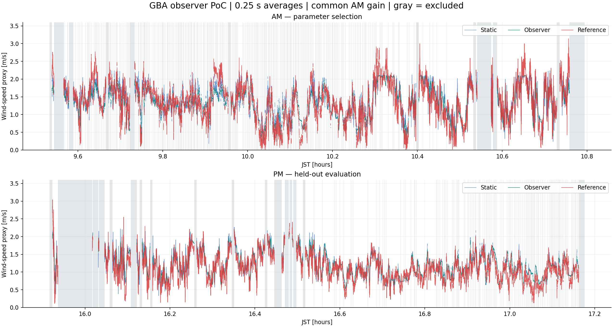
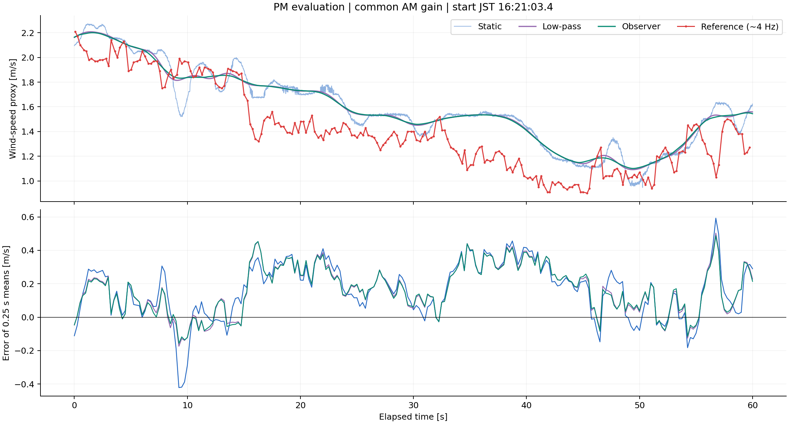
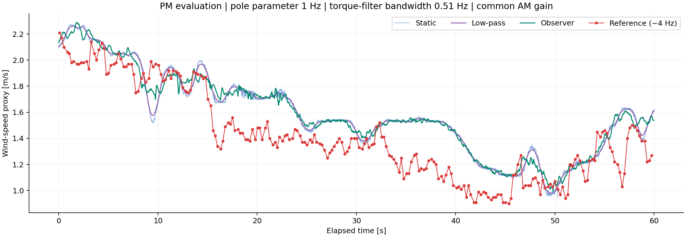
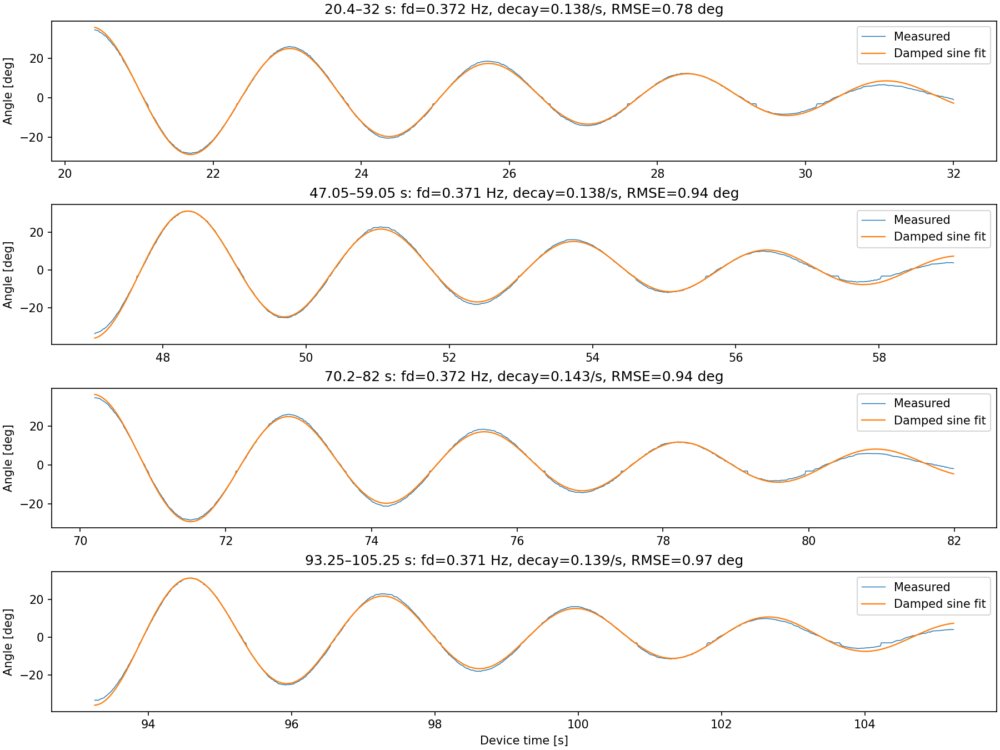
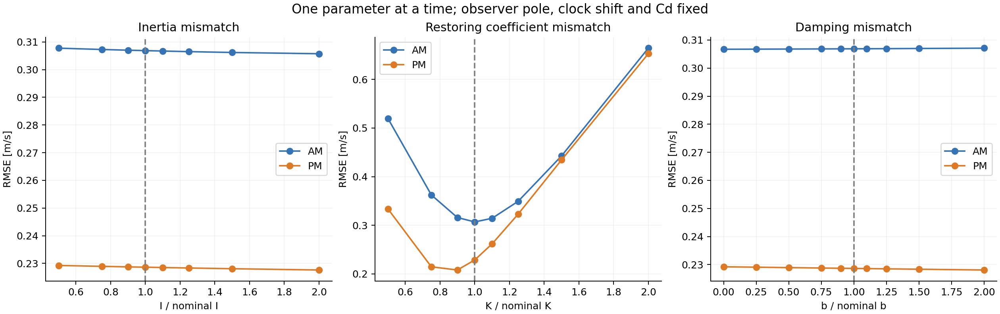
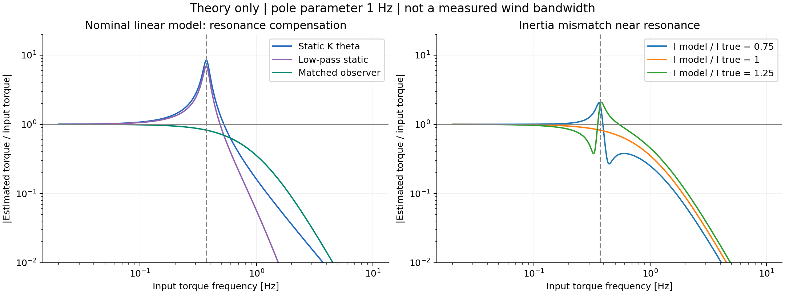

# GBA：既存データによる外乱オブザーバーの PoC

対象：2025年1月14日の風速比較試験、および既存の自由減衰試験。

**既存ログから100 Hzの推定値を生成し、参照に対する誤差とモデル誤差への感度を定量化した。今回の条件では誤差は減るが、誤差最小の設定における改善の大半は平滑化で説明できる。高速な風変動の復元を実証した段階ではない。**

風速換算には既存コードの式を暫定的に残した。力学モデルの効果を先に比較するためであり、球のCdや水平抗力の厳密な推定を完了したものではない。

## 1. 実測ログで得た結果

午前だけから共通の速度倍率、両計器間の時刻補正、極の候補選択を計算し、午後には再調整せず適用した。以下の各方式は、同じ倍率補正・同じ時刻・同じ除外区間で比較している。午後の値も探索中に閲覧しているため、事前登録した独立検証ではなく、別区間への適用確認と位置づける。

| 方式 | 午前 RMSE [m/s] | 午後 RMSE [m/s] |
|---|---:|---:|
| 静的換算 | 0.327832 | 0.250151 |
| ローパスのみ | 0.308690 | 0.230565 |
| オブザーバー | 0.306871 | 0.228622 |

午後のオブザーバーは静的換算に対して **RMSEを8.61%、MSEを16.47%低減**した。しかし、同じ平滑化強度のローパスに対するRMSEの追加低減は **0.84%（0.00194 m/s）**にとどまった。この小差について統計的有意性や別の日への一般化は評価していない。

共通の有効ビン数は午前13,232、午後14,023。各ビンは0.25秒で、合計評価時間はそれぞれ3,308秒と3,505.75秒。時系列に強い相関があるため、このビン数を独立標本数とはみなさない。

午後のSSEは静的換算877.493、ローパス745.465、オブザーバー732.953 [m²/s²]。オブザーバーの平均偏りは+0.0961 m/sで、残差には振動以外の要因も残っている。

拡大区間は、午後記録の1/3経過後に現れる最初の「全区間が有効な60秒」を機械的に選んだ。見栄えのよい区間を選択したものではない。

## 2. 平滑化を弱めた場合

オブザーバーの極を3重極 $-p$ とし、設定値を $f_p=p/(2\pi)$ と呼ぶ。入力トルクから推定トルクまでの理想的なフィルターは

$$
Q(s)=\frac{p^3}{(s+p)^3},\qquad
f_{-3\mathrm{dB}}=f_p\sqrt{2^{1/3}-1}\simeq0.5098f_p.
$$

| 設定 | トルク推定フィルターの帯域 | 午後ローパス RMSE | 午後オブザーバー RMSE |
|---|---:|---:|---:|
| $f_p=0.2$ Hz | 約0.102 Hz | 0.230565 | 0.228622 |
| $f_p=1$ Hz | 約0.510 Hz | 0.247048 | 0.237719 |

1 Hzの極では、オブザーバーのRMSEは同じフィルター強度のローパスより約3.78%小さい。静的換算に対しても約4.97%小さい。こちらは振り子の固有周波数付近の入力をより残す比較例として、100 Hz出力を生成できるようにした。大容量の生成データはGit管理外とし、結果の図と集計表を保存した。

午前で調べた極の候補は0.2、0.3、0.4、0.5、0.75、1、1.5、2、3、5 Hz。誤差最小だった0.2 Hzは探索範囲の下端なので、最適値が確定したとはいえない。また、表の帯域は設計上のトルクフィルターの値で、実測で保証した風速計の帯域ではない。

フライトシミュレーター用の変動を残す目的では、RMSEだけで設定を選ぶと過度に滑らかな結果を選びやすい。次の評価には、周波数ごとの振幅・位相誤差と角度ノイズから換算される力ノイズも必要となる。

## 3. データと前処理

取得元は `Pakfat50/GBA`、コミット `dbc153d89fa335aca14014e0173c587e8adc93a8`。ファイルとblob SHAは `source_manifest.json` に記録した。

| データ | 使用方法・読み取った定義 |
|---|---|
| `05_Script/01_Analysis/20250114/LOG00016.TXT` | 午前。マイクロ秒カウンター、外軸ADC、内軸ADC、外軸角度、内軸角度、GPS文字列の6列 |
| 同ディレクトリの `LOG00017.TXT` | 午後。同じ列定義 |
| `WS400am.txt`、`WS400pm.txt` | JST時刻、エラーフラグ、風速[m/s]、風向[deg]。0が正常。平均約4サンプル/秒 |
| `04_Data/00_Calibration/swing/LOG00014.TXT` | 内軸の自由減衰4区間を使用。外軸ADC・内軸ADCを含む4列形式 |

フィールドログの正常な6列行は午前453,961行、午後453,454行。カウンターは各記録で1回折り返しているため、$2^{32}$を加えて連続化した。記録間隔はほぼ10 msで、午前約4,539.6秒、午後約4,534.5秒を含む。

角度はログの角度列を用いた。ジグによるADC較正をこのPoCで再推定していない。自由減衰ログだけは既存の内軸変換式 $\theta[\mathrm{deg}]=-0.0803317\,ADC+120.248$ を使用した。

GPSの完全な文字列を使って装置時刻とJSTの線形対応を推定した。`TestBoardSoftware.ino` は時刻末尾に `gps.time.centisecond()` を出力しているため、末尾を100で割る。既存解析の1000で割る処理を修正した。ただしGPS対応の残差標準偏差は午前約0.35秒、午後約0.33秒あり、センサー間の精密な同期が保証されたわけではない。

午前の0.1 Hz以下を主に使い、±5秒の範囲で共通時計補正を探索すると、装置時刻に+1.60秒を加える設定となった。全方式・午後にも同じ値を適用した。これは風の伝搬や参照器の応答も含みうる経験的補正で、純粋な時計の誤差と断定しない。

風速の比較では参照を100 Hzへ水増しせず、両計器それぞれの実サンプルを共通の0.25秒ビンに入れて平均した。全装置サンプルが有効、装置のサンプル充足率80%以上、参照サンプル1個以上、参照フラグが全て正常のビンだけを採用した。

## 4. 飽和と除外区間

約38度で機械的に制限されるという条件を受け、次の共通マスクを使用した。

| 条件 | 既定の扱い |
|---|---|
| 合成傾斜の暫定値が36度以上、またはどちらかの軸が絶対値37度以上 | 飽和近傍として検出 |
| 飽和検出の前後 | 各10秒を除外 |
| 記録にある突っつき | 午前09:35・10:47、午後16:00・17:10。各時刻の前15秒・後20秒を除外 |
| 記録の先頭・末尾 | 各20秒を除外 |
| 利用者指定区間 | `settings.json` で追加可能 |

合成傾斜は $\arccos(\cos\theta_o\cos\theta_i)$ を使った近似的な判定量。実際のストッパー形状や2軸角度の厳密な定義を確認できていないため、接触検出器の代わりとなる保守的な仮置きである。複合傾斜では実際には非接触の点も除く可能性がある。

接触中はストッパー反力が未知のトルクとして混ざり、角度だけから空力と分離できない。平らになった区間だけでなく、その前後のフィルター過渡も除く。除外部分の推定値はCSVに残すが無効フラグを付ける。

合成しきい値34・36・37度、前後余白5・10・20秒の9通りでも再集計した。午後のオブザーバーRMSEは0.219〜0.231 m/sとなり、全9条件で「静的換算より小さく、同条件のローパスよりわずかに小さい」という順序だった。異なるマスク間のRMSEは対象区間が異なるため、しきい値を厳しくするほど推定器が改善したとは解釈しない。

## 5. 力学モデルと同定した装置特性

各軸を独立な回転1自由度として、正の角度方向に作用する残差トルクを $\tau$ と定義する。

$$
I\ddot\theta+b\dot\theta+K\sin\theta=\tau.
$$

$I$ は回転慣性モーメント、$b$ は等価粘性減衰、$K\sin\theta$ は復元トルク。$K$ の単位はN mで、原点近傍の角度に対する勾配として扱うとN m/radである。2軸の連成、クーロン摩擦、空力の相対速度依存は今回の暫定モデルに含めない。

利用者の部材値から、球と支柱の上側モーメントを錘の下側モーメントから差し引いた。

$$
K=g(0.0288\times0.180-0.0146\times0.245-0.0058\times0.070)
=0.01178181\ \mathrm{N\,m}.
$$

質量の単位はkg、距離はm。球中心まで245 mm、錘中心まで180 mmを使用した。支柱は5.8 g・重心70 mm上側というメモの値を採用した。浮力や未計上部品による補正は行っていない。

自由減衰を

$$
\theta(t)=c+e^{-\lambda t}\{a\cos(\omega_dt)+b_0\sin(\omega_dt)\}
$$

で当てはめ、$\omega_n^2=\omega_d^2+\lambda^2$、$I=K/\omega_n^2$、$b=2\lambda I$ とした。ここで $b_0$ は当てはめの振幅係数で、減衰係数 $b$ とは別物。

| 特性 | 暫定推定値 |
|---|---:|
| 固有周波数 $f_n$ | 0.3724 Hz |
| 固有周期 | 2.685秒 |
| 振幅減衰率 $\lambda$ | 0.1387 /秒 |
| 減衰比 $\zeta$ | 0.0593 |
| 振幅が1/eになる時間 | 約7.21秒 |
| $I$ | $2.152\times10^{-3}$ kg m² |
| $b$ | $5.968\times10^{-4}$ N m s/rad |

使用した装置時刻区間は20.4〜32、47.05〜59.05、70.2〜82、93.25〜105.25秒。4区間の当てはめRMSEは0.78〜0.97度だった。初期振幅は約35度で、完全な小振幅線形系ではない。上記I・bはこの振幅範囲をまとめた等価値である。

今回読み出して使用したのはLOG00014の内軸4区間で、同じ特性を外軸へ暫定適用した。LOG00015・LOG00016は今回の取得経路では本文を復元できず使用していない。外軸と2軸連成の同定は未完了である。

**自由減衰だけでIの絶対値が一意に求まるわけではない。** 直接得られるのは主にK/Iとb/Iであり、ここで示したIは部材由来Kを正しいと置いた条件付き推定である。

無風減衰には空気の抵抗も含まれうる。そのため、このbを差し引いた残差トルクを、球に作用する全空気力そのものとは呼べない。将来の空力モデルでは機械摩擦と静止空気中の運動抵抗を分ける必要がある。

## 6. 実装したオブザーバー

角度・角速度・未知トルクを状態とし、未知トルクの時間微分を0と置く予測モデルを使う。真の風が一定という仮定ではなく、観測残差から変化を追従させるモデル化である。

$$
x=[\theta,\omega,\tau]^T,\quad y=\theta,
$$

$$
\begin{aligned}
\dot{\hat\theta} &= \hat\omega+L_1(y-\hat\theta), \\
\dot{\hat\omega} &= -\frac{b}{I}\hat\omega+\frac{1}{I}\hat\tau
                    -\frac{K}{I}\sin y+L_2(y-\hat\theta), \\
\dot{\hat\tau} &= L_3(y-\hat\theta).
\end{aligned}
$$

重力項には計測角度を用いる。これは測定ノイズを含まない理想条件で誤差系を線形化しやすくするPoC上の構成であり、完全な非線形状態推定器ではない。

$a=b/I$ として、誤差系の極を $-p$ に3つ置くと

$$
L_1=3p-a,\qquad L_2=3p^2-aL_1,\qquad L_3=Ip^3.
$$

この推定トルク出力は、連続時間では次と等価になる。

$$
\hat\tau=I\,(s^2Q)[\theta]+b\,(sQ)[\theta]+K\,Q[\sin\theta].
$$

`poc.py` の `basis()` はこの3つの安定でプロパーな伝達関数を実装する。角度をそのまま2階差分する代わりに、微分と帯域制限を一体化した。100 Hzで双一次変換により離散化し、初期状態は最初の角度における定常値で初期化した。

比較する静的方式は $\tau_s=K\sin\theta$、ローパス方式は $\tau_{LP}=KQ[\sin\theta]$。したがって、ローパスとの差が慣性項と減衰項を加えた効果になる。ローパスは風速の大きさを最後に平均する方式ではなく、換算前の各軸トルクを平滑化する比較対象である。

事後解析なので、ローパスとオブザーバーの両方をQの低周波群遅延 $3/p$ だけ前進させた。0.2 Hz極では約2.387秒、1 Hz極では約0.477秒。参照への個別の時刻合わせではない。群遅延は周波数で変わるため、この補償は近似であり、厳密な平滑化器・ゼロ位相処理ではない。

前進しない因果的オブザーバーも比較した。0.2 Hz極の午後RMSEは0.261976 m/sで、今回の静的換算より悪かった。したがって、ここで報告する改善値は事後解析による遅延補償を含む。

実装検証では、一定角度に対するトルク誤差が約 $1.2\times10^{-14}$ N m、既知の微小正弦波トルク0.1 Hz・固有周波数・1 Hzに対する振幅比が理論値と0.03%以内で一致した。これは実装と理想モデルの整合性の確認であり、実機空力の妥当性検証ではない。

## 7. 風速換算・較正の扱い

既存 `analysis.py` は、各軸の力から別々に符号付き平方根で速度を計算し、その二乗和平方根を風速とする。このため、その風速の大きさは

$$
U_{legacy}=\sqrt{\frac{2(|\tau_o|+|\tau_i|)}{\rho C_d S l}},
\quad l=0.245\ \mathrm m,\quad S=\pi(0.15)^2/4
$$

に等しい。今回は全方式でこの同じ式を使用した。

水平ベクトル抗力の標準的な大きさ換算なら、分子の力には $\sqrt{F_x^2+F_y^2}$ が入るため、この旧式の $|F_x|+|F_y|$ とは異なる。また、単一平面で水平力が球中心に作用する場合、トルクは $lF\cos\theta$ なので、厳密な静的換算は $F=(K/l)\tan\theta$ となる。今回の等価力 $\tau/l$ はこのcos補正を含まない。2軸での姿勢変換と作用点の整理は次段階とした。

取得したコードは `cd=0.7`、グラフの題名は `Cd = 0.55` だった。このため添付グラフの厳密な数値再現は断定できない。まず図題に合わせたCd=0.55と、旧コードの $K_{old}=0.0140267304$ N mとの比を保存した基準を用意した。Kだけ変更したことで速度倍率が変わらないよう、新Kでの換算係数を $C_{d,eq}=0.46197477$ とした。

さらに午前の低速ローパス出力 $u_k$ に対し、参照 $r_k$ との二乗誤差を最小にする共通倍率

$$
g_u=\frac{\sum_k u_kr_k}{\sum_k u_k^2}=0.78488281
$$

を求めた。加算オフセットは使わず、全方式・午後・モデル感度に同じ倍率を適用した。新Kで表した等価Cdは0.749909だが、**これは球の物理的Cdを同定した値ではない。** 旧換算式の幾何誤差や装置差も吸収しうる。

共通倍率補正の影響をオブザーバーの効果と取り違えないよう、補正を追加しない評価も保存した。

| 午後の方式 | 倍率補正なしのRMSE | 共通倍率補正後のRMSE |
|---|---:|---:|
| 静的換算 | 0.507228 | 0.250151 |
| ローパス | 0.490526 | 0.230565 |
| オブザーバー | 0.489062 | 0.228622 |

倍率補正自体の影響が大きい。0.507→0.229という差全体をオブザーバーの改善量としては扱わない。風向の165度回転や北・東への変換精度は、この風速の大きさの比較には含めていない。

## 8. モデルがずれた場合

同定した公称値を基準として、I、K、bを一つずつ変更した。参照への倍率・Cd・極・時刻・マスクは固定し、Iやbの再同定もしない。これは推定器のパラメーター誤設定の試験で、装置改造の物理シミュレーションではない。

| 変更した係数 | 公称値の0.75倍 | 公称値 | 公称値の1.25倍 |
|---|---:|---:|---:|
| I、極0.2 Hz | 0.228927 | 0.228622 | 0.228337 |
| K、極0.2 Hz | 0.214560 | 0.228622 | 0.322831 |
| b、極0.2 Hz | 0.228767 | 0.228622 | 0.228479 |
| I、極1 Hz | 0.238927 | 0.237719 | 0.237206 |
| I、極2 Hz | 0.240735 | 0.240549 | 0.241781 |

表は午後RMSE [m/s]。今回の低い帯域ではI・bの±25%誤設定の影響は小さく、Kの影響が大きかった。Kを小さくすると午後の正の偏りを相殺してRMSEが改善するが、これをもって「真のKは0.75倍」とは結論できない。K・Cd・風速倍率の縮尺は混同しやすく、午前と午後の差も残る。

小角度の理論では、真の系 $P(s)=Is^2+bs+K$、推定器のモデル $\hat P(s)$ に対し

$$
\frac{\hat\tau(s)}{\tau(s)}=Q(s)\frac{\hat P(s)}{P(s)}
$$

となる。モデルが一致すれば振り子の共振を打ち消しQだけが残る。しかし固有周波数ではPの絶対値が小さくなるので、モデル誤差が目立つ。

例えばIだけを相対誤差 $\epsilon$ だけ誤設定した理想線形系では、$\omega=\omega_n$ で一致モデルに対する振幅比が

$$
\left|\frac{\hat P}{P}\right|=\sqrt{1+\left(\frac{\epsilon}{2\zeta}\right)^2}
$$

となる。今回の減衰比ではIの10%誤差でも約1.31倍、25%誤差では約2.33倍となる。これは単一周波数トルクに対する理論上の例で、上表の実風速RMSEとは異なる量である。「今回のRMSEがIに鈍感」でも、広帯域化後にIの精度が不要とはいえない。

## 9. 同期条件への依存と100 Hzの意味

午後に午前由来の+1.60秒を適用せず、GPS対応のままで比較すると、RMSEは静的換算0.235967、ローパス0.218721、オブザーバー0.217627 m/sだった。順位は同じだが、午後では補正なしの方が絶対誤差は小さい。

したがって、センサー間の遅れを1つの定数とみなす仮定は十分には裏付けられていない。午前で決めた補正を午後へ固定した値を主結果として示し、午後に合わせ直して数字を改善することはしていない。評価幅を1秒にした結果も `evaluation_sensitivity.csv` に保存した。

100 Hzの角度から100 Hz間隔で推定値を出すことは可能。ただし100 Hz標本化で任意の100 Hz変動を復元することはできず、理想的な帯域制限を仮定してもナイキスト境界は50 Hzである。実用的な帯域は、角度ノイズ、機構、アンチエイリアス、モデル誤差、同期精度によってさらに低くなる。

参照は平均約4 Hz記録で、参照器自体の応答や計器間の空間距離による差も未確認である。このデータは100 Hzの風変動の真値を与えない。100 Hz出力という形式と、信頼できる物理的な帯域を分けて記載する必要がある。

## 10. 今後の試験・改造を決めるための示唆とWBS

| 優先 | 作業 | 判断に使う成果物・完了条件 |
|---|---|---|
| 完了 | 既存ログの抽出、時刻処理、飽和除外 | 列定義、共通マスク、100 Hz出力、0.25秒評価表 |
| 完了 | 暫定モデル、オブザーバー、感度PoC | 静的・ローパス・オブザーバーの比較、I/K/b・帯域の感度 |
| 次 | 2軸の座標・作用点・風速ベクトル換算を整理 | cos係数、旧式の軸別平方根、北・東成分の扱いを分離して比較。既存データで進める |
| 次 | 既存の外軸・クロス自由振動を取り込み、振幅別に同定 | 軸別の固有周波数・減衰、摩擦・非線形性・連成の必要性を定量化 |
| 次 | 高周波を残す評価軸を追加 | 入力トルクの周波数別振幅・位相、角度ノイズの力換算、ブロック単位の誤差ばらつき |
| 後日の最小試験 | 既知の水平張力でKを較正 | 正負方向・複数角度でトルクと角度の関係、摩擦によるヒステリシスを確認 |
| 後日の最小試験 | 同期・配置を記録した、非飽和の既知入力または参照比較 | 速度倍率や時計差と、力学的な応答改善を区別できるデータ |
| 判断後 | 機構改造 | 測定範囲拡大、I低減、摩擦低減等を、目標帯域とノイズから選ぶ |
| 将来 | 非定常Cd・相対速度・単体較正の検討 | 文献・CFD・追加試験で空力モデルを検証。今回のPoCとは別の検証段階 |

既知の水平張力Tを球中心にかける提案は、単一平面で $K=T l/\tan\theta$ を求める方法として使える。複数角度・正負方向を測れば、摩擦やゼロ点の影響も見やすい。

今回のKは大きな重力モーメント同士の差なので、個別部材の誤差が増幅される。たとえば錘質量の1%誤差はKの約4.3%、球質量の1%誤差は約3.0%に相当する。静的張力較正は、この差し引きによる不確かさを減らす優先度の高い試験となる。

Iを下げると、Kが同じなら固有周波数は $\sqrt{K/I}$ に従って上がる。Kを上げると静的な測定範囲を広げられる一方、同じ力に対する角度は小さくなり角度ノイズの影響が増える。単一平面・公称Kで38度の静的釣り合いに相当する水平力は約0.0376 N。この値を風速上限に変換するには、別途妥当な空力係数が必要である。

減衰を大きくすると共振は弱まるが、機械摩擦の増加は低風速での不感帯につながりうる。まずはモデルが線形粘性減衰で十分かを既存波形で確認してから改造を選ぶ。

現時点で追加試験を待つ必要はなく、次は既存データで「2軸の換算式」と「軸別の動特性」を分けて更新することで、このPoCのどの誤差が説明できるかを調べられる。

## 11. 追跡可能性

解析手順は `src/prepare_data.py`、`src/poc.py`、`config/settings.json`、再実行方法は `README.md` に記載。自由減衰の当てはめ結果、評価表、図を保存した。中間データと大容量の100 Hz CSVは、既存の原ログから再生成できる。

元コード：[analysis.py](https://github.com/Pakfat50/GBA/blob/dbc153d89fa335aca14014e0173c587e8adc93a8/05_Script/01_Analysis/analysis.py)。時刻末尾の定義：[TestBoardSoftware.ino](https://github.com/Pakfat50/GBA/blob/dbc153d89fa335aca14014e0173c587e8adc93a8/03_Software/TestSoftware/TestBoardSoftware/TestBoardSoftware.ino)。試験時刻と参照列定義は同コミットの `04_Data/03_風速計ランニングデータ/20250114/memo.txt`、使用した自由振動区間は既存の `calc_eta.py` を手がかりに確認した。詳細パス・blob SHAはマニフェストを参照。

本レポートの理論式は上記の暫定運動方程式から導出した。非定常球抗力の文献・CFDによる裏付けは、このPoCには含めていない。

