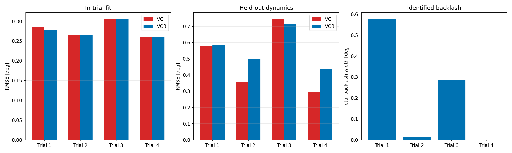

# 既存自由振動によるバックラッシュ識別性の確認

## 結論

クーロン摩擦を含むVCモデルと、復元トルク側へplayバックラッシュを追加したVCBモデルを、旧ハード内軸の同じ4自由振動区間で比較した。

試行内RMSEは一部でわずかに改善したが、同定されたバックラッシュ全幅は `0.578、0.014、0.286、0.001 deg` と安定しなかった。他の3区間の係数中央値を残り1区間へ移植すると、平均RMSEはVCの0.4943 degからVCBの0.5570 degへ12.7%悪化した。

このため、既存自由振動から「再現性のあるバックラッシュが存在する」とは判断しない。現状ではクーロン摩擦モデルを公称とし、バックラッシュは新ハードの低速反転試験で確認する。

## 比較結果

| 区間 | VC RMSE [deg] | VCB RMSE [deg] | VCB全幅 [deg] | AICcによる追加効果 |
|---|---:|---:|---:|---|
| 1 | 0.28591 | 0.27734 | 0.5779 | 改善 |
| 2 | 0.26503 | 0.26503 | 0.0142 | 追加パラメータの罰則が上回る |
| 3 | 0.30623 | 0.30519 | 0.2864 | 小幅改善 |
| 4 | 0.26051 | 0.26049 | 0.0010 | 追加パラメータの罰則が上回る |



## モデル

物理角度を `theta`、ばね側角度を `z`、バックラッシュ半幅を `delta` とする。

```math
z_k = \max(\theta_k-\delta,\min(z_{k-1},\theta_k+\delta))
```

```math
I\ddot\theta+b\dot\theta+K\sin z
+\tau_f\tanh(\dot\theta/\varepsilon)=0
```

`delta=0` では従来のVCモデルへ戻る。摩擦は運動方向へ逆らう散逸、バックラッシュは方向反転後の復元トルク履歴なので、同じ係数へまとめない。

## 評価方法

- 入力: `04_Data/00_Calibration/swing/LOG00014.TXT`
- 区間: 従来摩擦解析と同じ4区間
- 角度較正: 従来解析と同じ内軸ADC換算
- 評価周期: 100 Hzへ補間
- VCとVCBを同じ固定刻みRK4で計算
- VCBはバックラッシュ初期値を変えた4始点から最小残差を採用
- 試行内RMSE、AICc、BIC、他区間係数による予測RMSEを比較

自由振動は大振幅から始まるため、低速の小さな反転遊びを同定する専用試験ではない。角度オフセット、クーロン摩擦、初期状態との相関も残る。

## 新ハードで必要な試験

各軸を無風で±5 deg程度ゆっくり往復させ、既知トルクと角度を同時に記録する。同一トルクにおける正転・逆転角度差を3回以上比較する。角度差がMT6701量子化幅0.02197 degと反復ばらつきを十分上回る場合にだけ、軸別バックラッシュ補償を検討する。

現在の `tanh` 摩擦は動摩擦の近似であり、静止摩擦による固着やStribeck特性は表さない。起動トルクに方向差や滞留が見える場合は、バックラッシュとは別に静止摩擦モデルを評価する。

## 再実行

```bash
python 06_Analysis/backlash_study/analyze.py --input 04_Data/00_Calibration/swing/LOG00014.TXT
```

主な出力は `fits.csv`、`validation.csv`、`comparison.png`、`fits.png`、`residuals.png` である。
