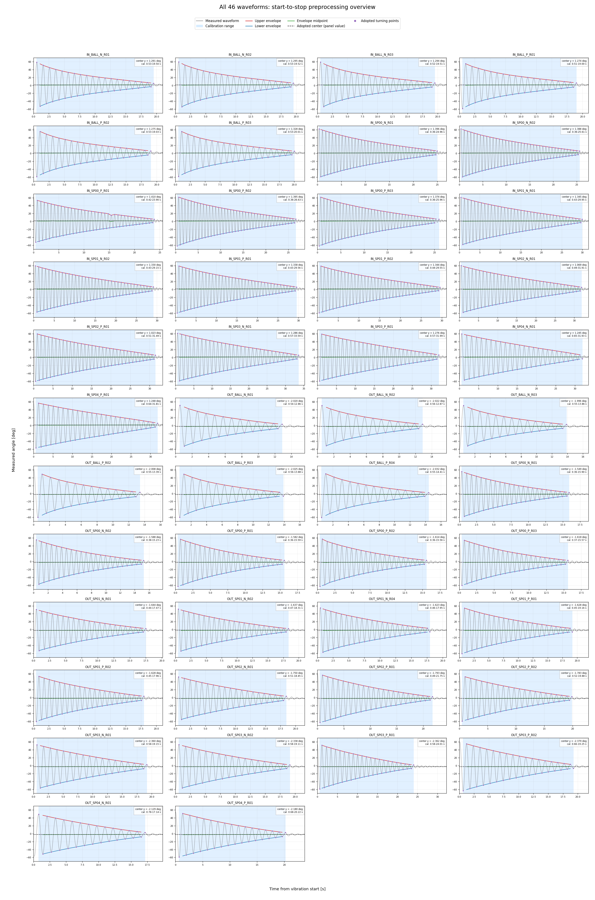

# Stage 1: 頂点・平衡中心・初期状態の決定

## 採用済みの判断

| 項目 | 採用内容 | フィッティング変数か |
|---|---|---|
| 平衡中心 | 各波形の上下包絡線中点の算術平均 | いいえ |
| 時間原点 | 解放後の最初の半周期を除外した、最初の折返し頂点 | いいえ |
| 初期角度 | 上記頂点の実測角度から、その波形の平衡中心を引いた値 | いいえ |
| 初期速度 | 頂点なので0 | いいえ |
| センサーオフセット | Stage 1では考慮しない | いいえ |
| 試験中の中心変化 | 約0.5 degは計測誤差範囲として補正・除外しない | いいえ |

中心、時間原点、初期角度は46波形それぞれで決めている。軸・形態別または全波形の
平均値を、個々の波形の初期条件として流用していない。物理係数の同定はまだ行っていない。

## 算出方法

1. 平衡中心を仮定せず極大・極小を抽出する。
2. 各頂点の時刻と角度を、近傍3点の二次補間で補正する。
3. 振幅4 deg以上の正負頂点から上下包絡線を作る。
4. 同じ時刻の上下包絡線の中点を求め、その算術平均を当該波形の平衡中心とする。
5. 解放後最初の折返し頂点を、時間原点・初期角度として固定する。

## 全体集計

- 採用波形: 46
- 検出頂点: 2458
- 二次補間適用率: 100.0%
- |全点平均 - 包絡線中心| 中央値: 0.101 deg
- |全点平均 - 包絡線中心| 最大: 0.511 deg
- |既存終端中心 - 包絡線中心| 中央値: 0.126 deg
- |既存終端中心 - 包絡線中心| 最大: 0.320 deg
- 包絡線中点の平均絶対偏差の中央値: 0.187 deg
- 包絡線中点範囲 最大: 1.783 deg
- 後半1/4中点平均 - 前半1/4中点平均の中央値: 0.536 deg
- 除外した最初の半周期 中央値: 0.510 s
- 初期振幅 中央値: 58.392 deg
- 包絡線中心の|P開始 - N開始| 中央値: 0.009 deg
- 全点平均の|P開始 - N開始| 中央値: 0.102 deg

### 指標の定義

- 包絡線中点の平均絶対偏差: 各中点と、その波形で採用した中点平均との差の絶対値を平均した値。
- 包絡線中点範囲: 同じ波形における中点の最大値と最小値の差。外れ値にも反応する診断値。
- 前半・後半1/4中点平均: 中点系列の先頭25%と末尾25%をそれぞれ算術平均した値。
- 表中の「中央値」: 46波形の集計値を極端な波形に左右されにくく示すためだけに使用。波形中心の算出には使用しない。

## 試験中の中心変化に関する誤差メモ

包絡線中点には、前半から後半へ約0.5 deg変化する傾向が見られる。今回は計測誤差範囲と判断し、
中心は時間変化させず、各波形の中点系列全体の算術平均で固定する。この変化だけを理由に波形を除外しない。

後段の連続波形再現で誤差が大きい場合、または残差に時間・振幅・方向依存性が残る場合は、
次を修正候補として再評価する。

- 振幅または時間に依存する平衡中心
- 角度センサーの非線形性またはゼロ点変化
- 方向別摩擦またはヒステリシス

## 軸・形態別集計

ここでの群平均は診断用であり、個々の波形の中心・初期条件には使用しない。

| 軸 | 形態 | 波形数 | 波形別中心の群平均 [deg] | 群内標準偏差 [deg] | 全点平均との差の絶対値平均 [deg] | 終端との差の絶対値平均 [deg] | 中点の平均絶対偏差の群平均 [deg] | 中点範囲最大 [deg] | 後半-前半の群平均 [deg] |
|---|---|---:|---:|---:|---:|---:|---:|---:|---:|
| IN | BALL | 6 | 1.293 | 0.018 | 0.041 | 0.121 | 0.185 | 1.214 | 0.541 |
| IN | SP00 | 5 | 1.393 | 0.012 | 0.104 | 0.075 | 0.235 | 1.783 | 0.661 |
| IN | SP01 | 4 | 1.339 | 0.006 | 0.092 | 0.014 | 0.235 | 1.004 | 0.687 |
| IN | SP02 | 2 | 1.046 | 0.023 | 0.083 | 0.102 | 0.204 | 0.864 | 0.602 |
| IN | SP03 | 2 | 1.281 | 0.005 | 0.120 | 0.005 | 0.240 | 0.961 | 0.696 |
| IN | SP04 | 2 | 1.247 | 0.002 | 0.128 | 0.089 | 0.206 | 0.859 | 0.608 |
| OUT | BALL | 6 | -2.017 | 0.012 | 0.137 | 0.264 | 0.162 | 1.085 | 0.472 |
| OUT | SP00 | 5 | -1.590 | 0.025 | 0.186 | 0.190 | 0.178 | 1.100 | 0.529 |
| OUT | SP01 | 5 | -1.632 | 0.007 | 0.116 | 0.309 | 0.183 | 0.894 | 0.531 |
| OUT | SP02 | 3 | -1.775 | 0.018 | 0.253 | 0.250 | 0.187 | 0.805 | 0.545 |
| OUT | SP03 | 4 | -2.360 | 0.014 | 0.210 | 0.107 | 0.148 | 0.674 | 0.433 |
| OUT | SP04 | 2 | -2.154 | 0.026 | 0.180 | 0.211 | 0.148 | 0.732 | 0.431 |

## 開始方向による中心差

全点平均は有限長の減衰波形を開始側の山から平均するため、開始方向の影響を受ける。
同一軸・形態でP開始平均からN開始平均を差し引き、包絡線中心と比較した。

| 軸 | 形態 | 包絡線中心 P-N [deg] | 全点平均 P-N [deg] |
|---|---|---:|---:|
| IN | BALL | -0.001 | 0.082 |
| IN | SP00 | 0.001 | 0.123 |
| IN | SP01 | 0.003 | 0.069 |
| IN | SP02 | -0.046 | 0.029 |
| IN | SP03 | -0.010 | 0.033 |
| IN | SP04 | 0.003 | 0.033 |
| OUT | BALL | -0.009 | 0.229 |
| OUT | SP00 | -0.036 | 0.185 |
| OUT | SP01 | 0.006 | 0.203 |
| OUT | SP02 | -0.038 | 0.210 |
| OUT | SP03 | -0.021 | 0.235 |
| OUT | SP04 | -0.051 | 0.011 |

## 全点平均との差が大きい波形

| 波形 | 軸 | 形態 | 全点平均 - 包絡線中心 [deg] |
|---|---|---|---:|
| OUT_SP03_P_R02 | OUT | SP03 | 0.511 |
| OUT_SP02_P_R01 | OUT | SP02 | 0.399 |
| OUT_SP00_P_R02 | OUT | SP00 | 0.335 |
| OUT_SP00_P_R01 | OUT | SP00 | 0.299 |
| OUT_SP02_P_R02 | OUT | SP02 | 0.273 |

## 既存終端中心との差が大きい波形

| 波形 | 軸 | 形態 | 既存終端中心 - 包絡線中心 [deg] |
|---|---|---|---:|
| OUT_SP01_N_R01 | OUT | SP01 | 0.320 |
| OUT_SP01_N_R02 | OUT | SP01 | 0.313 |
| OUT_SP01_P_R02 | OUT | SP01 | 0.305 |
| OUT_SP01_P_R01 | OUT | SP01 | 0.304 |
| OUT_SP01_N_R04 | OUT | SP01 | 0.300 |

## 全46波形の前処理概要

振動開始から停止までの実波形を表示し、較正に使用する範囲と中心決定の根拠を一枚で確認する。
図中の較正範囲は、最初の採用頂点から振幅4 deg以上の最後の採用頂点までである。

1. 灰色線: 振動開始から停止までの実波形
2. 水色背景: 較正に使用する時刻範囲
3. 赤線・青線: 上側・下側包絡線
4. 緑線: 上下包絡線の中点系列
5. 黒破線: 採用した包絡線中心値。各パネル右上に `center y = ... deg` と表示
6. 紫丸: 較正に採用する頂点

## Stage 1のレビュー結論

1. 承認: 各波形の包絡線中点の算術平均を平衡中心とする。
2. 承認: 最初の半周期を除外し、最初の折返し頂点で時間・角度・速度を固定する。
3. 承認: 約0.5 degの中点変化は今回は計測誤差として補正せず、波形も除外しない。
4. 記録: 後段の誤差が大きい場合に、中心変化を修正候補へ戻す。

## 出力

- [全46波形の前処理概要](all_waveform_preprocessing_overview.png)
- [波形別の中心推定方法比較](preprocessing_overview.png)
- [試験中の中心変化と波形別初期状態](center_stability_and_initial_state.png)
- [波形別前処理結果](waveform_preprocessing.csv)
- [二次補間後の全頂点](turning_points.csv)
- [包絡線中点系列](center_midpoints.csv)
- [軸・形態別集計](preprocessing_group_summary.csv)
- [開始方向別の中心比較](center_direction_comparison.csv)
- [実行条件](preprocessing_settings.json)
