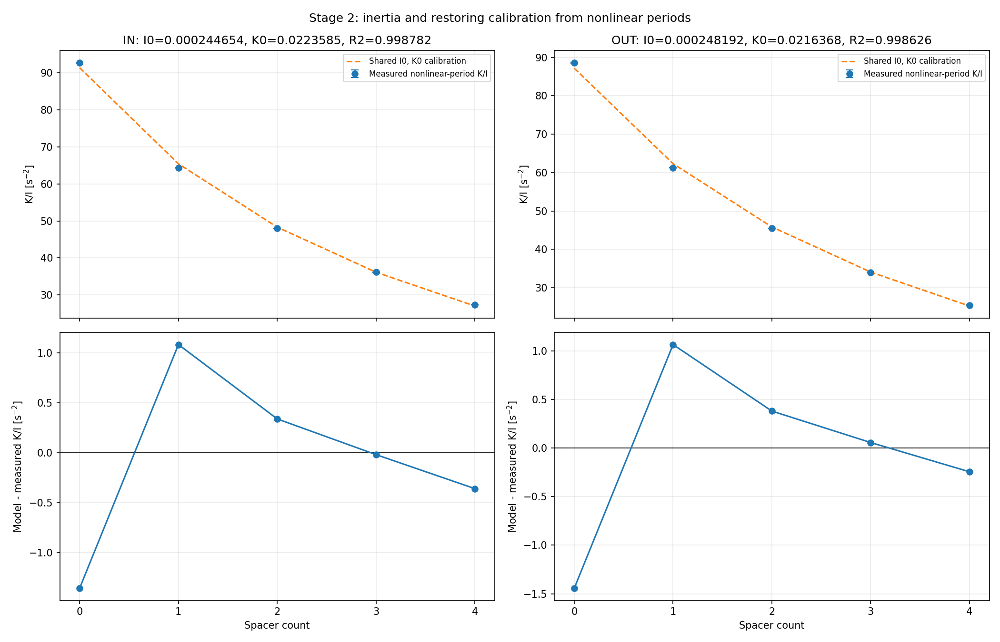
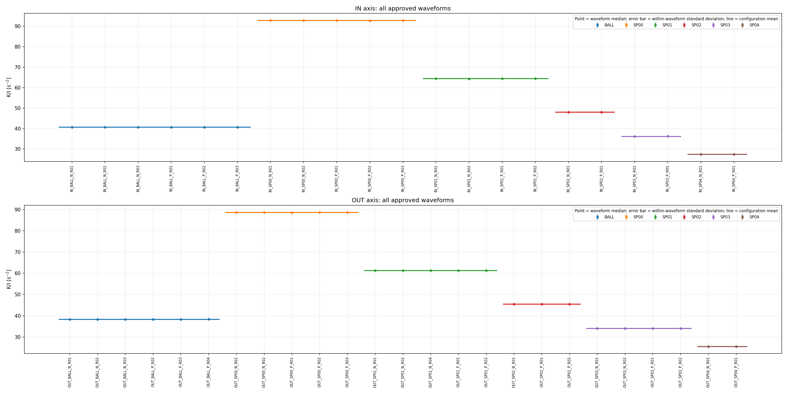
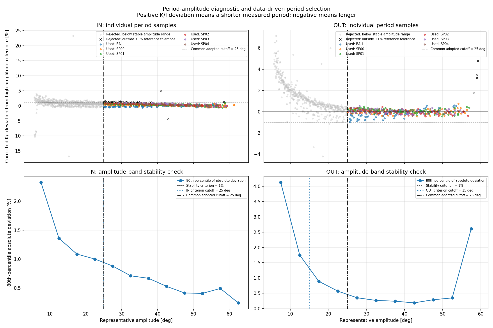

# Stage 2: 非線形周期によるI、K同定

## 結論

Stage 1で確定した46波形の頂点と中心を使用し、同符号頂点間周期から有限振幅補正済み
`K/I` を求めた。5 degは診断候補の下限にだけ使用し、同定範囲は角度で決め打ちしていない。
大振幅基準からの偏差率で安定域を判定した結果、INは25 deg以上、
OUTは15 deg以上となった。両軸に共通する25 deg以上を採用し、
さらに個別周期の偏差が±1%以内のものだけを同定に使用した。
波形全体へのフィッティングによる `I`、`K` の調整は行っていない。
SP00～SP04は既知の追加慣性・追加復元力を使って軸別の基準 `I0`、`K0` を同時同定し、
BALLは既知の重力復元力を実測 `K/I` で割って実効慣性を求めた。

## period_amplitude_diagnostics.pngの説明

この図は角度に対する周期そのものを直接プロットした図ではない。横軸は同符号頂点間周期の
両端振幅から求めた代表振幅、上段縦軸は各周期を有限振幅補正して得た `K/I` の
大振幅基準からの偏差率である。正の偏差は周期が基準より短い側、負の偏差は長い側を表す。
実データの低振幅側は主に正偏差であるため、この図は周期の伸長を直接示してはいない。
摩擦、中心推定、頂点時刻誤差のどれが原因かは、この図だけでは分離できない。

- 色付き丸: `I`、`K` 同定に採用した周期
- 灰色丸: データから決めた安定振幅域より小さいため除外した周期
- 黒い×: 安定振幅域内だが大振幅基準から±1%を超えたため除外した周期
- 上段の横破線: 個別周期の採用許容幅±1%
- 上段の縦一点鎖線: 両軸共通の採用下限25 deg
- 下段: 5 deg幅ごとの絶対偏差の80パーセンタイルと1%判定線

## 同定式

同符号頂点間の周期を `T`、両端のポテンシャルエネルギー平均に対応する代表振幅を `A` とする。

```math
K/I = [4 K_elliptic(sin^2(A/2))/T]^2
```

```math
(K0 + Delta K_j)/(I0 + Delta I_j) = (K/I)_j
```

各波形では周期サンプルの中央値を採用し、軸・形態の代表値は波形代表値の算術平均とした。
ここでの中央値は採用範囲内に残る測定ばらつきに対するロバスト化に使用する。

## 周期サンプルの採用方法

1. 振幅5 deg以上を診断候補として抽出する。
2. 各波形の振幅上位10%（最低5周期）の中央値を大振幅基準とする。
3. 各周期の有限振幅補正済み `K/I` と大振幅基準との差を百分率で求める。
4. 5 deg幅ごとに絶対偏差の80パーセンタイルを求め、
   3区間連続で1%以内となる最初の振幅を軸別下限とする。
5. 両軸で同じ条件とするため軸別下限の大きい方を共通下限とし、個別偏差も±1%以内の周期だけを採用する。

この判定により、低振幅域の系統偏差と、安定域内に孤立して現れる頂点時刻の外れ値を同時に除外する。

## 使用データ

- 波形数: 46
- 診断候補周期数: 2068
- I、K同定への採用周期数: 999
- 除外周期数: 1069
- 1波形あたり採用周期数の範囲: 9～40
- 採用代表振幅範囲: 25.02～61.35 deg
- 採用周期の有限振幅補正率範囲: 1.0243～1.1594

## 基準I0、K0

較正誤差は二乗平均平方根誤差、Rは相関係数、R^2は決定係数を表す。

| 軸 | I0 [kg m^2] | K0 [N m/rad] | 二乗平均平方根誤差 [s^-2] | 相関係数R | 決定係数R^2 |
|---|---:|---:|---:|---:|---:|
| IN | 0.000244654 | 0.022358477 | 0.8066 | 0.999461 | 0.998782 |
| OUT | 0.000248192 | 0.021636831 | 0.8272 | 0.999427 | 0.998626 |

## 形態別の採用I、K

| 軸 | 形態 | I [kg m^2] | 幾何I [kg m^2] | K [N m/rad] | 実測K/I [s^-2] | モデルK/I [s^-2] | K/I残差 [s^-2] | 決定方法 |
|---|---|---:|---:|---:|---:|---:|---:|---|
| IN | BALL | 0.000386563 | 0.000366631 | 0.015701411 | 40.6179 | 40.6179 | 0.0000 | 既知の重力復元係数を実測K/Iで除算 |
| IN | SP00 | 0.000244654 | 0.000244654 | 0.022358477 | 92.7451 | 91.3881 | -1.3570 | 基準値と既知スペーサ増分の和 |
| IN | SP01 | 0.000302557 | 0.000302557 | 0.019794437 | 64.3431 | 65.4239 | 1.0808 | 基準値と既知スペーサ増分の和 |
| IN | SP02 | 0.000357875 | 0.000357875 | 0.017288276 | 47.9712 | 48.3081 | 0.3369 | 基準値と既知スペーサ増分の和 |
| IN | SP03 | 0.000410669 | 0.000410669 | 0.014839995 | 36.1565 | 36.1362 | -0.0204 | 基準値と既知スペーサ増分の和 |
| IN | SP04 | 0.000460996 | 0.000460996 | 0.012449592 | 27.3664 | 27.0059 | -0.3605 | 基準値と既知スペーサ増分の和 |
| OUT | BALL | 0.000391150 | 0.000370168 | 0.014979765 | 38.2967 | 38.2967 | 0.0000 | 既知の重力復元係数を実測K/Iで除算 |
| OUT | SP00 | 0.000248192 | 0.000248192 | 0.021636831 | 88.6209 | 87.1779 | -1.4430 | 基準値と既知スペーサ増分の和 |
| OUT | SP01 | 0.000306094 | 0.000306094 | 0.019072791 | 61.2462 | 62.3102 | 1.0640 | 基準値と既知スペーサ増分の和 |
| OUT | SP02 | 0.000361413 | 0.000361413 | 0.016566630 | 45.4589 | 45.8385 | 0.3797 | 基準値と既知スペーサ増分の和 |
| OUT | SP03 | 0.000414206 | 0.000414206 | 0.014118348 | 34.0292 | 34.0853 | 0.0561 | 基準値と既知スペーサ増分の和 |
| OUT | SP04 | 0.000464533 | 0.000464533 | 0.011727946 | 25.4917 | 25.2467 | -0.2450 | 基準値と既知スペーサ増分の和 |

### BALLの決定方法を選んだ理由

BALLは一つの形態しかないため、周期だけでは `K/I` の比しか得られず、`I` と `K` を独立には決められない。
重力復元係数 `K` は質量・重心位置・重力加速度から直接計算でき、空気の付加慣性は重力復元力を変えない。
一方、球が押しのける空気の付加慣性は動的な `I` に現れる。このため、物理的に直接決められる `K` を固定し、
実測 `K/I` から `I=K/(K/I)` を求める。幾何学的 `I` を固定して `K` を逆算すると、付加慣性を誤って
重力復元係数へ配分することになるため採用しない。今後、既知水平力による静的K測定で独立検証する。

## 残差の要約

- SP00～SP04の最大絶対K/I残差: 1.4430 s^-2
- SP00～SP04の最大絶対相対残差: 1.737%
- 開始方向P-N差の最大絶対値: 0.266% (IN SP04)
- 診断候補周期の最大偏差: 23.22% (IN_SP00_P_R01、代表振幅16.46 deg)
- 安定振幅域外および±1%を超える個別周期は同定から除外したが、全周期と除外理由はCSVへ残している。

## 図







## 減衰と周期の扱い

採用している運動方程式には `b`、`c`、`tau` が含まれるため、数値積分では減衰による周期変化を表現できる。
ただしStage 2の楕円積分式は `b=c=tau=0` の理想振り子式である。したがって全振幅域を使うと、
減衰による周期変化が `I`、`K` に混入し、後段で減衰係数へ補償的に再配分される可能性がある。

低振幅で相対的に支配的になるのは主にクーロン摩擦 `tau` である。一方、二乗抗力 `c` は速度が大きい
高振幅側ほど強くなるため、高振幅だけなら減衰影響がゼロになるわけではない。そのためStage 2では
角度を任意に決めず、補正済みK/Iが安定する領域をデータから選んだ。

Stage 4～5でエネルギー損失・1半周期先頂点から `b`、`c`、`tau` を同定した後、これらを固定して
完全な運動方程式で周期を再計算する。減衰による周期補正が無視できない場合は、波形全体の誤差ではなく
周期残差だけを目的として `I`、`K` を更新し、減衰係数を再確認する。この交互確認を収束まで行う。
これにより `I,K` と `b,c,tau` を同時に自由フィットして相互に誤配分することを避ける。

## Stage 2のレビュー事項

1. 偏差率から得た共通下限25 deg、個別偏差±1%以内の999周期を採用するか。
2. SP00～SP04の既知増分から求めた軸別I0、K0を採用するか。
3. 空気の付加慣性をIへ配分するため、BALLのKは重力モデル、Iは実測K/Iから求めるか。
4. 減衰同定後、減衰係数固定の周期残差だけでI、Kを再確認する反復方針を採用するか。

## 持ち越し事項

- 減衰が周期へ与える影響は、減衰係数同定後に完全な運動方程式で定量化する。
- I、Kを更新する場合も周期残差だけを使い、全波形誤差を下げる自由変数にはしない。

## 出力

- [全周期サンプル](period_samples.csv)
- [波形別K/I](waveform_frequency.csv)
- [形態別K/Iと残差](configuration_frequency.csv)
- [基準I0、K0](base_parameters.csv)
- [形態別I、K](identified_inertia_restoring.csv)
- [開始方向比較](direction_frequency_comparison.csv)
- [振幅帯別の安定性判定](amplitude_stability.csv)
- [実行条件](frequency_settings.json)
