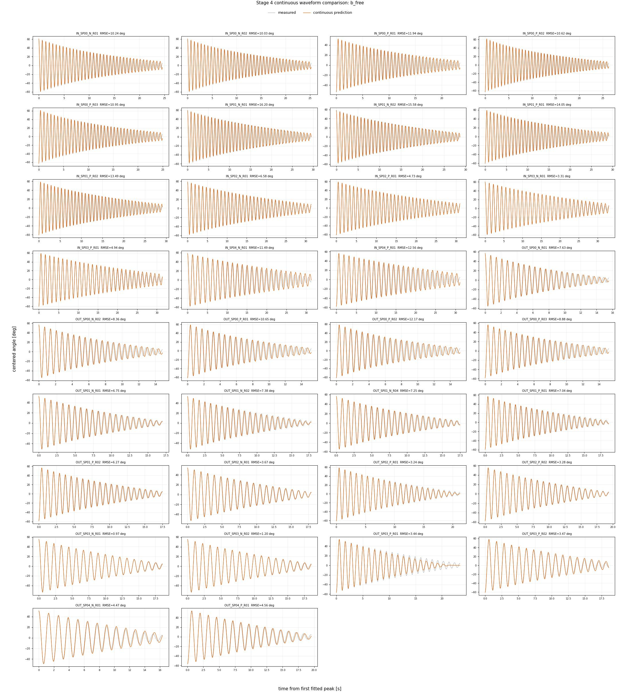
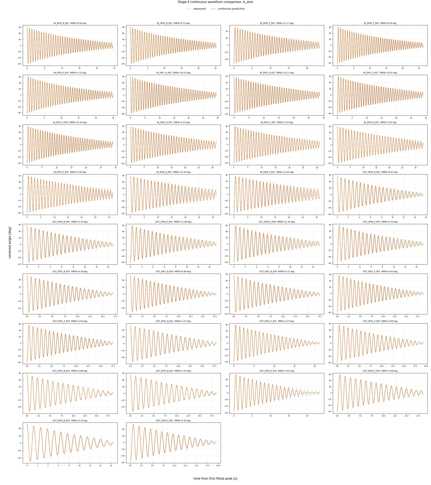
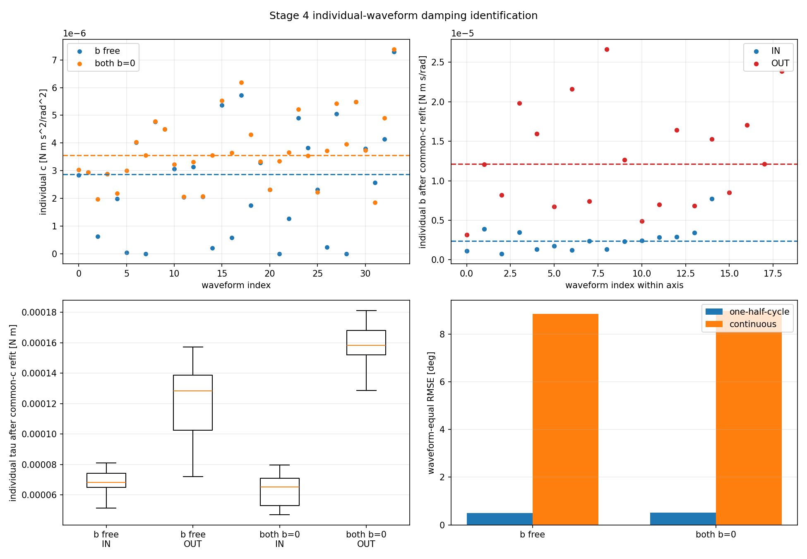

# Stage 4: 波形別ロッド減衰係数の同定

## 結論

承認済み球なし34波形、1794半周期を使用した。全波形を一つの
最適化問題として同時に解く方法を廃止し、各波形を独立にフィットした後、
cを全波形の中央値、bとtauを軸別中央値として集約した。
b_INとb_OUTをともに同定するb自由モデルと、両軸ともb=0とするモデルを比較した。
モデル採否は本レポートの分割積分結果と連続積分結果をレビューした後に確定する。

## 修正後の同定手順

1. 波形ごとに、全半周期で共通のb、c、tauを同定する。b=0モデルではc、tauだけを同定する。
2. 34個の波形別cの中央値を共通cとする。中央値は少数の異常波形に左右されにくく、追加の閾値を必要としないため採用した。
3. 共通cを固定し、波形ごとにb、tauを再同定する。b=0モデルではtauだけを再同定する。
4. 再同定したb、tauの軸別中央値を、IN、OUTそれぞれの代表係数とする。
5. 代表係数で全半周期の1ステップ予測を再計算する。
6. 同じ代表係数を固定し、各波形の最初の有効頂点から最後までリセットなしで連続積分する。

波形別係数は、実測した隣接頂点のエネルギー差をb、c、tauの散逸仕事基底へ
当てはめる非負線形最小二乗で求める。したがって反復ODE最適化は行わず、
各波形の係数は一回の線形求解で得られる。ODEは集約後の代表係数による
1半周期先予測と連続波形検証にだけ使用する。

```math
\Delta E_n \simeq b B_b(A_n)+c B_c(A_n)+\tau B_\tau(A_n)
```

```math
B_b=8\omega_0[E(m)-(1-m)K(m)],\quad
B_c=4\omega_0^2(\sin A-A\cos A),\quad
B_\tau=2A
```

ここでAは始点振幅、m=sin^2(A/2)、omega_0=sqrt(K/I)、K(m)、E(m)は完全楕円積分である。
散逸仕事基底は保存系軌道を用いる近似なので、集約した代表係数はStage 3の非線形ODEで
全半周期を再計算し、近似による係数導出後も次頂点予測誤差が許容できるかを確認する。

## 共通値と波形別値

| 段階 | b | c | tau |
|---|---|---|---|
| 波形別1次同定 | 同一波形内で共通 | 同一波形内で共通 | 同一波形内で共通 |
| c共通化後の再同定 | 波形ごとに再同定 | 全34波形で共通 | 波形ごとに再同定 |
| 最終代表モデル | 軸別中央値 | 全34波形の中央値 | 軸別中央値 |

半周期ごとに異なるb、c、tauを設定することはない。各半周期で実測頂点へ戻すのは
状態だけであり、同じ波形内の係数は共通である。

## 代表係数

| モデル | b_IN | b_OUT | c_rod | tau_IN | tau_OUT |
|---|---:|---:|---:|---:|---:|
| b_free | 2.389934832e-06 | 1.212305864e-05 | 2.862094620e-06 | 6.820007015e-05 | 1.282368497e-04 |
| b_zero | 0.000000000e+00 | 0.000000000e+00 | 3.553117430e-06 | 6.535512485e-05 | 1.583328735e-04 |

## 分割積分と連続積分の誤差

| モデル | 1半周期先・波形等重みRMSE [deg] | 1半周期先・最大波形RMSE [deg] | 連続波形・波形等重みRMSE [deg] | 連続波形・中央値 [deg] | 連続波形・最大値 [deg] |
|---|---:|---:|---:|---:|---:|
| b_free | 0.495406 | 0.647224 | 8.857664 | 7.314063 | 16.200552 |
| b_zero | 0.508099 | 0.648533 | 8.977927 | 6.952422 | 16.905483 |

1半周期先誤差は、各区間を実測頂点から開始するため減衰則の局所的な適合性を示す。
連続波形誤差は、最初の頂点だけを初期値とし、以後は実測値へ戻さないため、
振幅、周期、位相および小さな系統誤差の累積を含む。連続誤差だけでb、c、tauを
再調整するとI、Kや初期条件の誤差まで減衰係数へ混入するため、本Stageでは
同定には用いず、同定後のモデル妥当性確認に用いる。

## 連続波形の比較

### b自由モデル



### 両軸b=0モデル



各橙線は最初の有効頂点から最後までリセットせずに積分した予測波形、灰線は
中心補正後の実測波形である。各パネルのRMSEは、その波形の全表示サンプルに
対する角度RMSEである。

## 波形別係数の分布



b自由モデルの波形別c範囲は3.531e-13～7.301e-06、
両軸b=0モデルでは1.852e-06～7.379e-06である。
全波形の個別係数、共通c固定後の再同定値、線形求解回数および誤差は
waveform_parameters.csvへ保存した。

## 固定数値と根拠

| 数値 | 根拠 |
|---|---|
| epsilon=0.5 deg/s | Stage 3レビューで承認した摩擦連続化の初期値。 |
| 振幅下限4 deg | 停止直前の固着、頂点検出、中心誤差の影響を避けるためStage 3で承認した下限。 |
| Stage 3高速ODE設定 | 全360合成条件で精度基準を満たし、従来設定より関数評価回数が約4倍少ないため採用した。 |
| cおよび軸別b、tauの中央値 | 外れ波形の影響を抑え、除外閾値という新たなマジックナンバーを導入しない代表値。 |
| 波形別係数の非負線形最小二乗 | 頂点間の実測エネルギー損失をb、c、tauの散逸仕事基底で表せるため採用した。負の減衰係数は物理的に不採用なので下限を0とする。反復ODE評価を必要としない。 |
| 連続比較の範囲 | 最初の有効頂点から、振幅4 deg以上として採用した最後の頂点まで。同定区間と同じ範囲で比較する。 |
| 概要図4列 | 34波形を9行に配置し、波形と凡例を判読できる表示専用設定。解析値には影響しない。 |
| CSV有効数字10桁 | Stage 3の角度許容誤差0.01 degより十分細かい値を保持しつつ、レビュー・保存用成果物を軽量化する。解析内部は倍精度のままとする。 |

今後新たな固定数値を導入する場合は、適用範囲と導出根拠を本表または設定ファイルへ記録する。

## 出力

- [波形別係数](waveform_parameters.csv)
- [全半周期の予測と残差](interval_predictions.csv)
- [モデル比較](model_comparison.csv)
- [連続波形誤差](continuous_waveform_metrics.csv)
- [係数・誤差概要図](rod_damping_identification.png)
- [b自由モデルの34波形連続比較](continuous_waveform_comparison_b_free.jpg)
- [両軸b=0モデルの34波形連続比較](continuous_waveform_comparison_b_zero.jpg)
- [実行条件](stage4_settings.json)
