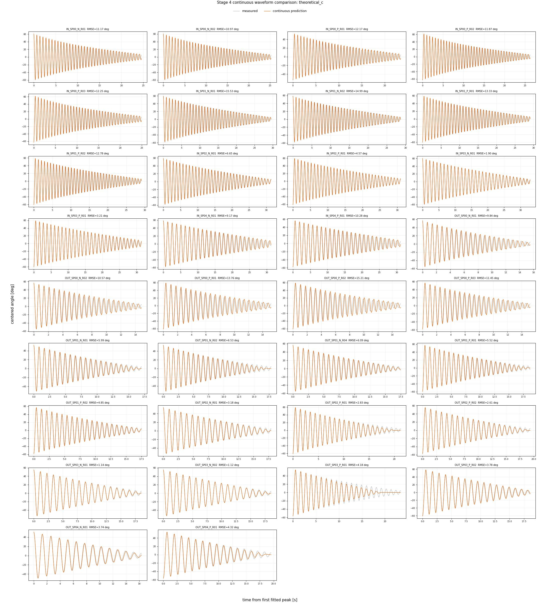
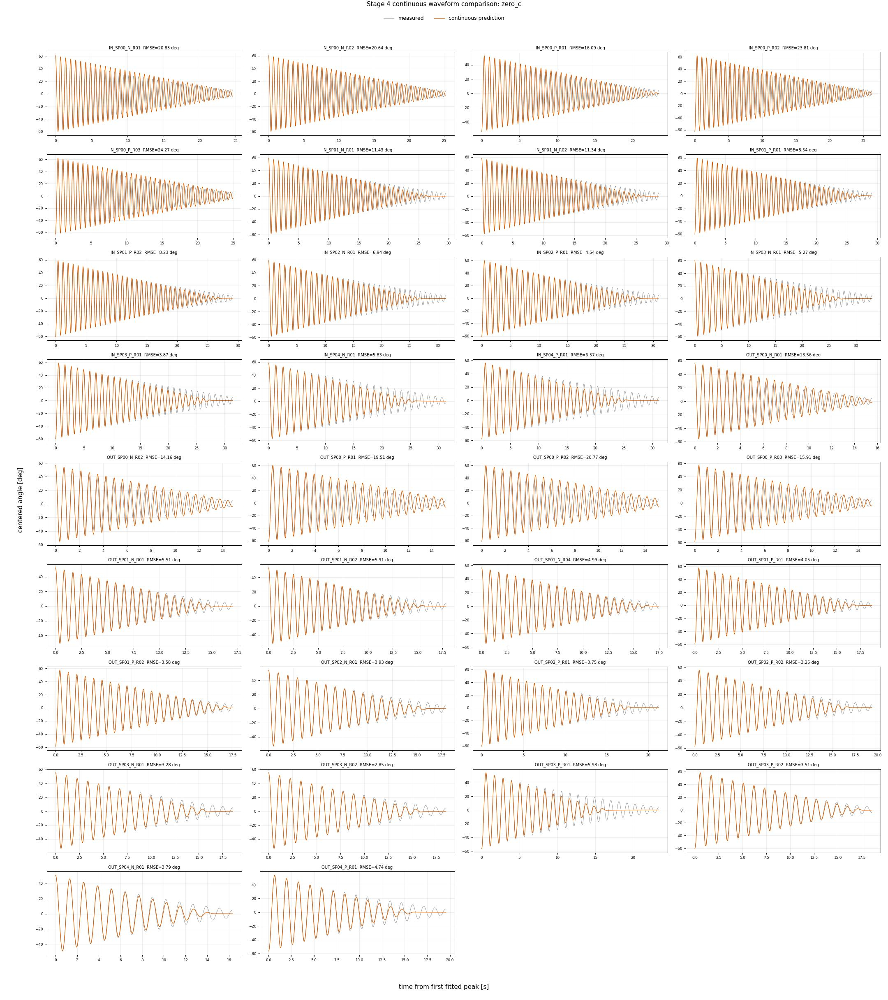

# Stage 4: 理論ロッド抗力固定・クーロン摩擦同定

## 結論

承認済み球なし34波形、1794半周期を使用した。主モデルは
`b=0`、円柱ロッドの二乗抗力係数`c`を理論値に固定し、軸別のクーロン摩擦`tau`だけを同定する。
これによりb、c、tauの間で同じ減衰量を分配する識別性の問題を除いた。
`c=0`はロッド抗力を無視した場合の影響を見る比較モデルであり、主モデルには採用しない。
I、KはStage 2の値から変更せず、連続波形の位相誤差を減衰係数へ押し込まない。

## ロッド抗力係数cの理論値

支点から距離rの円柱微小要素では速度`v=r*theta_dot`である。抗力トルクを上下ロッドへ積分すると、

```math
M_D=c|\dot{\theta}|\dot{\theta},\qquad
c=\frac{\rho C_D d}{8}(L_+^4+L_-^4)
```

| 入力 | 値 |
|---|---:|
| 空気密度 rho | 1.225 kg/m^3 |
| 円柱抗力係数 Cd | 1.2 |
| パイプ外径 d | 5.0 mm |
| 上側長さ L+ | 229 mm |
| 下側長さ L- | 70 mm |
| 理論固定値 c | 2.548675417e-06 N m s^2/rad^2 |

上側ロッドは全二乗抗力トルクの99.13%を占める。さらに円柱の外側半分は
同じ側の抗力トルクの93.75%、外側25%は68.36%を占めるため、Cdの確認では上側先端付近かつ
振り子が平衡点を通過して角速度が最大になる条件を重視する。

## レイノルズ数によるCd確認

各半周期の始点振幅Aと固定したI、Kから、保存系として平衡点通過時の最大角速度を
`omega_max=sqrt(2K(1-cos A)/I)`で算出した。レイノルズ数は`Re=rho*v*d/mu`、
空気の粘性係数は1.810e-05 Pa sとした。個々の1794条件は
[reynolds_assessment.csv](reynolds_assessment.csv)へ保存した。

| 評価位置・条件 | Re最小 | Re中央値 | Re最大 |
|---|---:|---:|---:|
| 上側先端・全採用区間 | 35.0 | 260.0 | 772.1 |
| 抗力重み付き位置・全採用区間 | 27.9 | 206.7 | 613.9 |
| 上側先端・40 deg以上 | 275.5 | 497.3 | 772.1 |
| 抗力重み付き位置・40 deg以上 | 219.1 | 395.4 | 613.9 |

観測範囲のうちcの寄与が大きい高振幅・最大速度条件は、円柱の亜臨界な低Re領域にある。
NACA TN 2960の円柱抗力試験（[NASA NTRS](https://ntrs.nasa.gov/citations/19930084018)）も参照し、
この領域では円柱Cdを概ね1.0～1.2と置く工学的近似と整合する。抗力への寄与が大きい条件を
代表する固定値としてCd=1.2を採用した。Re依存を詳細モデル化するとcが速度依存となるが、
今回の目的はtauとの分配をなくすことなので、まず単一の理論固定値を用いる。

## 同定方法

1. 各波形でb=0、cを固定し、全半周期に共通のtauだけを非負線形最小二乗で求める。
2. IN、OUTそれぞれについて、波形別tauの中央値を代表値とする。
3. 代表値を固定し、各実測頂点から次頂点までの分割積分で減衰を検証する。
4. 同じ係数で最初の有効頂点から最後まで状態をリセットせず連続積分し、累積誤差を検証する。

半周期ごとに実測頂点へ戻すのは状態`theta, theta_dot`だけであり、tauは同一波形内で共通である。
最終評価では波形別tauをそのまま使わず、軸別中央値を全34波形へ共通に適用する。

## 代表係数と誤差

| モデル | b_IN | b_OUT | c_rod | tau_IN | tau_OUT | 半周期RMSE [deg] | 連続RMSE [deg] |
|---|---:|---:|---:|---:|---:|---:|---:|
| 主: 理論c | 0.000e+00 | 0.000e+00 | 2.548675417e-06 | 8.659189535e-05 | 1.715241009e-04 | 0.514644 | 9.045576 |
| 比較: c=0 | 0.000e+00 | 0.000e+00 | 0.000000000e+00 | 1.415973251e-04 | 2.178487518e-04 | 0.616007 | 11.601369 |

分割積分は局所的な減衰則、連続積分は周期・位相誤差を含む累積挙動の確認に用いる。
連続積分の誤差を最小化していないため、位相ずれが残ってもI、Kやtauを再調整しない。

## 34波形の連続比較

### 主モデル: b=0、c=理論固定値



### 比較モデル: b=0、c=0



## 波形別tauとRe・誤差の概要


## 出力

- [波形別tau](waveform_parameters.csv)
- [全半周期の予測と残差](interval_predictions.csv)
- [モデル比較](model_comparison.csv)
- [レイノルズ数評価](reynolds_assessment.csv)
- [連続波形誤差](continuous_waveform_metrics.csv)
- [実行条件](stage4_settings.json)
