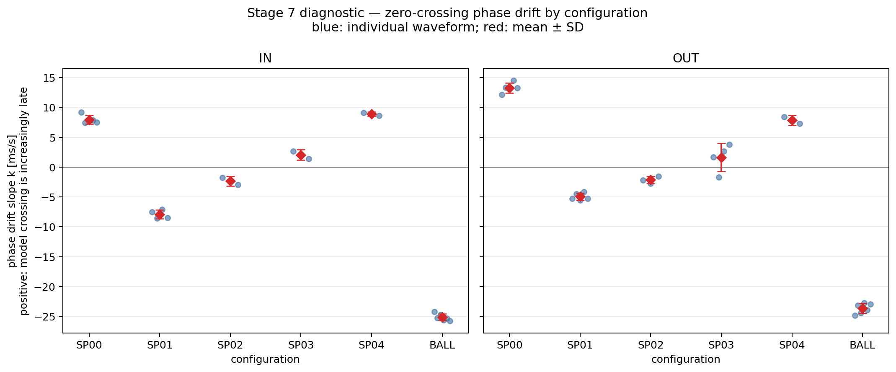

# Stage 7 診断: x軸交点における位相ズレ

## 方法

Stage 6の固定係数を変更せず、承認済み46波形について平衡角（x軸）との交点時刻を測定値・連続ODEの両方から取得した。実測交点はサンプル間を線形補間し、ODE交点は連続解の根として求めた。交点は時系列順に対応づけた。

各波形の交差時刻誤差を `e_n = t_model,n - t_measured,n` と定義する（正ならモデルが遅い）。一定の時刻原点差を除くため、最初の対応交点からの経過 `x_n` と誤差変化 `y_n = e_n - e_0` を用い、原点固定で `y = kx` を最小二乗した。従って `k > 0` はモデルの遅れが時間とともに増えることを示す。

係数は波形ごとにStage 6の軸・形態別割当てをそのまま使用し、フィットし直していない。交点数が異なる場合は共通する先頭から対応づけ、余った交点数を波形別CSVに記録した。

## 傾きの形態別プロット

## 形態別集計

| 軸 | 形態 | 波形数 | k平均 [ms/s] | k標準偏差 [ms/s] | k中央値 [ms/s] | 平均R² | 平均対応交点数 |
|---|---|---:|---:|---:|---:|---:|---:|
| IN | BALL | 6 | -25.1592 | 0.5723 | -25.3113 | 0.999 | 37.8 |
| IN | SP00 | 5 | 7.9427 | 0.7164 | 7.7631 | 0.979 | 74.0 |
| IN | SP01 | 4 | -7.9237 | 0.7238 | -7.9878 | 0.958 | 73.0 |
| IN | SP02 | 2 | -2.3542 | 0.8187 | -2.3542 | -0.086 | 67.5 |
| IN | SP03 | 2 | 2.0389 | 0.8802 | 2.0389 | 0.648 | 60.5 |
| IN | SP04 | 2 | 8.8695 | 0.3710 | 8.8695 | 0.942 | 50.5 |
| OUT | BALL | 6 | -23.6695 | 0.8610 | -23.5505 | 0.973 | 25.3 |
| OUT | SP00 | 5 | 13.2668 | 0.8401 | 13.2387 | 0.973 | 44.0 |
| OUT | SP01 | 5 | -4.9564 | 0.5916 | -5.2490 | 0.415 | 43.4 |
| OUT | SP02 | 3 | -2.1501 | 0.6152 | -2.1600 | -0.159 | 40.0 |
| OUT | SP03 | 4 | 1.6088 | 2.3438 | 2.1838 | 0.342 | 34.2 |
| OUT | SP04 | 2 | 7.8505 | 0.8235 | 7.8505 | 0.831 | 27.5 |

## 解釈上の注意

`k`の形態差は周期ずれの累積率を示すが、それだけで `I`、`K`、摩擦、球後流のいずれが原因かは特定できない。波形ごとの線形適合度、初期交点オフセット、方向差、残差の時間変化と併せて次の判断材料とする。

## 出力

- [交点ごとの誤差とフィット値](zero_crossing_residuals.csv)
- [波形ごとのkと診断値](waveform_phase_slopes.csv)
- [軸・形態別集計](phase_slope_by_configuration.csv)
