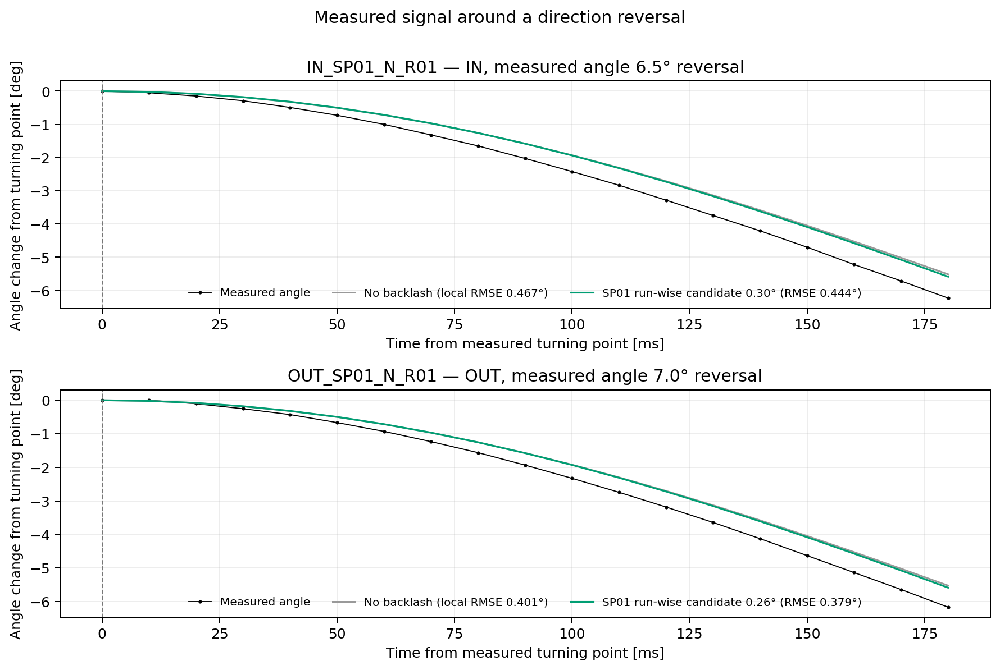
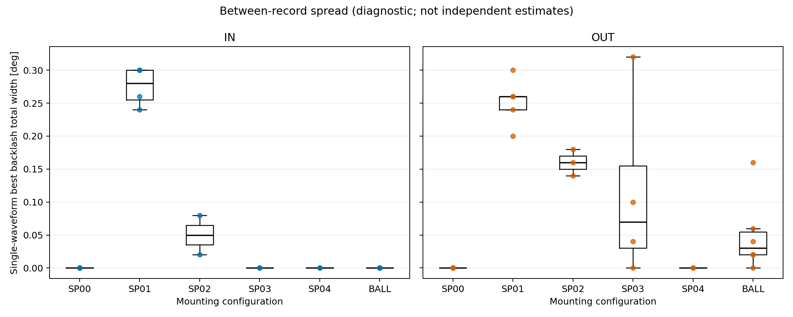
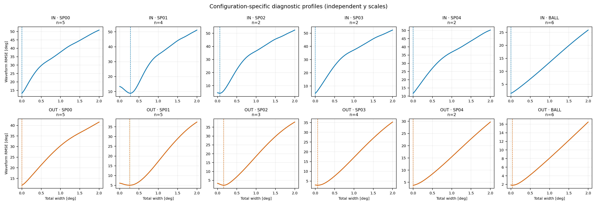
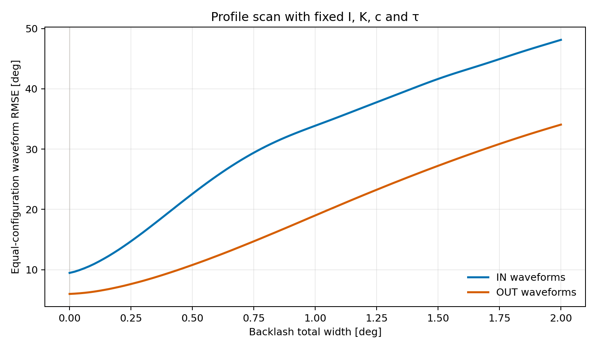

# 新ハード自由振動波形によるバックラッシュ推定

## 目的と結論の読み方

承認済み自由振動波形46本を使い、IN軸とOUT軸のバックラッシュを別々に推定した。I、K、ロッド抗力、球抗力、クーロン摩擦係数は既存の採用値に固定し、軸ごとに共通するバックラッシュ全幅だけを走査した。推定対象は、復元機構に入れたplayモデルの全幅である。

| 軸 | 共通幅の最良値 [deg] | 再標本化した最良幅の2.5–97.5%範囲 [deg] | バックラッシュなしRMSE [deg] | 最良モデルRMSE [deg] |
|---|---:|---:|---:|---:|
| IN | 0.000 | 0.000–0.000 | 9.459 | 9.459 |
| OUT | 0.000 | 0.000–0.000 | 5.971 | 5.971 |

今回の両軸の最良値は探索下限の0°だった。再標本化した1,000組もすべて0°を選び、範囲が0°に縮退した。これは「真のバックラッシュが物理的に厳密な0°」という意味ではなく、この固定係数モデルでは非ゼロ幅を採用するだけの波形誤差改善が見られなかったことを表す。再標本化範囲は係数・中心角・モデル構造の誤差を含まず、物理的な上限ではない。

## バックラッシュのモデル

角度センサーの角度を $\theta$、ばね・復元機構側の角度を $z$、バックラッシュ半幅を $\delta$ とした。全幅は $2\delta$ である。playモデルでは、角度が反転して隙間を通過する間、復元機構側の角度が直ちには動かない。

```math
z_k=\max(\theta_k-\delta,\min(z_{k-1},\theta_k+\delta))
```

運動方程式は、現在採用している固定係数に復元角 $z$ を入れた形とした。摩擦トルクと二乗抗力はそのままにし、追加パラメータは $\delta$ のみとする。

```math
I\ddot{\theta}+K\sin(z)+c|\dot{\theta}|\dot{\theta}+\tau\tanh(\dot{\theta}/\epsilon)=0,\qquad b=0
```



図は、軸共通幅の結論とは別に、繰返し波形で非ゼロ幅候補が揃ったSP01の低振幅反転直後を拡大したもの。各モデルはその反転点の計測角・角速度ゼロから局所的に再初期化している。黒は計測、灰はバックラッシュなし、緑はその波形だけで選んだ幅の候補である。これは現象の見え方を説明する診断例であり、軸別採用値ではない。反転点の小さな角度差はサンプリング、角度量子化、係数誤差でも生じるため、機械的隙間を直接測った図ではない。

## 推定手順と仮定

1. 20260921の波形レビュー表で `APPROVED` かつ解析対象に指定されたデータを使った。IN/OUT各軸で、球とスペーサ0〜4個の全形態を含む。
2. 各波形を既存前処理と同じ包絡線中心で中心化し、初期頂点から隣接する頂点の両方が4°以上の区間を対象にした。
3. シミュレーションは最初の適格頂点の計測角から開始し、角速度を0とした。初期play状態は、正の最大点なら $z=\theta-\delta$、負の最小点なら $z=\theta+\delta$ とした。
4. I/KはIHB-02の形態別値を使用した。ただしBALLは、今回完了した位置補正（180.61 mm）後のI/Kを使った。ロッド抗力は理論固定値、BALLの球抗力は方式Aの再同定値、軸別 $\tau$ は方式Aの一回積分法の採用値を使った。$b=0$ とした。
5. バックラッシュ全幅を0〜2°、0.02°刻みで走査した。各軸内では形態ごとの総重みを等しくし、形態内では波形を等重みにした。ODEは10 ms刻み（ログの公称100 Hz）のRK4で積分し、同じ計測間隔で角度残差を計算した。
6. 区間は波形単位の再標本化を1,000回行った。複数の形態を含む軸では、各形態の標本数を保った層別再標本化とした。

## 形態・繰返し間のばらつき

波形別の最良幅は、個々の試行だけでRMSEが最小になる幅である。I/Kの誤差、初期条件、中心角の小誤差も引き受けるため、単独波形の値を部品固有値とは見なさない。



| 軸 | 形態 | 波形数 | 波形別最良全幅中央値 [deg] | 10–90%範囲 [deg] |
|---|---|---:|---:|---:|
| IN | BALL | 6 | 0.000 | 0.000–0.000 |
| IN | SP00 | 5 | 0.000 | 0.000–0.000 |
| IN | SP01 | 4 | 0.280 | 0.246–0.300 |
| IN | SP02 | 2 | 0.050 | 0.026–0.074 |
| IN | SP03 | 2 | 0.000 | 0.000–0.000 |
| IN | SP04 | 2 | 0.000 | 0.000–0.000 |
| OUT | BALL | 6 | 0.030 | 0.010–0.110 |
| OUT | SP00 | 5 | 0.000 | 0.000–0.000 |
| OUT | SP01 | 5 | 0.260 | 0.216–0.284 |
| OUT | SP02 | 3 | 0.160 | 0.144–0.176 |
| OUT | SP03 | 4 | 0.070 | 0.012–0.254 |
| OUT | SP04 | 2 | 0.000 | 0.000–0.000 |

### 形態別に幅を分けた診断

軸共通幅ではなく形態別幅を別々に選ぶと、SP01ではIN 0.28°、OUT 0.26°の候補となり、同じ形態の繰返し波形でも概ね揃った。ただし他形態は0°または小さい幅となり、SP01以外に同じ非ゼロ幅が見られない。形態別の幅を各々採用すると自由度を増やした同一データ内適合になるため、軸全体の共通バックラッシュとしては採用しない。SP01の候補幅は、同じ形態でI/K・周期誤差が残る効果との分離がまだできていない。

| 軸 | 形態 | 波形数 | 形態別最良全幅 [deg] | 幅0° RMSE [deg] | 形態別最良RMSE [deg] | RMSE変化 |
|---|---|---:|---:|---:|---:|---:|
| IN | BALL | 6 | 0.00 | 1.567 | 1.567 | +0.0% |
| IN | SP00 | 5 | 0.00 | 13.250 | 13.250 | +0.0% |
| IN | SP01 | 4 | 0.28 | 13.357 | 8.842 | -33.8% |
| IN | SP02 | 2 | 0.06 | 4.596 | 4.217 | -8.2% |
| IN | SP03 | 2 | 0.00 | 4.535 | 4.535 | +0.0% |
| IN | SP04 | 2 | 0.00 | 11.779 | 11.779 | +0.0% |
| OUT | BALL | 6 | 0.04 | 1.850 | 1.812 | -2.1% |
| OUT | SP00 | 5 | 0.00 | 11.777 | 11.777 | +0.0% |
| OUT | SP01 | 5 | 0.26 | 6.097 | 5.042 | -17.3% |
| OUT | SP02 | 3 | 0.16 | 3.326 | 2.249 | -32.4% |
| OUT | SP03 | 4 | 0.06 | 3.021 | 2.896 | -4.1% |
| OUT | SP04 | 2 | 0.00 | 3.802 | 3.802 | +0.0% |





スキャン曲線が平坦であれば、RMSEの最小位置は数値上求まっても幅をデータから識別できていない。最小値が探索端にある場合も、指定範囲内の最良点にすぎない。波形ごと・形態ごとの最良幅が大きく散る場合は、共通バックラッシュ幅の仮定を支持しない。

## 解釈上の制約と次の扱い

自由振動の角度だけからバックラッシュを見積もるには、I/K、摩擦、中心角、初期play状態が正しいという仮定が必要である。いずれの誤差も周期・位相に作用し、バックラッシュ推定値へ混入しうる。特に本解析では、これら係数の不確かさを再フィットしていない。角度波形の時間差はバックラッシュが存在しなくても起こる。

従って、今回の結論は「軸全体で一貫するバックラッシュ幅は、この自由振動データからは確認できない」である。SP01の形態別候補は残るが、バックラッシュと周期係数の誤差を切り分けた確定値ではない。オブザーバーには現時点で非ゼロの補償幅を固定しない。将来、トルクと角度を同時計測する低速正逆往復で同じ幅が確認された場合に、改めて補償を判断する。

### 固定した係数

- ロッド抗力 $c_{rod}$: 2.54868e-06 N·m·s²/rad²
- 球装着時ロッド抗力 $c_{rod,BALL}$: 2.56644e-07 N·m·s²/rad²
- 球抗力 $c_{ball}$: 1.37753e-05 N·m·s²/rad²
- $\tau_{IN}$: 7.94573e-05 N·m
- $\tau_{OUT}$: 0.00017695 N·m

## 再実行

リポジトリのルートから次を実行する。必要な入力は承認済み波形選択、頂点・中心前処理、IHB-02/03係数、IHB-05の更新係数、20260921の元角度ログである。

```bash
python 06_Analysis/fitting_pipeline/run_hybrid_backlash_estimation.py
```

主要出力: `backlash_profile.csv`, `configuration_profile.csv`, `waveform_width_scan.csv`, `waveform_best_widths.csv`, `backlash_profile.png`, `configuration_profile.png`, `waveform_width_spread.png`, `reversal_neighborhood.png`, `settings.json`。
