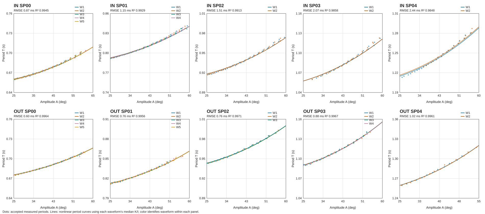

# 反復ハイブリッド同定プロセス

## ID一覧と進捗

| ID | 同定手順 | 状態 |
|---|---|---|
| IHB-01 | $c=0,\tau=0$ とし、各球なし条件の非線形周期から $K_j/I_j$ を新規算出する | 完了 |
| IHB-02 | $K_j/I_j$ と既知の $\Delta I_j,\Delta K_j$ から $I_0,K_0$ を同定する | 次 |
| IHB-03 | $I_0,K_0,c_{\mathrm{rod,model}}$ を使い、半周期の振幅減衰から $\tau_0$ を同定する | 未着手 |
| IHB-04 | 前回値で減衰項を固定して $K_j/I_j$ を再同定し、IHB-02/03を反復する | 未着手 |
| IHB-05 | IHB-01〜04で得た値を球あり形態へ展開し、球の $c$ を同定する | 未着手 |

IHB-04では条件番号と反復番号が混同しないよう、条件を $q\in\{\mathrm{SP00},\ldots,\mathrm{SP04}\}$、反復番号を $r$ と書く。

## 全体モデル

球なし条件 $q$ の物理係数を

$$
I_q=I_0+\Delta I_q,\qquad
K_q=K_0+\Delta K_q
$$

とする。IN/OUTは独立に解析する。球なし全条件で $b=0$、理論値

$$
c=c_{\mathrm{rod,model}}=2.5486754169\times10^{-6}\;\mathrm{N\,m\,s^2/rad^2}
$$

を用いる。過去のハイブリッド同定の係数結果は新しい係数の初期値・出力に流用せず、手順と比較基準の参照に限る。IHB-04の初期値は今回のIHB-01〜03で新しく算出する。

## 記号の添字

測定波形から得た量には $\mathrm{obs}$、モデルが計算・予測した量には $\mathrm{model}$ を付ける。たとえば、観測周期を $T_{w,i,\mathrm{obs}}$、理論式の予測周期を $T_{w,i,\mathrm{model}}$ と表す。$I,K,c,\tau$ などの同定対象パラメータや条件・反復添字は、観測時系列値やモデル予測値とは区別して、従来の記号のまま表す。

## 各IDの計算

### IHB-01: 減衰をゼロとして周期比を求める

IHB-01でいうフィッティングは、角度の時系列全体を数値積分波形に合わせる処理ではない。観測波形から切り出した各周期について、観測代表振幅と観測周期の組 $(A_{w,i,\mathrm{obs}},T_{w,i,\mathrm{obs}})$ を作り、保存系の非線形振り子が予測する周期との関係から比 $\kappa=K_q/I_q$ を求める。

理論モデルが予測する周期と振幅の関係を次式に示す。$K_\mathrm{ell}(m)$ は母数 $m$ の第一種完全楕円積分であり、復元係数 $K_q$ とは別の記号である。$A_{w,i,\mathrm{obs}}$ はラジアンで式に代入する（CSVと図では度で保存・表示し、計算前にラジアンへ変換する）。

$$
T_{w,i,\mathrm{model}}=
\frac{4K_\mathrm{ell}\!\left(\sin^2(A_{w,i,\mathrm{obs}}/2)\right)}{\sqrt{\kappa}},
\qquad \kappa=\frac{K_q}{I_q}
$$

各波形 $w$ の周期番号 $i$ について、観測周期 $T_{w,i,\mathrm{obs}}$ と観測代表振幅 $A_{w,i,\mathrm{obs}}$ をこの理論式に代入して、周期ごとの比を逆算する。

$$
\kappa_{w,i,\mathrm{obs}}=
\left[
\frac{4K_\mathrm{ell}\!\left(\sin^2(A_{w,i,\mathrm{obs}}/2)\right)}
{T_{w,i,\mathrm{obs}}}
\right]^2
$$

代表振幅は、同符号の頂点2点から得た角度についてポテンシャルエネルギーを平均し、それと等価な振幅として計算する。候補周期のうち、観測代表振幅が25 deg以上で、かつ波形ごとの大振幅周期から作る基準比の±1%以内に入る周期だけを採用する。採用周期の番号集合を $S_w$ とする。波形単位の推定比は、採用周期ごとに逆算した比の中央値である。

$$
\widehat{\kappa}_{w,\mathrm{obs}}=
\mathrm{median}_{i\in S_w}(\kappa_{w,i,\mathrm{obs}})
$$

このように、周期ごとに理論式を逆算してから中央値を取るロバスト推定であり、全周期点に対する最小二乗最適化ではない。条件別の値は、同じ条件に属する波形ごとの $\widehat{\kappa}_{w,\mathrm{obs}}$ を等重みで平均したものである。IHB-01で得るのは $K_q/I_q$ の観測データに基づく比だけであり、$I_q,K_q$ の個別値はIHB-02で既知増分とともに分離する。ここでは $c=\tau=0$ とする。

### IHB-02: 既知増分から $I_0,K_0$ を求める

IHB-01の条件別周期比と幾何から既知の $\Delta I_q,\Delta K_q$ を使い、

$$
\left(\frac{K_q}{I_q}\right)_\mathrm{obs}
\approx
\left(\frac{K_0+\Delta K_q}{I_0+\Delta I_q}\right)_\mathrm{model}
$$

を全SP条件で解く。制約・重み・残差診断を記録し、IN/OUT別に新しい $I_0,K_0$ を得る。

### IHB-03: 固定 $I_0,K_0,c_{\mathrm{rod,model}}$ から $\tau_0$ を求める

IHB-02の $I_0,K_0$、既知の形態増分、理論 $c_{\mathrm{rod,model}}$、$b=0$ を固定し、既存ハイブリッド同定の半周期振幅減衰法で $\tau_0$ を推定する。使用半周期、波形別残差、軸別の統合方法を保存する。この推定値も今回の実行で新しく得る。

### IHB-04: 前回の減衰項で周期比を更新して反復する

反復 $r=0$ の値は今回のIHB-01〜03で求めた $I_0^{(0)},K_0^{(0)},\tau_0^{(0)}$ とする。各反復で条件 $q$ の慣性を

$$
I_q^{(r-1)}=I_0^{(r-1)}+\Delta I_q
$$

として、正規化運動方程式

$$
\ddot{\theta}_{\mathrm{model}}+
\widehat{\kappa}_{q,\mathrm{obs}}^{(r)}\sin\left(\theta_{\mathrm{model}}\right)+
\frac{c_{\mathrm{rod,model}}}{I_q^{(r-1)}}|\dot{\theta}_{\mathrm{model}}|\dot{\theta}_{\mathrm{model}}+
\frac{\tau_0^{(r-1)}}{I_q^{(r-1)}}\mathrm{sgn}(\dot{\theta}_{\mathrm{model}})=0
$$

を使う。未知量は観測波形から同定する比 $\widehat{\kappa}_{q,\mathrm{obs}}^{(r)}=K_q/I_q$ とし、他項は前回値で固定する。ここで $c_{\mathrm{rod,model}}/I_q^{(r-1)}$ と $\tau_0^{(r-1)}/I_q^{(r-1)}$ は既知である。

更新した全条件の $\widehat{\kappa}_{q,\mathrm{obs}}^{(r)}$ をIHB-02へ戻して $I_0^{(r)},K_0^{(r)}$ を求め、その値と $c_{\mathrm{rod,model}}$ を固定してIHB-03を再実行し、$\tau_0^{(r)}$ を求める。これを停止条件まで繰り返す。反復ごとに各係数、フィット残差、波形へ戻した予測結果を保存する。

### IHB-05: 球あり形態で球の $c$ を同定する

収束後の $I_0,K_0,\tau_0$ と実測球の質量・位置による $\Delta I,\Delta K$ を用いて球ありの $I,K$ を計算する。ロッドの理論抗力寄与と $b=0$ を固定し、球あり波形から球の $c$ を同定する。

## IHB-01 実施結果

### 入力と再計算方法

承認済み球なし波形34本（IN 15本、OUT 19本）の頂点データを用い、Stage 2の保存済み $I_0,K_0$ を読み込まずに周期比を再計算した。IHB-01で使った規則は、共通の代表振幅25 deg以上、波形の大振幅周期基準から±1%以内とする。代表振幅は同符号周期端点のポテンシャルエネルギー平均から計算し、楕円積分は算術幾何平均で評価した。各波形の周期比の中央値を求め、条件値は波形ごとに等重みで平均した。

入力の承認表blobは `cabbeca3242d0ef8f267e160f46bed2e4fa0fcdd`、頂点データblobは `95fc7a10f200bc5c69aa9ddc2848567b1717ff4d`。これらは頂点抽出済みの観測データであり、Stage 2の係数出力は入力に使っていない。

| 軸 | 条件 | 波形数 | 採用周期数 | $\overline{\widehat{\kappa}}_{q,\mathrm{obs}}$ [s$^{-2}$] | 周期RMSE [ms] | $R^2$* |
|---|---|---:|---:|---:|---:|---:|
| IN | SP00 | 5 | 183 | 92.745108 | 0.8664 | 0.994549 |
| IN | SP01 | 4 | 151 | 64.343095 | 1.1466 | 0.992885 |
| IN | SP02 | 2 | 71 | 47.971224 | 1.5085 | 0.991333 |
| IN | SP03 | 2 | 50 | 36.162654 | 2.0683 | 0.985826 |
| IN | SP04 | 2 | 46 | 27.366380 | 2.4425 | 0.984758 |
| OUT | SP00 | 5 | 99 | 88.620911 | 0.5980 | 0.996400 |
| OUT | SP01 | 5 | 99 | 61.246205 | 0.7613 | 0.995588 |
| OUT | SP02 | 3 | 59 | 45.458870 | 0.7563 | 0.997055 |
| OUT | SP03 | 4 | 69 | 34.029234 | 0.8796 | 0.996680 |
| OUT | SP04 | 2 | 27 | 25.491741 | 1.0195 | 0.996091 |

*周期RMSEと $R^2$ は、採用済み周期に対する条件別のインサンプル指標である。各観測点 $(A_{w,i,\mathrm{obs}},T_{w,i,\mathrm{obs}})$ に対する予測周期 $T_{w,i,\mathrm{model}}$ は、その波形の $\widehat{\kappa}_{w,\mathrm{obs}}$ を上式に代入して計算する。条件に属する全採用周期で残差 $e_{w,i}=T_{w,i,\mathrm{obs}}-T_{w,i,\mathrm{model}}$ を集計し、$\mathrm{RMSE}=1000\sqrt{\sum e_{w,i}^2/N}$ [ms]、$R^2=1-\sum e_{w,i}^2/\sum(T_{w,i,\mathrm{obs}}-\overline{T}_{\mathrm{obs}})^2$ とした。波形別中央値を使った曲線に対する適合度であり、未使用波形での予測性能や $I,K$ の分離誤差ではない。

### 条件別フィッティング図

以下にIN/OUT × SP00〜SP04の10条件を1枚にまとめる。点は採用周期の実測値、色ごとの曲線は各波形で得た中央値 $\widehat{\kappa}_{w,\mathrm{obs}}$ を係数にした周期モデル $T_\mathrm{model}$である。各パネルに周期RMSEと $R^2$ を示す。



### 再現用ツールと出力

IHB-01の計算を再実行する標準ライブラリのみのスクリプトを追加した。

- [ihb01_period_ratio.py](../../../iterative_hybrid/ihb01_period_ratio.py)
- [条件別 (K/I)](ihb01_condition_ratios.csv)
- [波形別 (K/I)](ihb01_waveform_ratios.csv)
- [周期別診断値](ihb01_cycle_ratios.csv)

実行例:

```bash
python 06_Analysis/fitting_pipeline/iterative_hybrid/ihb01_period_ratio.py \\
  --selection-csv <approved-selection.csv> \\
  --turning-points-csv <turning-points.csv> \\
  --output-dir <output-directory>
```

スクリプトは承認済み選択表と頂点表から波形別・周期別・条件別CSVを生成する。合成振動データで、選択フィルタ、周期比計算、出力生成までの動作確認を行った。今回の34波形の新規計算結果は、同じ式・フィルタを適用した計算結果を上記CSVに保存した。

### IHB-01の評価

周期比は全条件で得られ、IHB-02へ進めるデータはある。ただしSP02〜SP04の一部は条件あたり波形が2本で、周期数が多くても独立した波形再現性の情報は限られる。IHB-02では波形数の偏りを重みに反映し、5条件で分離した $I_0,K_0$ が安定かを確認する。

前回のハイブリッド値を係数初期値として流用していない。今回の新規周期比が過去出力に近い場合も、同じ観測データと採用規則から得た結果であることによる。IHB-01は $I_q,K_q$ 個別値を決めたものではない。これらの分離は次のIHB-02の役割である。

## 収束判定案

IHB-04では符号付き時刻誤差を単純に足して相殺させず、波形ごとに集約した二乗誤差を使う。候補指標は波形全体の角度RMSEと、ゼロ交差時刻差 $\Delta t_n=t_{n,\mathrm{model}}-t_{n,\mathrm{obs}}$ の波形別二乗平均である。パラメータ変化量と予測誤差の変化を併記し、最終停止閾値は計測・頂点検出の再現ばらつきに基づいて決める。IHB-02/03開始前にこの目的関数と閾値の定義を確定する。
