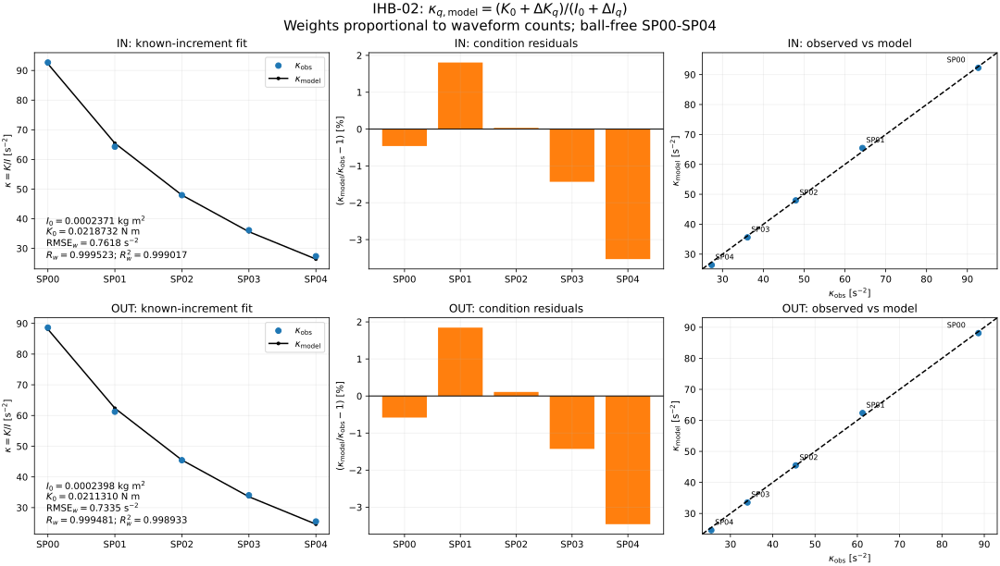

# IHB-02: 既知の付加質量増分から基準 I₀・K₀を同定

## 結果

IHB-01の条件内共通線形フィットで得た10条件の周期比を入力に、IN・OUTを独立に新規同定した。過去のStage 2やハイブリッド同定で得た係数は、初期値にも出力にも使っていない。球なし・スペーサなしのSP00を基準形態とする。

| 軸 | 条件数 | 採用波形数 | $`I_0`$ [kg m²] | $`K_0`$ [N m] | $`\mathrm{RMSE}_w`$ [s⁻²] | $`R_w`$ | $`R_w^2`$ |
|---|---:|---:|---:|---:|---:|---:|---:|
| IN | 5 | 15 | 0.000237094050 | 0.021873198594 | 0.761752 | 0.999523 | 0.999017 |
| OUT | 5 | 19 | 0.000239819686 | 0.021131036118 | 0.733508 | 0.999481 | 0.998933 |

$`K_0`$ は運動方程式の $`K_0\sin\theta`$ に掛かる復元トルク係数で、単位はN mである。微小角のトルク勾配として表す場合はN m/radに相当する。

5条件全体の適合度は高いが、両軸ともSP04で予測周期比が約3.5%低くなる。さらにSP00を外すと基準慣性が約8〜9%変わる。したがって、この結果はIHB-03へ渡す初回推定値であり、減衰補正を含むIHB-04の収束確認を終えた最終値ではない。IHB-03以降はまだ実施していない。

## 入力と既知増分

- [IHB-01の条件別周期比](ihb01_condition_ratios.csv)：採用854周期、34波形。条件内で波形の総重みを等しくした切片ゼロの線形フィット結果をそのまま使う。
- [resolved_manifest.csv](../resolved_manifest.csv)：質量・符号付き重心位置・重心回り慣性・採用フラグ。今回参照したblobは `a3c2535bd634bc5055bb751650ec9de43427b5c3`。
- [物理入力の出典](../physical_input_sources.csv)：錘計測結果.xlsxと取り付け位置の定義。IHB-01入力blobは `5a9ae9b31ed65902cf9ab16f74500113308a0fd4`。

保存済みマニフェストの物理入力を再利用し、過去の同定係数を含むCSVは読み込まない。重力加速度は既存ツールと同じ9.81 m/s²。スペーサは1個1.18 g、長さ5 mm、内径5.3 mm、外径8 mmの円筒を前提とする。支点から端面まで229 mm、外側の端面から5 mm内側にスペーサ列の外側端を置く既存の位置解釈を引き継ぐ。SP03は合計質量の実測記録がなく、1.18 g×3という仮定を引き継ぐ。上側にある追加部品は復元トルクを減らすため、重心位置と追加復元係数の符号は負になる。

```math
\Delta I_q=J_{G,q}+m_q r_q^2,\qquad
\Delta K_q=m_q g r_q
```

| 条件 | 合計質量 [g] | 符号付き重心位置 [mm] | $`J_G`$ [kg m²] | $`\Delta I`$ [kg m²] | $`\Delta K`$ [N m] |
|---|---:|---:|---:|---:|---:|
| SP00 | 0 | 0 | 0 | 0 | 0 |
| SP01 | 1.18 | −221.5 | 9.249971e-9 | 5.79027050e-5 | −0.0025640397 |
| SP02 | 2.36 | −219.0 | 3.324994e-8 | 1.13221210e-4 | −0.0050702004 |
| SP03 | 3.54 | −216.5 | 8.674991e-8 | 1.66014515e-4 | −0.0075184821 |
| SP04 | 4.72 | −214.0 | 1.844999e-7 | 2.16341620e-4 | −0.0099088848 |

両軸に同じ追加部品の増分を使い、基準係数だけを軸別に求める。球あり波形はこの同定に使わない。BALLへの展開はIHB-05で行う。

## 同定方法と重み

IHB-01で観測波形から推定した条件別周期比を $`\widehat\kappa_{q,\mathrm{obs}}`$ とする。既知増分で予測する周期比は

```math
\kappa_{q,\mathrm{model}}=
\frac{K_0+\Delta K_q}{I_0+\Delta I_q}
```

である。条件の採用波形数を $`W_q`$ とし、軸内で正規化した重みで次の目的関数を最小化する。

```math
a_q=\frac{W_q}{\sum_p W_p},\qquad
J(I_0,K_0)=\sum_q a_q
\left(\kappa_{q,\mathrm{model}}-\widehat\kappa_{q,\mathrm{obs}}\right)^2
```

INの波形数は5/4/2/2/2、OUTは5/5/3/4/2。採用周期数の多い長い波形を過大評価しないよう、条件の重みには周期数ではなく波形数を使う。これは逆分散重みや信頼区間を意味しない。全条件等重みとの差も診断する。

現在の観測値と既知増分だけから、線形関係

```math
\widehat\kappa_{q,\mathrm{obs}} I_0-K_0
=\Delta K_q-\widehat\kappa_{q,\mathrm{obs}}\Delta I_q
```

を重み付き最小二乗で解き、初期値にする。その後、上記の周期比残差を制約付き最小二乗で最小化する。線形式の残差は周期比残差に $`I_0+\Delta I_q`$ を掛けたものなので、その線形解を最終解にすると目的関数の重みが変わる。今回のIHB-02の最終解は周期比残差を最小にする方を採用した。

IHB-01の周期スケールに対する線形同定は変更していない。IHB-02は基準2係数を分離する別の問題であり、ここでは比の式を直接合わせる。新しい補正項や自由な切片は追加していない。$`I_0,K_0`$ と各条件の慣性・復元係数を正に制約し、解では全ての条件が正となった。

## 条件別予測と残差

残差の符号はモデル−観測で統一する。

| 軸 | 条件 | $`\widehat\kappa_{\mathrm{obs}}`$ [s⁻²] | $`\kappa_{\mathrm{model}}`$ [s⁻²] | 残差 [s⁻²] | 相対残差 [%] |
|---|---|---:|---:|---:|---:|
| IN | SP00 | 92.682499 | 92.255367 | −0.427132 | −0.461 |
| IN | SP01 | 64.294371 | 65.455496 | +1.161125 | +1.806 |
| IN | SP02 | 47.950123 | 47.965362 | +0.015239 | +0.032 |
| IN | SP03 | 36.127237 | 35.610051 | −0.517186 | −1.432 |
| IN | SP04 | 27.351186 | 26.385912 | −0.965273 | −3.529 |
| OUT | SP00 | 88.627845 | 88.112183 | −0.515662 | −0.582 |
| OUT | SP01 | 61.233169 | 62.363453 | +1.130284 | +1.846 |
| OUT | SP02 | 45.443269 | 45.492848 | +0.049578 | +0.109 |
| OUT | SP03 | 34.027859 | 33.542156 | −0.485703 | −1.427 |
| OUT | SP04 | 25.482863 | 24.601278 | −0.881585 | −3.460 |



左はSP条件ごとの観測周期比と予測、中央は相対残差、右は観測対予測と一致線を示す。左の線は離散的なSP条件の予測点を結んだものである。図の式・添字はmathtextで描画し、SVGパスとして保存した。

## 適合度の定義

```math
e_q=\kappa_{q,\mathrm{model}}-\widehat\kappa_{q,\mathrm{obs}},\qquad
\bar\kappa_{\mathrm{obs}}=\sum_q a_q\widehat\kappa_{q,\mathrm{obs}}
```

```math
\mathrm{RMSE}_w=\sqrt{\sum_q a_q e_q^2},\qquad
R_w^2=1-\frac{\sum_q a_q e_q^2}
{\sum_q a_q(\widehat\kappa_{q,\mathrm{obs}}-\bar\kappa_{\mathrm{obs}})^2}
```

$`R_w`$ は同じ重みで計算した観測と予測のPearson相関係数。$`R_w^2`$ は残差から計算した決定係数であり、相関係数の単純な二乗ではない。今回のRMSEは周期比の単位s⁻²で、IHB-01の周期残差のmsとは対象・単位が異なる。いずれも同定に使った5条件のインサンプル指標である。

## 安定性と数値検証

| 確認 | IN | OUT |
|---|---:|---:|
| 全条件等重みにした場合の $`I_0`$ 変化 [%] | +1.089 | +0.800 |
| 全条件等重みにした場合の $`K_0`$ 変化 [%] | +0.880 | +0.692 |
| SP00を外した場合の $`I_0`$ 変化 [%] | +8.660 | +8.380 |
| SP00を外した場合の $`K_0`$ 変化 [%] | +4.464 | +4.228 |
| SP00以外を1条件ずつ外した場合の最大 $`|\Delta I_0|`$ [%] | 1.448 | 1.129 |
| SP00以外を1条件ずつ外した場合の最大 $`|\Delta K_0|`$ [%] | 1.312 | 1.033 |

5条件から1条件ずつ外す診断では、SP00が係数分離に強く効いている。条件除外の変化幅は信頼区間ではない。質量・位置の計測誤差は今回伝播させていない。

両軸でSP01が正、SP03・SP04が負になる共通の残差傾向がある。減衰をゼロとした周期比、代表振幅・採用規則、追加部品の質量・位置などの影響を候補に残すが、この段階では原因を特定しない。残差を小さくするためにスペーサの物理入力を逆調整したり、条件ごとの自由係数を追加したりしていない。

数値解は、各 $`I_0`$ に対して $`K_0`$ を解析的に消去した独立の1変数最小化と相対許容差2e-7で一致した。実際の増分を使った誤差なし合成データでは既知の基準係数を相対許容差1e-10で回復した。条件の順序を反転しても相対許容差1e-8で一致した。全条件の慣性・復元係数の正値も確認済み。

## 再現方法と出力

依存パッケージ：NumPy、SciPy、Matplotlib。

```bash
python 06_Analysis/fitting_pipeline/iterative_hybrid/ihb02_base_identification.py \
  --condition-csv 06_Analysis/fitting_pipeline/results/20260921/iterative_hybrid/ihb01_condition_ratios.csv \
  --manifest-csv 06_Analysis/fitting_pipeline/results/20260921/resolved_manifest.csv \
  --output-dir 06_Analysis/fitting_pipeline/results/20260921/iterative_hybrid
```

- [再現スクリプト](../../../iterative_hybrid/ihb02_base_identification.py)
- [基準係数・適合度](ihb02_base_parameters.csv)
- [全条件の物理係数・予測・残差](ihb02_condition_predictions.csv)
- [条件除外・重み変更の感度](ihb02_sensitivity.csv)
- [設定と入力SHA-256](ihb02_settings.json)
- [数値検証結果](ihb02_validation.json)

IHB-02はここでレビュー待ちとする。次のIHB-03では本結果と既知増分を固定し、既存計画のロッド理論抗力・$`b=0`$ の下で半周期振幅減衰から $`\tau_0`$ を求める。
