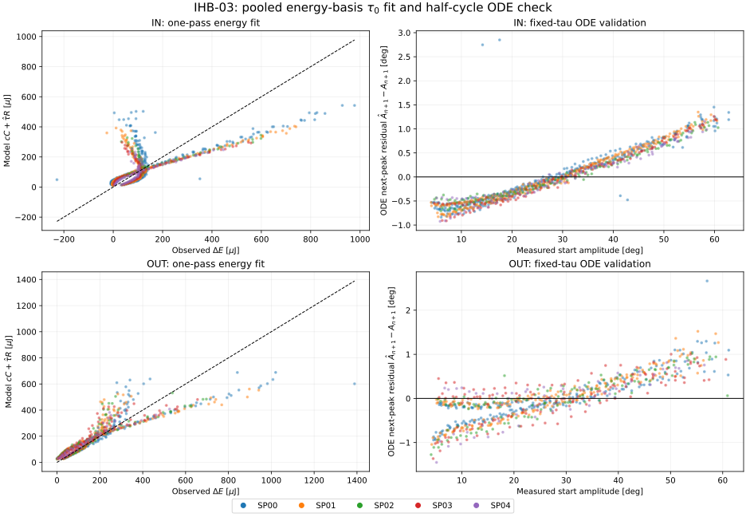
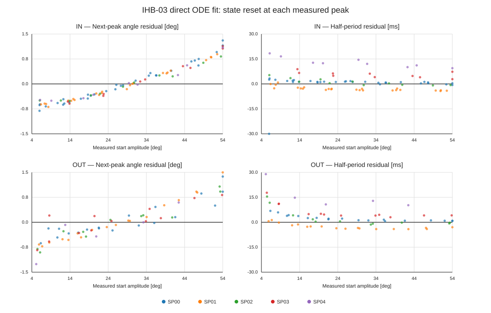

# IHB-03: 一回計算のエネルギー基底による摩擦係数同定

## 結果

本レポートには当初の一回積分エネルギー基底法に加え、後段に実測頂点ごとに状態をリセットする半周期ODE直接フィットを追記した。今回追加した直接法を同定法選択の新しい比較基準とし、エネルギー基底法の数値は比較用に保持する。

IHB-02で得た I₀,K₀、スペーサ増分、b=0、理論ロッド抗力係数を固定して、クーロン摩擦 τ₀ をIN・OUT別に同定した。半周期ODEを反復して係数を探す方法ではなく、各半周期のエネルギー基底を一度計算し、軸ごとに一回の切片ゼロ線形最小二乗で係数を求めた。その後、固定した τ₀ で全半周期をODE予測し、独立に適合度を確認した。

| 軸 | 波形数 | 半周期数 | τ₀ [N m] | エネルギーRMSE [mJ] | エネルギー R² | ODE頂点RMSE [deg] | ODE頂点 R² |
|---|---:|---:|---:|---:|---:|---:|---:|
| IN | 15 | 1,025 | 8.2576141 × 10⁻⁵ | 0.1083 | 0.4673 | 0.5504 | 0.999699 |
| OUT | 19 | 769 | 1.7519982 × 10⁻⁴ | 0.0876 | 0.7549 | 0.5014 | 0.999708 |

ODEでの最大波形別RMSEはIN 0.646 deg、OUT 0.622 degだった。波形ごとの総重みを同じにしているため、長い波形が係数を支配しない。半周期は実測点の隣り合う採用頂点対の数で、対象外頂点を飛び越して接続していない。

## 対象データと固定値

承認済み球なし波形34本（IN 15本、OUT 19本）のみを使用した。球あり波形や承認されていない波形は含めない。リリースから最初の頂点までの区間は捨て、記録された頂点から次の頂点までを用いた。頂点は既存の前処理結果を使い、平衡中心は包絡線中点由来の固定値である。先頭・終端の振幅が共に4 deg以上の隣り合うピーク対を採用した。

形態・軸ごとの I,K はIHB-02の基準値に既知のスペーサ増分を加えた値で固定した。ロッド抗力は両軸・全球なし条件で c_rod=2.5486754169×10⁻⁶ N m s²/rad²、粘性係数は b=0 に固定した。摩擦正則化を含むODE検証には既定値 ε=0.5 deg/s を用いた。過去に同定された τ 値は初期値や解に流用していない。

## 積分一回で解ける理由

ある半周期の始点・終点角をそれぞれ Aₙ,Aₙ₊₁ [rad] とする。折返し点では角速度がゼロなので、実測振幅から得る力学的エネルギー差は

~~~math
\Delta E_n=K_j\left[\cos(|A_{n+1}|)-\cos(|A_n|)\right]
~~~

である。速度の符号関数を使うクーロン摩擦の散逸仕事は、半周期中に角度が一方向へ動くため、速度波形を知らなくても角度移動量から厳密に求まる。

~~~math
R_n=|A_n|+|A_{n+1}|,\qquad W_{\tau,n}=\tau_0 R_n
~~~

二乗抗力の基底 Cₙ=∫|θ̇|³dt は、有限振幅の非線形復元力を保った保存振り子軌道から一度計算する。ω₀=√(Kⱼ/Iⱼ) とすると

~~~math
C_n=4\omega_0^2\left[\sin(|A_n|)-|A_n|\cos(|A_n|)\right]
~~~

この基底は、二乗抗力が実際に存在する軌道そのものではなく、散逸を無視した保存軌道に沿って評価する近似である。この点は、後述する非線形ODE検証で影響を確かめる。二つの散逸寄与を差し引くと、

~~~math
y_n=\Delta E_n-c_{\mathrm{rod}}C_n
=\tau_0R_n+e_n
~~~

となる。各波形 w に同じ総重みを与えた重み a_w,n=1/(W N_w) について、最終係数は一回の閉形式最小二乗で得られる。

~~~math
\widehat\tau_0=\max\!\left(0,
\frac{\sum_{w,n}a_{w,n}R_{w,n}y_{w,n}}
{\sum_{w,n}a_{w,n}R_{w,n}^2}\right)
~~~

ここで W は軸内の波形数、N_w は波形ごとの採用半周期数である。波形選別後の実測データのみを用い、外れ値を任意に切り落とすロバスト損失や自由切片は導入していない。高振幅側に残る残差を見て、追加の説明変数を後付けしない。

## 非線形ODEによる独立確認

一度求めた軸別の τ̂₀ と固定 Iⱼ,Kⱼ,c_rod,b=0 を使い、計測された各始点頂点から次の頂点まで、検証済みDOP853ソルバーで積分した。ODEの正則化クーロン項には τ₀ tanh(θ̇/ε) を使う。実測頂点間へ戻して評価するため、前の区間の誤差は累積しない。ここでは τ₀ の再最適化を行っていない。

| 軸 | 波形等重み頂点角RMSE [deg] | 頂点 R² | 半周期時間RMSE [ms] |
|---|---:|---:|---:|
| IN | 0.5504 | 0.999699 | 11.2 |
| OUT | 0.5014 | 0.999708 | 7.3 |

エネルギーRMSE・R²は観測された半周期損失と cC+τ̂₀R の差に対する指標である。ODE頂点RMSE・R²はモデル予測頂点と実測次頂点との比較で、対象量・残差定義が異なる。エネルギー R² が低く見える軸について、ODE頂点一致だけで I,K や c の妥当性を証明したとは扱わない。

左列は計測された半周期エネルギー損失と一回計算の基底予測、右列は固定した τ₀ によるODE頂点残差を示す。点の色はSP条件である。

## 感度と制約

4 degの採用閾値を3 degまたは5 degへ変えたときの τ₀ の変化は両軸とも0.05%未満だった。各SP条件を一つずつ外す診断でも、INの変化は1%未満、OUTで最大の変化はSP00除外時の−4.18%だった。これは条件選択の感度診断であり、測定不確かさを伝播した信頼区間ではない。質量・重心位置と I,K,c の不確かさも今回の区間には含めない。

エネルギー基底法は高速で、積分基底を一回計算した後に τ₀ を線形最小二乗で一度解ける。一方、Cₙ は保存軌道近似であり、正則化した摩擦仕事も符号関数の理想積分である。計算時間が短いことだけを根拠に最終値とはせず、今回は全1,794区間での固定係数ODE検証を併記した。必要になれば、ODE直接最小化値との差を追加診断できる。

## 再現方法

必要パッケージはNumPy、SciPy、Matplotlib。

~~~bash
python 06_Analysis/fitting_pipeline/iterative_hybrid/ihb03_friction_identification.py \
  --turning-points-csv 06_Analysis/fitting_pipeline/results/20260921/hybrid_identification/01_preprocessing/turning_points.csv \
  --selection-csv 06_Analysis/fitting_pipeline/results/20260921/waveform_review/waveform_selection.csv \
  --condition-physics-csv 06_Analysis/fitting_pipeline/results/20260921/iterative_hybrid/ihb02_condition_predictions.csv \
  --base-parameters-csv 06_Analysis/fitting_pipeline/results/20260921/iterative_hybrid/ihb02_base_parameters.csv \
  --output-dir 06_Analysis/fitting_pipeline/results/20260921/iterative_hybrid
~~~

- [再現スクリプト](../../../iterative_hybrid/ihb03_friction_identification.py)
- [軸別τと適合度](ihb03_tau_parameters.csv)
- [全半周期のエネルギー基底・ODE予測](ihb03_interval_predictions.csv)
- [波形別ODE残差](ihb03_waveform_metrics.csv)
- [振幅閾値・SP除外感度](ihb03_sensitivity.csv)
- [実行条件・入力SHA-256](ihb03_settings.json)
- [数値検証](ihb03_validation.json)

IHB-03はレビュー待ちで止める。IHB-04の反復更新にはまだ進まない。

## 追加解析：実測頂点ごとにリセットする半周期ODEフィット

ご指摘を受け、係数同定自体も半周期ごとのODE積分で行う解析を追加した。以前のエネルギー基底法では半周期の散逸基底を一度計算し、その近似式から τ₀ を閉形式で求めていた。今回の直接法では、各区間の開始角度を実測頂点に戻し、固定した I,K,b,c と候補 τ₀ で次の折返し点まで数値積分する。予測した次頂点角と実測値の差を目的関数とし、同じ軸の全波形をまとめて τ₀ を1つ求めた。区間間で状態・位相誤差は引き継がない。

~~~math
\\widehat{\\tau}_{0}
=\\arg\\min_{\\tau_0\\ge 0}
\\sum_w\\frac{1}{W N_w}
\\sum_{n=1}^{N_w}
\\left[\\theta_{n+1}^{\\mathrm{ODE}}(\\tau_0;\\theta_n^{\\mathrm{meas}})
-\\theta_{n+1}^{\\mathrm{meas}}\\right]^2
~~~

ODEは各区間で実測始点角・角速度ゼロから解き直す。重みは一波形あたりの総和が等しくなるようにした。最小化する量は次頂点角であり、半周期時間は独立の診断値である。IHB-02の I,K、理論ロッド抗力係数、b=0、4 deg採用閾値、対象波形は一回積分法と同一である。

| 軸 | 方法 | τ₀ [N m] | 半周期頂点角RMSE [deg] | 半周期時間RMSE [ms] |
|---|---|---:|---:|---:|
| IN | 一回積分のエネルギー基底 | 8.2576 × 10⁻⁵ | 0.55045 | 10.9049 |
| IN | 半周期リセットODE直接フィット | 8.8238 × 10⁻⁵ | 0.54933 | 10.9015 |
| OUT | 一回積分のエネルギー基底 | 1.7520 × 10⁻⁴ | 0.50143 | 7.3560 |
| OUT | 半周期リセットODE直接フィット | 1.5633 × 10⁻⁴ | 0.47674 | 7.3695 |

直接法の τ₀ はエネルギー基底法に対しINで+6.86%、OUTで−10.77%となった。一方、同じリセット半周期ODEで評価した頂点角RMSEの改善はINで0.2%、OUTで4.9%で、半周期時間RMSEはほぼ同じだった。直接ODEフィットへの変更で大きく改善したとは言えない。特にINではほぼ同じ適合度で τ₀ が異なり、減衰係数の識別には依然として不確かさがある。角度減衰を合わせる目的では、今回の直接法を次の比較基準とする。

図の点は半周期残差を振幅条件ごとに示す（表示点は視認性のため間引き、数値評価は全1,794区間）。各積分は実測開始頂点から独立に開始する。左列は予測次頂点の角度残差、右列は半周期時間残差。残る時間誤差や振幅依存の角度残差は、τだけでは説明できない周期係数 I,K の誤差やモデル近似も含みうるため、これだけで原因を特定しない。

この結果は連続波形を初期条件から最後まで積分した誤差を評価するものではない。位相ずれを積算させない以前のハイブリッド同定と同じ評価設計であり、連続波形の誤差指標とは直接比較しない。IHB-04の減衰補正付き周期確認も未実施なので、I,Kの最終同定値とは扱わない。

再現には [半周期ODE直接フィットスクリプト](../../../iterative_hybrid/ihb03_half_cycle_ode_fit.py) を使う。直接ODE係数と波形別指標は、それぞれ [係数・集約適合度](ihb03_half_cycle_ode_parameters.csv)、[波形別適合度](ihb03_half_cycle_ode_waveform_metrics.csv) に保存した。

~~~bash
python 06_Analysis/fitting_pipeline/iterative_hybrid/ihb03_half_cycle_ode_fit.py \\
  --turning-points-csv 06_Analysis/fitting_pipeline/results/20260921/hybrid_identification/01_preprocessing/turning_points.csv \\
  --selection-csv 06_Analysis/fitting_pipeline/results/20260921/waveform_review/waveform_selection.csv \\
  --condition-physics-csv 06_Analysis/fitting_pipeline/results/20260921/iterative_hybrid/ihb02_condition_predictions.csv \\
  --output-dir 06_Analysis/fitting_pipeline/results/20260921/iterative_hybrid
~~~
