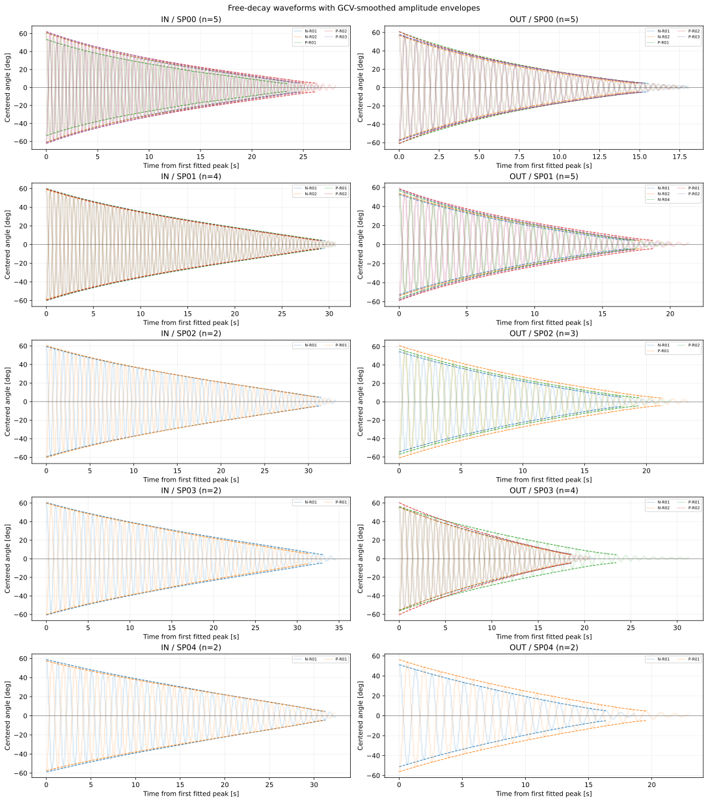
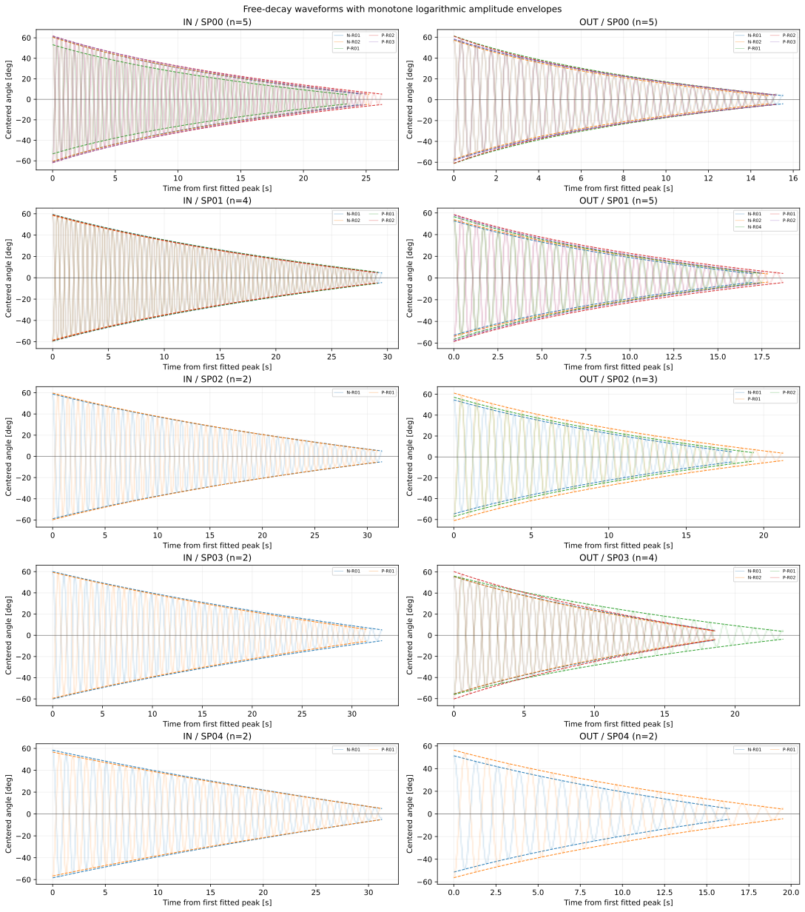
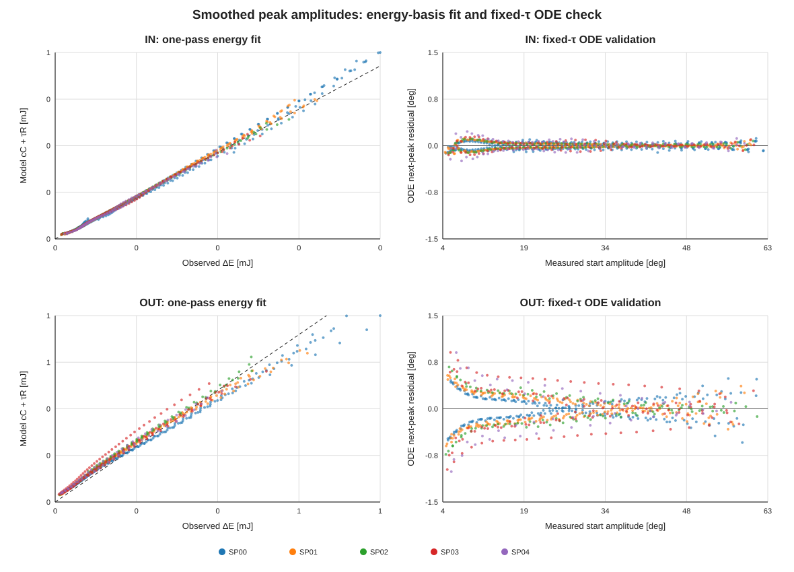
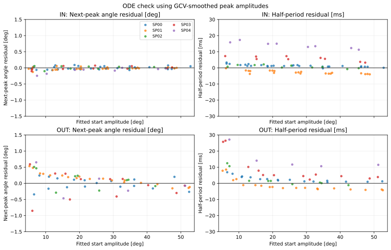
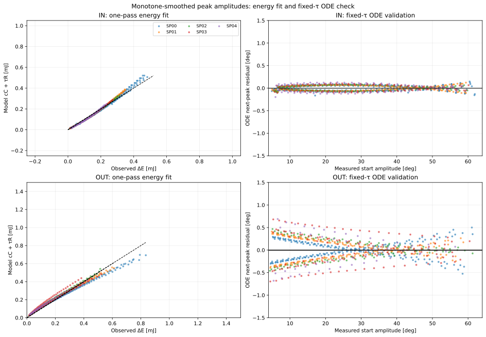
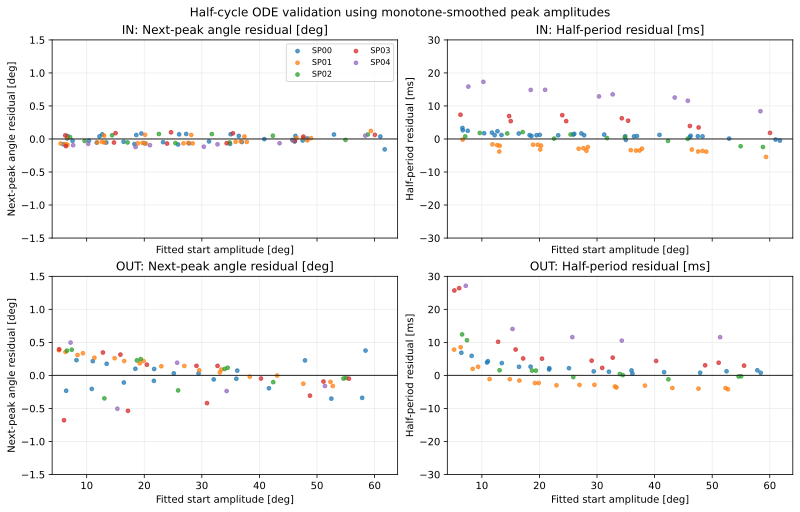
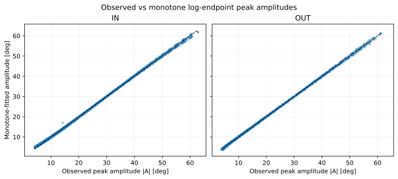
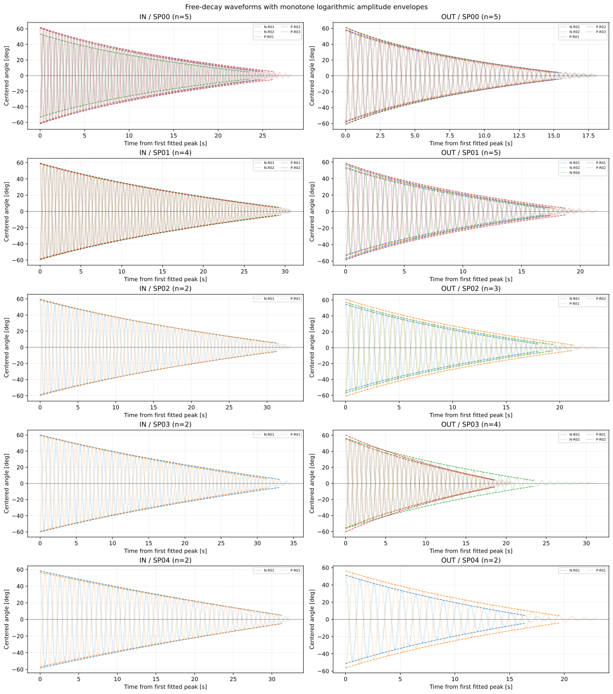

# IHB-03: 一回計算のエネルギー基底による摩擦係数同定

## まず全体像：同じ半周期データでも、計算の目的が二つある

この解析では、実測した隣り合う頂点から「半周期で失われたエネルギー」を求め、その損失を説明する摩擦係数を決めます。係数を決めたあと、別の計算でモデルの予測を評価します。どちらも同じ半周期を使いますが、合わせる量と評価する量が違います。

使ったのは、承認済みの球なし波形34本（IN 15本、OUT 19本）です。採用した隣り合う頂点対はIN 1,025組、OUT 769組です。リリースから最初の頂点までの区間は含めず、採用条件を満たさない頂点を飛び越して区間をつなぐこともしません。頂点角は平衡中心から測った角度で、数式の計算ではラジアンに変換します。頂点では角速度がほぼゼロなので、角度から力学的エネルギーを計算できます。

### まず、観測されたエネルギー損失を作る

角度の大きさを |Aₙ|、|Aₙ₊₁| とすると、頂点でのエネルギーは Eₙ = Kⱼ(1 − cos|Aₙ|) です。Kⱼ はIHB-02で条件ごとに決めた復元係数です。始点から次の頂点までに観測された損失は、始点のエネルギーから終点のエネルギーを引いた量です。

~~~math
\Delta E_{\mathrm{obs},n}
= E_{n,\mathrm{obs}}-E_{n+1,\mathrm{obs}}
=K_j\left[\cos(|A_{n+1}|)-\cos(|A_n|)\right]
~~~

したがって ΔE_obs は「頂点角の差」そのものではありません。角度をエネルギーに変換してから、その二つのエネルギーを引いた値です。

### 手順1：全半周期の損失を使って τ を一つ決める

摩擦によるモデル損失を二つに分けます。ロッドの二乗抗力による損失は c_rod Cₙ、クーロン摩擦による損失は τ Rₙ です。ここで c_rod = 2.5486754169 × 10⁻⁶ N m s²/rad²、b = 0 に固定しています。Cₙ は保存振り子の半周期軌道上で一度計算した基底、Rₙ = |Aₙ| + |Aₙ₊₁| は半周期中に角度が動いた合計です。動きが大きい半周期ほど、クーロン摩擦の仕事 τRₙ も大きくなります。

~~~math
C_n=4\frac{K_j}{I_j}
\left[\sin(|A_n|)-|A_n|\cos(|A_n|)\right],
\qquad
R_n=|A_n|+|A_{n+1}|
~~~

この τ の計算では、半周期ごとにODEを数値積分していません。保存軌道から Cₙ を一度計算し、測定された損失からロッド損失を引き、残りを τRₙ で説明します。

~~~math
y_n=\Delta E_{\mathrm{obs},n}-c_{\mathrm{rod}}C_n
\approx \tau R_n
~~~

「一致させる」といっても、全区間の値を完全に一致させられるわけではありません。τ は軸ごとに一つだけなので、全波形の残差の二乗和が最小になる値を選びます。波形数や長さの違いで一つの波形が支配しないよう、各波形の総重みを等しくしています。切片は設けず、負の τ も許しません。

~~~math
\widehat\tau
=\max\left(0,
\frac{\sum_{w,n}a_{w,n}R_{w,n}y_{w,n}}
{\sum_{w,n}a_{w,n}R_{w,n}^2}\right),
\qquad a_{w,n}=\frac{1}{W N_w}
~~~

| 軸 | 重み付き分子 ΣaRy | 重み付き分母 ΣaR² | 求まった τ [N m] |
|---|---:|---:|---:|
| IN | 0.000103970 | 1.259076 | 8.2576141 × 10⁻⁵ |
| OUT | 0.000192646 | 1.099578 | 1.7519982 × 10⁻⁴ |

これは全半周期についての一括フィットです。係数を決めるときの残差はエネルギー損失の残差で、エネルギーRMSEはIN 0.1083 mJ、OUT 0.0876 mJです。

### 手順2：求めた τ でエネルギー損失を評価する

評価では、各観測半周期についてモデル損失 ΔE_model = c_rod Cₙ + τRₙ を計算し、ΔE_obs と比較します。ここでは τ を再調整しません。レポートのエネルギー R² は、波形ごとの総重みをそろえた上で、残差二乗和を観測損失のばらつきと比べた指標です。

~~~math
R^2
=1-\frac{\sum a_{w,n}(\Delta E_{\mathrm{obs},w,n}-\Delta E_{\mathrm{model},w,n})^2}
{\sum a_{w,n}(\Delta E_{\mathrm{obs},w,n}-\overline{\Delta E}_{\mathrm{obs}})^2}
~~~

IN のエネルギー R² は0.4673、OUTは0.7549です。これは「損失をどれだけ説明できたか」の指標で、1なら誤差ゼロ、0なら観測損失の平均値だけを予測する場合と同程度、負ならその平均値予測より悪いことを表します。τの最小二乗フィット自体が完全だったという意味ではありません。なお、出力CSVの energy_weighted_r 欄は名前に weighted とありますが、実際には観測損失とモデル損失の通常のPearson相関係数です（IN 0.6831、OUT 0.8727）。相関 R と上記の R² は別の指標です。

### 手順3：同じ始点からODEで次の角度を予測する

もう一つの評価では、測定された始点角と角速度ゼロをODEに与え、固定した I、K、c_rod、b と求めた τ で次の折返し角を予測します。この計算は半周期ごとに測定頂点へ戻して始めるので、前の半周期の位相誤差は引き継ぎません。ここで比べるのは次頂点角であり、エネルギー損失の R² とは違う量です。予測した次頂点角と実測角の全体の比較では R² がIN 0.999699、OUT 0.999708、角度RMSEがそれぞれ0.5504°、0.5014°でした。

### 実データ一例：角度が近くても損失誤差が目立つ理由

次は実際のIN_SP00_N_R01波形の1→2番目の頂点です。始点を同じ測定角にそろえています。

| 量 | 始点 | 次の頂点 |
|---|---:|---:|
| 観測角 | −60.1038° | +57.6733° |
| ODE予測角 | −60.1038°（測定値から開始） | +58.6310° |
| 始点・終点の観測エネルギー | 10.9709 mJ | 10.1766 mJ |
| ODE予測の始点・終点エネルギー | 10.9709 mJ | 10.4872 mJ |

観測された損失は 10.9709 − 10.1766 = 0.7944 mJ です。ODE予測の損失は 10.9709 − 10.4872 = 0.4838 mJ です。したがって、この区間ではモデルが損失を0.3106 mJ少なく予測しました。角度のずれは約0.96°ですが、二つの損失そのものの差として見ると0.3106 mJが直接現れます。

図の左側は全エネルギー範囲、右側は終点付近を拡大しています。終点エネルギーの観測値と予測値の差は0.3106 mJです。同じ始点エネルギーから引き算しているので、この終点エネルギーの差は損失予測の差と同じ大きさになります。損失は約0.5〜0.8 mJと全エネルギー約11 mJより小さいため、終点の小さな差も損失に対しては目立ちます。これが、頂点角の全体的な一致が非常に良くても、半周期エネルギー損失の R² がそれほど高くならないことと両立する理由です。全波形で成り立つ関係の説明であり、この一例だけから全体の R² を計算しているわけではありません。

なお、この図の損失はODE軌道から計算した値です。先に τ を求める一回計算式の cC+τR と完全には一致しません。C は保存軌道上で計算した近似基底であり、ODEは減衰を含む軌道と正則化クーロン摩擦 τ tanh(θ̇/ε) を積分するためです。二つの手法で同じ τ、同じ始点を使っても、モデル損失の計算経路が違います。

## 結果

本レポートには当初の一回積分エネルギー基底法に加え、後段に実測頂点ごとに状態をリセットする半周期ODE直接フィットを追記した。今回追加した直接法を同定法選択の新しい比較基準とし、エネルギー基底法の数値は比較用に保持する。

IHB-02で得た I₀,K₀、スペーサ増分、b=0、理論ロッド抗力係数を固定して、クーロン摩擦 τ₀ をIN・OUT別に同定した。半周期ODEを反復して係数を探す方法ではなく、各半周期のエネルギー基底を一度計算し、軸ごとに一回の切片ゼロ線形最小二乗で係数を求めた。その後、固定した τ₀ で全半周期をODE予測し、独立に適合度を確認した。

| 軸 | 波形数 | 半周期数 | τ₀ [N m] | エネルギーRMSE [mJ] | エネルギー R² | ODE頂点RMSE [deg] | ODE頂点 R² |
|---|---:|---:|---:|---:|---:|---:|---:|
| IN | 15 | 1,025 | 8.2576141 × 10⁻⁵ | 0.1083 | 0.4673 | 0.5504 | 0.999699 |
| OUT | 19 | 769 | 1.7519982 × 10⁻⁴ | 0.0876 | 0.7549 | 0.5014 | 0.999708 |

ODEでの最大波形別RMSEはIN 0.646 deg、OUT 0.622 degだった。波形ごとの総重みを同じにしているため、長い波形が係数を支配しない。半周期は実測点の隣り合う採用頂点対の数で、対象外頂点を飛び越して接続していない。

## 対象データと固定値

承認済み球なし波形34本（IN 15本、OUT 19本）のみを使用した。球あり波形や承認されていない波形は含めない。リリースから最初の頂点までの区間は捨て、記録された頂点から次の頂点までを用いた。頂点は既存の前処理結果を使い、平衡中心は包絡線中点由来の固定値である。先頭・終端の振幅が共に4 deg以上の隣り合うピーク対を採用した。

形態・軸ごとの I,K はIHB-02の基準値に既知のスペーサ増分を加えた値で固定した。ロッド抗力は両軸・全球なし条件で c_rod=2.5486754169×10⁻⁶ N m s²/rad²、粘性係数は b=0 に固定した。摩擦正則化を含むODE検証には既定値 ε=0.5 deg/s を用いた。過去に同定された τ 値は初期値や解に流用していない。

## 積分一回で解ける理由

ある半周期の始点・終点角をそれぞれ Aₙ,Aₙ₊₁ [rad] とする。折返し点では角速度がゼロなので、実測振幅から得る力学的エネルギー差は

~~~math
\Delta E_n=K_j\left[\cos(|A_{n+1}|)-\cos(|A_n|)\right]
~~~

である。速度の符号関数を使うクーロン摩擦の散逸仕事は、半周期中に角度が一方向へ動くため、速度波形を知らなくても角度移動量から厳密に求まる。

~~~math
R_n=|A_n|+|A_{n+1}|,\qquad W_{\tau,n}=\tau_0 R_n
~~~

二乗抗力の基底 Cₙ=∫|θ̇|³dt は、有限振幅の非線形復元力を保った保存振り子軌道から一度計算する。ω₀=√(Kⱼ/Iⱼ) とすると

~~~math
C_n=4\omega_0^2\left[\sin(|A_n|)-|A_n|\cos(|A_n|)\right]
~~~

この基底は、二乗抗力が実際に存在する軌道そのものではなく、散逸を無視した保存軌道に沿って評価する近似である。この点は、後述する非線形ODE検証で影響を確かめる。二つの散逸寄与を差し引くと、

~~~math
y_n=\Delta E_n-c_{\mathrm{rod}}C_n
=\tau_0R_n+e_n
~~~

となる。各波形 w に同じ総重みを与えた重み a_w,n=1/(W N_w) について、最終係数は一回の閉形式最小二乗で得られる。

~~~math
\widehat\tau_0=\max\!\left(0,
\frac{\sum_{w,n}a_{w,n}R_{w,n}y_{w,n}}
{\sum_{w,n}a_{w,n}R_{w,n}^2}\right)
~~~

ここで W は軸内の波形数、N_w は波形ごとの採用半周期数である。波形選別後の実測データのみを用い、外れ値を任意に切り落とすロバスト損失や自由切片は導入していない。高振幅側に残る残差を見て、追加の説明変数を後付けしない。

## 非線形ODEによる独立確認

一度求めた軸別の τ̂₀ と固定 Iⱼ,Kⱼ,c_rod,b=0 を使い、計測された各始点頂点から次の頂点まで、検証済みDOP853ソルバーで積分した。ODEの正則化クーロン項には τ₀ tanh(θ̇/ε) を使う。実測頂点間へ戻して評価するため、前の区間の誤差は累積しない。ここでは τ₀ の再最適化を行っていない。

| 軸 | 波形等重み頂点角RMSE [deg] | 頂点 R² | 半周期時間RMSE [ms] |
|---|---:|---:|---:|
| IN | 0.5504 | 0.999699 | 11.2 |
| OUT | 0.5014 | 0.999708 | 7.3 |

エネルギーRMSE・R²は観測された半周期損失と cC+τ̂₀R の差に対する指標である。ODE頂点RMSE・R²はモデル予測頂点と実測次頂点との比較で、対象量・残差定義が異なる。エネルギー R² が低く見える軸について、ODE頂点一致だけで I,K や c の妥当性を証明したとは扱わない。

左列は計測された半周期エネルギー損失と一回計算の基底予測、右列は固定した τ₀ によるODE頂点残差を示す。点の色はSP条件である。

## 感度と制約

4 degの採用閾値を3 degまたは5 degへ変えたときの τ₀ の変化は両軸とも0.05%未満だった。各SP条件を一つずつ外す診断でも、INの変化は1%未満、OUTで最大の変化はSP00除外時の−4.18%だった。これは条件選択の感度診断であり、測定不確かさを伝播した信頼区間ではない。質量・重心位置と I,K,c の不確かさも今回の区間には含めない。

エネルギー基底法は高速で、積分基底を一回計算した後に τ₀ を線形最小二乗で一度解ける。一方、Cₙ は保存軌道近似であり、正則化した摩擦仕事も符号関数の理想積分である。計算時間が短いことだけを根拠に最終値とはせず、今回は全1,794区間での固定係数ODE検証を併記した。必要になれば、ODE直接最小化値との差を追加診断できる。

## 再現方法

必要パッケージはNumPy、SciPy、Matplotlib。

~~~bash
python 06_Analysis/fitting_pipeline/iterative_hybrid/ihb03_friction_identification.py \
  --turning-points-csv 06_Analysis/fitting_pipeline/results/20260921/hybrid_identification/01_preprocessing/turning_points.csv \
  --selection-csv 06_Analysis/fitting_pipeline/results/20260921/waveform_review/waveform_selection.csv \
  --condition-physics-csv 06_Analysis/fitting_pipeline/results/20260921/iterative_hybrid/ihb02_condition_predictions.csv \
  --base-parameters-csv 06_Analysis/fitting_pipeline/results/20260921/iterative_hybrid/ihb02_base_parameters.csv \
  --output-dir 06_Analysis/fitting_pipeline/results/20260921/iterative_hybrid
~~~

- [再現スクリプト](../../../iterative_hybrid/ihb03_friction_identification.py)
- [軸別τと適合度](ihb03_tau_parameters.csv)
- [全半周期のエネルギー基底・ODE予測](ihb03_interval_predictions.csv)
- [波形別ODE残差](ihb03_waveform_metrics.csv)
- [振幅閾値・SP除外感度](ihb03_sensitivity.csv)
- [実行条件・入力SHA-256](ihb03_settings.json)
- [数値検証](ihb03_validation.json)

IHB-03はレビュー待ちで止める。IHB-04の反復更新にはまだ進まない。

## 追加解析：実測頂点ごとにリセットする半周期ODEフィット

ご指摘を受け、係数同定自体も半周期ごとのODE積分で行う解析を追加した。以前のエネルギー基底法では半周期の散逸基底を一度計算し、その近似式から τ₀ を閉形式で求めていた。今回の直接法では、各区間の開始角度を実測頂点に戻し、固定した I,K,b,c と候補 τ₀ で次の折返し点まで数値積分する。予測した次頂点角と実測値の差を目的関数とし、同じ軸の全波形をまとめて τ₀ を1つ求めた。区間間で状態・位相誤差は引き継がない。

~~~math
\widehat{\tau}_{0}
=\arg\min_{\tau_0\ge 0}
\sum_w\frac{1}{W N_w}
\sum_{n=1}^{N_w}
\left[\theta_{n+1}^{\mathrm{ODE}}(\tau_0;\theta_n^{\mathrm{meas}})
-\theta_{n+1}^{\mathrm{meas}}\right]^2
~~~

ODEは各区間で実測始点角・角速度ゼロから解き直す。重みは一波形あたりの総和が等しくなるようにした。最小化する量は次頂点角であり、半周期時間は独立の診断値である。IHB-02の I,K、理論ロッド抗力係数、b=0、4 deg採用閾値、対象波形は一回積分法と同一である。

| 軸 | 方法 | τ₀ [N m] | 半周期頂点角RMSE [deg] | 半周期時間RMSE [ms] |
|---|---|---:|---:|---:|
| IN | 一回積分のエネルギー基底 | 8.2576 × 10⁻⁵ | 0.55045 | 10.9049 |
| IN | 半周期リセットODE直接フィット | 8.8238 × 10⁻⁵ | 0.54933 | 10.9015 |
| OUT | 一回積分のエネルギー基底 | 1.7520 × 10⁻⁴ | 0.50143 | 7.3560 |
| OUT | 半周期リセットODE直接フィット | 1.5633 × 10⁻⁴ | 0.47674 | 7.3695 |

ODE直接法についても、角度予測から各半周期のエネルギー損失を計算し、実測損失と比較した。モデルの終点角を θ_{n+1,model} とし、折返し点のエネルギー式 E=K_j(1−cos|θ|) から損失を ΔE_{model}=K_j[cos|θ_{n+1,model}|−cos|θ_n,obs|] と求める。始点は実測値に固定している。観測損失も同じ始点から求めるため、両者は同じ半周期どうしの比較である。τの再フィットはせず、既に角度フィットで決めた ODE直接法の τ を使う。評価対象は全1,794半周期で、波形ごとの重みは等しくした。

| 軸 | エネルギー損失 Pearson R | エネルギー損失 R² | エネルギー損失 RMSE [mJ] | 次頂点角 Pearson R | 次頂点角 R² | 次頂点角 RMSE [deg] |
|---|---:|---:|---:|---:|---:|---:|
| IN | 0.6884 | 0.4735 | 0.1076 | 0.999850 | 0.999700 | 0.5493 |
| OUT | 0.8795 | 0.7429 | 0.0897 | 0.999872 | 0.999736 | 0.4767 |

ここでは混同を避けるため、R（観測値と予測値のPearson相関係数）と R²（観測値のばらつきに対する予測誤差の指標）を両方記載した。角度の R² は、以前の表の丸め値とほぼ同じである。エネルギー損失の R² も一回積分法の値（IN 0.4673、OUT 0.7549）と近く、ODE直接法にしてもエネルギー損失の評価は大きくは変わらない。OUTでは一回積分法の方がわずかに高く、INではODE直接法の方がわずかに高い。この比較だけから一方が全体に優れているとは言えない。

直接法の τ₀ はエネルギー基底法に対しINで+6.86%、OUTで−10.77%となった。一方、同じリセット半周期ODEで評価した頂点角RMSEの改善はINで0.2%、OUTで4.9%で、半周期時間RMSEはほぼ同じだった。直接ODEフィットへの変更で大きく改善したとは言えない。特にINではほぼ同じ適合度で τ₀ が異なり、減衰係数の識別には依然として不確かさがある。角度減衰を合わせる目的では、今回の直接法を次の比較基準とする。

図の点は半周期残差を振幅条件ごとに示す（表示点は視認性のため間引き、数値評価は全1,794区間）。各積分は実測開始頂点から独立に開始する。左列は予測次頂点の角度残差、右列は半周期時間残差。残る時間誤差や振幅依存の角度残差は、τだけでは説明できない周期係数 I,K の誤差やモデル近似も含みうるため、これだけで原因を特定しない。

この結果は連続波形を初期条件から最後まで積分した誤差を評価するものではない。位相ずれを積算させない以前のハイブリッド同定と同じ評価設計であり、連続波形の誤差指標とは直接比較しない。IHB-04の減衰補正付き周期確認も未実施なので、I,Kの最終同定値とは扱わない。

再現には [半周期ODE直接フィットスクリプト](../../../iterative_hybrid/ihb03_half_cycle_ode_fit.py) を使う。直接ODE係数と波形別指標は、それぞれ [係数・集約適合度](ihb03_half_cycle_ode_parameters.csv)、[波形別適合度](ihb03_half_cycle_ode_waveform_metrics.csv) に保存した。

~~~bash
python 06_Analysis/fitting_pipeline/iterative_hybrid/ihb03_half_cycle_ode_fit.py \
  --turning-points-csv 06_Analysis/fitting_pipeline/results/20260921/hybrid_identification/01_preprocessing/turning_points.csv \
  --selection-csv 06_Analysis/fitting_pipeline/results/20260921/waveform_review/waveform_selection.csv \
  --condition-physics-csv 06_Analysis/fitting_pipeline/results/20260921/iterative_hybrid/ihb02_condition_predictions.csv \
  --output-dir 06_Analysis/fitting_pipeline/results/20260921/iterative_hybrid
~~~

## 追加試行：一回積分法で c_rod と τ を同時フィット

c_rod を固定せず、各半周期のエネルギー損失を二つの基底の和として表し、c_rod と τ を同時に最小二乗で求めた。どちらも負にならない制約を置き、切片はゼロとした。係数は軸ごとに推定するため、同じ軸の全波形・全採用半周期に対して c_rod を一つ、τを一つだけ使う。振幅ごと、波形ごとに係数を変える自由度は加えていない。

~~~math
\Delta E_{\mathrm{obs},n}
\approx c_{\mathrm{rod}} C_n+\tau R_n,
\qquad c_{\mathrm{rod}}\ge0,\quad \tau\ge0
~~~

I、K、対象波形、4 degの採用条件、保存軌道から作る Cₙ と実測角度から作る Rₙ は従来の一回積分法と同じである。重みも各波形の総重みが等しくなるようにした。以下の固定係数法は従来レポートの基準値、同時フィット法は今回の追加試行を示す。

| 軸 | 方法 | c_rod [N m s²/rad²] | τ [N m] | エネルギーRMSE [mJ] | エネルギーR² |
|---|---|---:|---:|---:|---:|
| IN | c固定 | 2.5487 × 10⁻⁶ | 8.2576 × 10⁻⁵ | 0.10826 | 0.46730 |
| IN | c、τ同時推定 | 2.5520 × 10⁻⁶ | 8.2499 × 10⁻⁵ | 0.10826 | 0.46730 |
| OUT | c固定 | 2.5487 × 10⁻⁶ | 1.7520 × 10⁻⁴ | 0.08758 | 0.75487 |
| OUT | c、τ同時推定 | 4.2021 × 10⁻⁶ | 1.4201 × 10⁻⁴ | 0.08432 | 0.77280 |

INでは c_rod が基準値からほとんど動かず、適合度も実質的に変わらなかった。OUTでは c_rod が基準値の約1.65倍となり、τは約19%小さくなった。エネルギーRMSEは約3.7%低下、R²は0.7549から0.7728へ上がった。したがって、cを動かすことでOUTの残差の一部を説明できる可能性は見えるが、改善幅は限定的である。

### 波形単位で外して確かめる

同じ波形に合わせた結果だけで改善と判断しないよう、波形を一つずつ除外して係数をフィットし、除外した波形のエネルギー損失を予測する leave-one-waveform-out 確認も行った。各折り返し点を別々にランダム分割せず、一つの波形に属する半周期はまとめて除外した。

| 軸 | 方法 | 未使用波形RMSE [mJ] | 未使用波形R² |
|---|---|---:|---:|
| IN | c固定、τを学習波形で推定 | 0.10828 | 0.46714 |
| IN | c、τ同時推定 | 0.10832 | 0.46678 |
| OUT | c固定、τを学習波形で推定 | 0.08780 | 0.75366 |
| OUT | c、τ同時推定 | 0.08454 | 0.77164 |

OUTの改善は未使用波形でも残ったが、INでは同時推定による改善は確認できなかった。現段階では「cとτを同時に動かせば両軸の損失予測が明確に良くなる」とまでは言えない。

### c と τ を分けて推定できているか

c と τ の基底は同じ振幅変化にある程度反応するため、係数間の取り合いを確認した。各軸で波形等重みを反映した二つの基底の相関はIN 0.822、OUT 0.818だった。完全に同じ形ではありませんが、独立でもありません。cとτが代替し合う余地は残ります。

波形を一つずつ除外したときの同時推定係数の範囲は、INで c_rod=2.516〜2.621 × 10⁻⁶、τ=8.123〜8.337 × 10⁻⁵、OUTで c_rod=4.090〜4.339 × 10⁻⁶、τ=1.400〜1.448 × 10⁻⁴ だった。この範囲は波形選択に対する安定性の診断であり、計測誤差や I、K の不確かさを含む信頼区間ではない。

ロッド形状が両軸で同一なら c_rod も共通とする考え方が自然なので、追加で「c_rodはIN・OUT共通、τだけ軸別」とする3係数の試行も行った。共通 c_rod は3.2343 × 10⁻⁶となったが、波形単位の未使用データではINのR²が0.4599に下がり、OUTは0.7655だった。軸ごとに別々の c を許した結果より自由度を抑えられる一方、両軸に同じ改善をもたらすとは確認できなかった。軸間で推定されたcが異なる理由は、抗力の方向依存性、I・Kや保存軌道近似の誤差など複数考えられ、今回の結果だけでは特定できない。

この試行から言えるのは、**c_rod と τ を同時に推定する計算は可能で、特にOUTではcを調整する余地が見えた**ということまでである。係数を最終値として採用する判断は保留する。c_rodを自由にした影響とモデル近似の誤差を分けるには、次に振幅別残差を確認し、I・Kの誤差や c 基底の保存軌道近似に対する感度も調べる必要がある。

再現スクリプトは [c_rod・τ同時フィット](../../../iterative_hybrid/ihb03_joint_energy_fit.py)、係数と全体・波形外し適合度は [同時フィット結果CSV](ihb03_joint_energy_fit.csv) に保存した。出力CSVには固定c法、軸別同時推定、軸間で共通cを使う試行の結果を含む。

## 追加試行：ODEのエネルギー損失に直接合わせて τ を同定

前節までのODE直接法は、ODEの次頂点角を実測角に合わせて τ を決めていた。今回は同じ半周期リセットODEを使い、目的関数を次頂点角からエネルギー損失へ変更した。c_rod は従来値に固定し、軸ごとに τ を一つだけ推定する。始点角と始点角速度ゼロは各半周期の実測頂点から与える。

ODEの数値積分中に、ロッド抗力とクーロン摩擦が散逸させた仕事を積算する。b=0としているので、モデルの損失は次の量になる。

~~~math
\Delta E_{\mathrm{model},n}(\tau)
=\int_{t_n}^{t_{n+1}}
\left[
c_{\mathrm{rod}}|\dot\theta|^3
+\tau\tanh\!\left(\frac{\dot\theta}{\epsilon}\right)\dot\theta
\right]dt
~~~

各実測半周期の ΔE_obs とこの積算損失の差を、波形ごとの総重みが等しくなるように最小化した。従来の一回積分法の τ は探索の初期値に使ったが、最終値に固定していない。推定値はINで $8.5218\times10^{-5}$ N m、OUTで $1.7891\times10^{-4}$ N mとなった。

| 軸 | τ同定の方法 | τ [N m] | エネルギーRMSE [mJ] | エネルギーPearson R | エネルギーR² | 角度RMSE [deg] |
|---|---|---:|---:|---:|---:|---:|
| IN | ODE次頂点角にフィット | 8.8238 × 10⁻⁵ | 0.10763 | 0.6876 | 0.47352 | 0.5493 |
| IN | ODEエネルギー損失にフィット | 8.5218 × 10⁻⁵ | 0.10758 | 0.6877 | 0.47402 | 0.5496 |
| OUT | ODE次頂点角にフィット | 1.5633 × 10⁻⁴ | 0.08971 | 0.8774 | 0.74282 | 0.4767 |
| OUT | ODEエネルギー損失にフィット | 1.7891 × 10⁻⁴ | 0.08674 | 0.8759 | 0.75957 | 0.5108 |

エネルギー損失に直接合わせた結果は、角度フィットの τ と比べてINで少し小さく、OUTでは大きくなった。OUTではエネルギー損失のR²が0.7428から0.7596へ改善した一方、角度RMSEは0.4767°から0.5108°へ大きくなった。目的とする量をよく合わせるほど、別の評価量も同時に改善するとは限らない。

ただし、一回積分法で得た τ を初期値として同じODE損失を評価した場合と比べると、差はごく小さい。波形を単位に5分割して未使用波形を評価した結果も、次のとおりだった。

| 軸 | 学習データで決めた τ | 未使用波形RMSE [mJ] | 未使用波形R² |
|---|---|---:|---:|
| IN | 一回積分法のτを使用 | 0.10764 | 0.47337 |
| IN | ODEエネルギー損失でτを推定 | 0.10760 | 0.47376 |
| OUT | 一回積分法のτを使用 | 0.08709 | 0.75917 |
| OUT | ODEエネルギー損失でτを推定 | 0.08700 | 0.75970 |

未使用波形でも方向は改善側だが、RMSEの差はINで約0.00004 mJ、OUTで約0.00009 mJにとどまる。このデータでは、評価対象をエネルギー損失に変えると角度フィットよりOUTのエネルギー評価は良くなるものの、一回積分法の τ から大きく改善する結果ではなかった。τの主な同定法を切り替える根拠としてはまだ弱い。

5分割は波形を単位に行い、同じ波形の半周期を学習・評価に分けていない。各foldのODEエネルギー損失フィットでは、τごとの計算済み応答を補間して学習側の係数を探し、未使用波形の予測損失はその係数でODEを再積分して求めた。数値積分のエネルギー閉合誤差の最大値はIN 2.1×10⁻⁷ J、OUT 7.6×10⁻⁷ Jで、評価に使ったエネルギーRMSEより十分小さい。

再現スクリプトは [ODEエネルギー損失フィット](../../../iterative_hybrid/ihb03_half_cycle_ode_energy_fit.py)。集約値と5分割結果は [係数・評価表](ihb03_half_cycle_ode_energy_parameters.csv)、区間別予測は [半周期予測CSV](ihb03_half_cycle_ode_energy_predictions.csv)、波形別指標は [波形別CSV](ihb03_half_cycle_ode_energy_waveform_metrics.csv) に保存した。

## 追加試行：波形の累積エネルギー損失で τ をフィット

ご提案に沿って、c_rod は従来値に固定したまま、各波形の始点から最終採用頂点までの総エネルギー損失で τ を求めた。ここでは各波形から一つの総損失値を作る。許可条件を外れた頂点を飛び越してつなぐことはせず、隣り合う採用半周期を順に足し、最終採用頂点で累積を止める。

波形 w の採用半周期数を M_w とすると、始点から最終頂点までの観測総損失とモデル損失は

~~~math
D_{w,\mathrm{obs}}=E_{w,0}-E_{w,M_w}
=\sum_{n=0}^{M_w-1}\Delta E_{w,n,\mathrm{obs}},
\qquad
D_{w,\mathrm{model}}
=c_{\mathrm{rod}}\sum_{n=0}^{M_w-1}C_{w,n}
+\tau\sum_{n=0}^{M_w-1}R_{w,n}
~~~

となる。$X_w=\sum_n R_{w,n}$、$Y_w=D_{w,\mathrm{obs}}-c_{\mathrm{rod}}\sum_n C_{w,n}$ と置くと、波形ごとに同じ重みを与えたτの解は

~~~math
\widehat\tau_{\mathrm{total}}
=\max\!\left(0,
\frac{\sum_w X_wY_w}{\sum_w X_w^2}\right)
~~~

である。これは一回積分法のまま解けるため、各半周期のODE積分や反復最適化は不要である。速度の大きい区間・小さい区間を任意に同じ重みにするのではなく、各区間のモデル損失が総損失に寄与する分だけ足し合わせる。

| 軸 | τの決め方 | τ [N m] | 最終総損失RMSE [mJ] | 最終総損失R² | 5分割・未使用波形RMSE [mJ] | 5分割R² |
|---|---|---:|---:|---:|---:|---:|
| IN | 半周期ごとの損失でフィット | 8.2576 × 10⁻⁵ | 0.2200 | 0.9870 | 0.2378 | 0.9848 |
| IN | 波形の最終総損失でフィット | 8.3775 × 10⁻⁵ | 0.2046 | 0.9888 | 0.2191 | 0.9871 |
| OUT | 半周期ごとの損失でフィット | 1.7520 × 10⁻⁴ | 0.6294 | 0.8884 | 0.6629 | 0.8762 |
| OUT | 波形の最終総損失でフィット | 1.6843 × 10⁻⁴ | 0.5769 | 0.9062 | 0.6136 | 0.8939 |

最終総損失に対する波形単位の5分割評価では、累積フィットのRMSEがINで約8%、OUTで約7%小さくなった。一方、このτで半周期ごとの損失を評価すると、RMSEはINで0.10826から0.10827 mJ、OUTで0.08758から0.08787 mJとなり、ほぼ同じかごくわずかに悪化した。つまり、波形全体の総損失予測には少し利点が見えるが、個々の半周期の損失配分が改善したわけではない。

図では青丸が半周期フィットのτ、橙四角が累積総損失フィットのτによる予測で、破線は予測と観測が一致する線である。点はIN 15波形、OUT 19波形であり、同じ波形の二つの予測を並べている。

### 累積曲線の評価と解釈

τを決めた最終点だけでなく、始点から各採用頂点までの累積損失曲線も比較した。曲線全体のR²は半周期フィットのτでIN 0.9947、OUT 0.9639、累積フィットのτでIN 0.9943、OUT 0.9601だった。累積フィットは全波形の終点を合わせる目的なので、途中の累積曲線全体ではわずかに良くならなかった。

累積曲線のR²が半周期ΔEのR²（IN 0.4673、OUT 0.7549）より高いことは、区間ごとの損失配分まで正しいことを意味しない。累積値は始点からの減衰傾向を表す別の評価対象で、同じ波形内の点どうしも相関している。最終総損失RMSE、累積曲線RMSE、半周期ΔEのRMSEを併記して、どの目的に対して改善したかを分けて解釈する。

この試行では、半周期ごとの小さな誤差を足し合わせたときに一部が打ち消されるため、最終総損失の予測は波形外し評価でも少し良くなった。一方、相殺で隠れる区間誤差もあるので、半周期ΔEは局所的な損失配分を確認する診断として残す。次の比較では、波形全体の減衰を重視するなら累積フィット、各半周期の物理的損失配分を重視するなら半周期フィットを使い分けるのが妥当である。

5分割評価は波形単位で行い、各回で除外した波形の最終総損失を予測した。累積曲線のR²は波形等重み、各波形内の累積点も等重みで算出した。再現スクリプトは [累積エネルギー損失フィット](../../../iterative_hybrid/ihb03_cumulative_energy_fit.py)、集約結果は [累積フィット係数・評価CSV](ihb03_cumulative_energy_parameters.csv)、頂点ごとの曲線値は [累積予測CSV](ihb03_cumulative_energy_predictions.csv)、波形ごとの最終総損失は [波形総損失CSV](ihb03_cumulative_energy_waveform_totals.csv) に保存した。

## 追加試行：滑らかな頂点振幅列を仮定した感度確認

観測頂点角の局所的なばらつきがエネルギー損失指標にどれだけ現れるかを見るため、各波形の頂点時刻 $t_n$ における振幅 $|A_n|$ を滑らかな関数で近似した。具体的には $\log |A_n|$ 対 $t_n$ に波形ごとの三次平滑化スプラインを当て、平滑化の強さは一般化交差検証（GCV）で選んだ。関数を同じ頂点時刻 $t_n$ で評価し、符号は観測頂点の交互符号を保持した。この平滑角列から $\Delta E$、Cₙ、Rₙをすべて再計算し、c_rod固定の一回積分法でτをフィットした。

| 軸 | 指標 | 生の頂点角 | 平滑後の頂点角 |
|---|---|---:|---:|
| IN | τ [N m] | 8.2576 × 10⁻⁵ | 8.2293 × 10⁻⁵ |
| IN | エネルギーRMSE [mJ] | 0.10826 | 0.00728 |
| IN | エネルギーPearson R | 0.6831 | 0.9984 |
| IN | エネルギーR² | 0.4673 | 0.9946 |
| OUT | τ [N m] | 1.7520 × 10⁻⁴ | 1.7598 × 10⁻⁴ |
| OUT | エネルギーRMSE [mJ] | 0.08758 | 0.02474 |
| OUT | エネルギーPearson R | 0.8727 | 0.9936 |
| OUT | エネルギーR² | 0.7549 | 0.9747 |

頂点振幅の平滑化による角度差は、RMSEでIN 0.288°、OUT 0.226°だった。95パーセンタイルの絶対差はそれぞれ0.505°、0.429°である。この角度差だけで計算した観測半周期損失の変化は、RMSEでIN 0.112 mJ、OUT 0.088 mJとなり、元のエネルギーRMSEと同程度だった。したがって、頂点角に1°未満の変化があっても、差分エネルギーの評価には無視できない変化が出ることを示す試行結果となった。

ただし、平滑化後のエネルギーR²は、**滑らかにした同じ角度列から観測損失とモデル基底の両方を作り直し、その同じデータでτも適合させた値**である。測定誤差を独立に推定した結果でも、独立データに対する予測精度でもない。平滑化差には測定ノイズだけでなく、実際の振幅減衰の不規則さやスプラインの近似誤差も含まれる。GCV平滑化が物理的な真の角度列を表すとも限らない。したがって、R²の上昇は「角度列の滑らかさを仮定すると損失指標が大きく変わりうる」ことを示す感度確認として扱い、主解析の適合度や測定精度として解釈しない。

GCVスプラインの場合、軸別のτは平滑化の前後でIN −0.34%、OUT +0.45%だった。この関数型での試行では、局所的なエネルギー残差とR²は角度平滑化に強く影響された一方、推定されたτは比較的安定だった。単調関数版での結果は後掲の比較節に示す。

再現スクリプトは [頂点振幅平滑化・エネルギー感度解析](../../../iterative_hybrid/ihb03_smoothed_peak_energy_fit.py)、集約結果は [平滑化比較CSV](ihb03_smoothed_peak_fit_summary.csv)、頂点ごとの生・平滑角は [頂点角CSV](ihb03_smoothed_peak_angles.csv) に保存した。

### 振幅 $A(t)$ のフィッティング結果

前節の感度確認で使った平滑化関数そのものを、実際の自由振動波形に重ねました。頂点の時刻 $t_n$ と振幅 $|A_n|$ に対し、$log |A_n|$ を時間の三次平滑化スプラインで近似し、平滑化係数は GCV（一般化交差検証）で決めています。図の細い実線が観測波形、破線がフィットした包絡線 $+A(t)$ と $-A(t)$ です。これは振幅の減衰をフィットしたもので、波形の位相や周期をフィットしたものではありません。各小図は列がIN/OUT、行がSP00〜SP04で、表示範囲にはフィットに採用した頂点間を用いています。

#### 振幅フィットの R 値

前版には、振幅フィッティング自体のR値を記載していませんでした。下表では、各波形について観測頂点振幅 $|A_n|$ とスプラインの頂点時刻での値を比較したPearson相関係数 $R$ を計算しています。「波形平均」は各波形で求めたRの単純平均、「範囲」は波形ごとの最小〜最大です。「全ピーク」は条件内の頂点をまとめて計算した参考値です。

| 軸 | 条件 | 波形数 | 頂点数 | 波形別 R 平均（範囲） | 全ピーク R | 波形別振幅RMSE平均 [deg] |
|---|---|---:|---:|---:|---:|---:|
| IN | SP00 | 5 | 380 | 0.99978 (0.99957–0.99985) | 0.99980 | 0.312 |
| IN | SP01 | 4 | 296 | 0.99984 (0.99983–0.99985) | 0.99984 | 0.281 |
| IN | SP02 | 2 | 137 | 0.99987 (0.99987–0.99988) | 0.99987 | 0.248 |
| IN | SP03 | 2 | 123 | 0.99983 (0.99983–0.99983) | 0.99983 | 0.288 |
| IN | SP04 | 2 | 104 | 0.99987 (0.99987–0.99987) | 0.99987 | 0.249 |
| OUT | SP00 | 5 | 230 | 0.99988 (0.99983–0.99990) | 0.99988 | 0.239 |
| OUT | SP01 | 5 | 223 | 0.99987 (0.99986–0.99989) | 0.99988 | 0.235 |
| OUT | SP02 | 3 | 127 | 0.99989 (0.99988–0.99990) | 0.99989 | 0.233 |
| OUT | SP03 | 4 | 149 | 0.99993 (0.99992–0.99994) | 0.99993 | 0.189 |
| OUT | SP04 | 2 | 59 | 0.99991 (0.99990–0.99993) | 0.99991 | 0.193 |

Rがほぼ1なのは、観測振幅とフィット値がどちらも時間とともに減少するため、全体の減衰傾向が強く相関することも反映しています。したがって、Rだけでフィット誤差が小さいとは判断せず、振幅RMSE（約0.19〜0.31°）も併記しました。また、このRは観測頂点を使って同じ波形上にスプラインを当てたときの適合度であり、独立波形に対する予測性能を表す値ではありません。

#### 単調減少関数による $A(t)$ フィット結果

スプラインによる図・表と比較できるよう、同じ34波形に、正値かつ単調減少となる対数関数を当てた結果も示します。各波形で頂点時刻を $u=(t-t_0)/(t_{\mathrm{end}}-t_0)$（$0\le u\le1$）に正規化し、観測頂点振幅 $|A_n|$ に対して次の3パラメータ関数を非線形最小二乗でフィットしました。

$$
A(u)=A_{\mathrm{end}}+B\ln\left(\frac{1+C}{u+C}\right),\qquad A_{\mathrm{end}}>0,\ B>0,\ C>0.
$$

この正規化区間内では $A(1)=A_{\mathrm{end}}$ で、$dA/du=-B/(u+C)<0$ です。したがって正値かつ厳密な単調減少になります。ここで $A_{\mathrm{end}}$ はフィット区間終端の振幅であり、無限時間後の漸近値を意味しません。フィット範囲外への外挿には使いません。図の実線は計測波形、破線はフィットした $+A(t)$ と $-A(t)$ の包絡線です。列はIN/OUT、行はSP00〜SP04で、スプライン版と同じ34波形をまとめています。

各波形で観測頂点振幅とフィット値を比較したPearson $R$ の条件別集計です。「波形平均（範囲）」は波形ごとのRの平均と最小〜最大、「全ピークR」は条件内の全頂点をまとめて計算した参考値です。RMSEは波形ごとの振幅RMSEの平均です。

| 軸 | 条件 | 波形数 | 頂点数 | 波形別 R 平均（範囲） | 全ピーク R | 波形別振幅RMSE平均 [deg] |
|---|---|---:|---:|---:|---:|---:|
| IN | SP00 | 5 | 380 | 0.999716 (0.999475–0.999789) | 0.999733 | 0.359 |
| IN | SP01 | 4 | 296 | 0.999723 (0.999701–0.999753) | 0.999723 | 0.365 |
| IN | SP02 | 2 | 137 | 0.999763 (0.999754–0.999772) | 0.999763 | 0.339 |
| IN | SP03 | 2 | 123 | 0.999745 (0.999718–0.999773) | 0.999744 | 0.356 |
| IN | SP04 | 2 | 104 | 0.999750 (0.999717–0.999782) | 0.999751 | 0.342 |
| OUT | SP00 | 5 | 230 | 0.999834 (0.999795–0.999873) | 0.999833 | 0.284 |
| OUT | SP01 | 5 | 223 | 0.999858 (0.999840–0.999879) | 0.999859 | 0.251 |
| OUT | SP02 | 3 | 127 | 0.999875 (0.999863–0.999890) | 0.999875 | 0.245 |
| OUT | SP03 | 4 | 149 | 0.999906 (0.999883–0.999925) | 0.999905 | 0.211 |
| OUT | SP04 | 2 | 59 | 0.999881 (0.999875–0.999887) | 0.999881 | 0.225 |

34波形すべてが $R\ge0.99$ かつ振幅RMSE $\le0.5^\circ$ の品質ゲートを通過しました。波形別Rの範囲は0.999475〜0.999925、RMSE平均は0.211〜0.365°（全波形の最大RMSEは0.449°）です。R値だけでなくRMSEもスプライン版と並べると、今回のデータでは単調性を課しても振幅頂点列を十分よく表せていることが分かります。ただし、これは同じ波形上の頂点振幅に対する適合度で、独立波形に対する予測精度ではありません。

再現用スクリプトは [ihb03_monotone_amplitude_fit_results.py](../../../iterative_hybrid/ihb03_monotone_amplitude_fit_results.py)、波形別指標は [CSV](ihb03_monotone_amplitude_waveform_metrics.csv)、条件別集計は [CSV](ihb03_monotone_amplitude_condition_metrics.csv) です。

#### 振幅フィットの関数と品質ゲート

現在の振幅フィットでは、各波形の $\log |A_n|$ を時刻 $t_n$ の関数として三次平滑化スプラインで近似し、平滑化係数 $\lambda$ は GCV（一般化交差検証）で決めています。得られた値を指数変換して $|A(t)|=\exp(f(t))$ とするため、振幅は正になります。頂点の符号は観測値の符号を引き継ぎます。この関数は自由度のある平滑曲線であり、**単調減少を保証する制約はありません**。

Aフィットが明らかに不適切な入力から $\tau$ を計算しないよう、次のゲートを追加しました。どれか一つでも失敗した場合は波形名と理由を出して処理を停止し、該当波形を黙って除外したり、その波形から $\tau$ を計算したりしません。

| 確認項目 | ゲート |
|---|---|
| 頂点データ | 時刻と角度が有限値、時刻が厳密な昇順、振幅がゼロでない |
| スプラインの入力数 | 連続した頂点列ごとに5点以上 |
| 波形ごとの振幅フィット | Pearson $R \ge 0.99$ |
| 波形ごとの振幅残差 | RMSE $\le 0.5^\circ$ |

今回の波形別CSVでは、34波形すべてが $R \ge 0.999569$、振幅RMSE $\le 0.406971^\circ$、採用頂点数27〜80点でした。従って、全波形でRとRMSEのゲートを通過します。RMSE上限0.5°は今回の最大値に約0.093°の余裕を持たせた運用値です。異なる計測条件にも普遍的に適用できる物理定数ではなく、条件が変わった場合はゲート失敗を調べて再評価します。

### 単調減少を保証する振幅関数の試行比較

スプラインは単調減少を保証しないため、全34波形の頂点時刻・振幅列に、単調減少と正値を保つ関数を当てて比較しました。各波形内の頂点時刻を $u=(t-t_0)/(t_{\mathrm{end}}-t_0)$ と正規化し、観測振幅とフィット振幅のPearson $R$、RMSEを波形ごとに計算しています。RMSEは角度単位です。合格数は前節の $R\ge0.99$ かつRMSE $\le0.5^\circ$ の両方を満たす波形数です。

| 関数 | 自由パラメータ数 | 波形別Rの最小値 | Rの中央値 | RMSE平均 [deg] | RMSE最大 [deg] | 両ゲート合格 |
|---|---:|---:|---:|---:|---:|---:|
| GCV平滑化スプライン（現行） | 非パラメトリック | 0.999569 | 0.999874 | 0.249 | 0.407 | 34/34 |
| 単調直線 $a-bu$ | 2 | 0.984979 | 0.993898 | 1.794 | 2.761 | 0/34 |
| 指数 $A_0e^{-ku}$ | 2 | 0.985306 | 0.991416 | 2.021 | 2.739 | 0/34 |
| 伸長指数 $A_0e^{-ku^p}$ | 3 | 0.996136 | 0.997649 | 1.081 | 1.332 | 0/34 |
| べき乗 $A_0/(1+ku)^p$ | 3 | 0.979061 | 0.986122 | 2.609 | 3.286 | 0/34 |
| 対数＋正の終点値 $A_{\mathrm{end}}+B\ln\frac{1+C}{u+C}$ | 3 | 0.999475 | 0.999822 | 0.295 | 0.449 | 34/34 |
| 対数＋正の終点値（$C=1$固定） | 2 | 0.996404 | 0.999349 | 0.612 | 1.355 | 16/34 |

対数＋正の終点値モデルは $A_{\mathrm{end}}>0$、$B>0$、$C>0$ に制約してフィットしました。$u\in[0,1]$ で常に正であり、微分 $dA/du=-B/(u+C)<0$ なので単調減少が保証されます。このモデルのRの最小値は0.999475で、現行スプラインの0.999569に近く、全波形が現在のR/RMSEゲートを通過しました。RMSEは平均0.295°、最大0.449°で、スプラインよりわずかに大きいものの、0.5°以内です。

一方、指数関数や直線などは、Rだけなら多くの波形が0.99を超えるものの、RMSEは全波形で0.5°を超えました。伸長指数はRが全波形で0.99以上でしたが、RMSE平均は1.081°でした。この比較は、Rだけでは振幅フィット誤差を判定できないことも示しています。$C=1$固定の対数モデルは2パラメータに簡略化できますが、合格は16/34波形にとどまりました。

従って、**単純な指数関数への置き換えは今回の振幅列には適合しません**。単調性を保ちつつ今の誤差水準に近づける候補は対数＋正の終点値モデルですが、波形ごとの3パラメータ最適化が必要です。スプラインより単調性は保証できる反面、パラメータ数の削減にはなりません。この関数を振幅フィットの候補にした時点では、振幅列のR/RMSEだけを比較していました。後掲で、同じ関数を使った $\tau$ 同定とエネルギー指標の再計算結果を追加しています。

再現用の [比較スクリプト](../../../iterative_hybrid/ihb03_monotone_envelope_comparison.py)、[モデル別集計CSV](ihb03_monotone_envelope_summary.csv)、[波形別結果CSV](ihb03_monotone_envelope_waveforms.csv) を追加しました。

#### 振幅のばらつきが $\tau$ とエネルギー損失に及ぼす影響

観測頂点振幅そのもののばらつきはデータから決まり、フィット関数の選択では変わりません。一方、観測列からフィット曲線への平滑化差、およびその差を使って再計算する $\tau$・エネルギー指標は関数型に依存します。以下の感度表はスプライン平滑化を基準にした結果です。

観測振幅とスプライン振幅の差（平滑化差）のRMS、同じ頂点角の置き換えで変化した半周期の観測エネルギー損失 $\Delta E_{\mathrm{obs}}$ のRMS、および平滑化前後の $\tau$ の変化を並べます。ここでのエネルギー変化は、隣接する頂点の振幅から計算した損失の差です。

| 軸 | 条件 | 振幅の平滑化差 RMS [deg] | $\Delta E_{\mathrm{obs}}$ の変化 RMS [mJ] | エネルギーPearson R（生 → 平滑） | エネルギー R²（生 → 平滑） | SP別 $\tau$ 診断フィットの変化 |
|---|---|---:|---:|---:|---:|---:|
| IN | SP00 | 0.315 | 0.131 | 0.69303 → 0.99800 (+0.30497) | 0.48011 → 0.99236 (+0.51225) | -0.99% |
| IN | SP01 | 0.281 | 0.117 | 0.65245 → 0.99939 (+0.34694) | 0.42560 → 0.99674 (+0.57113) | -0.20% |
| IN | SP02 | 0.248 | 0.092 | 0.69317 → 0.99957 (+0.30641) | 0.48048 → 0.99825 (+0.51776) | +0.04% |
| IN | SP03 | 0.288 | 0.089 | 0.66203 → 0.99897 (+0.33695) | 0.43847 → 0.99612 (+0.55765) | -0.05% |
| IN | SP04 | 0.249 | 0.062 | 0.72723 → 0.99883 (+0.27161) | 0.52723 → 0.99400 (+0.46677) | +0.11% |
| OUT | SP00 | 0.241 | 0.112 | 0.87198 → 0.99824 (+0.12626) | 0.74186 → 0.97415 (+0.23229) | +0.19% |
| OUT | SP01 | 0.236 | 0.092 | 0.85619 → 0.99690 (+0.14071) | 0.72172 → 0.98002 (+0.25830) | +0.41% |
| OUT | SP02 | 0.235 | 0.076 | 0.87161 → 0.99861 (+0.12700) | 0.74707 → 0.98110 (+0.23404) | +0.71% |
| OUT | SP03 | 0.189 | 0.053 | 0.90835 → 0.98720 (+0.07886) | 0.81247 → 0.95813 (+0.14565) | +0.62% |
| OUT | SP04 | 0.197 | 0.044 | 0.92633 → 0.99686 (+0.07053) | 0.84192 → 0.97322 (+0.13130) | +0.50% |

振幅差はRMSで0.189〜0.315°、それによる半周期損失の変化は0.044〜0.131 mJでした。エネルギー損失の相関指標も大きく動きました。軸ごとに全SP条件をまとめて求めた同じ $\tau$ を使って各SP条件を評価すると、Pearson RはINで生データ0.652〜0.727から平滑データ0.998〜1.000へ、OUTで0.856〜0.926から0.987〜0.999へ変化しました。R²もINで0.426〜0.527から0.992〜0.998へ、OUTで0.722〜0.842から0.958〜0.981へ上がりました。表の括弧内は平滑化前後の差です。R²は波形ごとの総重みを等しくして算出し、Pearson Rは全半周期をまとめた通常の相関係数です。

この変化は、単に $\tau$ の同定値が変わったことを意味しません。今回、軸別に全SPを合わせた $\tau$ の変化はIN −0.34%、OUT +0.45%と小さい一方で、エネルギーR/R²は大きく変わりました。SP別 $\tau$ 欄は各SPだけで再フィットした診断値であり、主解析の軸別一括 $\tau$ とは区別しています。振幅の小さな揺らぎが隣接頂点間の差分を通じて $\Delta E_{\mathrm{obs}}$ と基底を変え、その影響が残差だけでなくR²の分母（観測損失のばらつき）にも現れるためです。平滑化によりR²が高くなっても、同じデータを平滑化して再計算した結果なので、独立な予測精度の改善とは言えません。

このスプライン版の範囲では、軸別 $\tau$ の変化はIN −0.34%、OUT +0.45%と小さく、「スプラインによる振幅平滑化に対しては比較的安定」という結論です。ただし、後掲の単調関数版ではIN −3.78%、OUT +1.00%となり、この結論は関数型全般には一般化できません。いずれの関数型でも、エネルギーR/R²を妥当性判断に用いる以上、振幅平滑化と関数型の選択による変化を判定の不確かさとして考慮します。R/R²の値だけで $\tau$ 同定の成否を決めず、生データと関数型別の感度を示し、頂点減衰・半周期時間・全波形・残差など他の検証結果と併せて判断します。

#### 平滑化振幅列に対する半周期ODE比較

「非線形ODEによる独立確認」と同じ4パネル形式で、GCV平滑化後の頂点角に対するODE残差を描きました。横軸は半周期の始点振幅、縦軸はODE予測と平滑化後の次頂点との角度差、または半周期時間差です。色はSP条件です。

添付図と同じ構成で、平滑化した振幅列に対するエネルギー基底フィットとODE確認を1枚にまとめた図も追加しました。左列は観測された半周期損失と一回積分法の予測損失、右列は平滑化後の観測頂点と固定したτによるODE予測頂点の角度残差です。行はIN/OUT、点色はSP条件を示します。どちらも平滑化振幅列から求めた軸別τを使っています。

| 軸 | 半周期数 | 角度RMSE [deg] | 角度 Pearson R | 角度 R² | 半周期時間RMSE [ms] |
|---|---:|---:|---:|---:|---:|
| IN | 1,025 | 0.0569 | 0.999999 | 0.999997 | 10.91 |
| OUT | 769 | 0.2694 | 0.999960 | 0.999916 | 7.36 |

ここでは $\tau$ も平滑化後の同じ頂点列から求めているため、この図は元レポートの独立確認を置き換えるものではありません。平滑化を仮定したときのODE残差の感度比較として扱います。図に示す比較と数値の算出方法は元のODE確認と同じで、ODEパラメータの再フィットはしていません（$\tau$ は平滑化データに対する一回積分エネルギー基底フィット値です）。

再現スクリプトは [頂点振幅平滑化・エネルギー感度解析](../../../iterative_hybrid/ihb03_smoothed_peak_energy_fit.py)。波形ごとの指標は [波形別CSV](ihb03_smoothed_peak_waveform_metrics.csv)、SP別のR値・感度指標は [条件別CSV](ihb03_smoothed_peak_condition_metrics.csv)、平滑化頂点列でのODE指標と予測は [ODE指標CSV](ihb03_smoothed_peak_ode_metrics.csv)、[半周期予測CSV](ihb03_smoothed_peak_ode_predictions.csv) に保存しました。

### 単調減少関数で同じ感度解析を再実施

前節のGCVスプラインによる平滑化感度確認と同じ34波形・同じ採用半周期（IN 1,025区間、OUT 769区間）を使い、振幅列だけを単調減少関数で置き換えて後段の解析を一通り再計算しました。各波形の頂点が連続している区間ごとに、頂点時刻を $u=(t-t_0)/(t_{\mathrm{end}}-t_0)$ に正規化し、次式を観測頂点振幅へ非線形最小二乗で当てています。

$$
A(u)=A_{\mathrm{end}}+B\ln\left(\frac{1+C}{u+C}\right),\qquad A_{\mathrm{end}}>0,\ B>0,\ C>0.
$$

$0\le u\le1$ で $A(1)=A_{\mathrm{end}}$、$dA/du=-B/(u+C)<0$ となるため、各フィット区間の中で正値かつ単調減少です。$A_{\mathrm{end}}$ は区間終端の値です。符号は実測頂点の符号を保持しました。フィットした頂点角から $\Delta E_{\mathrm{obs}}$、二乗抗力基底 $C_n$、クーロン摩擦基底 $R_n$ を再計算し、スプライン解析と同じ固定 $I,K,c_{\mathrm{rod}},b=0$ のもとで軸ごとに $\tau$ を再同定しました。生データと単調関数版で同一の1,794半周期を使い、波形ごとの総重みも同一にしています。振幅フィット品質は前掲「単調減少関数による $A(t)$ フィット結果」の図と条件別R/RMSE表に示した通り、34波形すべてが $R\ge0.99$、RMSE $\le0.5^\circ$ を通過しました。

#### 軸ごとの一括 $\tau$ 同定とエネルギー損失評価

| 軸 | 頂点列 | 波形数 | 半周期数 | $\tau$ [N m] | エネルギーRMSE [mJ] | エネルギーPearson R | エネルギー R² |
|---|---|---:|---:|---:|---:|---:|---:|
| IN | 生の観測頂点 | 15 | 1,025 | 8.2576 × 10⁻⁵ | 0.10826 | 0.6831 | 0.4673 |
| IN | 単調関数フィット | 15 | 1,025 | 7.9457 × 10⁻⁵ | 0.01030 | 0.9970 | 0.9883 |
| OUT | 生の観測頂点 | 19 | 769 | 1.7520 × 10⁻⁴ | 0.08758 | 0.8727 | 0.7549 |
| OUT | 単調関数フィット | 19 | 769 | 1.7695 × 10⁻⁴ | 0.02612 | 0.9929 | 0.9724 |

単調関数フィットによる振幅置き換えのRMSはIN 0.357°、OUT 0.253°でした。95パーセンタイル絶対差はIN 0.641°、OUT 0.488°、最大絶対差はそれぞれ2.848°、1.145°でした。対応する軸別一括 $\tau$ は、生の頂点角に対してIN −3.78%、OUT +1.00%変化しました。前節のスプライン平滑化ではそれぞれ−0.34%、+0.45%だったため、「$\tau$ は平滑化関数を変えても常にほとんど変わらない」とは言えません。

#### SP条件ごとのエネルギー感度

表中のエネルギーR/R²は、それぞれ生頂点角から求めた軸別 $\tau$ と単調関数版から求めた軸別 $\tau$ を使って評価しています。したがって、各側の値はその処理に対応した係数での評価です。SP別 $\tau$ 欄だけは各SP条件内で別々に診断フィットした値の変化率であり、軸別一括同定値とは区別します。

| 軸 | 条件 | 振幅の平滑化差 RMS [deg] | $\Delta E_{\mathrm{obs}}$ の変化 RMS [mJ] | エネルギーPearson R（生 → 単調） | エネルギー R²（生 → 単調） | SP別 $\tau$ 診断フィットの変化 |
|---|---|---:|---:|---:|---:|---:|
| IN | SP00 | 0.361 | 0.132 | 0.69303 → 0.99684 (+0.30381) | 0.48011 → 0.98773 (+0.50761) | -3.59% |
| IN | SP01 | 0.366 | 0.117 | 0.65245 → 0.99743 (+0.34498) | 0.42560 → 0.98703 (+0.56142) | -4.52% |
| IN | SP02 | 0.339 | 0.093 | 0.69317 → 0.99788 (+0.30472) | 0.48048 → 0.99222 (+0.51173) | -3.87% |
| IN | SP03 | 0.357 | 0.090 | 0.66203 → 0.99746 (+0.33544) | 0.43847 → 0.98982 (+0.55135) | -3.32% |
| IN | SP04 | 0.342 | 0.063 | 0.72723 → 0.99694 (+0.26971) | 0.52723 → 0.98576 (+0.45853) | -3.24% |
| OUT | SP00 | 0.285 | 0.113 | 0.87198 → 0.99840 (+0.12642) | 0.74186 → 0.96753 (+0.22567) | +2.26% |
| OUT | SP01 | 0.251 | 0.093 | 0.85619 → 0.99800 (+0.14180) | 0.72172 → 0.98395 (+0.26222) | -0.24% |
| OUT | SP02 | 0.248 | 0.076 | 0.87161 → 0.99867 (+0.12706) | 0.74707 → 0.98035 (+0.23328) | +0.98% |
| OUT | SP03 | 0.213 | 0.054 | 0.90835 → 0.98676 (+0.07841) | 0.81247 → 0.95632 (+0.14384) | +0.77% |
| OUT | SP04 | 0.227 | 0.045 | 0.92633 → 0.99609 (+0.06976) | 0.84192 → 0.97105 (+0.12914) | +0.93% |

この単調関数でも、平滑後のエネルギーR²は大きく上がりました（IN 0.4673→0.9883、OUT 0.7549→0.9724）。一方、スプライン版とは上がり幅や条件ごとの値が一致しません。平滑化後のR/R²は、同じ単調関数化した頂点列から観測損失とモデル基底を作り、その列に合わせて $\tau$ を再同定した結果です。独立データの予測精度や、元の計測値に対する改善を意味しません。よって、エネルギー損失R/R²を $\tau$ 同定の妥当性判断に使うときは、振幅平滑化の関数型に対する感度も考慮する必要があります。

#### 単調関数版の図と半周期ODE確認

左列は単調関数化した頂点角から再計算した観測半周期エネルギー損失と一回計算基底予測、右列は単調関数版で同定した軸別 $\tau$ を固定してODEで予測した次頂点残差です。4パネル図の形式・色分け・評価手順はスプライン版に合わせています。

| 軸 | 半周期数 | 次頂点角RMSE [deg] | 次頂点角 Pearson R | 次頂点角 R² | 半周期時間RMSE [ms] |
|---|---:|---:|---:|---:|---:|
| IN | 1,025 | 0.0627 | 0.999998 | 0.999996 | 10.91 |
| OUT | 769 | 0.2521 | 0.999965 | 0.999926 | 7.36 |

次頂点角RMSEは小さいままですが、これも単調関数化した同じ頂点列で $\tau$ を同定し、同じ列に対して評価した結果です。エネルギー損失評価との対象量の違いに加え、関数型を変えると各数値も変わるため、スプライン版の図表と単調関数版の図表を並べて判断します。

観測頂点振幅と単調関数フィット値の散布図および、自由振動波形にフィット包絡線を重ねた図も、対応するスプライン版と同じ構成で作成しました。

再現スクリプトは [単調関数による頂点振幅感度解析](../../../iterative_hybrid/ihb03_monotone_smoothed_peak_sensitivity.py)。係数比較は [集約CSV](ihb03_monotone_peak_summary.csv)、頂点列は [CSV](ihb03_monotone_peak_angles.csv)、波形・条件別指標は [波形別CSV](ihb03_monotone_peak_waveform_metrics.csv) と [条件別CSV](ihb03_monotone_peak_condition_metrics.csv)、ODE指標と全半周期予測は [ODE指標CSV](ihb03_monotone_peak_ode_metrics.csv) と [予測CSV](ihb03_monotone_peak_ode_predictions.csv) に保存しました。
