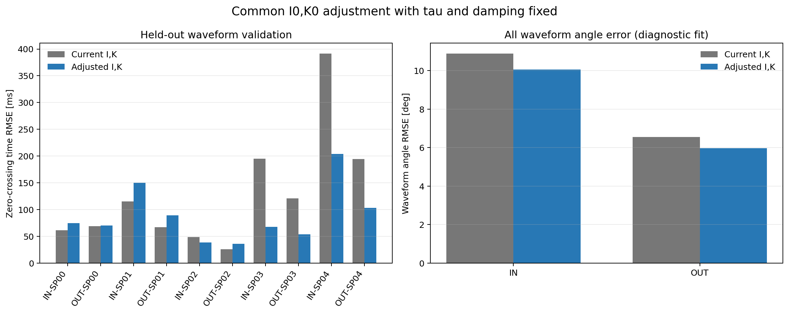

# IHB-05: I・K共通調整による連続波形の位相ずれ診断

## 目的

IHB-02の周期フィットはINでR=0.999523、OUTでR=0.999481と高い。一方、IHB-04の全波形連続積分では、ゼロ交点のずれが時間とともに蓄積し、特にSP03・SP04で大きくなった。本解析では、I・Kだけを軸ごとに共通調整すれば、このずれが全条件で改善するかを試した。

この結果は係数の正式な更新ではなく、I・K調整の効果を確認する診断である。τ、ロッド抗力係数、b=0、初期角、初期角速度、計測範囲はIHB-04と同じ値に固定した。

## 調整方法

軸ごとにIHB-02の基準値I0とK0へ一つずつ倍率をかけ、そこへ既知のスペーサによる慣性・復元係数の増分を加えて各SP条件の値を作った。従って、自由パラメータはIN・OUTそれぞれのI0倍率とK0倍率だけであり、SP条件ごとの個別フィットは行っていない。

各軸・各SP条件から、再現番号が最も大きい波形を1本ずつ検証用に取り分けた。残りの波形だけで、連続ODEのゼロ交点時刻誤差が小さくなるI0、K0を選び、取り分けた波形にも同じ候補係数を適用した。各波形の総重みは等しくし、交点数の多い波形が最適化を支配しないようにした。

探索範囲は現行I0、K0の±5%とした。この幅は測定された不確かさではなく、改善可能性を調べるための診断範囲である。結果を採用する場合は、質量・寸法・復元係数の物理的不確かさと照合する必要がある。

## 得られた候補値

| 軸 | 係数 | 現行基準値 | 診断候補 | 変化率 |
|---|---|---:|---:|---:|
| IN | I0 [kg m²] | 2.3709405e-4 | 2.4146806e-4 | +1.845% |
| IN | K0 [N m] | 2.1873199e-2 | 2.2254440e-2 | +1.743% |
| OUT | I0 [kg m²] | 2.3981969e-4 | 2.4340875e-4 | +1.497% |
| OUT | K0 [N m] | 2.1131036e-2 | 2.1452451e-2 | +1.521% |

IN・OUTとも候補は探索範囲の端には達していない。最適化に用いた波形で、波形単位等重みの交点ずれRMSE平均はINで121.3 msから107.5 ms、OUTで76.1 msから65.1 msへ下がった。

## 取り分けた波形での検証

| 軸 | 検証波形数 | 交点ずれRMSE平均（現行 → 候補） | 角度RMSE平均（現行 → 候補） |
|---|---:|---:|---:|
| IN | 5 | 162.4 → 107.0 ms | 12.09 → 9.49 deg |
| OUT | 5 | 95.6 → 70.7 ms | 7.18 → 5.76 deg |

取り分けた波形でも平均指標は改善した。全34波形でまとめた場合、交点ずれRMSE平均はINで135.0 msから107.3 ms、OUTで81.2 msから66.6 msへ改善した。角度RMSE平均はINで10.88 degから10.05 deg、OUTで6.56 degから5.98 degへ改善した。

## 条件ごとの結果

次表は全波形について、条件内の波形別交点ずれRMSEを平均した値である。

| 軸 | 条件 | 波形数 | 交点ずれRMSE 現行 [ms] | 交点ずれRMSE 候補 [ms] | 傾向 |
|---|---|---:|---:|---:|---|
| IN | SP00 | 5 | 58.4 | 70.6 | 悪化 |
| IN | SP01 | 4 | 128.0 | 162.7 | 悪化 |
| IN | SP02 | 2 | 40.0 | 49.3 | 悪化 |
| IN | SP03 | 2 | 187.7 | 57.9 | 改善 |
| IN | SP04 | 2 | 382.7 | 195.8 | 改善 |
| OUT | SP00 | 5 | 70.6 | 72.6 | わずかに悪化 |
| OUT | SP01 | 5 | 64.3 | 87.0 | 悪化 |
| OUT | SP02 | 3 | 28.5 | 36.1 | 悪化 |
| OUT | SP03 | 4 | 97.6 | 38.0 | 改善 |
| OUT | SP04 | 2 | 196.5 | 103.3 | 改善 |



候補係数はSP03・SP04の大きな遅れを縮める一方、SP00・SP01・SP02では交点ずれを悪化させた。従って、**I・Kだけの軸別共通調整で全条件のズレを解消できるとは確認できなかった**。平均指標は改善したが、その改善は主にスペーサ数の多い条件の誤差低減による。

SP04では候補適用後も交点ずれが残り、INの平均RMSEは195.8 ms、OUTは103.3 msである。平均値だけで改善を判断すると、条件間のトレードオフを見落とす。

## 考察と次の検討

今回の共通調整では、基準I0とK0を両方およそ1.5〜1.8%増やす候補が得られた。しかし、SP00〜SP04の各条件に加わる既知増分があるため、基準値を同じ割合だけ変えても、各条件でのIとKの比は同じ割合では変化しない。その結果、スペーサ条件の少ない波形と多い波形で異なる効果が出た。

取り分けた波形にも平均改善があったため、候補が訓練波形だけに過度に合わせられたとは見えにくい。ただし、SP条件ごとの検証波形は1本ずつで、波形数も条件によって2本しかない。候補値の統計的不確かさや物理的妥当性が確立したわけではない。また、物理的根拠のない±5%範囲で選んだ診断値であり、I・Kの正式値として採用しない。

次の切り分けでは、SP条件ごとに周期残差と交点ずれを比較し、スペーサによる慣性・復元係数の増分が実機値と一致しているかを先に確認する。I、Kの物理値の不確かさを設定できる場合は、その範囲内でもう一度共通調整を評価する。共通I・Kでは条件間の悪化が残る場合、条件ごとの係数を自由に合わせる前に、スペーサ取付位置・質量、中心角、初期頂点、摩擦の振幅依存性などを独立に確認する。

## 再現方法と出力

```bash
python 06_Analysis/fitting_pipeline/iterative_hybrid/ihb05_base_parameter_phase_correction.py
```

- [解析スクリプト](../../../iterative_hybrid/ihb05_base_parameter_phase_correction.py)
- [軸別候補値と最適化記録](ihb05_ik_phase_correction_parameters.csv)
- [波形別の現行・候補比較](ihb05_ik_phase_correction_waveforms.csv)
- [軸・訓練/検証別集計](ihb05_ik_phase_correction_summary.csv)
- [比較図](ihb05_ik_phase_correction_comparison.png)
- [計算条件](ihb05_ik_phase_correction_settings.json)
