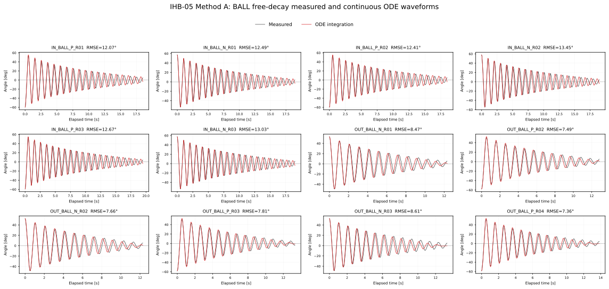
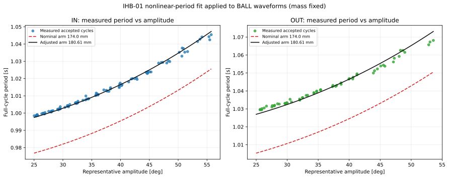
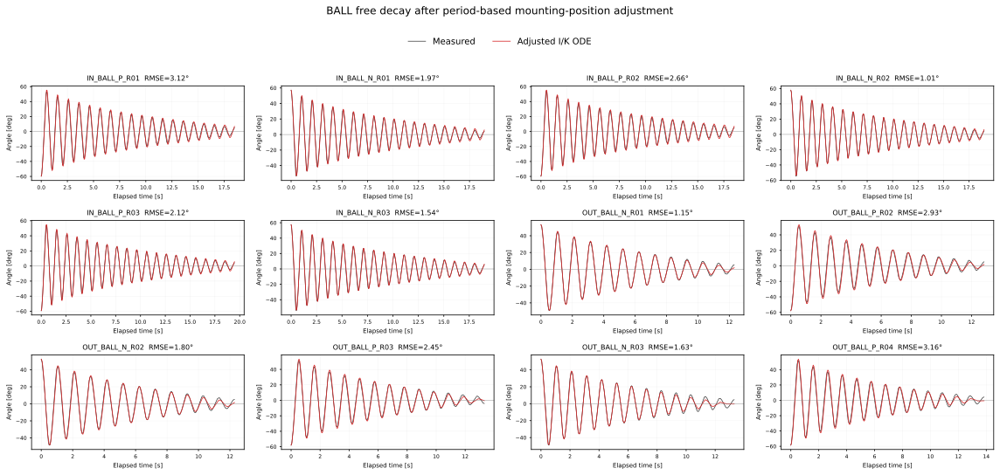

# IHB-05: 球抗力係数 c_ball の同定

## 概要

IHB-04をスキップする指示に合わせ、IHB-02の球なし基準 I/K に実測球質量・形状から計算した増分を加え、IHB-03で採用した単調減少Aフィットと一回積分法の考え方をIHB-05の球あり頂点列にも適用した。単調フィット後の頂点角をエネルギー損失計算に用い、軸別τ等を固定して共通の非負 c_ball を一回の重み付き最小二乗で求めた。

最終採用方式は **方式A（単調関数フィット後の頂点振幅）** とする。方式Aによる暫定推定値は **c_ball = 1.3550808e-05 N·m·s²/rad²**。生の計測Aを使った従来方式の値 **1.4408564e-05 N·m·s²/rad²** は感度比較に限って用い、主結果には採用しない。方式Aを使った半周期ODEの次頂点角RMSEは、フィット頂点との比較で **0.2170°**、生の計測頂点との比較で **0.3952°**（379区間）だった。方式Aから作ったエネルギー損失はPearson R **0.99638**、RMSE **0.02115 mJ**、R² **0.99179**（従来方式: R 0.95875、RMSE 0.07332 mJ、R² 0.91716）となった。

振幅フィットのRとRMSEは波形ごとの診断値として記録する。IHB-03のRMSE 0.5°は同タスクのデータで定めた参考値であり、別ハードへそのまま合否ゲートとして適用しない。誤判定を避けるため0.5°の上側に0.1°の確認マージンを設け、0.5°以下を参考範囲、0.5°超〜0.6°以下をマージン内、0.6°超を個別確認推奨と表示する。いずれの区分も解析を停止したり波形を除外したりする基準ではない。今回の内訳は **参考範囲内 8本、参考値からマージン内 4本、個別確認推奨 0本**。マージン内は IN_BALL_P_R01（R=0.99930, RMSE=0.5587°）、IN_BALL_P_R02（R=0.99945, RMSE=0.5035°）、IN_BALL_N_R02（R=0.99943, RMSE=0.5072°）、IN_BALL_P_R03（R=0.99940, RMSE=0.5222°）、個別確認推奨は なし。

この値はIHB-04の更新結果を用いた値ではない。IHB-04をスキップしたため、IHB-02/03の係数に依存する暫定同定値として記録する。

## 固定入力と対象

- 対象: 承認済み球あり波形 12本、379半周期（IN 6本、OUT 6本）。
- 各軸の球あり I/K: IHB-02の I₀/K₀ に、`resolved_manifest.csv` の球質量・重心位置・重心回り慣性から求めたΔI/ΔKを加算。
- τ: IHB-03単調振幅一回積分法。IN 7.9457314e-05 N·m、OUT 0.00017694968 N·m。
- b: 0 N·m·s/rad。
- 球で覆われない上側ロッド長129 mmを反映し、ロッド抗力は長さの4乗比 `(129/229)^4` で理論値を縮小。
- 初期リリースから最初の適格頂点までを除外し、隣接頂点の両方が4°以上の半周期を使用。波形ごとの総重みは等しい。

球あり係数の展開は、球なしIHB-02基準値と球の物理増分から次のように定めた。

$$
I_{\mathrm{BALL}}=I_0+J_{G,\mathrm{ball}}+m_{\mathrm{ball}}\ell_{\mathrm{ball}}^2,\quad K_{\mathrm{BALL}}=K_0+m_{\mathrm{ball}}g \ell_{\mathrm{signed}}.
$$

## 同定方法：実測エネルギー損失から球抗力を分ける

### なぜIHB-03と同じくAを単調関数で近似するか

IHB-03では、生の頂点振幅の小さな局所変動でも、隣接頂点のエネルギーを引き算して作る半周期損失に無視できない変化が出ることを確認した。エネルギー損失は各頂点のエネルギーそのものより小さいため、頂点Aのわずかな揺れが差分の相対誤差を大きくする。IHB-05も同じ隣接頂点差から観測損失を作り、さらにその損失を c_ball 同定に使うので、同じ理由で単調減少包絡線に置き換えるのが妥当である。

ここではIHB-03最終採用の関数をそのまま用いる。

~~~math
A(u)=A_{\mathrm{end}}+B\ln\!\left(\frac{1+C}{u+C}\right),
\qquad A_{\mathrm{end}}>0,\quad B>0,\quad C>0.
~~~

各波形の連続した頂点列に対して当てはめ、符号は計測頂点の交互符号を保つ。フィット頂点と生の頂点の振幅R/RMSEを波形ごとに記録する。IHB-03レポートは0.5°を同タスク内の運用参考値とし、別条件では再評価すると明記している。そこで本タスクではRMSE上限やR下限を自動合否判定に使わず、RMSE 0.5°を参考位置、0.1°を確認マージンとして診断表示する。今回は 参考範囲内 8本、参考値からマージン内 4本、個別確認推奨 0本。参考値を超えた波形を除外せず、全波形を用いて係数を算出した。

IHB-03が示すように、平滑後の同じA列から観測損失とモデル基底の両方を作り直した適合指標は、平滑後の列への同一データ内適合である。測定誤差を独立に推定した結果や、別データへの予測精度ではない。そのため、ここでは c_ball の生A感度比較値と、ODE予測をフィット頂点・生頂点の双方に比較した角度RMSEも併記する。

ここでは、球抗力係数をいきなりODEの波形合わせで探すのではなく、まず頂点から頂点までに失われたエネルギーを使う。頂点では振り子が一瞬止まるため、角速度はほぼゼロである。その瞬間の力学的エネルギーは位置エネルギーだけになり、平衡点からの角度 A [rad] を使って E=K(1−cos|A|) と計算できる。隣り合う頂点のエネルギー差が、実測半周期損失になる。以下の主計算の A_n は、生角ではなくIHB-03と同じ単調関数でフィットした頂点角である。

~~~math
E_n=K_j\left(1-\cos|A_n|\right),\qquad
\Delta E_{\mathrm{obs},n}=E_n-E_{n+1}
=K_j\left[\cos|A_{n+1}|-\cos|A_n|\right].
~~~

ここで j は IN または OUT の軸、A_n は単調関数フィット後の半周期始点角、A_{n+1} は次のフィット頂点角である。角度はこの計算の前にラジアンへ変換する。頂点列は品質確認済みの前処理結果を使い、リリース直後の区間を除外する。さらにフィット後の始点・終点振幅が両方4°以上で、隣り合う頂点が連続している半周期だけを残した。

## 係数を固定する理由と、抗力仕事の式

球抗力以外の寄与が球係数に混ざらないよう、同定前に I、K、τ、b、ロッド抗力を決めて固定する。

- **I と K**: IHB-02の球なし基準値に、球の物理量による増分を加えた値を使う。球の質量を m、支点から球重心までの距離を ℓ、球重心まわりの慣性を J_G とすると、増分は ΔI=J_G+mℓ²、ΔK=mgℓ_signed である。I は回りにくさ、K は重力が元の位置へ戻そうとする強さを表す。球半径と支点からの距離を混同しないよう、ℓ は支点から球重心までの腕の長さを表す。
- **τ**: IHB-03で選んだ単調振幅一回積分法の軸別値をそのまま使う。
- **b**: 0 に固定する。
- **ロッド抗力**: 球に覆われない長さ129 mmのみが空気に露出するとして、球なし時の理論ロッド係数に (129/229)^4 を掛ける。

クーロン摩擦の仕事は速度の大きさではなく、摩擦トルクと移動角の積で決まる。半周期中は角度が一方向に進むので、実測された始点・終点振幅の和 R_n=|A_n|+|A_{n+1}| が移動角であり、摩擦が失わせるエネルギーは τ_j R_n となる。従って、半周期のエネルギー収支は次の形になる。

~~~math
R_n=|A_n|+|A_{n+1}|,\qquad
y_n=\Delta E_{\mathrm{obs},n}-\tau_jR_n-c_{\mathrm{rod,BALL}}C_n
\approx c_{\mathrm{ball}}C_n.
~~~

左辺 y_n は「実測された損失から、既知とみなしたクーロン摩擦とロッド抗力の損失を差し引いた残り」である。右辺は球の二乗抗力が説明する損失である。C_n は半周期の二乗抗力基底で、C_n=∫|θ̇|³dt に相当する。抗力トルクが速度の二乗に比例するため、抗力がする仕事を時間で積分すると速度の絶対値の3乗が現れる。

速度を計測してこの積分を直接行う代わりに、保存振り子（摩擦・抗力がないと仮定した振り子）の軌道から一度だけ計算する。始点振幅を a=|A_n|、ω₀=√(K_j/I_j) とおく。保存エネルギーから各角度での速度を求め、それを角度について積分すると、次の閉じた式になる。

保存軌道では、始点振幅 a における位置エネルギーと、途中の角度 θ における位置・運動エネルギーが等しい。従って角速度は次式で表される。

~~~math
\frac{1}{2}I_j\dot{\theta}^{2}+K_j(1-\cos\theta)
=K_j(1-\cos a),\qquad
\dot{\theta}^{2}=2\omega_0^2(\cos\theta-\cos a),\quad
\omega_0^2=\frac{K_j}{I_j}.
~~~

一半周期では角度が a から −a まで一方向に進む。dt=dθ/θ̇ を使うと、積分する量は θ̇² dθ になり、上式を −a から a まで積分して次を得る。

~~~math
C_n=\int|\dot{\theta}|^3dt
=2\omega_0^2\int_{-a}^{a}(\cos\theta-\cos a)\,d\theta
=4\omega_0^2\left[\sin(a)-a\cos(a)\right].
~~~

この式の C_n は球だけでなく、同じ回転運動に対する二乗抗力なら同じ形の基底として使える。したがって球抗力と露出ロッド抗力は、ともに係数×C_n の形で表せる。球とロッドの抗力係数を分けるため、固定したロッド寄与 c_{rod,BALL}C_n を先に引く。保存軌道による C_n は減衰した実軌道を厳密に再現する積分値ではないので、ここは近似である。最後に行うODE計算は、この近似を含む同定値が頂点予測でも妥当かを確かめる独立チェックである。

## 重み付き最小二乗で c_ball を一度求める

一つの半周期だけを見ると、測定誤差や頂点検出誤差の影響が大きい。そこで全12波形・379半周期のデータをまとめ、全波形に共通する c_ball を求める。残差とは、予測損失 c_ball C_n と差し引き後の損失 y_n の差である。c_ball は0以上とし、自由な切片（基底 C では説明されない一定損失）は加えない。

波形ごとの区間数は同じではない。全区間を同じ重みにすると、半周期数の多い長い記録が結果を強く左右する。そのため、まず各波形の中では区間数 N_w で割り、波形ごとの重み合計を1にする。そのうえで波形ごとの寄与を平均し、12波形を等しく扱う。重みを a_{w,n}=1/(W N_w) とすると、誤差二乗和を最小にする解は次の一回の割り算で計算できる。

~~~math
\widehat c_{\mathrm{ball}}
=\max\!\left(0,
\frac{\displaystyle\sum_{w=1}^{W}\sum_{n=1}^{N_w}
a_{w,n}C_{w,n}y_{w,n}}
{\displaystyle\sum_{w=1}^{W}\sum_{n=1}^{N_w}
a_{w,n}C_{w,n}^{2}}\right),
\qquad a_{w,n}=\frac{1}{W N_w}.
~~~

この式は、傾き c を持つ直線 y≈cC を原点を通るように当てはめたときの最小二乗解である。実際の計算では波形ごとに分子 ΣaCy と分母 ΣaC² を先に足し、最後に全波形分を合計して c_ball を得る。非負制約は、抗力係数が負にならないという物理条件を反映する。軸ごとに異なる τ を差し引くが、球が共通部品なので c_ball 自体は IN/OUT 共通の一つとする。ここでの係数決定は「各半周期の実測エネルギー損失を説明する」一回の計算であり、ODEを何度も積分して係数を探す反復最適化ではない。

## エネルギー損失の適合度の読み方

係数を決めた後、各区間について一回積分法の予測損失を計算する。τとロッド抗力は固定し、推定した球抗力の寄与を足し戻す。

~~~math
\Delta E_{\mathrm{model},n}
=\tau_jR_n+\left(c_{\mathrm{rod,BALL}}+\widehat c_{\mathrm{ball}}\right)C_n.
~~~

観測値と予測値がどれだけ合うかを、全波形の総重みが等しくなるようにして評価する。重みの合計を1に正規化しているので、重み付きRMSEは次式である。

~~~math
\mathrm{RMSE}_E
=\sqrt{\sum_{w,n}a_{w,n}
\left(\Delta E_{\mathrm{obs},w,n}-\Delta E_{\mathrm{model},w,n}\right)^2}.
~~~

Pearson R は、損失の大きい区間で予測損失も大きいという増減のそろい具合を測る相関である。R²は、予測誤差の二乗和を「全区間へ観測損失の加重平均を予測した場合」の二乗和と比べる。1なら予測誤差がゼロ、0なら平均値だけの予測と同程度、負なら平均値だけの予測より悪い。

~~~math
R^2=1-
\frac{\sum_{w,n}a_{w,n}
\left(\Delta E_{\mathrm{obs},w,n}-\Delta E_{\mathrm{model},w,n}\right)^2}
{\sum_{w,n}a_{w,n}
\left(\Delta E_{\mathrm{obs},w,n}-\overline{\Delta E}_{\mathrm{obs}}\right)^2}.
~~~

R、RMSE、R²は違う側面を見るため、一つだけで適合の良し悪しを決めない。特にRが高くても、予測値に一定の偏りがあればRMSEは残りうる。

得られた値は c_ball=1.3550808e-05 N·m·s²/rad² である。球抗力を慣例的な無次元抗力係数 Cd に換算する場合、球の速度を ℓ_ball θ̇ とし、抗力を 1/2 ρ Cd A v² と置くと、トルク係数との関係は次の通りである。ここで ℓ_ball=0.174 m は支点から球重心までの距離、球半径はD/2=0.050 mである。

~~~math
c_{\mathrm{ball}}=\frac{1}{2}\rho C_D A \ell_{\mathrm{ball}}^3,\qquad
C_D=\frac{2c_{\mathrm{ball}}}{\rho A \ell_{\mathrm{ball}}^3},\qquad
A=\frac{\pi D^2}{4}.
~~~

本解析では直径 D=0.100 m、支点から球重心まで ℓ_ball=0.174 m とし、設定ファイルに記録した空気密度・粘度を用いた換算 Cd は 0.5347 となった。これはこの振り子・速度域・固定した他係数のもとでの等価値である。

## 不確かさと独立検証

95%区間は、379個の半周期を独立と見なすのではなく、12本の波形を単位に復元抽出するクラスタ・ブートストラップで求めた。各反復で波形を12本、重複を許して引き直し、その波形に属する全半周期をまとめて同じ最小二乗計算を行う。これを2,000回行い、推定値の分布の2.5百分位と97.5百分位を区間とした。この区間が表すのは、観測された波形間のばらつきである。I/K/τ、質量・寸法、空気密度、ロッド長近似などの不確かさは含まない。

最後に、求めた c_ball を固定して検証済みの半周期ODEソルバーを全379区間に適用する。これは、保存軌道近似ではなく減衰を含む運動方程式を各区間で数値積分して、次の折返し角を予測する確認である。

~~~math
I_j\ddot{\theta}+K_j\sin\theta
+\left(c_{\mathrm{rod,BALL}}+\widehat c_{\mathrm{ball}}\right)
|\dot{\theta}|\dot{\theta}
+\tau_j\tanh\left(\frac{\dot{\theta}}{\varepsilon}\right)=0,
\qquad b=0.
~~~

ε は、速度ゼロ付近で符号関数が急に切り替わる計算を滑らかにする小さな速度幅で、実装では0.5°/sをラジアン毎秒へ変換している。各区間は実測始点角・角速度ゼロから独立に開始する。ここでは c_ball を再調整しないので、係数を合わせたデータと同じデータではあるものの、ODEという別の計算経路による検算となる。次頂点角RMSEは、この数値計算の折返し角と実測次頂点角との差から求める。エネルギー損失のRMSE/R²は上記の一回積分予測式に対する指標であり、ODE頂点角RMSEとは比較対象が異なる。

この方法は「τとロッド損失を正しいものとして固定したとき、残るエネルギー損失を説明する球係数」を推定する。固定入力に誤差があれば、その一部を c_ball が引き受ける可能性がある。またIHB-03と同様、平滑後に同じデータで算出したエネルギー適合度は独立予測性能を示さない。従って本値は確定した普遍定数とは見なさず、IHB-04を未実施の暫定係数として、オブザーバー評価で誤差伝播を確認する。

## 結果

| 評価 | 結果 |
|---|---:|
| c_ball | 1.3550808e-05 N·m·s²/rad² |
| 生Aによる従来方式の感度比較値 | 1.4408564e-05 N·m·s²/rad² |
| 波形クラスタ・ブートストラップ95%区間 | 1.3009058e-05〜1.4157291e-05 N·m·s²/rad² |
| 等価 Cd | 0.5347 |
| エネルギー損失 Pearson R | 0.99638 |
| エネルギー損失 RMSE | 0.02115 mJ |
| エネルギー損失 R² | 0.99179 |
| エネルギー損失 RMSE（生A方式） | 0.07332 mJ |
| 半周期ODE次頂点角RMSE | 0.2170° |
| 半周期ODE次頂点角RMSE（生計測頂点との比較） | 0.3952° |
| Aフィット診断（参考範囲内／マージン内／個別確認推奨） | 参考範囲内 8本、参考値からマージン内 4本、個別確認推奨 0本 |
| 波形数・半周期数 | 12・379 |


## 方式A：単調関数で平滑化した振幅を使う方法

### 検討

方式Aでは、計測頂点の振幅列を正値かつ単調減少の対数関数で近似してから、エネルギー損失と c_ball を求めた。推定値は **c_ball=1.3550808e-05 N·m·s²/rad²、等価 Cd=0.5347**。エネルギー損失の適合は R=0.99638、RMSE=0.02115 mJ、R²=0.99179。半周期ODEによる次頂点角のRMSEは、平滑化頂点との比較で 0.2170°、生計測頂点との比較で 0.3952°だった。

### 結論

**最終結論として、IHB-05の採用方式は方式Aとする。** IHB-03の理由に沿って、隣接頂点の差からエネルギー損失を作る本解析では、局所的な振幅変動の影響を抑える方式Aを主結果として採用する。従来方式を基準にすると、方式Aの c_ball と等価Cdは約5.95%小さい。生の計測振幅を使う従来方式は方式選択による影響を把握する感度比較として残し、最終値の決定には用いない。Aフィットは参考値0.5°、上側の確認マージン0.1°で診断し、今回の4波形は0.5〜0.6°の範囲に入るため不合格扱いしない。係数値自体はIHB-04未実施の暫定値であり、オブザーバー評価で影響を確認する。

## 従来方式：生の計測振幅を使う方法

### 検討

生の計測振幅から求めた感度比較値は **c_ball=1.4408564e-05 N·m·s²/rad²、等価 Cd=0.5686**。エネルギー損失の適合は R=0.95875、RMSE=0.07332 mJ、R²=0.91716だった。方式Aよりエネルギー損失RMSEは大きく、頂点列の局所変動が隣接差分に影響した可能性がある。生Aから得た c_ball は感度比較用であり、この係数でODEの次頂点角検証は実施していない。

### 結論

従来方式は計測点を直接使うため、平滑化モデルの仮定による影響を避けられる一方、半周期損失が隣接頂点の差で決まるため、小さな計測変動が損失へ反映されやすい。方式Aとの推定差は方式選択に対する感度を示し、従来方式を基準に c_ball と等価Cdは約6.33%大きく、エネルギー損失RMSEも0.07332 mJへ増えた。AフィットRMSEの0.5°は別ハードの合否基準にせず、今回の4波形は上側0.1°のマージン内として扱う。現時点では、方式Aを主結果、生A方式を感度比較として報告する。

## 次のオブザーバー評価

ブートストラップ区間は波形間のばらつきを表し、I/K/τ、球寸法・質量、ロッド抗力近似の不確かさを含まない。Cdは往復運動中のデータに対する等価値であり、孤立した球の普遍値としては扱わない。今後このc_ballを使うときは、本レポートに記載した固定I/K/τと組み合わせ、IHB-04を未実施であることを保ったままオブザーバー側の誤差伝播を評価する。

図のODE次頂点残差と開始振幅のPearson相関は全体で 0.058（IN 0.081、OUT 0.068）と小さく、この評価では明瞭な線形の振幅依存傾向は見られなかった。ただしODE頂点RMSEがゼロではなく、他のモデル誤差や係数誤差が残る可能性はある。オブザーバー評価ではこの半周期検証結果を固定係数の参考値として用いる。

## 再現方法

```bash
python 06_Analysis/fitting_pipeline/iterative_hybrid/ihb05_cball_identification.py
```

出力: `ihb05_settings.json`、`amplitude_fit_metrics.csv`、`energy_fit_metrics.csv`、`raw_peak_sensitivity_energy_fit_metrics.csv`、`waveform_estimates.csv`、`interval_predictions.csv`、`reynolds_assessment.csv`、およびPNG/SVG比較図。

## 球あり自由振動全波形による係数評価

IHB-05で方式Aから導出した係数が、頂点間のエネルギー評価だけでなく、球ありの自由振動波形全体をどの程度再現するかを確認した。承認済みBALL波形12本（IN 6本、OUT 6本）を対象に、最初の適格折返し点から最後の適格折返し点まで運動方程式を連続積分した。適格点は前処理で採用された折返し点のうち振幅4°以上とした。

ここでは係数を再フィットしていない。I/KにはIHB-02の基準値に球の質量・位置・慣性を加えた値、τにはIHB-03の軸別値、球の抗力係数には本章で方式Aから求めた `c_ball=1.3550808e-05 N·m·s²/rad²` をそのまま使った。ロッド抗力係数は球装着時の露出長さに補正した値を使い、球の係数と加算した。計算は初期実測折返し角・角速度ゼロから始め、各頂点で計算状態を計測値へ戻さず、実測波形との時間合わせも行っていない。したがって、この誤差には振幅の再現性に加えて周期・位相のずれが積み重なる影響も含まれる。

| 対象 | 波形数 | 波形別時間標本RMSEの平均 | ゼロ交差時刻ずれRMSEの波形平均 | 符号付き平均ずれ | 対応させた交差数 |
|---|---:|---:|---:|---:|---:|
| IN | 6 | 12.69° | 205.9 ms | −176.9 ms | 227 |
| OUT | 6 | 7.90° | 130.8 ms | −112.9 ms | 150 |
| 全体 | 12 | 10.29° | 168.3 ms | −144.9 ms | 377 |

ゼロ交差は各波形内で時間順に並べ、先頭から対応させた。計測と計算の交差数が異なる波形では、少ない方の個数までを比較している。ずれの負値は計算波形の交差が実測より早いことを表す。波形別の詳細（最大角度誤差、最大交差時刻ずれを含む）は `ihb05_ball_continuous_waveform_metrics.csv`、軸別集計は `ihb05_ball_continuous_waveform_summary.csv` に記録した。

全標本のRMSEは、INで12.07〜13.45°、OUTで7.36〜8.61°であった。ゼロ交差ずれにも継続的な負方向の偏りが見られ、計算波形の位相が実測より先行する。従って、方式Aの係数は半周期のエネルギー損失を良好に説明していても、この連続波形比較では長時間の位相・波形形状まで十分には再現できていない。半周期ごとに初期状態を実測へ戻すIHB-05のODE検算（次頂点角RMSE 0.217°）と、状態を戻さない本評価は評価している範囲が異なるため、両者を混同しない。今回の差は c_ball だけの誤差と断定できず、I/K/τ、中心角・初期状態、モデル構造などの影響を分離して次段階で調べる必要がある。

再現コマンド:

```bash
python 06_Analysis/fitting_pipeline/iterative_hybrid/ihb05_ball_continuous_waveform_validation.py
```

### 全12波形の計測値と連続数値積分値

黒線は角度中心を補正した計測波形、赤線は方式Aで導出した係数を固定して連続積分した計算波形である。各小グラフのRMSEは全計測標本を用いている。



## 球質量・取り付け位置の計測誤差に対する感度

前節の連続波形誤差に対し、球質量と支点から球重心までの距離が入力誤差でずれた場合の影響を調べた。解析入力の公称値は質量 **3.9 g**、距離 **174 mm** である。記録には、質量計・位置計測の精度や許容差が残っていない。そのため以下では局所感度を見やすくする仮定として、質量±0.1 g、距離±1 mmを設定した。この幅を実際の測定誤差とみなすものではない。

質量・距離の各組合せ9通りについて、球の質量、重心位置、重心まわり慣性からI/Kを更新し、方式Aのc_ballも同じ半周期エネルギー法で再同定した。その後、更新したI/Kと同定し直したc_ballで全12波形を連続積分した。重心まわり慣性は、直径・質量分布を変えない球として質量に比例させた。抗力係数を再同定した場合と基準c_ballのまま固定した場合の波形指標はほぼ一致し、今回の差は主にI/Kの変化を通じて生じている。

| 質量差 | 距離差 | IN ΔI / ΔK | OUT ΔI / ΔK | 再同定 c_ball 差 | エネルギー RMSE | 全波形RMSE平均 | ゼロ交差ずれRMSE平均 |
|---:|---:|---:|---:|---:|---:|---:|---:|
| −0.1 g | −1 mm | −1.238 / +1.367% | −1.229 / +1.437% | −0.544% | 0.02138 mJ | 15.86° | 286.6 ms |
| −0.1 g | 0 mm | −0.871 / +1.122% | −0.864 / +1.179% | −0.295% | 0.02133 mJ | 14.73° | 258.8 ms |
| −0.1 g | +1 mm | −0.502 / +0.877% | −0.498 / +0.922% | −0.046% | 0.02129 mJ | 13.48° | 231.2 ms |
| 0 g | −1 mm | −0.377 / +0.251% | −0.374 / +0.264% | −0.249% | 0.02119 mJ | 11.80° | 196.9 ms |
| 0 g | 0 mm | 0 / 0% | 0 / 0% | 0% | 0.02115 mJ | 10.29° | 168.3 ms |
| 0 g | +1 mm | +0.379 / −0.251% | +0.376 / −0.264% | +0.249% | 0.02111 mJ | 8.70° | 139.7 ms |
| +0.1 g | −1 mm | +0.484 / −0.864% | +0.481 / −0.908% | +0.023% | 0.02103 mJ | 6.77° | 106.4 ms |
| +0.1 g | 0 mm | +0.871 / −1.122% | +0.864 / −1.179% | +0.271% | 0.02100 mJ | 5.03° | 77.1 ms |
| +0.1 g | +1 mm | +1.260 / −1.380% | +1.250 / −1.450% | +0.520% | 0.02097 mJ | 3.31° | 48.4 ms |

ΔI/ΔKは公称I/Kからの相対変化、c_ball差は公称同定値からの相対変化である。波形RMSEと交差時刻ずれRMSEは各波形で求めた値の平均である。公称入力では、全波形RMSE平均10.29°、交差時刻ずれRMSE平均168.3 msであった。今回の仮定幅では、c_ballは最大でも公称値から約0.55%変化し、エネルギー損失RMSEは0.02097〜0.02138 mJとほとんど変わらない。一方、連続波形RMSE平均は3.31〜15.86°、交差時刻ずれRMSE平均は48.4〜286.6 msまで変化した。つまり、本評価では質量・位置の小さな入力差がI/Kと固有周期に作用し、長時間積分で位相誤差を大きく変える。エネルギー適合度がほぼ不変でも連続波形の一致度は大きく変わり得る。

この傾向だけから、真の質量・位置誤差の符号や大きさ、あるいは既存の位相ずれの原因を決めることはできない。距離+1 mmで波形RMSEが小さくなった結果は、あくまで今回の同一データへ仮定値を適用した感度であり、距離を補正値として採用した結果ではない。次の確認では実際に使った質量計・位置計測方法の精度を記録し、その実測不確かさでこの解析幅を置き換える。I/K同定自体の不確かさや球の重心位置の定義も併せて確認する。

再現コマンド:

```bash
python 06_Analysis/fitting_pipeline/iterative_hybrid/ihb05_ball_mass_position_sensitivity.py
```

全9条件のI/K、c_ball、エネルギー・連続波形指標は `ihb05_ball_mass_position_sensitivity.csv` に保存した。

## 球あり周期による取り付け位置の補正と再評価

前節の感度結果を踏まえ、質量はマニフェストの値 **3.9 g** に固定し、球重心までの取り付け距離のみを補正した。許容範囲は公称174 mmに対する±3 mm（171〜177 mm）である。補正にはIHB-01と同じ振幅依存の非線形周期モデルを用いた。球ありの採用周期から位置を求めた後に c_ball を方式Aで再同定し、全12波形を連続数値積分で検証した。

### ③ 取り付け位置の導出

#### 1. 周期と代表振幅を計測値から作る

球ありの承認済み12波形から、同じ符号の折返し点どうし（頂点列の2つ先）を一周期として切り出した。IHB-01の処理を踏襲し、周期 T_i と、周期の始点・終点角をポテンシャルエネルギー平均に置き換えた代表振幅 A_i を作った。角度は周期式の計算前にラジアンへ変換している。

減衰による影響を抑えた周期同定とするため、代表振幅25°以上の周期を候補とした。さらに各波形内で、大きい振幅側の周期から作った基準値の±1%以内にある候補だけを採用した。基準値は振幅の大きい方から最大5周期または全周期の上位10%の多い方を選び、その比の中央値である。この選別を球あり波形へ適用した結果、12波形で **147周期（IN 90、OUT 57）** を周期フィットに使用した。

#### 2. IHB-01の周期式から、球ありの K/I を測る

減衰をゼロとした非線形振り子の運動方程式は次のとおりである。

~~~math
I\ddot{\theta}+K\sin\theta=0
~~~

この振り子が振幅 A_i で一周期運動する時間は、第一種完全楕円積分を用いて次のように表せる。

~~~math
T_{i,\mathrm{model}}=
4\sqrt{\frac{I}{K}}\,\mathcal{K}\!\left(\sin^2\frac{A_i}{2}\right)
=\alpha H(A_i),\qquad
\alpha=\sqrt{\frac{I}{K}},\quad
H(A_i)=4\mathcal{K}\!\left(\sin^2\frac{A_i}{2}\right)
~~~

K_ell(m) は母数 m の第一種完全楕円積分で、復元係数 K とは別の記号である。小振幅の単純な 2π√(I/K) だけに置き換えず、測定した各振幅 A_i に対応する H(A_i) を使うことで、25°以上の非線形周期の伸びを計算に含める。

IHB-01と同様、周期を H(A_i) に対して切片ゼロで重み付き最小二乗し、軸ごとの観測係数 alpha_obs,j を求めた。添字 j はINまたはOUTを表す。波形ごとの総重みを等しくし、採用周期数の多い波形だけが結果を支配しないようにした。周期比は

~~~math
\left(\frac{K}{I}\right)_{j,\mathrm{obs}}=\frac{1}{\alpha_{j,\mathrm{obs}}^2}
~~~

となる。この手順で得た球ありの周期比は、INが **40.6422 s⁻²**、OUTが **38.3331 s⁻²** だった。IHB-01は各条件の周期比 K/I を求める段階であり、個々の I,K を分離するものではない。

| 軸 | 採用周期数 | 観測 K/I | 周期フィット R² | モデル K/I（174 mm） | モデル K/I（177 mm） | 周期係数ずれ（174 → 177 mm） |
|---|---:|---:|---:|---:|---:|---:|
| IN | 90 | 40.6422 s⁻² | 0.99374 | 42.3765 s⁻² | 41.5812 s⁻² | −2.068% → −1.136% |
| OUT | 57 | 38.3331 s⁻² | 0.96977 | 40.0059 s⁻² | 39.2432 s⁻² | −2.113% → −1.166% |

周期係数ずれは、モデルの √(I/K) が周期データからの観測係数より何%短いかを示す。位置を上限まで動かすと差は縮むが、両軸で計測周期の方がモデル周期よりまだ長い。

#### 3. 質量固定で取り付け位置を探す

球なし基準 I₀,j と K₀,j はIHB-02の値を使う。球質量 m=0.0039 kgと球の重心まわり慣性 J_cm を固定し、支点から球重心までの距離 r だけを変更する。現在の符号規約では球は基準復元係数と逆向きの腕に位置するため、球あり係数は

~~~math
I_j(r)=I_{0,j}+J_{\mathrm{cm}}+mr^2,\qquad
K_j(r)=K_{0,j}-mgr
~~~

となる。この式は、点質量を支点から距離 r に追加した慣性増分と、球の重力による復元係数増分を足したものである。質量を今回の波形に合わせて再調整することはせず、実測値で固定した。

各位置候補 r について、球ありモデルが予測する係数は

~~~math
\alpha_{j,\mathrm{model}}(r)=\sqrt{\frac{I_j(r)}{K_j(r)}},\qquad
T_{i,\mathrm{model}}(r)=\alpha_{j,\mathrm{model}}(r)H(A_i)
~~~

である。したがって、位置は観測周期と予測周期の重み付き二乗残差

~~~math
S(r)=\sum_j\sum_{i\in j}w_i\left[T_{i,\mathrm{obs}}-
\alpha_{j,\mathrm{model}}(r)H(A_i)\right]^2
~~~

が最小となる値として選んだ。軸ごとの重みを同じにし、その軸の中では各波形の総重みを等しく配分した。位置範囲171〜177 mmを **0.01 mm刻みの601点**で走査した。各点で行うのは I,K の計算と楕円積分式の評価だけで、繰り返しODE積分や多変数最適化は使わない。

この結果、指定範囲内の最小残差は **177 mm（上限）** で得られた。周期残差の重み付きRMSEは公称174 mmの **21.57 ms** から **11.95 ms** へ減ったが、最小点が探索上限にあるため、これは範囲内の最良点であり、内部の最適位置が確定したことを意味しない。観測周期から得た alpha はモデル値よりINで約1.14%、OUTで約1.17%大きく、周期をなお長くする方向が残っている。取り付け位置をさらに増やすと合う可能性はあるが、今回指定された±3 mmの範囲外なので採用していない。



### 補正した係数と c_ball の再同定

取り付け位置を174 mmから177 mmへ変更した計算値を以下に示す。質量は3.9 gで固定した。

| 軸 | 質量 | 取り付け距離 | I 補正前 | I 補正後 | 変化率 | K 補正前 | K 補正後 | 変化率 |
|---|---:|---:|---:|---:|---:|---:|---:|---:|
| IN | 3.9 g | 174 → 177 mm | 3.5907045e-4 kg·m² | 3.6317715e-4 kg·m² | +1.144% | 0.0152161 N·m | 0.0151014 N·m | −0.754% |
| OUT | 3.9 g | 174 → 177 mm | 3.6179609e-4 kg·m² | 3.6590279e-4 kg·m² | +1.135% | 0.0144740 N·m | 0.0143592 N·m | −0.793% |

この更新 I,K と、従来どおり固定したIHB-03の軸別 τ を使って、隣接する方式Aフィット頂点間のエネルギー損失を再計算した。共通の c_ball は同じ一回の重み付き最小二乗で **1.3652391e-5 N·m·s²/rad²** となった。補正後の腕長177 mmで換算した等価Cdは **0.5118**。旧値1.3550808e-5からの増加は約 **0.75%** である。エネルギー損失の全体適合は Pearson R=0.99641、RMSE **0.02104 mJ**、R²=0.99174 だった。

### 全波形の数値積分評価

更新した I,K,c_ball と固定した τ を用い、承認済み球あり12波形を最初の適格折返し点から最後まで連続積分した。途中で計算状態を計測値へリセットせず、位相合わせも追加していない。補正前後の比較を示す。

| 対象 | 標本RMSE平均 補正前 → 補正後 | ゼロ交差ずれRMSE平均 補正前 → 補正後 | 符号付き平均ずれ 補正前 → 補正後 |
|---|---:|---:|---:|
| IN 6波形 | 12.69° → 6.67° | 205.9 ms → 103.4 ms | −176.9 ms → −87.7 ms |
| OUT 6波形 | 7.90° → 3.97° | 130.8 ms → 60.8 ms | −112.9 ms → −51.2 ms |
| 全12波形 | 10.29° → 5.32° | 168.3 ms → 82.1 ms | −144.9 ms → −69.5 ms |

補正後もゼロ交差ずれの平均は負で、数値計算波形が実測より先行する残差は残った。一方、波形RMSE平均は約48%、交差時刻ずれRMSE平均は約51%減少し、今回の位置補正は連続波形の一致を改善した。これは周期式から選んだ位置を全波形ODEで検算した結果であり、位置補正が誤差要因を完全に解消したことを意味しない。また、周期残差が探索上限でもゼロにならず、補正後の位相ずれも残るため、次に取り付け位置の実測値、球重心位置の定義、減衰を無視した周期同定による偏りを確認する必要がある。



### 再現方法

```bash
python 06_Analysis/fitting_pipeline/iterative_hybrid/ihb05_ball_position_period_adjustment.py
```

主要出力は `ihb05_ball_position_period_cycles.csv`、`ihb05_ball_position_period_scan.csv`、`ihb05_ball_position_period_fit_by_axis.csv`、`ihb05_position_adjusted_coefficients.csv`、`ihb05_position_adjusted_energy_metrics.csv`、`ihb05_position_adjusted_waveform_metrics.csv`、`ihb05_position_adjusted_waveform_summary.csv` および本節の2枚のSVG/PNG図である。
