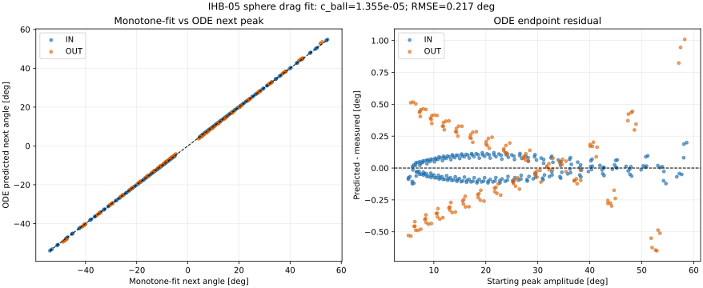

# IHB-05: 球抗力係数 c_ball の同定

## 結論

IHB-04をスキップする指示に合わせ、IHB-02の球なし基準 I/K に実測球質量・形状から計算した増分を加え、IHB-03で採用した単調減少Aフィットと一回積分法の考え方をIHB-05の球あり頂点列にも適用した。単調フィット後の頂点角をエネルギー損失計算に用い、軸別τ等を固定して共通の非負 c_ball を一回の重み付き最小二乗で求めた。

単調関数Aを使った暫定推定値は **c_ball = 1.3550808e-05 N·m·s²/rad²**。生の計測Aを使った旧方式の感度比較値は **1.4408564e-05 N·m·s²/rad²** である。単調フィットを使った半周期ODEの次頂点角RMSEは、フィット頂点との比較で **0.2170°**、生の計測頂点との比較で **0.3952°**（379区間）だった。単調フィットAから作ったエネルギー損失はPearson R **0.99638**、RMSE **0.02115 mJ**、R² **0.99179**（生A方式: R 0.95875、RMSE 0.07332 mJ、R² 0.91716）となった。

ただし、IHB-03と同じ品質基準（AフィットR ≥ 0.99、振幅RMSE ≤ 0.5°）を満たさない波形が **4/12本**あった（IN_BALL_P_R01（R=0.99930, RMSE=0.5587°）、IN_BALL_P_R02（R=0.99945, RMSE=0.5035°）、IN_BALL_N_R02（R=0.99943, RMSE=0.5072°）、IN_BALL_P_R03（R=0.99940, RMSE=0.5222°））。従って上記は全波形でゲートを通過した確定値ではなく、A平滑化の影響を調べる暫定感度解析値として扱う。

この値はIHB-04の更新結果を用いた値ではない。IHB-04をスキップしたため、IHB-02/03の係数に依存する暫定同定値として記録する。

## 固定入力と対象

- 対象: 承認済み球あり波形 12本、379半周期（IN 6本、OUT 6本）。
- 各軸の球あり I/K: IHB-02の I₀/K₀ に、`resolved_manifest.csv` の球質量・重心位置・重心回り慣性から求めたΔI/ΔKを加算。
- τ: IHB-03単調振幅一回積分法。IN 7.9457314e-05 N·m、OUT 0.00017694968 N·m。
- b: 0 N·m·s/rad。
- 球で覆われない上側ロッド長129 mmを反映し、ロッド抗力は長さの4乗比 `(129/229)^4` で理論値を縮小。
- 初期リリースから最初の適格頂点までを除外し、隣接頂点の両方が4°以上の半周期を使用。波形ごとの総重みは等しい。

球あり係数の展開は、球なしIHB-02基準値と球の物理増分から次のように定めた。

$$
I_{\mathrm{BALL}}=I_0+J_{G,\mathrm{ball}}+m_{\mathrm{ball}}\ell_{\mathrm{ball}}^2,\quad K_{\mathrm{BALL}}=K_0+m_{\mathrm{ball}}g \ell_{\mathrm{signed}}.
$$

## 同定方法：実測エネルギー損失から球抗力を分ける

### なぜIHB-03と同じくAを単調関数で近似するか

IHB-03では、生の頂点振幅の小さな局所変動でも、隣接頂点のエネルギーを引き算して作る半周期損失に無視できない変化が出ることを確認した。エネルギー損失は各頂点のエネルギーそのものより小さいため、頂点Aのわずかな揺れが差分の相対誤差を大きくする。IHB-05も同じ隣接頂点差から観測損失を作り、さらにその損失を c_ball 同定に使うので、同じ理由で単調減少包絡線に置き換えるのが妥当である。

ここではIHB-03最終採用の関数をそのまま用いる。

~~~math
A(u)=A_{\mathrm{end}}+B\ln\!\left(\frac{1+C}{u+C}\right),
\qquad A_{\mathrm{end}}>0,\quad B>0,\quad C>0.
~~~

各波形の連続した頂点列に対して当てはめ、符号は計測頂点の交互符号を保つ。フィット頂点と生の頂点の振幅R/RMSEを波形ごとに記録する。IHB-03と同じ判定基準を当てた結果、未達波形は 4本で、該当は IN_BALL_P_R01（R=0.99930, RMSE=0.5587°）、IN_BALL_P_R02（R=0.99945, RMSE=0.5035°）、IN_BALL_N_R02（R=0.99943, RMSE=0.5072°）、IN_BALL_P_R03（R=0.99940, RMSE=0.5222°）。未達を除外したり閾値を緩めたりせず、今回の c_ball は全波形での厳密な品質ゲート合格値とは区別する。

IHB-03が示すように、平滑後の同じA列から観測損失とモデル基底の両方を作り直した適合指標は、平滑後の列への同一データ内適合である。測定誤差を独立に推定した結果や、別データへの予測精度ではない。そのため、ここでは c_ball の生A感度比較値と、ODE予測をフィット頂点・生頂点の双方に比較した角度RMSEも併記する。

ここでは、球抗力係数をいきなりODEの波形合わせで探すのではなく、まず頂点から頂点までに失われたエネルギーを使う。頂点では振り子が一瞬止まるため、角速度はほぼゼロである。その瞬間の力学的エネルギーは位置エネルギーだけになり、平衡点からの角度 A [rad] を使って E=K(1−cos|A|) と計算できる。隣り合う頂点のエネルギー差が、実測半周期損失になる。以下の主計算の A_n は、生角ではなくIHB-03と同じ単調関数でフィットした頂点角である。

~~~math
E_n=K_j\left(1-\cos|A_n|\right),\qquad
\Delta E_{\mathrm{obs},n}=E_n-E_{n+1}
=K_j\left[\cos|A_{n+1}|-\cos|A_n|\right].
~~~

ここで j は IN または OUT の軸、A_n は単調関数フィット後の半周期始点角、A_{n+1} は次のフィット頂点角である。角度はこの計算の前にラジアンへ変換する。頂点列は品質確認済みの前処理結果を使い、リリース直後の区間を除外する。さらにフィット後の始点・終点振幅が両方4°以上で、隣り合う頂点が連続している半周期だけを残した。

## 係数を固定する理由と、抗力仕事の式

球抗力以外の寄与が球係数に混ざらないよう、同定前に I、K、τ、b、ロッド抗力を決めて固定する。

- **I と K**: IHB-02の球なし基準値に、球の物理量による増分を加えた値を使う。球の質量を m、支点から球重心までの距離を ℓ、球重心まわりの慣性を J_G とすると、増分は ΔI=J_G+mℓ²、ΔK=mgℓ_signed である。I は回りにくさ、K は重力が元の位置へ戻そうとする強さを表す。球半径と支点からの距離を混同しないよう、ℓ は支点から球重心までの腕の長さを表す。
- **τ**: IHB-03で選んだ単調振幅一回積分法の軸別値をそのまま使う。
- **b**: 0 に固定する。
- **ロッド抗力**: 球に覆われない長さ129 mmのみが空気に露出するとして、球なし時の理論ロッド係数に (129/229)^4 を掛ける。

クーロン摩擦の仕事は速度の大きさではなく、摩擦トルクと移動角の積で決まる。半周期中は角度が一方向に進むので、実測された始点・終点振幅の和 R_n=|A_n|+|A_{n+1}| が移動角であり、摩擦が失わせるエネルギーは τ_j R_n となる。従って、半周期のエネルギー収支は次の形になる。

~~~math
R_n=|A_n|+|A_{n+1}|,\qquad
y_n=\Delta E_{\mathrm{obs},n}-\tau_jR_n-c_{\mathrm{rod,BALL}}C_n
\approx c_{\mathrm{ball}}C_n.
~~~

左辺 y_n は「実測された損失から、既知とみなしたクーロン摩擦とロッド抗力の損失を差し引いた残り」である。右辺は球の二乗抗力が説明する損失である。C_n は半周期の二乗抗力基底で、C_n=∫|θ̇|³dt に相当する。抗力トルクが速度の二乗に比例するため、抗力がする仕事を時間で積分すると速度の絶対値の3乗が現れる。

速度を計測してこの積分を直接行う代わりに、保存振り子（摩擦・抗力がないと仮定した振り子）の軌道から一度だけ計算する。始点振幅を a=|A_n|、ω₀=√(K_j/I_j) とおく。保存エネルギーから各角度での速度を求め、それを角度について積分すると、次の閉じた式になる。

保存軌道では、始点振幅 a における位置エネルギーと、途中の角度 θ における位置・運動エネルギーが等しい。従って角速度は次式で表される。

~~~math
\frac{1}{2}I_j\dot{\theta}^{2}+K_j(1-\cos\theta)
=K_j(1-\cos a),\qquad
\dot{\theta}^{2}=2\omega_0^2(\cos\theta-\cos a),\quad
\omega_0^2=\frac{K_j}{I_j}.
~~~

一半周期では角度が a から −a まで一方向に進む。dt=dθ/θ̇ を使うと、積分する量は θ̇² dθ になり、上式を −a から a まで積分して次を得る。

~~~math
C_n=\int|\dot{\theta}|^3dt
=2\omega_0^2\int_{-a}^{a}(\cos\theta-\cos a)\,d\theta
=4\omega_0^2\left[\sin(a)-a\cos(a)\right].
~~~

この式の C_n は球だけでなく、同じ回転運動に対する二乗抗力なら同じ形の基底として使える。したがって球抗力と露出ロッド抗力は、ともに係数×C_n の形で表せる。球とロッドの抗力係数を分けるため、固定したロッド寄与 c_{rod,BALL}C_n を先に引く。保存軌道による C_n は減衰した実軌道を厳密に再現する積分値ではないので、ここは近似である。最後に行うODE計算は、この近似を含む同定値が頂点予測でも妥当かを確かめる独立チェックである。

## 重み付き最小二乗で c_ball を一度求める

一つの半周期だけを見ると、測定誤差や頂点検出誤差の影響が大きい。そこで全12波形・379半周期のデータをまとめ、全波形に共通する c_ball を求める。残差とは、予測損失 c_ball C_n と差し引き後の損失 y_n の差である。c_ball は0以上とし、自由な切片（基底 C では説明されない一定損失）は加えない。

波形ごとの区間数は同じではない。全区間を同じ重みにすると、半周期数の多い長い記録が結果を強く左右する。そのため、まず各波形の中では区間数 N_w で割り、波形ごとの重み合計を1にする。そのうえで波形ごとの寄与を平均し、12波形を等しく扱う。重みを a_{w,n}=1/(W N_w) とすると、誤差二乗和を最小にする解は次の一回の割り算で計算できる。

~~~math
\widehat c_{\mathrm{ball}}
=\max\!\left(0,
\frac{\displaystyle\sum_{w=1}^{W}\sum_{n=1}^{N_w}
a_{w,n}C_{w,n}y_{w,n}}
{\displaystyle\sum_{w=1}^{W}\sum_{n=1}^{N_w}
a_{w,n}C_{w,n}^{2}}\right),
\qquad a_{w,n}=\frac{1}{W N_w}.
~~~

この式は、傾き c を持つ直線 y≈cC を原点を通るように当てはめたときの最小二乗解である。実際の計算では波形ごとに分子 ΣaCy と分母 ΣaC² を先に足し、最後に全波形分を合計して c_ball を得る。非負制約は、抗力係数が負にならないという物理条件を反映する。軸ごとに異なる τ を差し引くが、球が共通部品なので c_ball 自体は IN/OUT 共通の一つとする。ここでの係数決定は「各半周期の実測エネルギー損失を説明する」一回の計算であり、ODEを何度も積分して係数を探す反復最適化ではない。

## エネルギー損失の適合度の読み方

係数を決めた後、各区間について一回積分法の予測損失を計算する。τとロッド抗力は固定し、推定した球抗力の寄与を足し戻す。

~~~math
\Delta E_{\mathrm{model},n}
=\tau_jR_n+\left(c_{\mathrm{rod,BALL}}+\widehat c_{\mathrm{ball}}\right)C_n.
~~~

観測値と予測値がどれだけ合うかを、全波形の総重みが等しくなるようにして評価する。重みの合計を1に正規化しているので、重み付きRMSEは次式である。

~~~math
\mathrm{RMSE}_E
=\sqrt{\sum_{w,n}a_{w,n}
\left(\Delta E_{\mathrm{obs},w,n}-\Delta E_{\mathrm{model},w,n}\right)^2}.
~~~

Pearson R は、損失の大きい区間で予測損失も大きいという増減のそろい具合を測る相関である。R²は、予測誤差の二乗和を「全区間へ観測損失の加重平均を予測した場合」の二乗和と比べる。1なら予測誤差がゼロ、0なら平均値だけの予測と同程度、負なら平均値だけの予測より悪い。

~~~math
R^2=1-
\frac{\sum_{w,n}a_{w,n}
\left(\Delta E_{\mathrm{obs},w,n}-\Delta E_{\mathrm{model},w,n}\right)^2}
{\sum_{w,n}a_{w,n}
\left(\Delta E_{\mathrm{obs},w,n}-\overline{\Delta E}_{\mathrm{obs}}\right)^2}.
~~~

R、RMSE、R²は違う側面を見るため、一つだけで適合の良し悪しを決めない。特にRが高くても、予測値に一定の偏りがあればRMSEは残りうる。

得られた値は c_ball=1.3550808e-05 N·m·s²/rad² である。球抗力を慣例的な無次元抗力係数 Cd に換算する場合、球の速度を ℓ_ball θ̇ とし、抗力を 1/2 ρ Cd A v² と置くと、トルク係数との関係は次の通りである。ここで ℓ_ball=0.174 m は支点から球重心までの距離、球半径はD/2=0.050 mである。

~~~math
c_{\mathrm{ball}}=\frac{1}{2}\rho C_D A \ell_{\mathrm{ball}}^3,\qquad
C_D=\frac{2c_{\mathrm{ball}}}{\rho A \ell_{\mathrm{ball}}^3},\qquad
A=\frac{\pi D^2}{4}.
~~~

本解析では直径 D=0.100 m、支点から球重心まで ℓ_ball=0.174 m とし、設定ファイルに記録した空気密度・粘度を用いた換算 Cd は0.5686となった。これはこの振り子・速度域・固定した他係数のもとでの等価値である。

## 不確かさと独立検証

95%区間は、379個の半周期を独立と見なすのではなく、12本の波形を単位に復元抽出するクラスタ・ブートストラップで求めた。各反復で波形を12本、重複を許して引き直し、その波形に属する全半周期をまとめて同じ最小二乗計算を行う。これを2,000回行い、推定値の分布の2.5百分位と97.5百分位を区間とした。この区間が表すのは、観測された波形間のばらつきである。I/K/τ、質量・寸法、空気密度、ロッド長近似などの不確かさは含まない。

最後に、求めた c_ball を固定して検証済みの半周期ODEソルバーを全379区間に適用する。これは、保存軌道近似ではなく減衰を含む運動方程式を各区間で数値積分して、次の折返し角を予測する確認である。

~~~math
I_j\ddot{\theta}+K_j\sin\theta
+\left(c_{\mathrm{rod,BALL}}+\widehat c_{\mathrm{ball}}\right)
|\dot{\theta}|\dot{\theta}
+\tau_j\tanh\left(\frac{\dot{\theta}}{\varepsilon}\right)=0,
\qquad b=0.
~~~

ε は、速度ゼロ付近で符号関数が急に切り替わる計算を滑らかにする小さな速度幅で、実装では0.5°/sをラジアン毎秒へ変換している。各区間は実測始点角・角速度ゼロから独立に開始する。ここでは c_ball を再調整しないので、係数を合わせたデータと同じデータではあるものの、ODEという別の計算経路による検算となる。次頂点角RMSEは、この数値計算の折返し角と実測次頂点角との差から求める。エネルギー損失のRMSE/R²は上記の一回積分予測式に対する指標であり、ODE頂点角RMSEとは比較対象が異なる。

この方法は「τとロッド損失を正しいものとして固定したとき、残るエネルギー損失を説明する球係数」を推定する。固定入力に誤差があれば、その一部を c_ball が引き受ける可能性がある。またODE残差には振幅依存の傾向が残った。従って、本値を確定した普遍定数と見なさず、IHB-04を未実施の暫定係数として、オブザーバー評価で誤差伝播を確認する。

## 結果

| 評価 | 結果 |
|---|---:|
| c_ball | 1.3550808e-05 N·m·s²/rad² |
| 生Aによる従来方式の感度比較値 | 1.4408564e-05 N·m·s²/rad² |
| 波形クラスタ・ブートストラップ95%区間 | 1.3009058e-05〜1.4157291e-05 N·m·s²/rad² |
| 等価 Cd | 0.5347 |
| エネルギー損失 Pearson R | 0.99638 |
| エネルギー損失 RMSE | 0.02115 mJ |
| エネルギー損失 R² | 0.99179 |
| エネルギー損失 RMSE（生A方式） | 0.07332 mJ |
| 半周期ODE次頂点角RMSE | 0.2170° |
| 半周期ODE次頂点角RMSE（生計測頂点との比較） | 0.3952° |
| Aフィット品質ゲート未達波形 | 4/12 |
| 波形数・半周期数 | 12・379 |



## 解釈と次のオブザーバー評価

ブートストラップ区間は波形間のばらつきを表し、I/K/τ、球寸法・質量、ロッド抗力近似の不確かさを含まない。Cdは往復運動中のデータに対する等価値であり、孤立した球の普遍値としては扱わない。今後このc_ballを使うときは、本レポートに記載した固定I/K/τと組み合わせ、IHB-04を未実施であることを保ったままオブザーバー側の誤差伝播を評価する。

図のODE次頂点残差は開始振幅に対して全体のPearson R = 0.058（IN 0.081、OUT 0.068）となり、低振幅側では予測が実測より小さく、高振幅側では大きくなる傾向が残った。従って、c_ball一つで全振幅域の半周期波形誤差を説明しきったとは言えない。この振幅依存の残差は、オブザーバー誤差評価でパラメータ不確かさとともに考慮する。

## 再現方法

```bash
python 06_Analysis/fitting_pipeline/iterative_hybrid/ihb05_cball_identification.py
```

出力: `ihb05_settings.json`、`amplitude_fit_metrics.csv`、`energy_fit_metrics.csv`、`raw_peak_sensitivity_energy_fit_metrics.csv`、`waveform_estimates.csv`、`interval_predictions.csv`、`reynolds_assessment.csv`、およびPNG/SVG比較図。
