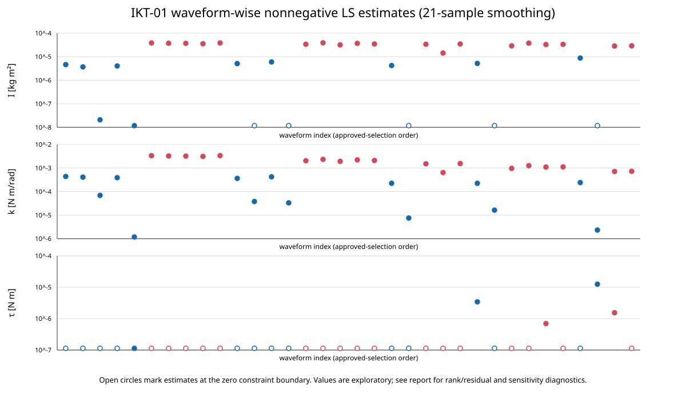

# IKT-01 球なし波形別積分残差フィット

- 実施日: 2026-09-30
- 対象: 2026-09-21 球なし SP00〜SP04、承認済み波形
- 状態: **計算・診断を実施。波形別の (I,k,\tau) は採用不可としてレビュー待ち**
- 方針: [IKT WBS](../../../../JOINT_IKT_IDENTIFICATION_WBS.md) と [積分残差の説明](../../../../INTEGRAL_RESIDUAL_FIT_GUIDE.md)

## 1. 対象と計算条件

採否表で `use_for_fitting=1` の球なし波形34本を使用した（SP00: 10本、SP01: 9本、SP02: 5本、SP03: 6本、SP04: 4本。IN 15本、OUT 19本）。波形ごとに既存の包絡線中心を差し引き、角度をradへ変換した。採否表が指定する角度列を使用した。

解放から最初の頂点までを除外し、最初の頂点以降の隣接頂点間を半周期とした。両端の振幅がともに4 deg以上の半周期を二分し、頂点から中間点、中間点から次頂点をそれぞれ積分窓とした。各窓で
$$
\phi(s)=\sin(\pi s),\quad s=(t-t_a)/(t_b-t_a)
$$
を使った。合計3,436窓である。区間を半周期全体にした試算では、ほぼ対称な運動の保守力項の積分が相殺されるため、半周期内を二分する形へ変更した。

角速度は角度データへ局所3次多項式を当てて微分した。標準窓幅は21サンプル（約0.21 s）、感度確認は11、31サンプル（約0.11、0.31 s）とした。符号関数の平滑化は (g(\omega)=\tanh(\omega/\varepsilon))、(ε=0.5\;\mathrm{deg/s}) をrad/sへ変換して使用。(b=0)、球なし全形態共通の (c_{\mathrm{rod}}=2.5486754169\times10^{-6}\;\mathrm{N\,m\,s^2/rad^2}) に固定した。

波形ごとに同一係数 (I,k,\tau) を全窓へ当て、(I\geq0,k\geq0,\tau\geq0) の制約付き線形最小二乗を解いた。ゼロ境界は物理的な推定値ではなく、識別に失敗した警告として扱う。したがってWBSが要求する厳密な (I>0,k>0) を満たさない波形は採用候補にならない。

## 2. 結果



| 軸 | 採用波形 | 解けた波形 | フルランク | ゼロ境界 I | ゼロ境界 k | ゼロ境界 τ | 条件数中央値* | 相対残差中央値** |
|---|---:|---:|---:|---:|---:|---:|---:|---:|
| IN | 15 | 14 | 14/14 | 5/14 | 0/14 | 12/14 | 1.84（最大35.9） | 0.977 |
| OUT | 19 | 19 | 19/19 | 0/19 | 0/19 | 17/19 | 121.5（最大132.8） | 0.611 |

\* 各説明変数列のノルムを1に正規化した設計行列の条件数。OUTでは列の強い相関が残る。  
\** (\|A\hat\beta-y\|_2/\|y\|_2)、(y=-c_{\mathrm{rod}}D)。固定したロッド抗力積分 (y) に対して、フィット後の残差がどの程度残るかを示す。1に近い値は、積分式がデータをほとんど説明していない。

INは15本中1本で十分な窓が作れず推定不能。残りも14本中12本で (τ=0) 境界となり、相対残差の中央値は0.977だった。OUTは (I,k) が正値になった一方、19本中17本で (τ=0) 境界、条件数中央値121.5、相対残差中央値0.611だった。これは制約付き解が存在することと、物理係数が識別できたことが同じではないことを示す。

波形別の推定値、派生比 (k/I,\tau/I)、残差、条件数、平滑化窓・(φ) 変更時の値は `ikt01_waveform_fits.csv` に収録した。個々の積分式を再計算できる (X_I,X_k,X_\tau,D) と積分窓は `ikt01_integral_windows.csv` に保存した。

## 3. 感度診断

- **平滑化窓（11/21/31サンプル）**: OUTでは (I,k) の21サンプル基準に対する中央値差はおよそ1%で、比 (k/I) は安定していた。一方、OUTの (\tau) は推定できた波形が2本だけで、残り17本はゼロ境界。INでは正値の (I) の中央値差が約16%、(k) は約74%、(k/I) は約23%で、ばらつきが大きい。
- **重み関数**: (sin(\pi s)) を (4s(1-s)) に変えたとき、正値推定値の中央値差はINで (I) 約9.8%、(k) 約8.8%、OUTで (I) 約1.1%、(k) 約1.3%。どちらでも (τ) の境界推定が大半を占め、結論は変わらなかった。
- **識別性**: OUTの (I,k) 列は条件数が大きく、係数分離に弱い。INは条件数だけを見ると小さい波形が多いが、残差が大きく、(τ) のゼロ境界も多い。条件数単独では適合性を保証しない。

## 4. IKT-01の結論とレビュー事項

波形別に (I,k,\tau) を同時フィットする処理は実行できたが、今回の設定・データでは安定した波形別係数を得られなかった。特に (\tau) がほとんどの波形で境界値となり、INの残差は非常に大きい。従って、この結果を後段の物理パラメータとして採用しない。境界にある推定値を平均したり、ゼロを物理的な摩擦値と解釈したりしない。

この結果は、既知の (c_{\mathrm{rod}}) が弱い絶対スケール情報しか与えないこと、窓積分の説明変数間の相関、角速度推定・モデル誤差の影響が残る可能性を示している。IKT-02へ進む前に、このIKT-01の識別失敗をレビューする。IKT-02では既知の (Delta I_j,\Delta k_j) を全条件で共有するため、波形単位のこのフィットとは別の識別情報を使う。

## 5. 再現

`ikt01_integral_fit.py` は同じ入力CSVから区間特徴量・制約付きフィットを再計算するスクリプト。実行例:

```bash
python 06_Analysis/fitting_pipeline/results/20260921/joint_ikt/IKT-01/ikt01_integral_fit.py \
  --repo-root . \
  --output-dir 06_Analysis/fitting_pipeline/results/20260921/joint_ikt/IKT-01/reproduced
```

入力は採否表、Stage 1の頂点表と前処理表、及び採用表に記録された元CSVである。各出力には設定を記録し、Stage 2以降の作業とは分けている。
