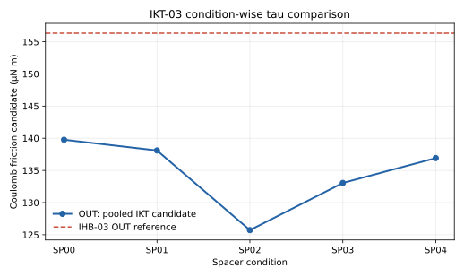

# IKT-03 レポート：条件別τ候補の比較と採用判断

- 実施日: 2026-10-01
- 状態: **比較・採用判断を完了。IKT由来のτは採用しない**
- 前提: IKT-02の条件別同時フィット結果

## 条件別候補の比較

OUTでは物理的に妥当な同時解が得られたため、条件別τを比較した。INは基準慣性がゼロ境界に張り付くため、非負制約解から出たτを物理候補として表示しない。

| 条件 | OUTのτ候補 [µN m] | IHB-03 OUT参考値 156.3 µN mとの差 |
|---|---:|---:|
| SP00 | 139.8 | -10.6% |
| SP01 | 138.1 | -11.7% |
| SP02 | 125.7 | -19.6% |
| SP03 | 133.1 | -14.9% |
| SP04 | 136.9 | -12.4% |

INでは制約なし解の基準慣性が負、非負制約解の基準慣性が0となるため、比較できる条件別候補は成立していない。

## 採用判断

OUTの5候補は125.7〜139.8 µN mに分布し、条件差は残る。IHB-03のOUT値より全条件で低い。もっとも、IHB-03は別の同定系に基づく参考値であり、直接の同一手法比較ではない。

IKTの目的はIN/OUTの両軸で再現可能な基準値を得ることだった。INの解が物理条件を満たさないため、OUTだけから共通のIKT基準τを選ぶことはしない。τ候補を単純平均して採用値にすることも避ける。従って、IKT-03の結論は「条件別OUT候補を保存するが、IKT由来のτ0は未採用」とする。

## 次段階

IKT-04はユーザー判断によりスキップする。球抗力係数c_ballはIKT-05で、以前の解析で保存済みの球ありI・Kを固定入力として同定する。IKT-02/03由来の係数は使用しない。

## 成果物

- 条件別τ比較図: [ikt03_tau_candidates.svg](ikt03_tau_candidates.svg)
- 条件別の同時解: [IKT-02 fit summary](../IKT-02/ikt02_fit_summary.csv)
