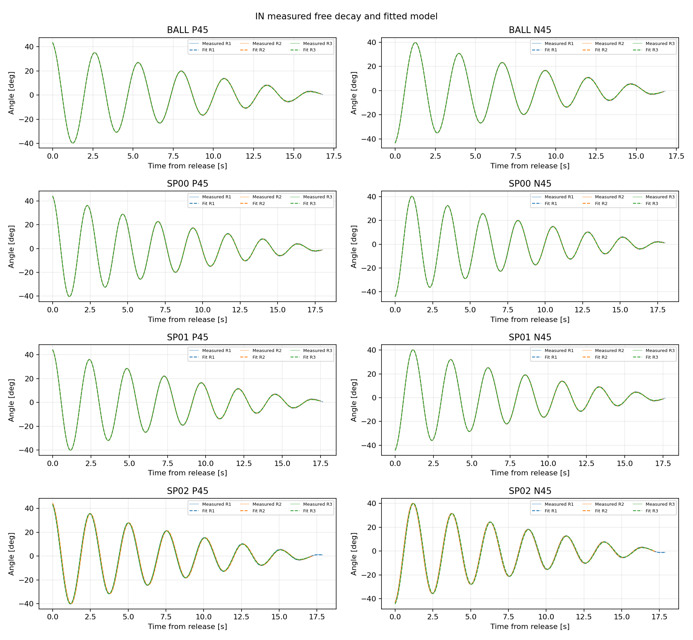
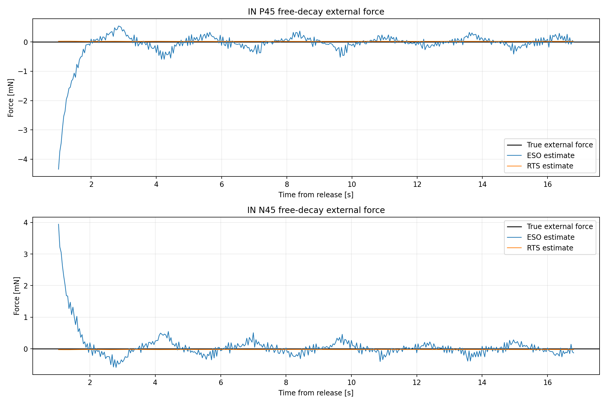
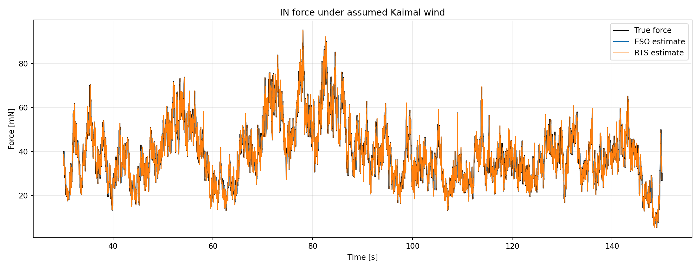

# 既存自由振動ベースデモの実行結果

## 結果

`04_Data/05_Fitting/20990101/` のデモ入力に対し、データ分割、波形フィット、
係数同定、外力比較の全処理が正常終了した。

| 確認項目 | 結果 |
|---|---:|
| 自動分割 | 24 / 24波形 |
| フィット成功 | 24 / 24波形 |
| 全波形の平均角度RMSE | 0.0382 deg |
| 較正形態 | SP00、SP01、SP02 |
| 製品形態 | BALL |

## 係数の回収精度

`demo_truth.csv` の生成真値と `identified_parameters.csv` を比較した。
表は4形態における絶対誤差率の最大値である。

| 係数 | 最大絶対誤差率 |
|---|---:|
| `I` | 0.0047% |
| `K` | 0.0047% |
| `b` | 1.0632% |
| `c` | 0.8843% |
| `tau_f` | 0.1073% |

形態別の値は [`demo_truth_comparison.csv`](demo_truth_comparison.csv) に保存した。

## 波形フィット

実線がデモ角度、同色の破線がフィット結果である。各形態の正負とも3回が重なることを確認した。

## 自由振動の外力推定

真値を0 Nとした場合の評価結果である。正負の2波形の平均を示す。

| 方式 | RMSE | 最大絶対誤差 |
|---|---:|---:|
| ESO | 0.228 mN | 2.175 mN |
| RTS | 0.016 mN | 0.029 mN |

## 想定風の外力比較

Kaimal想定風の30–150秒を評価した。

| 方式 | RMSE | 最大絶対誤差 |
|---|---:|---:|
| ESO | 3.725 mN | 21.004 mN |
| RTS | 0.119 mN | 0.489 mN |

## デモデータの位置付け

この入力は実測ログではない。旧ハードの実測自由振動から減衰特性と
微小な角度ばらつきを取り出し、真鍮スペーサの既知追加慣性を仮定して再構成した。
そのため、この結果はソフトウェアの動作確認に使い、新ハードの物理係数とは解釈しない。
