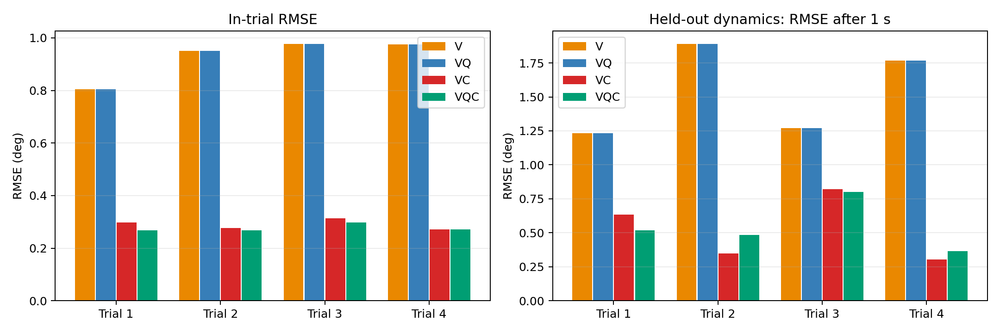
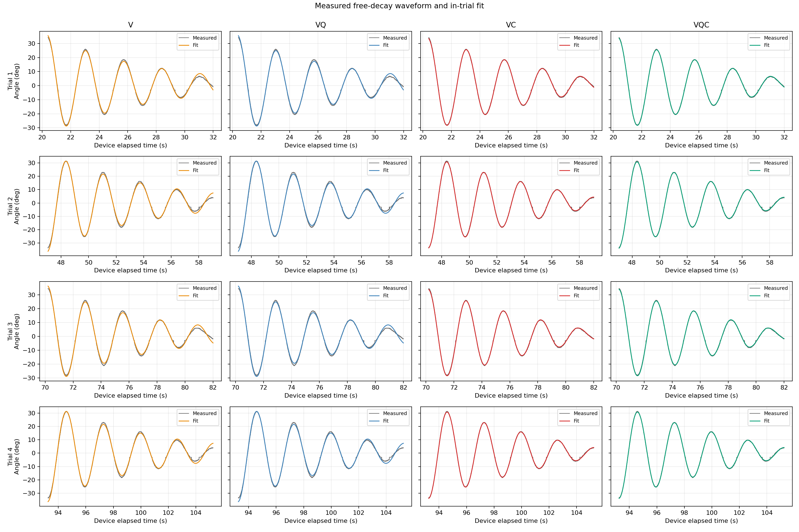
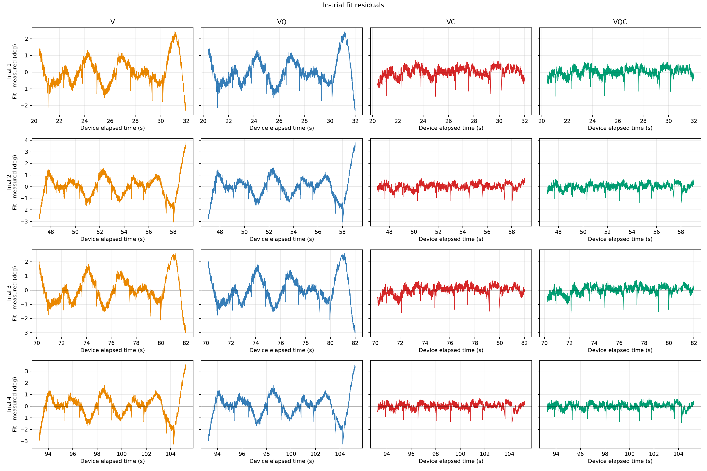

# 既存自由振動データによる摩擦項の評価

## 結論

旧ハードの内軸自由振動4区間では、**粘性抵抗だけでは説明しにくい減衰があり、クーロン摩擦型の項を加えることで説明力が改善した**。別区間の係数を用いた予測でも改善したため、単にフィット用の自由度を増やしただけとは考えにくい。

ただし、これはクーロン摩擦という物理原因の一意な証明ではない。角度較正の非線形性、軸間連成、荷重による摩擦変化などは今回分離していない。V1ハードの摩擦係数、静止摩擦、風速推定の改善量を直接測定した結果でもない。

| モデル | 同一区間フィットのRMSE | 別区間係数による予測RMSE |
|---|---:|---:|
| V：粘性抵抗 | 0.927° | 1.540° |
| VQ：粘性＋二乗抵抗 | 0.927° | 1.540° |
| VC：粘性＋クーロン摩擦 | **0.289°** | **0.527°** |
| VQC：粘性＋二乗抵抗＋クーロン摩擦 | 0.276° | 0.542° |

数値は各区間のRMSEを求めた後の4区間の算術平均。全サンプルをまとめたRMSEではない。VCはVに対して同一区間で約69%、別区間予測で約66%改善した。



## データと前処理

- 入力：`04_Data/00_Calibration/swing/LOG00014.TXT`。旧ハードの既存自由振動ログ。
- 内軸ADC：タブ区切りの第3列。時刻は第1列をマイクロ秒から秒へ変換。
- 角度較正：角度[deg] = −0.0803317 × ADC + 120.248。
- 評価区間：20.40–32.00、47.05–59.05、70.20–82.00、93.25–105.25秒。従来解析の4区間を固定して使用。
- 正常に数値として読める4列の行を読み込み、時刻の単調増加を確認。
- 元の測定時刻を使用し、等間隔への補間、ローパス、角度の数値微分は行わない。
- 最適化時のみ4点に1点を使用。最終RMSEと図は各区間の全サンプルで計算。

横軸はログ先頭側の時刻基準による装置経過時刻であり、日時ではない。4区間は同一ログ内の試行で、異なる日・個体での独立再現試験ではない。

## 比較した理論式

角度を鉛直平衡位置から測り、無風で外力がないものとする。初期振幅が大きいため、復元トルクは線形化しない。

$$
I\ddot{\theta}+K\sin\theta+b\dot{\theta}+c|\dot{\theta}|\dot{\theta}+\tau_f\tanh(\dot{\theta}/\varepsilon)=0
$$

| 記号 | 意味 |
|---|---|
| I | 支点まわりの慣性モーメント |
| K | 重力復元トルクの係数 |
| b | 粘性抵抗の係数 |
| c | 速度の二乗に比例する抵抗の係数 |
| τf | クーロン摩擦型トルクの大きさ |
| ε | 速度ゼロ近傍の符号反転を滑らかにする幅 |

Vではcとτfをゼロ、VQではτfをゼロ、VCではcをゼロ、VQCではすべてを推定する。b、c、τfは非負に制約した。滑らかな符号関数は計算上の近似であり、静止摩擦による固着を再現するモデルではない。

自由振動だけで識別するのは、絶対値ではなく次の比である。

$$
a=K/I,\qquad d=b/I,\qquad q=c/I,\qquad f=\tau_f/I
$$

$$
\ddot{\theta}=-a\sin\theta-d\dot{\theta}-q|\dot{\theta}|\dot{\theta}-f\tanh(\dot{\theta}/\varepsilon)
$$

観測角度はθに一定オフセットを加えたものとし、各区間の初期角度・初期角速度・オフセットも推定した。したがってADCゼロ点の微小なずれを、直ちに摩擦と解釈する構成にはしていない。ただし較正の傾きや非線形性は固定している。

## フィッティングと別区間検証

1. 各モデルの微分方程式を数値積分し、観測角度との差の二乗和を最小化する。
2. モデルごとに4区間を個別にフィットする。
3. 1区間を評価用として外し、残り3区間で得た動力学係数の成分ごとの中央値を、その評価区間に移植する。
4. 評価区間の最初の1秒だけで初期状態とオフセットを合わせ、その後は観測値で修正せず自由応答を予測する。
5. 1秒より後の角度RMSEを求める。

これは「別試行への動力学係数の移植」の検証であり、3区間を同時最適化した共通係数ではない。初期1秒を使うため完全な無観測予測でもない。同一区間のフィット誤差だけで採否を決めないための補助評価である。

数値積分はRK45、相対許容誤差1e−8、絶対許容誤差1e−10、最大時間刻み0.04秒。摩擦の滑らか化幅εは0.5°/s。`scipy.optimize.least_squares`を使用し、全モデル・全区間で成功終了を確認した。大域最適性を保証する多始点探索は実施していない。

## 波形と結果の解釈



行はTrial 1～4、列はV／VQ／VC／VQCである。各パネルに測定波形と1種類のモデルだけを描き、ほぼ一致するVとVQ、およびVCとVQCが重なって見えなくなることを避けた。



残差も同じく行をTrial 1～4、列をV／VQ／VC／VQCとして分離した。縦軸は「計算角度−測定角度」である。VC/VQCでは、Vに残る周期的な大きな残差が減少している。

| 区間 | Vフィット | VCフィット | V別区間予測 | VC別区間予測 |
|---|---:|---:|---:|---:|
| 1 | 0.805° | 0.297° | 1.234° | 0.636° |
| 2 | 0.951° | 0.276° | 1.890° | 0.347° |
| 3 | 0.977° | 0.313° | 1.270° | 0.822° |
| 4 | 0.975° | 0.271° | 1.768° | 0.304° |

### 同定した係数

各区間で同定した正規化動力学係数 `K/I`、`b/I`、`c/I`、`τf/I` と角度オフセットを以下に示す。自由振動データだけでは慣性モーメント `I` との比までしか識別できないため、`K`、`b`、`c`、`τf` の絶対値ではない。より多い桁数の値は [`fits.csv`](fits.csv) に保存している。

| モデル | 区間 | K/I [s⁻²] | b/I [s⁻¹] | c/I [rad⁻¹] | τf/I [rad/s²] | 角度オフセット [deg] |
|---|---:|---:|---:|---:|---:|---:|
| V | 1 | 5.582059 | 0.276280 | 0（固定） | 0（固定） | 0.6123 |
| V | 2 | 5.557747 | 0.276506 | 0（固定） | 0（固定） | 0.6313 |
| V | 3 | 5.573943 | 0.285405 | 0（固定） | 0（固定） | 0.5425 |
| V | 4 | 5.562523 | 0.277092 | 0（固定） | 0（固定） | 0.6278 |
| VQ | 1 | 5.582059 | 0.276280 | 8.53×10⁻¹⁵ | 0（固定） | 0.6123 |
| VQ | 2 | 5.557747 | 0.276506 | 1.75×10⁻²⁰ | 0（固定） | 0.6313 |
| VQ | 3 | 5.573943 | 0.285406 | 2.69×10⁻¹³ | 0（固定） | 0.5425 |
| VQ | 4 | 5.562522 | 0.277090 | 1.85×10⁻¹⁰ | 0（固定） | 0.6278 |
| VC | 1 | 5.618959 | 0.089361 | 0（固定） | 0.109834 | 0.6744 |
| VC | 2 | 5.604486 | 0.083038 | 0（固定） | 0.115640 | 0.6560 |
| VC | 3 | 5.624230 | 0.076145 | 0（固定） | 0.122012 | 0.5717 |
| VC | 4 | 5.609120 | 0.082732 | 0（固定） | 0.117684 | 0.6381 |
| VQC | 1 | 5.619134 | 5.78×10⁻¹³ | 0.075876 | 0.130937 | 0.6695 |
| VQC | 2 | 5.604946 | 0.007226 | 0.061416 | 0.134150 | 0.6662 |
| VQC | 3 | 5.624264 | 2.30×10⁻¹² | 0.065666 | 0.139229 | 0.5634 |
| VQC | 4 | 5.609122 | 0.082286 | 0.000359 | 0.117793 | 0.6381 |

「0（固定）」は、そのモデルに含めずゼロに固定した項を表す。VQの `c/I` と、VQCの一部区間の `b/I` は最適化でゼロ境界付近となった値であり、固定値ではない。角度オフセットは観測モデルのフィット変数で、機械系の動力学係数ではない。区間ごとの初期角度・初期角速度もフィットしたが、これらは係数ではなく初期条件のため表から除外した。

VCの推定係数はK/Iが約5.60–5.62 s⁻²、b/Iが約0.076–0.089 s⁻¹、τf/Iが約0.110–0.122 rad/s²だった。摩擦係数の比が全区間で正となり、同程度の値が得られた。

粘性抵抗は速度が下がると弱くなる。一方、クーロン摩擦型の抵抗は、動いている間は速度が下がっても一定程度残る。この違いが、今回の振幅減衰を説明するのに有効だったと解釈できる。

VQでは二乗抵抗の推定値がほぼゼロとなり、追加効果がなかった。ただし「空気抵抗が存在しない」という意味ではない。今回の波形・較正・モデルで、二乗項だけを足しても残差を説明できなかったという結果である。

VQCはフィット誤差をVCから約4.5%減らすが、別区間予測ではわずかに悪化した。またbとcの配分が区間によって変わり、bがゼロ境界となる場合もあった。現状のデータから両者を安定に分離できているとは言いにくい。

推定済み係数を固定し、εを0.1、0.5、1°/sに変更した数値感度確認では、基準波形との差のRMSEは最大約0.011°だった。摩擦項追加による改善量より十分小さかった。ただし、これは再フィッティングではなく、滑らか化幅に対する局所的な確認である。

## オブザーバーへの示唆と限界

次の比較では、**粘性＋クーロン摩擦型のVCモデルを候補に加える価値がある**。未モデル化の摩擦トルクは、外力推定器では空力トルクの一部として推定され得るため、とくに低風速や往復運動で影響し得る。

今回オブザーバー本体は変更していない。摩擦を追加すれば風速推定が必ず改善する、とまでは本試験では評価できない。また無風自由振動時の二乗抵抗を、有風時にも同じ独立抵抗として加えると、相対風速に起因する空力と二重計上するおそれがある。機械摩擦と空力の役割は分けて検討する。

このデータだけから以下は決められない。

- IやK、摩擦トルクの絶対値：既知付加質量等による尺度の同定が別途必要。
- 静止摩擦・起動トルク：今回のtanh近似と振動区間からは特定しない。
- V1・外軸への適用：機構や荷重が異なり、係数は流用しない。
- 厳密な信頼区間：残差には時間相関とモデル誤差があり、独立白色雑音を仮定した狭い区間は提示しない。

後日の試験は、V1の各軸で複数初期振幅の自由振動を繰り返し、球あり・なし・既知付加質量条件で比較するのが有用。支持荷重の変化で機械摩擦も変わり得るため、球の有無による減衰差をそのまま空気抵抗だけに割り当てない。

## 再実行

リポジトリのルートから実行する。

```bash
python -m pip install -r 06_Analysis/friction_study/requirements.txt
python 06_Analysis/friction_study/analyze.py --input 04_Data/00_Calibration/swing/LOG00014.TXT
```

- `fits.csv`：区間ごとのフィット係数とRMSE。
- `validation.csv`：別区間係数による予測RMSE・MAE。
- `numerics.csv`：滑らか化幅の確認。
- `waveforms.csv`：測定値、フィット、別区間予測の全時系列。容量を抑えるためGitには含めず、再実行で生成する。
- `provenance.json`：入力パス、SHA-256、区間とモデル定義。
- PNG 3点：モデル別波形、モデル別残差、区間別RMSE。

生ログは変更していない。
