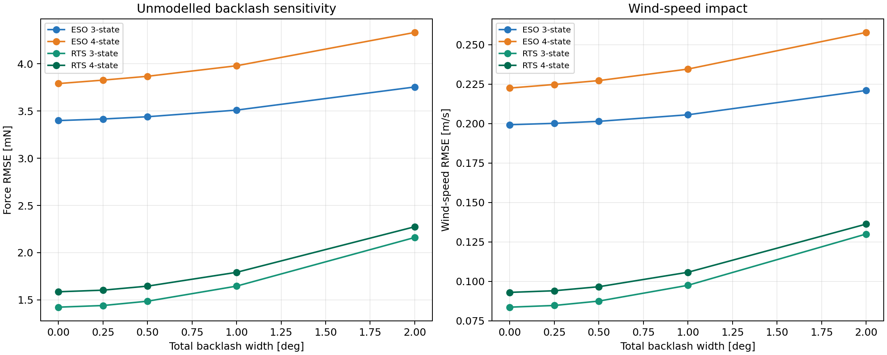
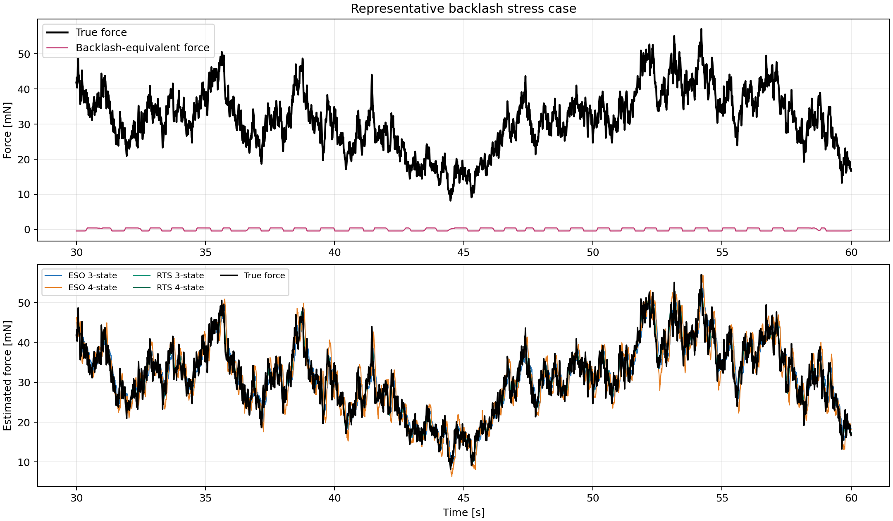
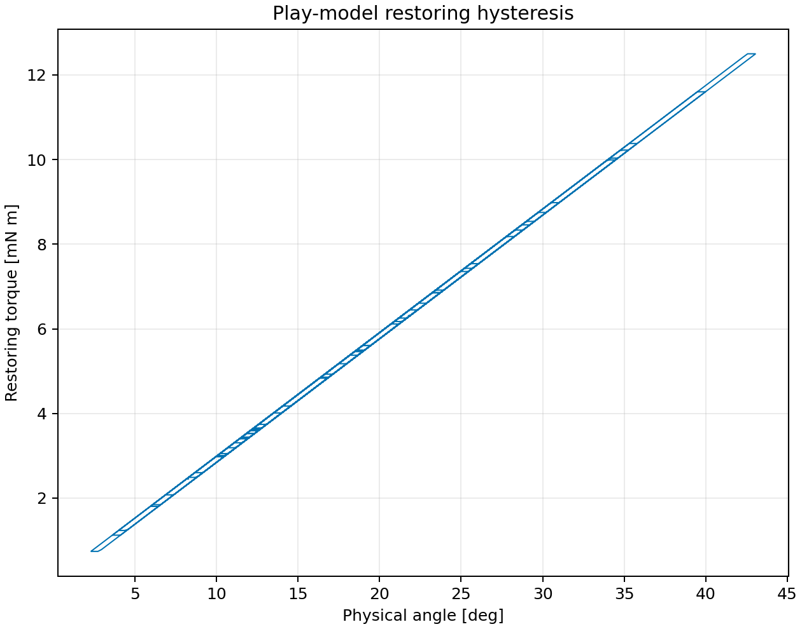

# Stage 4：摩擦・バックラッシュの検討

## 結論

クーロン摩擦はすでにプラントと推定器の双方へ実装済みである。今回、復元機構の方向反転時に履歴を持つplayバックラッシュを追加した。
旧ハード自由振動ではバックラッシュ幅の同定値が試行間で安定せず、他試行へ移植すると平均予測誤差が悪化した。
したがって現時点では、バックラッシュ補償を公称オブザーバーへ常時組み込む根拠は不足している。無効化可能な試験モデルとして保持し、新ハード反転試験で幅を測定する。

## 既存自由振動による識別結果

- VC別試行予測RMSE平均: 0.4943 deg
- VCB別試行予測RMSE平均: 0.5570 deg
- VCBの変化: +12.7%
- 同定された全バックラッシュ幅: 0.578, 0.014, 0.286, 0.001

試行内では一部区間の残差がわずかに減るが、幅がほぼ0～0.58 degへ散らばる。これはバックラッシュが一意に同定された状態ではない。

## Stage 3センサーモデル込みのストレス試験

公称値ではなく、全幅0.50 degを仮定した影響を示す。推定器はバックラッシュを知らず、Stage 3の調整値を固定した。

| 推定器 | 0 deg外力RMSE [mN] | ストレス時 [mN] | 変化 | 0 deg風速RMSE [m/s] | ストレス時 [m/s] |
|---|---:|---:|---:|---:|---:|
| ESO 3-state | 3.3990 | 3.4397 | +1.2% | 0.1993 | 0.2014 |
| ESO 4-state | 3.7909 | 3.8681 | +2.0% | 0.2225 | 0.2272 |
| RTS 3-state | 1.4228 | 1.4859 | +4.4% | 0.0836 | 0.0874 |
| RTS 4-state | 1.5858 | 1.6454 | +3.8% | 0.0930 | 0.0965 |

全幅0.50 degで、復元トルク差を力換算した最大値は0.429 mNだった。

## モデル

物理角度をθ、ばね側の履歴角度をz、半幅をδとし、離散play演算子を使う。

```math
z_k = \max(\theta_k-\delta,\min(z_{k-1},\theta_k+\delta))
```

```math
I\ddot\theta+b\dot\theta+Kz+\tau_f\tanh(\dot\theta/\varepsilon)=lF_{aero}
```

δ=0で従来モデルへ完全に戻る。摩擦は速度方向に依存する散逸項、バックラッシュは反転履歴に依存する復元トルク項なので、別パラメータとして扱う。

## 推奨する次の実機確認

- 新ハード各軸を無風で±5 deg程度ゆっくり往復させ、角度と既知外力またはトルクを同時記録する。
- 正転・逆転の同一トルクに対する角度差からバックラッシュ全幅を求める。
- 幅が角度分解能0.02197 degや反復ばらつきを十分上回る場合だけ、軸別補償を有効化する。
- 風速換算では、未補償バックラッシュの等価力を低風速検出限界へ加える。
- 全幅2 deg条件は最大角度が45 degを超えるため、ストッパーなしモデルの参考値としてのみ扱う。
- 現在の摩擦項は動摩擦であり、静止摩擦による固着やStribeck特性はまだ含まない。

## 図







## 再実行

```bash
python 06_Analysis/backlash_study/analyze.py --input 04_Data/00_Calibration/swing/LOG00014.TXT
python 06_Analysis/simulation/src/run_backlash_stage4.py
```
