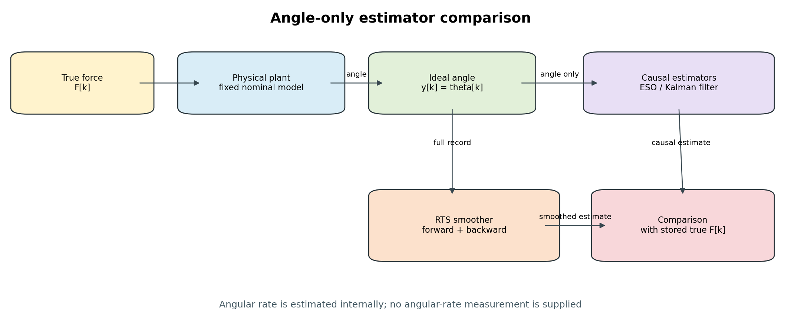
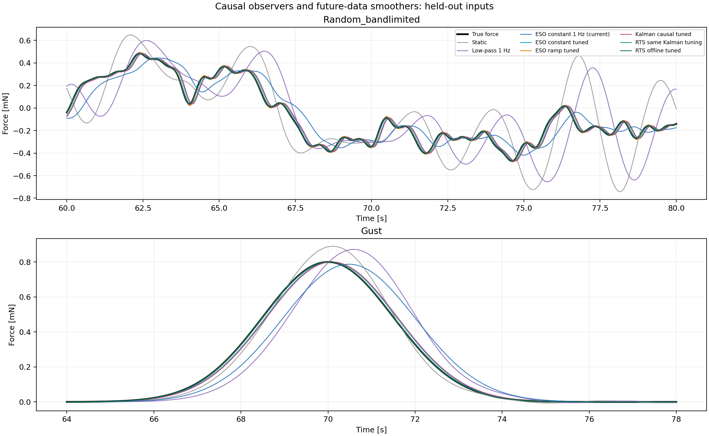
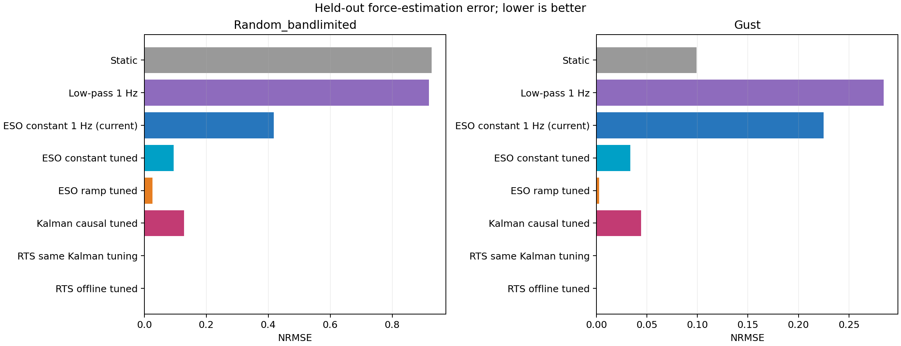
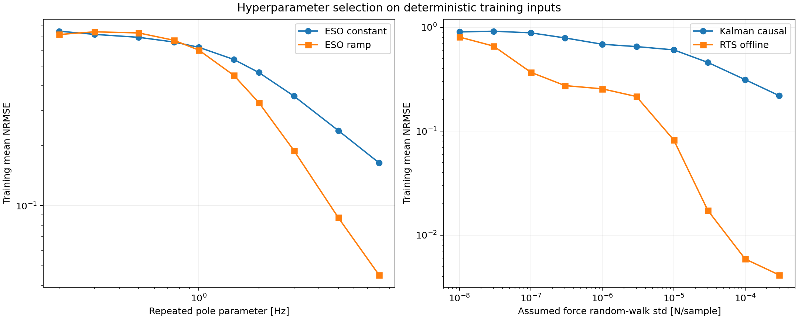

# Stage 2：オブザーバー実装比較

候補を帯域可変ESO、3状態RTS smoother、4状態RTS smootherへ絞り込んだ理論式と調整方法は、[外力推定器3候補の理論・調整ガイド](Estimator_Candidate_Guide.md)にまとめています。

## 観測データ

現在のオブザーバーを含め、全方式が観測するのは角度だけです。角速度は測定入力ではなく内部状態として推定します。角度の数値微分値も追加していません。



## 比較方式

| 方式 | 因果性 | 外力モデル | 使用する観測 |
|---|---|---|---|
| 現行ESO | 因果 | トルク一定 | 現在までの角度 |
| 調整ESO | 因果 | トルク一定 | 現在までの角度 |
| Ramp ESO | 因果 | トルク変化率一定 | 現在までの角度 |
| Kalman filter | 因果 | トルクのrandom walk | 現在までの角度 |
| RTS smoother | 非因果 | Kalman filterと同じ | 記録全体の角度 |

RTSは固定区間スムーザーです。時刻kの推定にkより後の角度を使うため、実時間処理には使えませんが、SDカード記録の事後解析には使用できます。

## 評価方法

プラント係数と推定係数は一致、センサノイズなし、100 Hzです。Step、低周波・共振付近・1 Hzの正弦波で係数を選び、選定に使っていないRandom bandlimitedとGustで評価しました。すべて同じ時刻で比較し、時間シフトは行っていません。

Kalman filterとRTSでは、実データにノイズがない場合でも正則化を定義するため、仮定角度ノイズ0.02度を設定しています。この値は実センサの同定値ではありません。

## 選択された設定

| 推定器 | 選択値 | 探索端か |
|---|---:|---|
| ESO constant | 8 pole_hz | はい |
| ESO ramp | 8 pole_hz | はい |
| Kalman causal | 0.0003 force_random_walk_N_per_sample | はい |
| RTS offline | 0.0003 force_random_walk_N_per_sample | はい |

探索端が選ばれた方式は、今回の範囲内の最良候補であり、最適値が確定したことを意味しません。ノイズなしでは帯域を上げるペナルティが現れにくいため、Stage 3のセンサモデル導入後に再調整が必要です。

## 未使用入力での結果

### Random_bandlimited

| 方式 | RMSE [mN] | NRMSE | 現行ESO比 |
|---|---:|---:|---:|
| Static | 0.224588 | 0.92735 | -122.00% |
| Low-pass 1 Hz | 0.222440 | 0.918483 | -119.88% |
| ESO constant 1 Hz (current) | 0.101165 | 0.417723 | 0.00% |
| ESO constant tuned | 0.023002 | 0.0949769 | 77.26% |
| ESO ramp tuned | 0.006214 | 0.0256572 | 93.86% |
| Kalman causal tuned | 0.030975 | 0.1279 | 69.38% |
| RTS same Kalman tuning | 0.000090 | 0.000371303 | 99.91% |
| RTS offline tuned | 0.000090 | 0.000371303 | 99.91% |

### Gust

| 方式 | RMSE [mN] | NRMSE | 現行ESO比 |
|---|---:|---:|---:|
| Static | 0.015451 | 0.099107 | 55.92% |
| Low-pass 1 Hz | 0.044354 | 0.284502 | -26.53% |
| ESO constant 1 Hz (current) | 0.035053 | 0.224847 | 0.00% |
| ESO constant tuned | 0.005211 | 0.0334248 | 85.13% |
| ESO ramp tuned | 0.000416 | 0.00266943 | 98.81% |
| Kalman causal tuned | 0.006884 | 0.0441593 | 80.36% |
| RTS same Kalman tuning | 1.278e-08 | 8.1945e-08 | 100.00% |
| RTS offline tuned | 1.278e-08 | 8.1945e-08 | 100.00% |







## 解釈上の制約

この比較は外力モデルの違いと未来データ利用の効果を調べる公称・ノイズなし試験です。実機で最良の方式を決める試験ではありません。センサノイズを入れると、高帯域ESO、Ramp ESO、Kalman filterの順位が変わる可能性があります。

RTS same Kalman tuningは因果Kalman filterと同じQ・Rを使うため、未来データを追加した効果を直接比較できます。RTS offline tunedはオフライン方式として独立に係数を選んだ場合の結果です。

## 再現方法

```bash
python 06_Analysis/simulation/src/run_estimator_comparison.py
python -m unittest discover -s 06_Analysis/simulation/tests -v
```

設定はconfig/estimator_comparison.json、数値結果はresults/stage2_estimator_comparisonに保存します。
