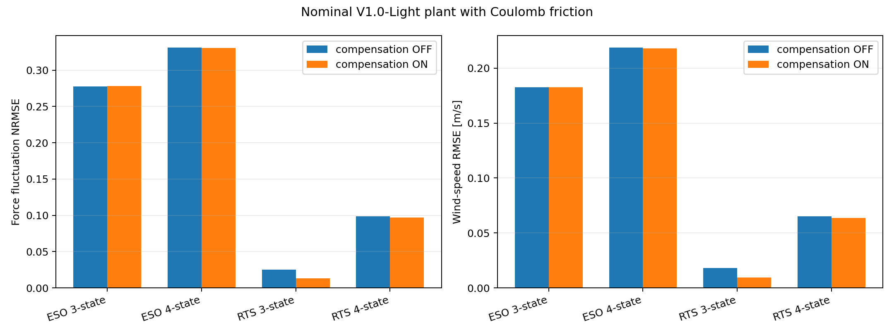
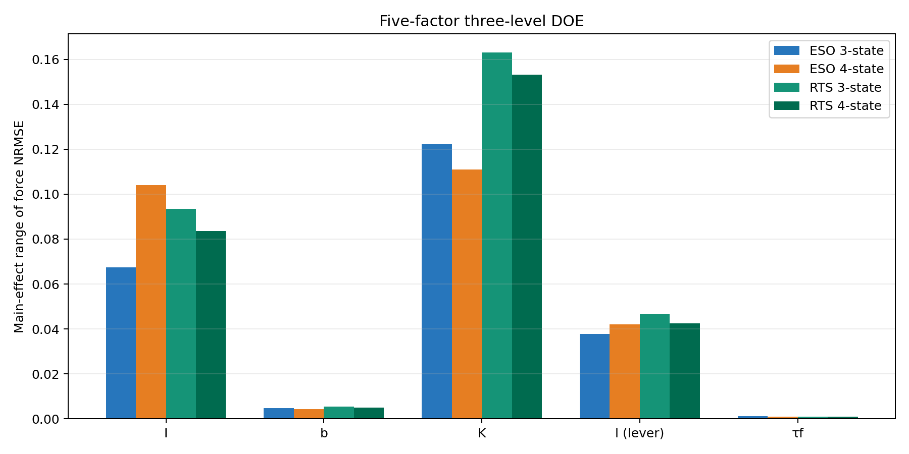
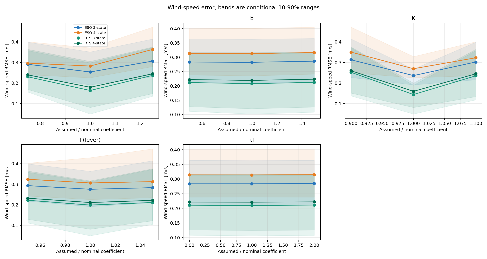

# 摩擦補償を含むオブザーバーの係数感度

## 結論

最終オブザーバーには、**無効化可能かつ軸ごとに設定可能なクーロン摩擦補償を追加する**ことを推奨する。機械摩擦と空力トルクは同じ運動方程式へ加算されるため、摩擦をモデル化しない推定器は両者を原理的に分離できない。

ただし、旧ハードで同定した値を新ハードへ固定流用してはならない。今回の新ハード摩擦は未実測の仮定値であり、実装後にV1.0-Light各軸の自由減衰試験で更新する。

今回仮定した摩擦では、ESO 3/4状態の公称風速RMSE改善は0.02%／0.21%と小さかった。一方、RTS 3状態は47.3%、RTS 4状態は2.20%改善した。RTS 3状態は元の誤差が小さいため、約0.00849 m/sの絶対改善が大きな相対改善率になっている。

5因子DOEでは、全方式で誤差影響の順位は概ね **K、I、l、b、τf** となった。τfを0～200%まで変化させても主効果は最小だった。したがって同定の優先順位は引き続きKとIが最上位であり、摩擦補償を追加することと、τfを最優先で精密同定することは同義ではない。

## 解析条件

既存の [実風スペクトルと4推定器の係数感度](Real_Wind_DOE_Report.md) と同じ条件を使用した。

- Kaimal風：平均3.75 m/s、上限6.0 m/s
- サンプリング：100 Hz
- 評価区間：30～150秒
- 観測：理想角度のみ
- 推定器：ESO 3状態、ESO 4状態、RTS 3状態、RTS 4状態
- チューニング：従来解析で選択した値に固定
- センサノイズ、量子化、遅延：未導入。Stage 3で評価する

プラントは従来の線形振り子モデルへ滑らかなクーロン摩擦を追加した。

```math
I\ddot{\theta}
+b\dot{\theta}
+K\theta
+\tau_f\tanh\left(\frac{\dot{\theta}}{\varepsilon}\right)
=lF_{aero}
```

摩擦項の導出と旧ハード自由減衰へのフィットは、[既存自由振動データによる摩擦項の評価](../friction_study/README.md)に示す。

## 新ハードの摩擦仮定

旧ハードVCモデルの4区間で得た `τf/I` の中央値を、V1.0-Lightでも同じ摩擦減速度になると仮定して用いた。

| 量 | 値 | 説明 |
|---|---:|---|
| 旧ハード中央値 `τf/I` | 0.116662 rad/s² | VCモデル4区間の中央値 |
| V1.0-Light暫定 `I` | 0.000427964 kg m² | 従来解析と同じ剛体近似 |
| 新ハード公称 `τf` | 4.9927×10⁻⁵ N m | `I(τf/I)` |
| 力換算 `τf/l` | 0.2937 mN | `l=0.17 m` |
| 平滑化幅 `ε` | 0.5 deg/s | 自由減衰解析と同じ値 |

これは「旧ハードと同じ摩擦トルク」という仮定ではなく、「旧ハードと同じ摩擦角減速度」という仮定である。新ハードの軸受、荷重、組立精度を実測した結果ではない。

## オブザーバーへの組込み

ESOでは推定角速度から摩擦トルクを計算し、既知の非線形入力として離散予測へ加えた。外乱状態は摩擦を含まない空力トルクを表す。

```math
\hat{\tau}_{fric,k}
=-\hat{\tau}_f\tanh\left(\frac{\hat{\omega}_k}{\varepsilon}\right)
```

RTSでは平均値の予測だけでなく、`tanh` の角速度微分をEKFおよびRTSの遷移ヤコビアンへ含めた。補償なし条件は同じ実装で `τf=0` としている。したがって、実装方法の違いではなく摩擦係数の有無を比較している。

## 公称条件における摩擦補償の効果

真のプラントには公称摩擦を入れ、推定器だけを補償なし／ありで比較した。

| 方式 | 外力NRMSE 補償なし | 外力NRMSE 補償あり | 変化 | 風速RMSE 補償なし [m/s] | 補償あり [m/s] | 変化 |
|---|---:|---:|---:|---:|---:|---:|
| ESO 3-state | 0.277828 | 0.277879 | +0.02% | 0.182726 | 0.182689 | −0.02% |
| ESO 4-state | 0.330903 | 0.330391 | −0.15% | 0.218545 | 0.218077 | −0.21% |
| RTS 3-state | 0.025304 | 0.013057 | **−48.40%** | 0.017941 | 0.009450 | **−47.33%** |
| RTS 4-state | 0.098899 | 0.097069 | −1.85% | 0.065262 | 0.063829 | −2.20% |



ESOでは推定帯域による誤差が摩擦誤差より大きく、補償効果がほぼ隠れている。RTS 3状態では元の動的推定誤差が小さいため、未補償摩擦が主要な残差となり、補償効果が明瞭に現れた。

## 5因子のばらつき感度DOE

プラント、風入力、チューニングは公称値に固定し、推定器が使用する係数だけを変化させた。

| 因子 | 低 | 中央 | 高 | 幅の意味 |
|---|---:|---:|---:|---|
| I | 0.75 | 1.00 | 1.25 | ±25% |
| b | 0.50 | 1.00 | 1.50 | ±50% |
| K | 0.90 | 1.00 | 1.10 | ±10% |
| l | 0.95 | 1.00 | 1.05 | ±5% |
| τf | 0.00 | 1.00 | 2.00 | 0～200% |

全因子計画は `3^5=243` 条件である。τfの範囲は製造公差ではなく、新ハードが未計測であることを反映した探索幅である。

| 方式 | 最小NRMSE | 中央値 | 最大NRMSE | 最大条件 I / b / K / l / τf |
|---|---:|---:|---:|---|
| ESO 3-state | 0.2778 | 0.4188 | 0.6455 | 0.75 / 1.50 / 1.10 / 0.95 / 2.00 |
| ESO 4-state | 0.3304 | 0.4592 | 0.6639 | 1.25 / 1.50 / 1.10 / 0.95 / 2.00 |
| RTS 3-state | 0.0131 | 0.3186 | 0.5826 | 0.75 / 1.50 / 1.10 / 0.95 / 2.00 |
| RTS 4-state | 0.0971 | 0.3330 | 0.5918 | 0.75 / 1.50 / 1.10 / 0.95 / 2.00 |

## 風速RMSEに対する主効果順位

主効果は、各因子の3水準について他の4因子81条件を平均し、その最大値と最小値の差を取った値である。

| 方式 | 1位 | 2位 | 3位 | 4位 | 5位 |
|---|---|---|---|---|---|
| ESO 3-state | K (0.0768) | I (0.0529) | l (0.0179) | b (0.0039) | τf (0.0011) |
| ESO 4-state | K (0.0808) | I (0.0808) | l (0.0180) | b (0.0039) | τf (0.0009) |
| RTS 3-state | K (0.1080) | I (0.0734) | l (0.0234) | b (0.0045) | τf (0.0010) |
| RTS 4-state | K (0.1000) | I (0.0656) | l (0.0209) | b (0.0041) | τf (0.0009) |

単位はすべてm/sである。ESO 4状態のKとIは差が3.3×10⁻⁵ m/sしかなく、実質的に同順位と解釈する。





## 従来DOEとの比較

| 方式 | I 従来→今回 | b 従来→今回 | K 従来→今回 | l 従来→今回 |
|---|---|---|---|---|
| ESO 3-state | 0.0608→0.0529 | 0.0045→0.0039 | 0.0779→0.0768 | 0.0178→0.0179 |
| ESO 4-state | 0.0883→0.0808 | 0.0043→0.0039 | 0.0818→0.0808 | 0.0179→0.0180 |
| RTS 3-state | 0.0836→0.0734 | 0.0057→0.0045 | 0.1086→0.1080 | 0.0237→0.0234 |
| RTS 4-state | 0.0752→0.0656 | 0.0048→0.0041 | 0.1005→0.1000 | 0.0208→0.0209 |

単位はm/sである。順位はほぼ変わらず、従来Iが僅差で1位だったESO 4状態のみ、今回はKが僅差で1位となった。摩擦プラント化と5番目の因子を平均へ加えたことで数値が少し変化しているため、小さな差を「摩擦がI感度を低減した」と因果解釈しない。

## 交互作用

外力NRMSEに対する主要な交互作用はK×l、I×K、I×lの順だった。摩擦を含む交互作用ではb×τfが最大だが、上位3組より十分小さい。

| 方式 | K×l 最大絶対値 | I×K | I×l | b×τf |
|---|---:|---:|---:|---:|
| ESO 3-state | 0.1027 | 0.0394 | 0.0086 | 0.0021 |
| ESO 4-state | 0.0950 | 0.0400 | 0.0098 | 0.0021 |
| RTS 3-state | 0.1354 | 0.0549 | 0.0166 | 0.0036 |
| RTS 4-state | 0.1285 | 0.0510 | 0.0142 | 0.0030 |

作用距離lは単独主効果では3位だが、Kと組み合わさると大きな誤差になる。Kとlを独立な許容差だけで管理せず、組合せでも検証する必要がある。

## 誤差影響の考察

1. **KとIを最優先で同定する。** K誤差は角度比例の復元トルク、I誤差は加速度トルクへ直接現れ、Kaimal風の広帯域応答全体へ影響する。
2. **lを次に管理する。** 推定トルクを力へ換算する除数であり、K×l交互作用が全方式で最大だった。
3. **bは今回も4位だがモデルから除外しない。** 今回の風スペクトル、低減衰、公称チューニングでは影響が小さい。共振近傍、自由減衰、センサノイズを伴う高帯域推定では順位が変わり得る。
4. **τfはモデルに含めるが、今回の中風速条件では同定優先度は5位である。** 公称摩擦の力換算値が0.294 mNと小さいためである。
5. **低風速ではτfの相対影響が増える。** 空力は風速二乗で減少するがクーロン摩擦はほぼ一定なので、このDOEの順位を低風速限界へそのまま一般化できない。

## 推奨実装と新ハード試験

- 摩擦補償を軸別パラメータとして実装し、`τf=0` で無効化できるようにする。
- 速度ゼロ近傍では今回と同じ滑らかな符号関数を使い、チャタリングを避ける。
- 新ハード各軸で、正負の複数初期角から自由減衰を測定し、`K/I`、`b/I`、`τf/I`を同時フィットする。
- 球あり／なし、支持荷重違いで測定し、軸受荷重に対するτfの変化を確認する。
- 追加慣性試験でIを独立同定し、`τf=I(τf/I)`としてN mへ換算する。
- 固着やヒステリシスが観測された場合は、現在の動摩擦tanhモデルと静止摩擦モデルを分けて評価する。

## 再実行

```bash
python 06_Analysis/simulation/src/run_friction_observer_doe.py
python -m unittest discover -s 06_Analysis/simulation/tests -p 'test_friction_*.py'
```

設定は `config/friction_observer_doe.json`、数値結果と図は `results/friction_observer_doe/` に保存する。

摩擦専用4テストに加え、既存を含むシミュレーション全21テストが合格した。検証記録は `results/friction_observer_doe/tests.txt` に示す。
