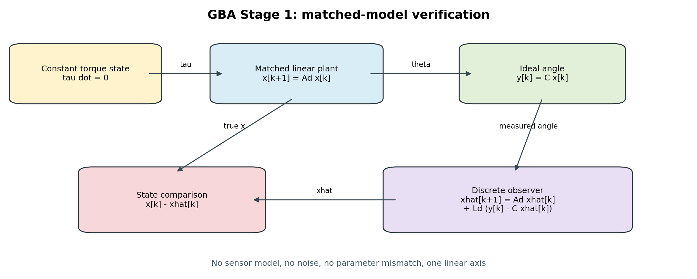

# Stage 1：同一モデルによるオブザーバー検証

## 目的

Stage 1では、1軸線形プラントとオブザーバーに同じモデル・同じ係数を使用し、実装と収束特性を検証します。

この段階では、センサモデル、ノイズ、非線形性、モデル係数誤差、軸間干渉を入れません。これらはStage 2以降で、原因を分離しながら追加します。

## 状態とモデル

状態は次の3成分です。

`x = [角度 θ、角速度 ω、外乱トルク τ]`

運動方程式は次の線形モデルです。

`I θ̈ + b θ̇ + K θ = τ`

外乱トルクの予測モデルは次のとおりです。

`τ̇ = 0`

オブザーバーが観測するのは角度だけです。

`y = θ`

実装では連続モデルから100 Hzの離散モデルを厳密離散化し、次の離散オブザーバーを使用します。

`x̂[k+1] = Ad x̂[k] + Ld (y[k] - C x̂[k])`

## 信号の関係



## Stage 1で分けている二つの試験

### 状態一致試験

プラントとオブザーバーを同じ状態から開始します。誤差がゼロなら、離散化後もゼロのままであることを確認します。これはモデル行列、更新順序、離散化の実装検証です。

### 収束試験

プラントとオブザーバーを異なる状態から開始し、角度観測だけで角度、角速度、外乱トルクの推定値が真値へ収束することを確認します。

外乱モデルが `τ̇ = 0` なので、同一モデルとして厳密に検証できるのは一定外乱です。ステップ外乱は変化した瞬間だけモデル仮定から外れるため、瞬時一致ではなく、ステップ後の再収束を確認します。

## 実行方法

リポジトリのトップディレクトリで実行します。

```bash
python 06_Analysis/simulation/src/run_stage1.py
python -m unittest discover -s 06_Analysis/simulation/tests -v
```

設定は `config/stage1_nominal.json`、生成結果は `results/stage1/` に保存されます。

## Stage 1の合格基準

| 項目 | 基準 |
|---|---:|
| 拡張モデルの可観測性 | ランク3 |
| 同一初期状態での正規化最大誤差 | 1e-10以下 |
| 離散誤差系の特性多項式係数誤差 | 1e-10以下 |
| 異なる初期状態からの最終正規化誤差 | 1%以下 |
| 一定外乱トルクの最終相対誤差 | 1%以下 |

## 成果物

- [Stage 1結果レポート](Stage1_Report.md)
- [機能ブロック線図](results/stage1/stage1_block_diagram.png)
- [初期誤差からの収束](results/stage1/stage1_convergence.png)
- [未知ステップ外乱への応答](results/stage1/stage1_step_response.png)
- `results/stage1/stage1_summary.json`：係数、極、誤差、合否判定

Stage 1の結果は理想条件での内部整合性検証です。実機に対する推定精度を示すものではありません。
