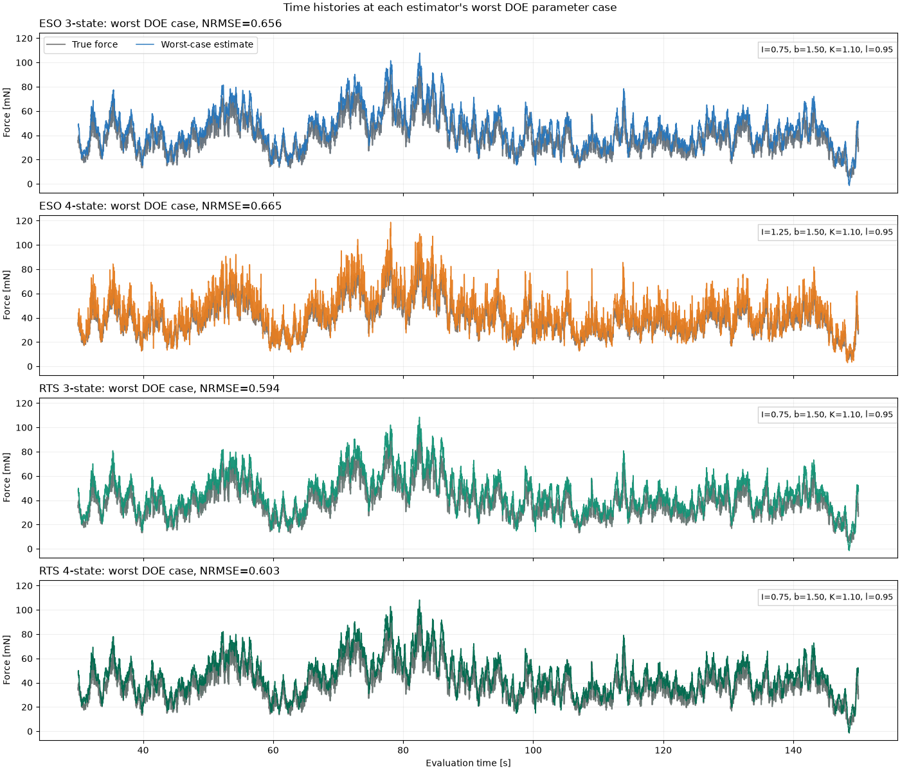
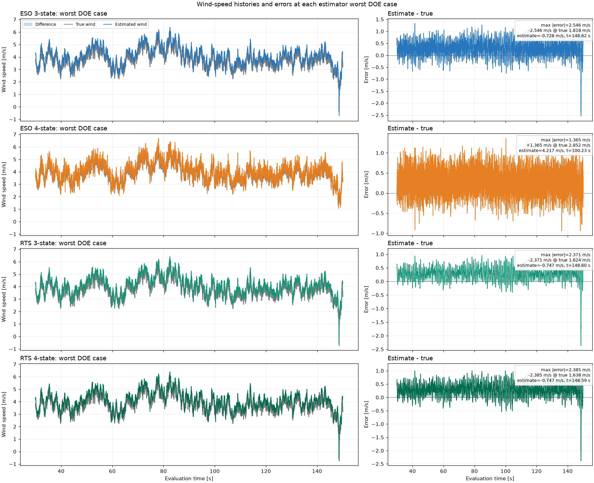
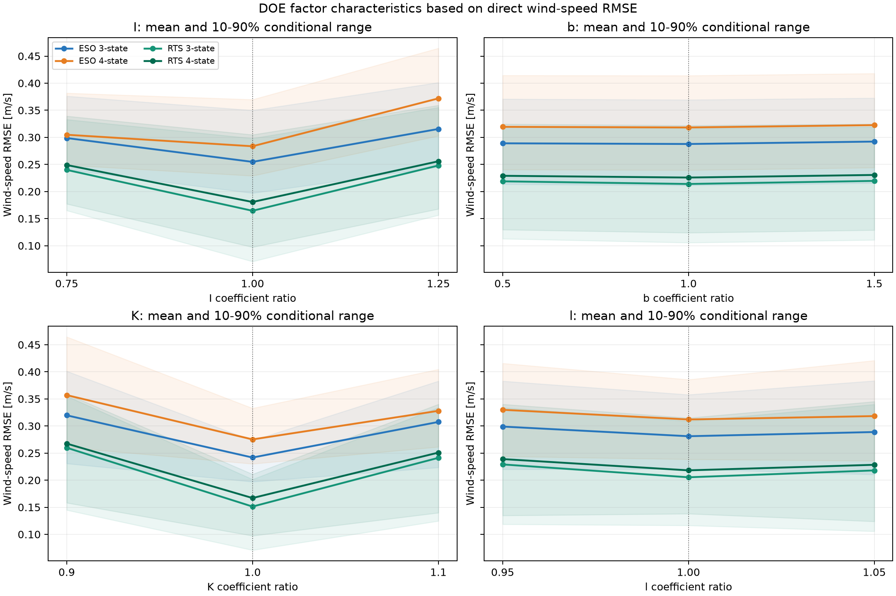

# Stage 2追加評価：実風スペクトルと4推定器の係数感度

## 結論の読み方

この評価は、Kaimalスペクトルに従う風速を準定常抗力へ変換し、角度だけから外力を推定するPoCである。センサノイズ、機械ストッパー、非定常Cdはまだ含めていない。4方式の比較対象は3状態ESO、4状態ESO、3状態RTSスムーザー、4状態RTSスムーザーである。生の静的換算と因果LPFを基準として併記する。

## 実風スペクトル

地表層の実測から整理されたKaimalスペクトルを採用した。NREL資料に記載されたIEC形式の一方向スペクトルを使う。

```math
S_u(f)=\frac{4\sigma_u^2 L_u/U}{\left(1+6fL_u/U\right)^{5/3}}
```

ここで、$`U`$は平均風速、$`\sigma_u`$は風速変動の標準偏差、$`L_u`$は積分長さスケールである。今回は高さ2 mの代表値として$`L_u=8.1\times0.7z=11.34`$ m、平均3.75 m/s、目標乱流強度20%、上限6.0 m/sとした。平均値は、以前の5/8という平均／上限比を保つため3.75 m/sへ変更した。上限を守るため変動全体へ一つの倍率を掛け、スペクトル形状を保った。評価波形で実現した乱流強度は16.57%である。

- [Kaimal et al. (1972), Spectral characteristics of surface-layer turbulence](https://doi.org/10.1002/qj.49709841707)
- [NREL, Sensitivity Analysis of Wind Characteristics and Wind Turbine Properties](https://www.nrel.gov/docs/fy19osti/74876.pdf)


抗力は次の準定常式で真値を作った。Cdは入力生成だけに用い、オブザーバーはCdや風速を知らない。

```math
F(t)=\frac{1}{2}\rho C_d A U(t)\lvert U(t)\rvert
```

## V1.0-Lightの装置パラメータ

入力値は `02_Hardware/V1.0/01_筐体/おもり計算.xlsx` の `Sheet1`、E列 `V1.0-Light` から読み取った。シートの `r=0.1 m` は名称上は半径だが、面積式が $`S=\pi r^2/4`$ なので直径として扱った。元ブック自体は変更していない。

| 量 | 使用値 | 根拠 |
|---|---:|---|
| 球側作用距離 $`l`$ | 0.170000 m | E2の絶対値 |
| 投影面積 $`S`$ | 0.007853982 m² | E10を直径として$`\pi d^2/4`$ |
| 復元係数 $`K`$ | 0.016726993 N m/rad | E列の質量・重心位置から導出 |
| 慣性モーメント $`I`$ | 0.000427964 kg m² | 中実球＋一様棒＋錘の剛体近似 |
| 減衰係数 $`b`$ | 0.000317096 N m s/rad | 旧機の暫定減衰比$`\zeta=0.0593`$を維持 |

導出式は次の通りである。ロッド長はE列の球側・錘側距離の和と仮定した。

```math
K=g(m_w l_w+m_b l_b+m_l l_l)
```

```math
I=m_b|l_b|^2+\frac{2}{5}m_b\left(\frac{d}{2}\right)^2+m_wl_w^2+m_l\left(\frac{(|l_b|+l_w)^2}{12}+l_l^2\right)
```

```math
b=2\zeta\sqrt{IK}
```

このIとbはシートに直接記載された値ではない。Iは部材を剛体近似した暫定値、bは旧機の減衰比を引き継いだ暫定値である。次号機の自由減衰試験またはCAD慣性値が得られたら更新する。

## 6 m/sと45度の範囲確認

6 m/sでの抗力は95.249 mNである。シートと同じ非線形静力学では角度は44.07度となり、約45度という設計意図と一致する。一方、小角度線形モデルでは55.46度となる。45度域では線形近似誤差を無視できない。45度に対応する風速は、非線形式で6.10 m/s、線形式で5.40 m/sである。

係数感度DOEは従来との比較性を保つため、プラントと推定器が同じ線形モデルを使う条件を維持した。別途、$`I\ddot{\theta}+b\dot{\theta}+K\sin\theta=lF\cos\theta`$ の非線形プラントを計算した。評価区間の最大動的角度は線形モデルで56.78度、非線形モデルで47.11度である。非線形モデルでも約45度を2.11度上回ったため、6 m/sを静的に44度へ合わせるだけでは過渡余裕がない。実機仕様ではストッパー余裕、最大運用風速、または減衰の見直しが必要である。


## 4方式と調整

全方式の観測は角度だけであり、角速度は入力しない。ESOは公称学習波形で反復極を探索する。RTSは同じ公称学習波形で外力または外力変化率へ与えるプロセス雑音を探索する。評価波形とDOEでは選択値を固定した。

| 方式 | 状態 | 外力仮定 | 因果性 | 選択値 |
|---|---|---|---|---:|
| ESO 3-state | 角度・角速度・トルク | 区間内で一定 | 因果 | 45 Hz |
| ESO 4-state | 上記＋トルク変化率 | 区間内で一定勾配 | 因果 | 20 Hz |
| RTS 3-state | 角度・角速度・トルク | トルクrandom walk | 非因果 | 30 N/sample |
| RTS 4-state | 上記＋トルク変化率 | 変化率random walk | 非因果 | 10 (N/s)/sample |

探索上限に達した方式がある場合、理想角度・ノイズなしでは高帯域化の罰則が十分に現れていないことを意味する。この選択値を実機の推奨値とは扱わない。センサノイズを有効にしたStage 3で再調整する。

## 公称条件の結果

RMSEは全外力の誤差、NRMSEは外力変動の標準偏差でRMSEを割った値である。平均抗力が大きい条件でも動的誤差を過小評価しにくい後者を主指標にする。

| 方式 | RMSE [mN] | 変動基準NRMSE | Bias [mN] | 95%絶対誤差 [mN] |
|---|---:|---:|---:|---:|
| Raw static | 12.9193 | 0.9651 | -0.0314 | 24.9384 |
| Causal LPF | 10.0105 | 0.7478 | 0.1282 | 19.3994 |
| ESO 3-state | 3.7208 | 0.2780 | 0.0013 | 7.3771 |
| ESO 4-state | 4.4263 | 0.3307 | 0.0006 | 8.8624 |
| RTS 3-state | 0.0230 | 0.0017 | 0.0000 | 0.0439 |
| RTS 4-state | 1.2993 | 0.0971 | 0.0002 | 2.5553 |


## 非線形プラントでの補助確認

非線形プラントに対しては、静的換算だけ$`F=K\tan\theta/l`$を用いた。ESOとRTSは線形モデルのままであり、下表には45度域の構造的モデル差も含まれる。DOEの係数感度とは別の確認である。

| 方式 | RMSE [mN] | 変動基準NRMSE | Bias [mN] | 95%絶対誤差 [mN] |
|---|---:|---:|---:|---:|
| Raw static | 13.2178 | 0.9874 | 0.4799 | 26.2912 |
| Causal LPF | 10.0308 | 0.7493 | 0.6486 | 19.6535 |
| ESO 3-state | 4.8677 | 0.3636 | -2.3470 | 10.0161 |
| ESO 4-state | 5.3064 | 0.3964 | -2.3476 | 10.7723 |
| RTS 3-state | 3.3684 | 0.2516 | -2.3481 | 7.2900 |
| RTS 4-state | 3.5862 | 0.2679 | -2.3479 | 7.6486 |

## 係数誤差DOE

I ±25%、b ±50%、K ±10%、作用距離l ±5%を低・中央・高の3水準とし、3の4乗=81条件を直接計算した。推定側の係数だけを変更し、プラント、風入力、調整値は固定した。各因子の感度値は、その因子の3水準ごとに他因子全条件を平均したNRMSEの最大値と最小値の差である。

| 方式 | 81条件の最小NRMSE | 中央値 | 最大値 | 最大値となるI / b / K / l倍率 |
|---|---:|---:|---:|---|
| ESO 3-state | 0.2780 | 0.4247 | 0.6557 | 0.75 / 1.50 / 1.10 / 0.95 |
| ESO 4-state | 0.3307 | 0.4646 | 0.6650 | 1.25 / 1.50 / 1.10 / 0.95 |
| RTS 3-state | 0.0017 | 0.3194 | 0.5942 | 0.75 / 1.50 / 1.10 / 0.95 |
| RTS 4-state | 0.0971 | 0.3348 | 0.6033 | 0.75 / 1.50 / 1.10 / 0.95 |

## ワースト係数条件の時系列

各推定器について、81条件のうちNRMSEが最大となった係数組合せを個別に再現した。横軸は評価に使った30～150秒であり、黒線が真の外力、色線が推定外力、塗りつぶしが両者の差である。各方式はそれぞれ異なるワースト係数条件なので、単一の共通ハードウェア条件を表す図ではない。

| 方式 | I / b / K / l倍率 | RMSE [mN] | NRMSE | 最大絶対誤差 [mN] |
|---|---|---:|---:|---:|
| ESO 3-state | 0.75 / 1.50 / 1.10 / 0.95 | 8.7768 | 0.6557 | 33.5258 |
| ESO 4-state | 1.25 / 1.50 / 1.10 / 0.95 | 8.9015 | 0.6650 | 36.3410 |
| RTS 3-state | 0.75 / 1.50 / 1.10 / 0.95 | 7.9540 | 0.5942 | 24.2778 |
| RTS 4-state | 0.75 / 1.50 / 1.10 / 0.95 | 8.0753 | 0.6033 | 25.8821 |



### 風速換算した時系列と誤差

3.0 m/sなど一つの基準風速へ固定換算せず、各時刻の推定外力を次式で符号付き風速へ戻し、真の風速時系列と直接比較した。

```math
\hat U_k=\mathrm{sgn}(\hat F_k)\sqrt{\frac{2|\hat F_k|}{\rho C_d A}}
```

左列は真値と推定値であり、真値を半透明、推定値を不透明にして差分を塗りつぶした。右列は推定値－真値だけを独立表示する。風速RMSEはこの風速時系列から直接計算した値であり、外力RMSEを代表風速で換算した値ではない。

| 方式 | 風速RMSE [m/s] | Bias [m/s] | 95%絶対誤差 [m/s] | 最大絶対誤差 [m/s] | 最大時の符号付き誤差 / 真値 / 推定値 / 時刻 |
|---|---:|---:|---:|---:|---|
| ESO 3-state | 0.4130 | +0.2823 | 0.7582 | 2.5461 | -2.546 @ true 1.818; estimate -0.728; t=148.62 s |
| ESO 4-state | 0.3997 | +0.2784 | 0.7417 | 1.3649 | +1.365 @ true 2.852; estimate 4.217; t=100.23 s |
| RTS 3-state | 0.3721 | +0.2820 | 0.6578 | 2.3713 | -2.371 @ true 1.624; estimate -0.747; t=148.60 s |
| RTS 4-state | 0.3781 | +0.2821 | 0.6731 | 2.3847 | -2.385 @ true 1.638; estimate -0.747; t=148.59 s |



## 主効果感度順位

| 方式 | 1位 | 2位 | 3位 | 4位 |
|---|---|---|---|---|
| ESO 3-state | K (0.1219) | I (0.0761) | l (0.0381) | b (0.0053) |
| ESO 4-state | I (0.1118) | K (0.1110) | l (0.0424) | b (0.0049) |
| RTS 3-state | K (0.1619) | I (0.1052) | l (0.0476) | b (0.0068) |
| RTS 4-state | K (0.1516) | I (0.0937) | l (0.0427) | b (0.0056) |


## 風速RMSEの要因特性図

各DOE条件で推定外力を風速へ直接換算し、風速RMSEを応答値としてI、b、K、lの要因特性図を作成した。各点は、その水準における他の3要因27条件の平均である。半透明帯は同じ27条件の10～90%範囲であり、統計的な信頼区間ではなく、他要因と交互作用による条件付きの広がりを表す。

| 方式 | I（低→中→高） | b（低→中→高） | K（低→中→高） | l（低→中→高） |
|---|---|---|---|---|
| ESO 3-state | 0.299 → 0.255 → 0.315 (Δ=0.061) | 0.289 → 0.288 → 0.292 (Δ=0.004) | 0.320 → 0.242 → 0.307 (Δ=0.078) | 0.299 → 0.281 → 0.289 (Δ=0.018) |
| ESO 4-state | 0.305 → 0.284 → 0.372 (Δ=0.088) | 0.319 → 0.318 → 0.323 (Δ=0.004) | 0.357 → 0.275 → 0.328 (Δ=0.082) | 0.330 → 0.312 → 0.318 (Δ=0.018) |
| RTS 3-state | 0.240 → 0.164 → 0.248 (Δ=0.084) | 0.219 → 0.214 → 0.220 (Δ=0.006) | 0.260 → 0.151 → 0.241 (Δ=0.109) | 0.229 → 0.205 → 0.218 (Δ=0.024) |
| RTS 4-state | 0.249 → 0.181 → 0.256 (Δ=0.075) | 0.229 → 0.226 → 0.231 (Δ=0.005) | 0.267 → 0.167 → 0.251 (Δ=0.101) | 0.239 → 0.218 → 0.228 (Δ=0.021) |



数値データは `wind_rmse_factor_characteristics.csv` に保存した。平均線の傾きが主効果、帯の広さが他要因の影響を含む条件依存性を示す。

## 要因特性図の考察

### IとKへの感度が高いという解釈

今回のDOE範囲では、4方式すべてでIとKの主効果が大きく、bは最小、lはその中間である。Kが最大となる方式が3つ、4状態ESOだけはIがわずかに最大である。したがって、現在想定している製作・同定誤差の範囲では、IとKを優先して精度良く同定する方針は妥当である。

| 方式 | Iの主効果 [m/s] | bの主効果 [m/s] | Kの主効果 [m/s] | lの主効果 [m/s] |
|---|---:|---:|---:|---:|
| ESO 3-state | 0.061 | 0.004 | 0.078 | 0.018 |
| ESO 4-state | 0.088 | 0.004 | 0.082 | 0.018 |
| RTS 3-state | 0.084 | 0.006 | 0.109 | 0.024 |
| RTS 4-state | 0.075 | 0.005 | 0.101 | 0.021 |

ただし、この順位は係数1%当たりの微分感度ではない。因子幅がI ±25%、b ±50%、K ±10%、l ±5%と異なり、想定誤差幅を含めた実用上の影響度である。また、bの影響が小さいのは今回のKaimal波形、評価帯域、低減衰の公称値および固定チューニングに対する結果である。共振付近の狭帯域入力、自由減衰、センサノイズを含む高帯域推定ではbの影響が増える可能性があり、bを物理モデルから除外できるという意味ではない。lもI、Kほどではないがゼロではない。

IとKの曲線が中央で低く両端で高いU字形なのは、公称値から正負どちらへ外れても誤差が増えるためである。平均線だけでなく10～90%帯が広いことから、IとKの組合せや他因子との交互作用も残っている。したがって単独因子だけで許容差を決めず、同定後にI、Kの局所DOEを行う。

### 自由減衰だけではIとKを分離できない

小角度の1軸モデルは次式で表す。

```math
I\ddot{\theta}+b\dot{\theta}+K\theta=\tau
```

自由減衰から直接得られるのは、固有角周波数と減衰比である。

```math
\omega_n=\sqrt{\frac{K}{I}},\qquad
\zeta=\frac{b}{2\sqrt{IK}}
```

したがって自由減衰単独ではK/Iとb/Iは同定できるが、IとKを別々には決められない。IまたはKの一方を既知にする試験、既知トルクを加える試験、または既知の追加慣性を加える試験が必要である。

### 参考試験：既知張力によるKの静的同定（任意）

既知張力による静的試験は独立検証として有効だが、試験装置が大掛かりになるため必須とはしない。実施する場合、球重心を既知の水平張力Fで引き、球重心までの作用距離をlとすると、非線形の静的釣合いは次式になる。

```math
K\sin\theta=lF\cos\theta
```

```math
K=\frac{lF}{\tan\theta}
```

小角度式K=lF/θを各点へ直接適用するより、±10～30度程度の複数角度、正負両方向、荷重の増加・減少を測り、上の非線形式へ一括フィットする。これによりゼロ点、ヒステリシス、軸摩擦を検出できる。張力は校正済みロードセル、または低摩擦滑車と分銅で作り、張力方向の水平度、作用点距離、糸と球の接触位置を記録する。

独立誤差を仮定した1点の概算では、Kの相対標準不確かさは次式である。角度不確かさuθはradで代入する。

```math
\left(\frac{u_K}{K}\right)^2
=\left(\frac{u_l}{l}\right)^2
+\left(\frac{u_F}{F}\right)^2
+\left(\frac{2u_\theta}{\sin(2\theta)}\right)^2
```

例としてθ=20度、角度0.1度、l 0.5%、F 0.2%とすると、理想的な合成標準不確かさは約0.8%である。治具の芯ずれ、摩擦、ADC校正、繰返し差を含む実機では1～2%を現実的な見込みとし、初回試験の受入れ基準を3%以内、改良後の目標を2%以内とする。この値は未実施試験の工学的見積りであり、実績値ではない。

### 推奨試験：球体脱着とナット複数水準による動的同定

#### 結論

静的K試験を行わず、(1)球あり、(2)球なし、(3)球なしでロッド上端へ既知ナットを追加、の自由減衰だけから製品状態のI、K、bを同定できる。球なしと付加質量1水準だけでも代数的には解けるが、誤差の自由度がなくモデル不一致を検出できない。ナット個数を変えた4～6水準と球なしを合わせて過剰決定系にし、重み付き非線形最小二乗で求めることを推奨する。

#### 幾何の定義

ロッドが球を貫通し、Lrodを支点から球の上端側ロッド端点までの距離、rを球半径と定義すると、球中心までの距離Lsは次式である。

```math
L_s=L_{rod}-r
```

現在の値ではLrod=0.220 m、r=0.050 m、Ls=0.170 mである。以後、すべての作用点は取付面ではなく支点から部品重心までの距離で定義する。

#### 自由減衰から各条件の周波数を求める

条件jごとに、減衰固有角周波数ωd,jと包絡線の減衰率αjを波形全体へフィットし、減衰補正した量qjを求める。

```math
q_j=\omega_{n,j}^2=\omega_{d,j}^2+\alpha_j^2
```

この補正は各条件で独立に行う。球を外すと空力減衰が変わり、ナット数によって軸受荷重が変わる可能性があるため、全条件で同じbを仮定しない。空力減衰が速度二乗型で単純な指数包絡線に合わない場合は、小振幅側の周期を使うか、線形項と二乗項を持つ非線形自由減衰モデルで再フィットする。

#### ナットが支点側へ移動する補正

n個のナットについて、i番目の質量をmi、支点からその重心までの距離をxi、重心を通り振動軸と平行な軸まわりの慣性をJiとする。ナット群が追加する慣性と復元係数は次式である。

```math
\Delta I_n=\sum_{i=1}^{n}\left(m_i x_i^2+J_i\right)
```

```math
\Delta K_n=-g\sum_{i=1}^{n}m_i x_i
```

ナットは支点より上にあるためΔKnは負である。密度の高い金属ナットの浮力は通常無視できるが、必要ならmiをmi−ρairViへ置換する。

合計質量Mnと合成重心Lnを使う場合は次式となる。

```math
M_n=\sum_i m_i,\qquad
L_n=\frac{\sum_i m_i x_i}{M_n}
```

```math
\Delta K_n=-M_ngL_n
```

```math
\Delta I_n=M_nL_n^2+J_{n,c}
```

ここでJn,cはナット群の合成重心まわり慣性である。ナット個数が増えてLnが支点側へ移動しても、各水準のLnまたは各xiを用いれば正しく補正できる。個数nだけを説明変数にしてはならない。

同一厚さtのナットが、ロッド端点からオフセットd0を空けて支点側へ隙間なく並ぶ理想配置なら、各重心位置と合成重心は次式で書ける。

```math
x_i=L_{rod}-d_0-\left(i-\frac{1}{2}\right)t
```

```math
L_n=L_{rod}-d_0-\frac{nt}{2}
```

実物の面取り、座金、ナット間隙がある場合はこの簡略式を使わず、各xiの実測値または治具CAD値から総和を計算する。各ナットを個別に計量するか、少なくとも各水準のナット群をまとめて計量する。

#### 球なし系のI0とK0を同定する

球なし・ナットなしの系をI0、K0とする。ナットn個の条件では、予測されるqは次式になる。

```math
\widehat q_n(I_0,K_0)
=\frac{K_0+\Delta K_n}{I_0+\Delta I_n}
```

ナットなしをn=0として含め、全水準を次の重み付き非線形最小二乗で同時にフィットする。

```math
(\widehat I_0,\widehat K_0)
=\underset{I_0,K_0}{\arg\min}
\sum_n w_n
\left[q_n-\frac{K_0+\Delta K_n}{I_0+\Delta I_n}\right]^2
```

```math
w_n=\frac{1}{u_{q,n}^2}
```

uq,nは繰返し試験から求めたqの標準不確かさである。制約としてI0>0および全水準でK0+ΔKn>0を課す。周波数誤差が十分小さい場合は、次の線形式を重み付き最小二乗で解いて初期値にできる。

```math
q_n I_0-K_0=\Delta K_n-q_n\Delta I_n
```

qが式の両辺に含まれるため、最終値は上記の非線形残差で求める。質量、位置、周波数のすべてに無視できない誤差がある場合は、モンテカルロ法または直交距離回帰で不確かさを評価する。

#### 球あり製品状態のI、K、b

球の質量ms、半径r、体積Vs、中心距離Lsを用いる。球の浮力を含む復元係数寄与は次式である。

```math
V_s=\frac{4}{3}\pi r^3
```

```math
\Delta K_s=-\left(m_s-\rho_{air}V_s\right)gL_s
```

したがって製品状態の復元係数と、球あり自由減衰qsから得る実効慣性は次式になる。

```math
K_{product}=\widehat K_0+\Delta K_s
```

```math
I_{product,eff}=\frac{K_{product}}{q_s}
```

Iproduct,effには球の固体慣性だけでなく、球が周囲の空気を加速する付加慣性も自動的に含まれる。オブザーバーには空気中で測定したこの実効値を用いる。理論付加質量係数を仮定する必要はない。

線形減衰近似で製品状態の減衰係数を使う場合は次式で求める。

```math
b_{product}=2\alpha_s I_{product,eff}
```

参考として、球による空気の付加慣性は次式で実測できる。

```math
I_{air}=I_{product,eff}-\widehat I_0
-\left[m_sL_s^2+\frac{2}{5}m_sr^2\right]
```

#### ナット水準の選び方

推奨はナットなしに加えて4～6水準である。単に1個ずつ全水準を使うのではなく、予測周波数が十分に離れる個数を選ぶ。設計条件は次の二つである。

1. 最大ナット数でもK0+ΔKnを正に保ち、初期計画ではK0の50%以上の復元余裕を残す。
2. 隣接水準の周波数差を、同一条件の繰返し標準偏差の少なくとも10倍にする。

現在の暫定モデルでは、球なし固有振動数は約1.425 Hz、ロッド端点は支点から0.220 mである。点質量近似で静的不安定になる合計質量は約11.1 gであり、50%の復元余裕を残す上限は約5.5 gである。合計5.0 gを端点へ付けた場合の予測固有振動数は約0.785 Hzで、球なしとの差は十分大きい。

実際の1個当たり質量と積層寸法を測定した後、例えば合計質量がおよそ1、2、3.5、5 gに近くなる個数を選ぶ。ナット重心が支点側へ移るため、最終的な採用個数は質量だけでなくΔIn、ΔKnおよび予測周波数から決める。

#### 試験手順

1. 球、各ナット、座金、固定部品を計量し、脱着される部品範囲を明確にする。
2. Lrod、r、各ナット条件のxiまたはLnを測定する。付加質量の取付面ではなく重心位置を記録する。
3. 球あり、球なし、ナット4～6水準をそれぞれ独立した脱着3回以上で測定する。
4. 各取付けについて正負方向、初期角3～5度、20周期以上を100 Hzで記録する。
5. 各波形からωd、α、qとフィット残差を求める。
6. 全ナット水準を非線形最小二乗へ入力し、I0、K0と共分散またはモンテカルロ信頼区間を求める。
7. 球あり条件からKproduct、Iproduct,eff、bproductを求める。
8. 個数に対する周波数残差、初期角依存性、正負方向差、脱着再現性を確認する。

#### 妥当性判定

| 確認項目 | PoCの目安 | 意味 |
|---|---:|---|
| 同一条件の固有振動数再現性 | 0.1%以下 | 周期抽出と取付けの安定性 |
| 非線形フィットの周波数残差 | 各点3σ以内 | I0、K0の2係数モデルとの整合 |
| Leave-one-level-outによるI0、K0変化 | 1%以下 | 特定ナット水準への依存がないこと |
| 正負初期角でのI、K差 | 1%以下 | 摩擦、ゼロ点、軸非対称の確認 |
| 3～5度での周波数変化 | 0.2%以下 | 振幅非線形性の確認 |
| Iproduct、Kproductの合成標準不確かさ | 目標2%以下 | オブザーバー感度DOEへの入力条件 |

残差がナット個数とともに単調に増える場合、重心位置補正の誤り、ロッド曲げ、ナットの緩み、軸受荷重による摩擦変化が疑われる。特定水準だけ外れる場合は、その取付け状態または質量・位置記録を再確認する。

#### 期待精度

周波数0.1%、ナット質量・重心位置0.1%、球質量・中心位置0.1%、半径0.2%、空気密度1%を仮定すると、現行モデルと5 g付近までの水準配置では理想的な誤差伝播はI、Kとも概ね0.4%程度である。実機では取付け再現性、摩擦、振幅依存性を含めて0.5～1.5%を現実的な見込みとし、PoCの目標を2%以内とする。これは未実施試験に対する工学的見積りであり、実測後にモンテカルロ不確かさへ置き換える。

### 推奨する同定順序と次の感度解析

1. ナットの個体質量と水準ごとの重心位置を測定し、ΔIn、ΔKnを計算する。
2. 球なし＋ナット4～6水準の自由減衰からI0、K0を同時同定する。
3. 球あり自由減衰から、製品状態のK、空気付加慣性を含むI、bを求める。
4. ナット水準の残差、正負方向差、振幅依存性、脱着再現性でモデルを検証する。
5. 得られたI、Kの不確かさを使い、±1%、±2%、±5%の局所DOEを追加する。bとlはStage 3のセンサノイズ条件と共振近傍試験で再評価する。

周期計測と波形フィットの考え方は、物理振り子の周期から慣性を評価した実験例、および動的データから減衰比を抽出する複数手法の比較を参考にした。

- [Experimental analysis of a physical pendulum with variable suspension point](https://arxiv.org/abs/1910.00072)
- [NASA: Extracting Damping Ratio From Dynamic Data and Numerical Solutions](https://ntrs.nasa.gov/citations/20170005173)
- [NASA: Moment of inertia measurement using a five-wire suspension system](https://ntrs.nasa.gov/citations/20120016864)

交互作用は、2因子の各3×3セル平均から加法的な主効果を引いた残差で評価した。値はdoe_interactions.csvに保存した。二次応答曲面は独立Latin Hypercube点で確認し、10%最大相対誤差ゲートを満たした場合だけ補間用に使える。直接計算した81条件の感度順位は、このゲートに依存しない。

| 方式 | 学習log(RMSE) R2 | 確認中央値誤差 | 確認最大誤差 | 10%ゲート |
|---|---:|---:|---:|---|
| ESO 3-state | 0.9716 | 4.13% | 9.98% | PASS |
| ESO 4-state | 0.9728 | 3.59% | 10.29% | NOT_MET |
| RTS 3-state | 0.5172 | 29.16% | 255.09% | NOT_MET |
| RTS 4-state | 0.8830 | 13.04% | 67.75% | NOT_MET |

強い交互作用の上位4件は次の通りである。

| 方式 | 交互作用 | RMS | 最大絶対値 |
|---|---|---:|---:|
| RTS 3-state | K:l | 0.08531 | 0.13321 |
| RTS 4-state | K:l | 0.08157 | 0.12632 |
| ESO 3-state | K:l | 0.06628 | 0.10142 |
| ESO 4-state | K:l | 0.06147 | 0.09394 |

## 再現方法

```bash
python 06_Analysis/simulation/src/run_real_wind_doe.py
python -m unittest discover -s 06_Analysis/simulation/tests -v
```

設定はsimulation/config/real_wind_doe.json、数値結果はsimulation/results/real_wind_doeに保存する。Iとbの暫定導出式、E列の転記値、平均・最大風速も設定ファイルに保存した。Stage 3では独立したセンサモデルを追加し、同じ4方式を再調整して比較する。
