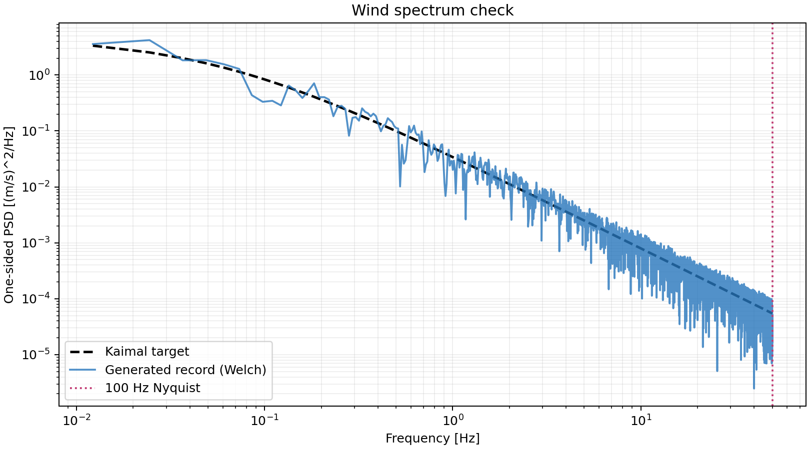
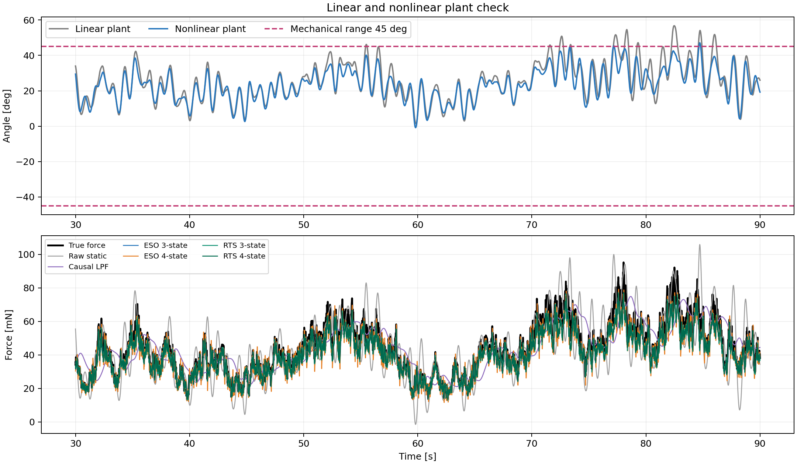
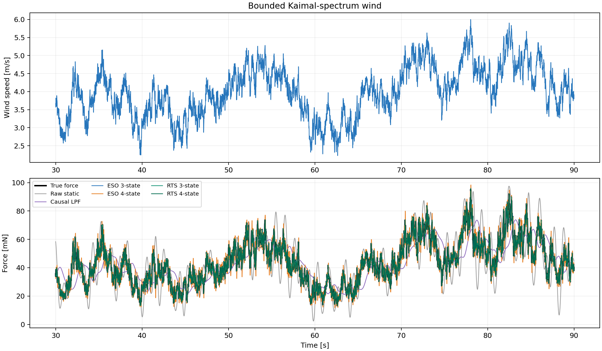
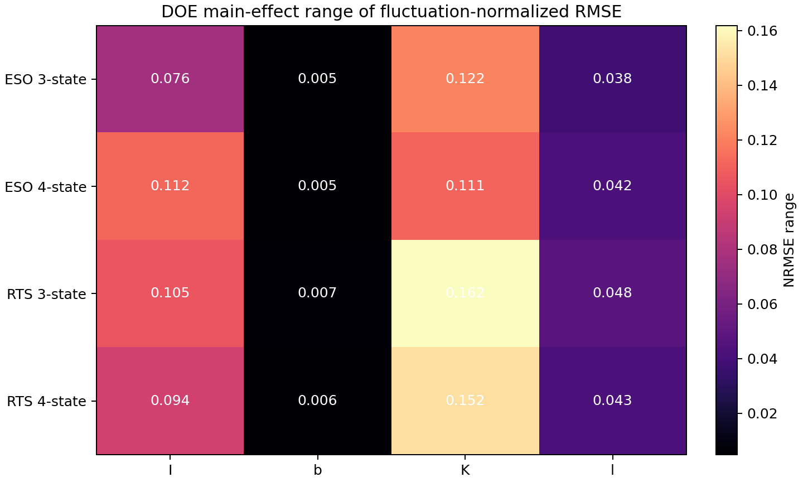

# Stage 2追加評価：実風スペクトルと4推定器の係数感度

## 結論の読み方

この評価は、Kaimalスペクトルに従う風速を準定常抗力へ変換し、角度だけから外力を推定するPoCである。センサノイズ、機械ストッパー、非定常Cdはまだ含めていない。4方式の比較対象は3状態ESO、4状態ESO、3状態RTSスムーザー、4状態RTSスムーザーである。生の静的換算と因果LPFを基準として併記する。

## 実風スペクトル

地表層の実測から整理されたKaimalスペクトルを採用した。NREL資料に記載されたIEC形式の一方向スペクトルを使う。

```math
S_u(f)=\frac{4\sigma_u^2 L_u/U}{\left(1+6fL_u/U\right)^{5/3}}
```

ここで、$`U`$は平均風速、$`\sigma_u`$は風速変動の標準偏差、$`L_u`$は積分長さスケールである。今回は高さ2 mの代表値として$`L_u=8.1\times0.7z=11.34`$ m、平均3.75 m/s、目標乱流強度20%、上限6.0 m/sとした。平均値は、以前の5/8という平均／上限比を保つため3.75 m/sへ変更した。上限を守るため変動全体へ一つの倍率を掛け、スペクトル形状を保った。評価波形で実現した乱流強度は16.57%である。

- [Kaimal et al. (1972), Spectral characteristics of surface-layer turbulence](https://doi.org/10.1002/qj.49709841707)
- [NREL, Sensitivity Analysis of Wind Characteristics and Wind Turbine Properties](https://www.nrel.gov/docs/fy19osti/74876.pdf)



抗力は次の準定常式で真値を作った。Cdは入力生成だけに用い、オブザーバーはCdや風速を知らない。

```math
F(t)=\frac{1}{2}\rho C_d A U(t)\lvert U(t)\rvert
```

## V1.0-Lightの装置パラメータ

入力値は `02_Hardware/V1.0/01_筐体/おもり計算.xlsx` の `Sheet1`、E列 `V1.0-Light` から読み取った。シートの `r=0.1 m` は名称上は半径だが、面積式が $`S=\pi r^2/4`$ なので直径として扱った。元ブック自体は変更していない。

| 量 | 使用値 | 根拠 |
|---|---:|---|
| 球側作用距離 $`l`$ | 0.170000 m | E2の絶対値 |
| 投影面積 $`S`$ | 0.007853982 m² | E10を直径として$`\pi d^2/4`$ |
| 復元係数 $`K`$ | 0.016726993 N m/rad | E列の質量・重心位置から導出 |
| 慣性モーメント $`I`$ | 0.000427964 kg m² | 中実球＋一様棒＋錘の剛体近似 |
| 減衰係数 $`b`$ | 0.000317096 N m s/rad | 旧機の暫定減衰比$`\zeta=0.0593`$を維持 |

導出式は次の通りである。ロッド長はE列の球側・錘側距離の和と仮定した。

```math
K=g(m_w l_w+m_b l_b+m_l l_l)
```

```math
I=m_b|l_b|^2+\frac{2}{5}m_b\left(\frac{d}{2}\right)^2+m_wl_w^2+m_l\left(\frac{(|l_b|+l_w)^2}{12}+l_l^2\right)
```

```math
b=2\zeta\sqrt{IK}
```

このIとbはシートに直接記載された値ではない。Iは部材を剛体近似した暫定値、bは旧機の減衰比を引き継いだ暫定値である。次号機の自由減衰試験またはCAD慣性値が得られたら更新する。

## 6 m/sと45度の範囲確認

6 m/sでの抗力は95.249 mNである。シートと同じ非線形静力学では角度は44.07度となり、約45度という設計意図と一致する。一方、小角度線形モデルでは55.46度となる。45度域では線形近似誤差を無視できない。45度に対応する風速は、非線形式で6.10 m/s、線形式で5.40 m/sである。

係数感度DOEは従来との比較性を保つため、プラントと推定器が同じ線形モデルを使う条件を維持した。別途、$`I\ddot{\theta}+b\dot{\theta}+K\sin\theta=lF\cos\theta`$ の非線形プラントを計算した。評価区間の最大動的角度は線形モデルで56.78度、非線形モデルで47.11度である。非線形モデルでも約45度を2.11度上回ったため、6 m/sを静的に44度へ合わせるだけでは過渡余裕がない。実機仕様ではストッパー余裕、最大運用風速、または減衰の見直しが必要である。



## 4方式と調整

全方式の観測は角度だけであり、角速度は入力しない。ESOは公称学習波形で反復極を探索する。RTSは同じ公称学習波形で外力または外力変化率へ与えるプロセス雑音を探索する。評価波形とDOEでは選択値を固定した。

| 方式 | 状態 | 外力仮定 | 因果性 | 選択値 |
|---|---|---|---|---:|
| ESO 3-state | 角度・角速度・トルク | 区間内で一定 | 因果 | 45 Hz |
| ESO 4-state | 上記＋トルク変化率 | 区間内で一定勾配 | 因果 | 20 Hz |
| RTS 3-state | 角度・角速度・トルク | トルクrandom walk | 非因果 | 30 N/sample |
| RTS 4-state | 上記＋トルク変化率 | 変化率random walk | 非因果 | 10 (N/s)/sample |

探索上限に達した方式がある場合、理想角度・ノイズなしでは高帯域化の罰則が十分に現れていないことを意味する。この選択値を実機の推奨値とは扱わない。センサノイズを有効にしたStage 3で再調整する。

## 公称条件の結果

RMSEは全外力の誤差、NRMSEは外力変動の標準偏差でRMSEを割った値である。平均抗力が大きい条件でも動的誤差を過小評価しにくい後者を主指標にする。

| 方式 | RMSE [mN] | 変動基準NRMSE | Bias [mN] | 95%絶対誤差 [mN] |
|---|---:|---:|---:|---:|
| Raw static | 12.9193 | 0.9651 | -0.0314 | 24.9384 |
| Causal LPF | 10.0105 | 0.7478 | 0.1282 | 19.3994 |
| ESO 3-state | 3.7208 | 0.2780 | 0.0013 | 7.3771 |
| ESO 4-state | 4.4263 | 0.3307 | 0.0006 | 8.8624 |
| RTS 3-state | 0.0230 | 0.0017 | 0.0000 | 0.0439 |
| RTS 4-state | 1.2993 | 0.0971 | 0.0002 | 2.5553 |



## 非線形プラントでの補助確認

非線形プラントに対しては、静的換算だけ$`F=K\tan\theta/l`$を用いた。ESOとRTSは線形モデルのままであり、下表には45度域の構造的モデル差も含まれる。DOEの係数感度とは別の確認である。

| 方式 | RMSE [mN] | 変動基準NRMSE | Bias [mN] | 95%絶対誤差 [mN] |
|---|---:|---:|---:|---:|
| Raw static | 13.2178 | 0.9874 | 0.4799 | 26.2912 |
| Causal LPF | 10.0308 | 0.7493 | 0.6486 | 19.6535 |
| ESO 3-state | 4.8677 | 0.3636 | -2.3470 | 10.0161 |
| ESO 4-state | 5.3064 | 0.3964 | -2.3476 | 10.7723 |
| RTS 3-state | 3.3684 | 0.2516 | -2.3481 | 7.2900 |
| RTS 4-state | 3.5862 | 0.2679 | -2.3479 | 7.6486 |

## 係数誤差DOE

I ±25%、b ±50%、K ±10%、作用距離l ±5%を低・中央・高の3水準とし、3の4乗=81条件を直接計算した。推定側の係数だけを変更し、プラント、風入力、調整値は固定した。各因子の感度値は、その因子の3水準ごとに他因子全条件を平均したNRMSEの最大値と最小値の差である。

| 方式 | 81条件の最小NRMSE | 中央値 | 最大値 | 最大値となるI / b / K / l倍率 |
|---|---:|---:|---:|---|
| ESO 3-state | 0.2780 | 0.4247 | 0.6557 | 0.75 / 1.50 / 1.10 / 0.95 |
| ESO 4-state | 0.3307 | 0.4646 | 0.6650 | 1.25 / 1.50 / 1.10 / 0.95 |
| RTS 3-state | 0.0017 | 0.3194 | 0.5942 | 0.75 / 1.50 / 1.10 / 0.95 |
| RTS 4-state | 0.0971 | 0.3348 | 0.6033 | 0.75 / 1.50 / 1.10 / 0.95 |

| 方式 | 1位 | 2位 | 3位 | 4位 |
|---|---|---|---|---|
| ESO 3-state | K (0.1219) | I (0.0761) | l (0.0381) | b (0.0053) |
| ESO 4-state | I (0.1118) | K (0.1110) | l (0.0424) | b (0.0049) |
| RTS 3-state | K (0.1619) | I (0.1052) | l (0.0476) | b (0.0068) |
| RTS 4-state | K (0.1516) | I (0.0937) | l (0.0427) | b (0.0056) |



交互作用は、2因子の各3×3セル平均から加法的な主効果を引いた残差で評価した。値はdoe_interactions.csvに保存した。二次応答曲面は独立Latin Hypercube点で確認し、10%最大相対誤差ゲートを満たした場合だけ補間用に使える。直接計算した81条件の感度順位は、このゲートに依存しない。

| 方式 | 学習log(RMSE) R2 | 確認中央値誤差 | 確認最大誤差 | 10%ゲート |
|---|---:|---:|---:|---|
| ESO 3-state | 0.9716 | 4.13% | 9.98% | PASS |
| ESO 4-state | 0.9728 | 3.59% | 10.29% | NOT_MET |
| RTS 3-state | 0.5172 | 29.16% | 255.09% | NOT_MET |
| RTS 4-state | 0.8830 | 13.04% | 67.75% | NOT_MET |

強い交互作用の上位4件は次の通りである。

| 方式 | 交互作用 | RMS | 最大絶対値 |
|---|---|---:|---:|
| RTS 3-state | K:l | 0.08531 | 0.13321 |
| RTS 4-state | K:l | 0.08157 | 0.12632 |
| ESO 3-state | K:l | 0.06628 | 0.10142 |
| ESO 4-state | K:l | 0.06147 | 0.09394 |

## 再現方法

```bash
python 06_Analysis/simulation/src/run_real_wind_doe.py
python -m unittest discover -s 06_Analysis/simulation/tests -v
```

設定はsimulation/config/real_wind_doe.json、数値結果はsimulation/results/real_wind_doeに保存する。Iとbの暫定導出式、E列の転記値、平均・最大風速も設定ファイルに保存した。Stage 3では独立したセンサモデルを追加し、同じ4方式を再調整して比較する。
