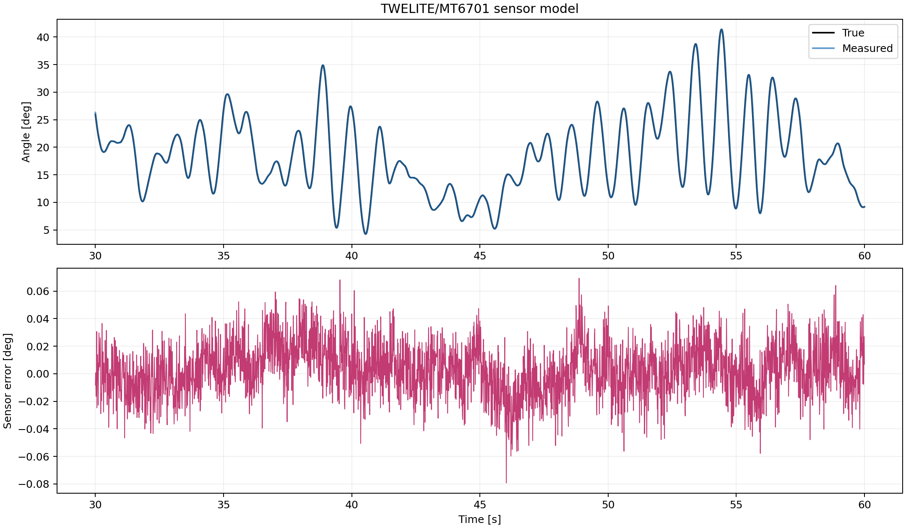
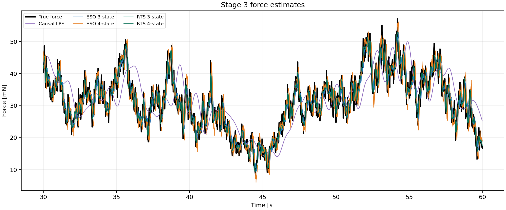
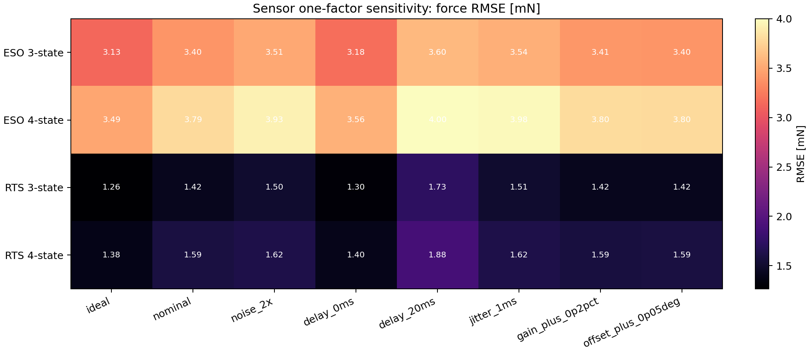

# Stage 3：TWELITE BLUEセンサーモデルを含む推定器比較

## 結論

TWELITE BLUE上の実装、MT6701の14 bit角度出力、既存ログの100 Hz時刻列から、
量子化・白色ノイズ・有色ノイズ・遅延・ジッタ・ゲイン・オフセットを独立に切替可能な
センサーモデルを追加した。調整用風波形と評価用風波形は異なるseedを使用した。
センサー評価とストッパー評価を分離するため最大風速を5.0 m/sとし、最大角度は43.22°だった。

## 公称センサー係数

| 項目 | 値 | 根拠 |
|---|---:|---|
| サンプル周波数 | 100 Hz | ファームウェアと既存ログ |
| 分解能 | 14 bit | MT6701および実装 |
| 量子化幅 | 0.02197266 deg | 360° / 2^14 |
| 白色ノイズσ | 0.015 deg | 既存PoC 0.02°を暫定分解 |
| 有色ノイズσ | 0.010 deg | BMI160補正を暫定表現 |
| 有色ノイズ時定数 | 0.475 s | 20 Hz、LPF係数0.1 |
| 固定遅延 | 10.0 ms | 1サンプル暫定値 |
| ジッタσ | 0.0 ms | ログでは10 ms一定 |

ノイズと遅延は新ハード静止ログで更新すべき暫定値である。分解能と100 Hz周期は実装から確定している。

## 再調整値

| 推定器 | 調整値 |
|---|---:|
| ESO 3-state pole | 8 Hz |
| ESO 4-state pole | 5 Hz |
| RTS 3-state process noise | 0.001 N/sample |
| RTS 4-state process noise | 0.03 (N/s)/sample |
| Causal LPF cutoff | 0.75 Hz |

## 未使用風波形での評価

| 推定器 | 外力RMSE [mN] | 風速RMSE [m/s] | 最良ラグ [s] |
|---|---:|---:|---:|
| Raw static | 8.8302 | 0.5928 | 0.210 |
| Causal LPF | 6.6932 | 0.3968 | 0.660 |
| ESO 3-state | 3.3990 | 0.1993 | 0.070 |
| ESO 4-state | 3.7909 | 0.2225 | 0.070 |
| RTS 3-state | 1.4228 | 0.0836 | 0.010 |
| RTS 4-state | 1.5858 | 0.0930 | 0.010 |

## 無外力時の偽外力

| 推定器 | RMS [mN] | 95%絶対値 [mN] | 最大絶対値 [mN] |
|---|---:|---:|---:|
| ESO 3-state | 0.5134 | 0.9881 | 2.1433 |
| ESO 4-state | 0.6122 | 1.1891 | 2.3092 |
| RTS 3-state | 0.2767 | 0.5368 | 1.1019 |
| RTS 4-state | 0.2058 | 0.3937 | 1.3214 |

## 考察

公称センサー条件では **RTS 3-state** が最小で、外力RMSEは1.423 mNだった。
理想センサーで選んだ高帯域設定を流用せず、センサー条件下で再調整する必要がある。
一因子感度では推定器の調整値とKalman測定雑音を公称値に固定した。詳細は `sensitivity_metrics.csv` に保存した。

| 推定器 | 最悪ケース | 公称比RMSE増加 |
|---|---|---:|
| ESO 3-state | delay_20ms | 5.9% |
| ESO 4-state | delay_20ms | 5.6% |
| RTS 3-state | delay_20ms | 21.3% |
| RTS 4-state | delay_20ms | 18.8% |

## 図







## 係数根拠資料

- [TWELITE BLUE/RED公式データシート](https://twelite.net/data-sheets/twelite/blue-red/latest.html)
- [MagnTek公式サイト：MT6701の14 bit絶対角度出力](https://www.magntek.com.cn/)
- [`mt6701.cpp`](https://github.com/Pakfat50/GBA/blob/feature/friction-observer-sensitivity/03_Software/GbaSoftware/src/mt6701.cpp)：14 bit値の角度変換
- [`normal_mode_task.h`](https://github.com/Pakfat50/GBA/blob/feature/friction-observer-sensitivity/03_Software/GbaSoftware/src/normal_mode_task.h)：100 Hz周期
- [`normal_mode_task.cpp`](https://github.com/Pakfat50/GBA/blob/feature/friction-observer-sensitivity/03_Software/GbaSoftware/src/normal_mode_task.cpp)：MT6701読出しとBMI160補正
- [`utility.cpp`](https://github.com/Pakfat50/GBA/blob/feature/friction-observer-sensitivity/03_Software/GbaSoftware/src/utility.cpp)：一次LPF係数0.1
- [`LOG00008_ANGLE.csv`](https://github.com/Pakfat50/GBA/blob/feature/friction-observer-sensitivity/05_Script/02_LoggerDecoder/LOG00008_ANGLE.csv)：10 ms時刻刻み

## 注意

今回の係数は実機静止試験前の初期モデルである。特に0.02°のノイズ分解と10 ms遅延は
推測を含むため、最終帯域や方式選定の確定値にはしない。新ハードログ取得後は設定JSONだけを更新し再実行する。

## 再実行

```bash
python 06_Analysis/simulation/src/run_sensor_model_stage3.py
```
