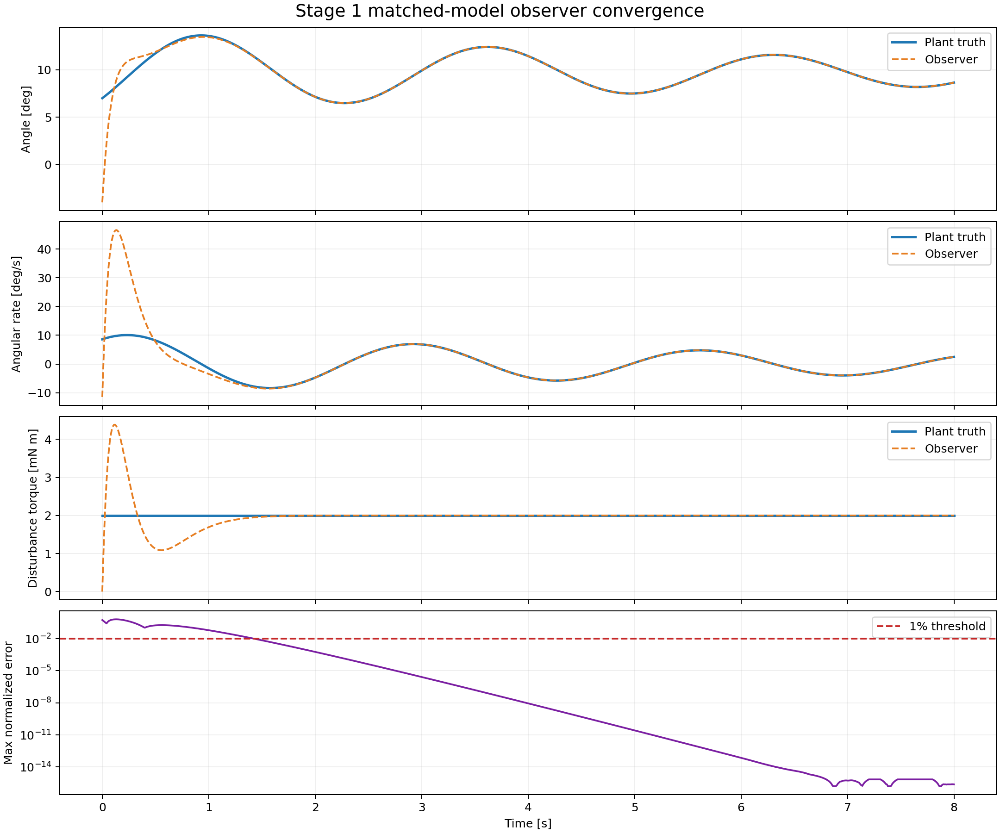
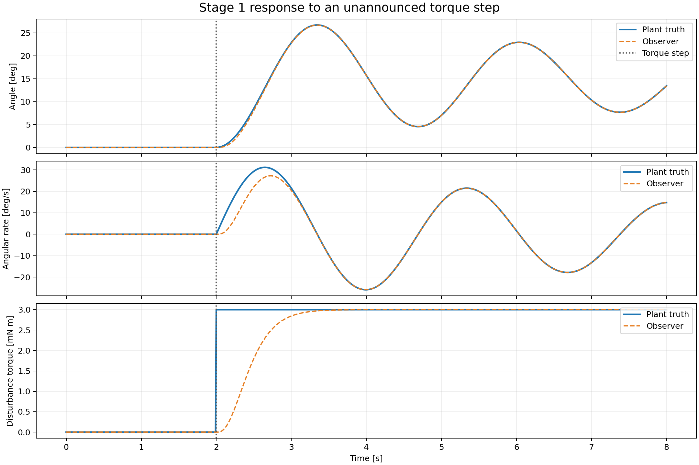

# Stage 1検証結果

## 結論

Stage 1の自動判定は **PASS** です。

1軸線形プラントと離散オブザーバーに同じモデル・同じ係数を与え、理想角度のみを観測した条件で、次を確認しました。

- 同じ初期状態から開始すると、プラント状態とオブザーバー状態は全サンプルで一致する
- 初期推定誤差がある場合も、角度観測だけで角度、角速度、外乱トルクが真値へ収束する
- 離散誤差系の特性多項式が、指定した三重極の特性多項式と一致する
- オブザーバーに知らせていないステップ外乱の後も真値へ再収束する
- 7件の自動テストがすべて成功する

これは理想条件における内部整合性の確認です。モデル係数誤差に対する性能はまだ確認していないため、Stage 2開始にはレビューが必要です。

## 構成

状態は `x = [角度 θ、角速度 ω、外乱トルク τ]` です。

プラントの運動方程式：

`I θ̈ + b θ̇ + K θ = τ`

外乱の予測モデル：

`τ̇ = 0`

離散オブザーバー：

`x̂[k+1] = Ad x̂[k] + Ld (y[k] - C x̂[k])`

オブザーバーへの観測入力は角度 `y = θ` だけです。

## 使用した公称値

| 項目 | 値 |
|---|---:|
| サンプリング周波数 | 100 Hz |
| 慣性モーメント I | 0.00215194497 kg m² |
| 減衰係数 b | 0.00059676098 N m s/rad |
| 復元係数 K | 0.01178181 N m/rad |
| 力作用距離 | 0.245 m |
| オブザーバー連続極 | -2π rad/sの三重極 |
| 対応する離散極 | 0.9391013674の三重極 |

このIとbは既存の自由減衰データおよびKから暫定的に求めた値です。Stage 1では数値の物理的確度ではなく、プラントとオブザーバーへ同じ値を設定した場合の整合性を検証しています。

## 導出したオブザーバー係数

| 係数 | 連続時間L | 離散時間Ld |
|---|---:|---:|
| 第1成分 | 18.5722435421 | 0.1793799030 |
| 第2成分 | 107.809980989 | 0.9935142726 |
| 第3成分 | 0.5337904091 | 0.0048671601 |

連続時間係数と離散時間係数はコードから自動導出され、`stage1_summary.json`にも保存されます。

## 合否結果

| 項目 | 結果 | 基準 | 判定 |
|---|---:|---:|---|
| 可観測性行列のランク | 3 | 3 | PASS |
| 同一初期状態での正規化最大誤差 | 0 | 1e-10以下 | PASS |
| 特性多項式係数の最大誤差 | 8.88e-16 | 1e-10以下 | PASS |
| 8秒後の正規化状態誤差 | 2.36e-16 | 1%以下 | PASS |
| 8秒後の外乱トルク相対誤差 | 2.17e-16 | 1%以下 | PASS |
| 初期誤差から1%以内への整定時間 | 1.43 s | 参考値 | ― |
| ステップ後1%以内への再整定時間 | 1.35 s | 参考値 | ― |

三重極は重根なので、一般的な固有値計算では丸め誤差が増幅され、約5.02e-6の見かけ上の極分裂が生じます。そのため、合否は数値的に安定な特性多項式係数の一致で判定しています。

## 初期推定誤差からの収束

青がプラント真値、橙の破線がオブザーバー推定値です。異なる初期状態から開始しても、約1.43秒後に全状態の正規化誤差が1%以内へ収束しました。

## 未知ステップ外乱への応答

2秒時点で外乱トルクを0から3 mN mへ変更しています。この瞬間は `τ̇ = 0` という予測モデルに反します。そのため瞬時一致は要求せず、変化後に再収束することを確認しました。1%以内への再整定時間は1.35秒でした。

## 自動テスト

次の7項目を実装しています。

1. 3状態の可観測性
2. 離散オブザーバー極の特性多項式
3. 同一初期状態の完全一致
4. 初期推定誤差からの収束
5. 未知ステップ外乱後の再収束
6. 連続時間オブザーバー極の特性多項式
7. 厳密離散化の時間刻み整合性

## Stage 1の範囲外

- プラントとオブザーバーの係数差
- センサノイズ、量子化、オフセット、遅延
- 非線形復元トルク
- クーロン摩擦などの未モデル化特性
- 2軸運動と軸間干渉
- 風速への換算
- 38度付近の物理ストッパー

係数差はStage 2で実験計画法を用いて評価します。センサモデルと実機に即したプラントモデルはStage 3で独立モジュールとして追加します。
