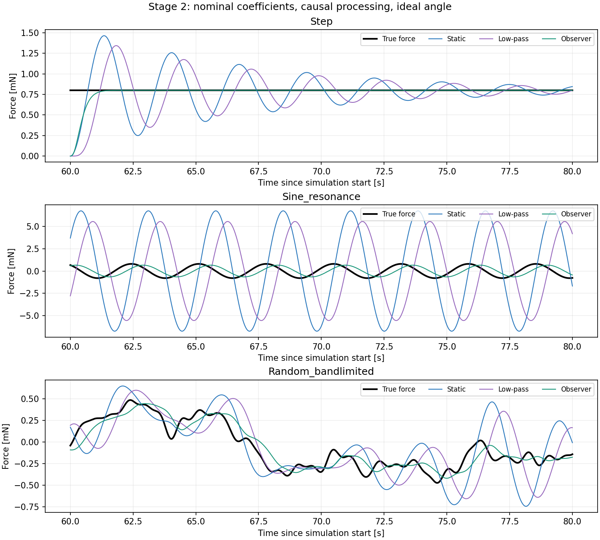
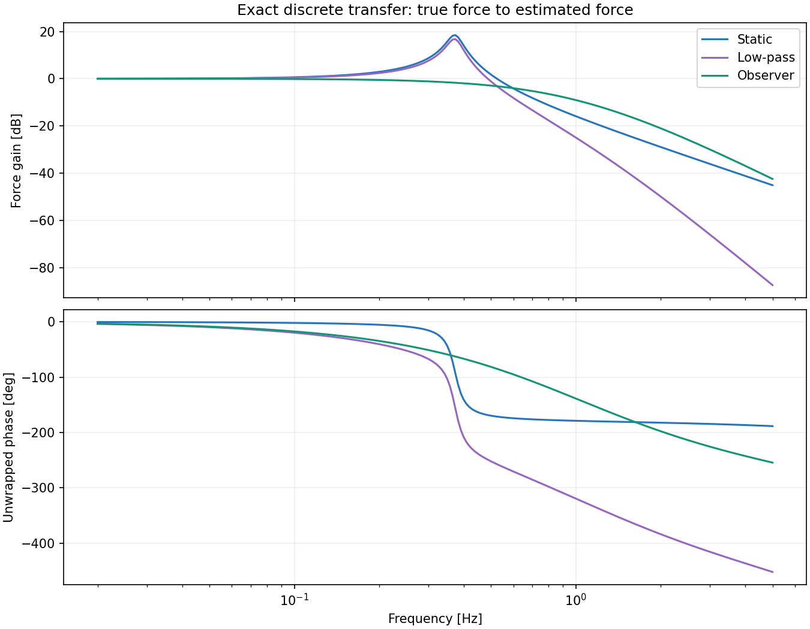
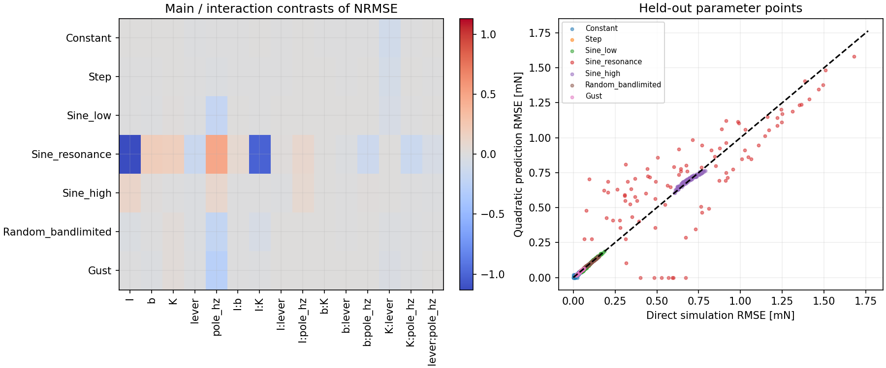

# Stage 2：DOEによるモデル係数誤差の評価

Stage 2の計算・成果物生成を完了しました。Stage 3はユーザー確認待ちです。

応答曲面の確認点ゲート：**NOT_MET**。未達の波形については応答曲面から許容誤差を断定しません。

## 評価条件

物理プラントは外力を入力とする2状態モデル、オブザーバーは角度だけを入力とする3状態モデルです。プラント係数は固定し、推定側の係数だけを変更しました。100 Hz、120秒、40〜120秒を全方式共通で評価しています。全方式に同じ理想角度を与え、ゲイン合わせ・時刻合わせは行っていません。

静的換算は推定K／推定作用距離×角度。LPFは同じ静的換算に三重極の因果LPFを適用。オブザーバーはStage 1と同じ離散極配置を使用しています。極パラメータとLPFの実効帯域は同義ではありません。ノイズなしなので、この結果だけで最適帯域は決定できません。

## 実験計画

I ±25%、b ±50%、K ±10%、作用距離 ±5%、極パラメータ0.5〜2 Hz（log2座標）。32端点＋中心1点＋軸上10点＝43点の面心中心複合計画で、5主効果・10交互作用・5二乗項を扱います。因子を削減せず全因子を保持しました。中心点は同一条件の決定論的計算なので重複実行しません。入力波形は別ブロックとして解析し、各ブロック内で主効果と交互作用を算出します。

[NISTの中心複合計画の説明](https://www.itl.nist.gov/div898/handbook/pri/section3/pri3361.htm)に基づく設計です。面心型は範囲外に点を置かず、回転可能性は持ちません。p値や統計的有意差、実機の発生確率は推定していません。

計画点と独立なLatin Hypercube 96点で確認。応答はMSEに二次式を当て、平方根をRMSE予測とします。負のMSE予測はゼロへ切り上げ、その件数を記録します。相対予測誤差の分母は実RMSEと真の力RMS×0.001の大きい方です。最大相対誤差10%以内をゲートとし、未達もそのまま報告します。

設計行列のランク：21/21。今回の最大角度は8.042度。ストッパー・飽和モデルは使用していません。

## 公称条件の比較

| 入力 | 静的RMSE [mN] | LPF RMSE [mN] | Observer RMSE [mN] | LPF比改善率 |
|---|---:|---:|---:|---:|
| Constant | 0.000483 | 0.000401 | 0.000000 | 100.00% |
| Step | 0.121099 | 0.117862 | 0.052029 | 55.86% |
| Sine_low | 0.014465 | 0.098452 | 0.086372 | 12.27% |
| Sine_resonance | 4.823072 | 4.439467 | 0.543704 | 87.75% |
| Sine_high | 0.656580 | 0.541663 | 0.727883 | -34.38% |
| Random_bandlimited | 0.231219 | 0.225375 | 0.100892 | 55.23% |
| Gust | 0.014453 | 0.041489 | 0.032790 | 20.97% |

改善率は負なら悪化です。Constantは機械振動の残留による微小誤差を含み、改善率だけを性能根拠にしません。これは固定1 Hzの因果比較であり、各方式の最適値比較や事後平滑化の性能ではありません。





## DOEと確認点

| 入力 | 確認点の最大相対予測誤差 | 中央値 | 負MSE予測点 | 判定 |
|---|---:|---:|---:|---|
| Constant | 1014.47% | 7.18% | 9 | NOT_MET |
| Step | 13.41% | 2.35% | 0 | NOT_MET |
| Sine_low | 21.45% | 4.29% | 0 | NOT_MET |
| Sine_resonance | 634.18% | 22.69% | 7 | NOT_MET |
| Sine_high | 4.47% | 1.65% | 0 | PASS |
| Random_bandlimited | 10.88% | 1.14% | 0 | NOT_MET |
| Gust | 17.39% | 3.03% | 0 | NOT_MET |



## 同時誤差範囲の直接確認

以下は極1 Hzに固定し、I・b・K・作用距離の誤差範囲を一括で縮小した16端点での最悪改善率です。範囲内の全点で成立する保証、公差確定値、確率95%の意味はありません。

| 範囲倍率 | I / b / K / 作用距離 の誤差 | ランダム波・最悪改善率 | 突風・最悪改善率 |
|---|---|---:|---:|
| 0 | ±0% / ±0% / ±0% / ±0% | 55.23% | 20.97% |
| 0.25 | ±6.25% / ±12.5% / ±2.5% / ±1.25% | 53.39% | 17.56% |
| 0.5 | ±12.5% / ±25% / ±5% / ±2.5% | 50.94% | 13.75% |
| 0.75 | ±18.75% / ±37.5% / ±7.5% / ±3.75% | 47.69% | 9.06% |
| 1 | ±25% / ±50% / ±10% / ±5% | 42.33% | 4.43% |

## 結果の解釈

ランダム波では極パラメータの主効果が大きく、IとKの交互作用も見られます。共振付近ではIの主効果とI×Kの交互作用が大きく、Iだけを単独で精密化すればよいとは結論できません。主効果は符号付きHigh−Lowの平均差なので、対称な二乗感度が大きくてもゼロになり得ます。応答曲面の二乗項と合わせて解釈してください。

公称1 Hzでランダム波はLPF比約55%改善しますが、低周波正弦波では静的換算の方が高精度です。1 Hz正弦波ではオブザーバーの位相遅れを含めた誤差が大きく、LPFより悪化します。単一のRMSE改善率を全帯域へ一般化できません。

現在の広い範囲に対する二次応答曲面はゲート未達です。係数差が小さいときのRMSEがゼロに近くなること、共振付近のIとKの相互作用、極の変更による非線形性を一つの二次式で十分近似できていません。追加の局所DOEはユーザー確認後に行います。

## 再現方法

リポジトリ直下から実行します。既存requirements.txtを使用します。

```bash
python 06_Analysis/simulation/src/run_stage2.py
python -m unittest discover -s 06_Analysis/simulation/tests -v
```

設定はconfig/stage2_doe.json。全43条件・確認96条件の物理係数と指標、回帰係数、主効果・交互作用、端点確認、周波数応答をresults/stage2のJSONへ保存します。乱数seedとライブラリ版も保存します。波形の乱数seedは全条件共通で、波形ごとの条件差を混入させません。

## 限界と次段階

センサモデルは未使用です。Stage 3で物理プラントと独立した切替可能なモデルとして追加します。入力波形は工学的な試験波形であり、実測風のスペクトルを再現したものではありません。作用距離の誤差は力換算に影響しますが、トルク状態の観測性には影響しません。

応答曲面ゲート未達なら、この範囲の二次近似を較正精度の決定に使用できません。必要帯域・要求誤差が未確定のため、許容公差の正式決定も行いません。Stage 2の結果をレビューし、必要なら帯域ごとの局所DOEへ進むかを決めます。
