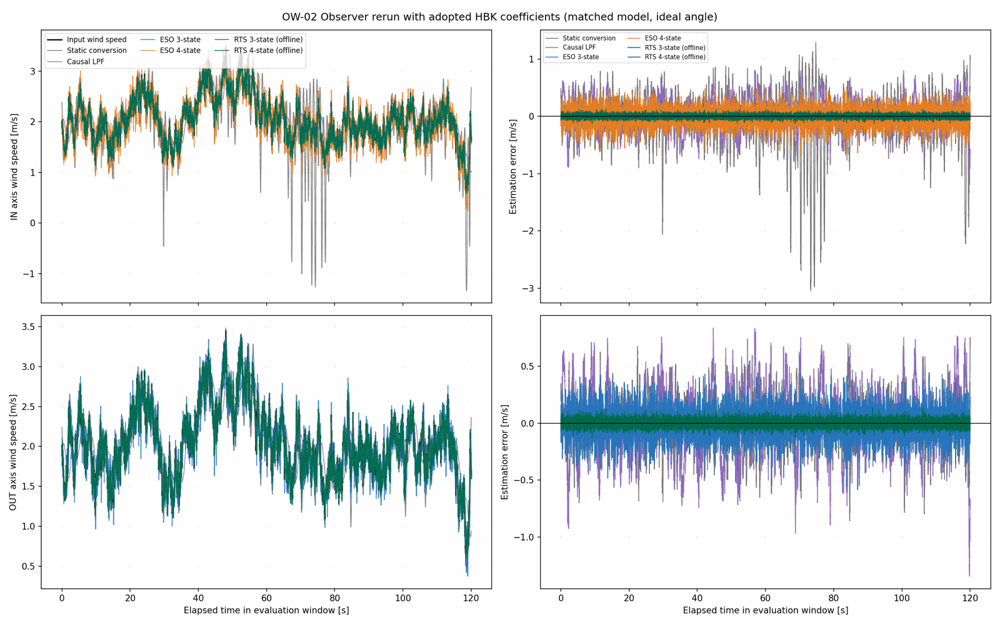
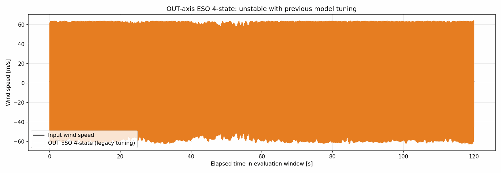

# OW-02 採用HBK係数によるオブザーバー再比較

## 目的と結論

従来のオブザーバー比較を、新ハードで採用した機械係数と非線形損失モデルに置き換えて再計算した。プラントと推定モデルには軸ごとに同一係数を与え、センサー角度は理想値とした。オブザーバーの係数は過去モデル用に調整した値をそのまま使ったため、今回の順位や誤差を最終選定結果とはみなさない。係数一致時の基準性能を得て、OW-03で独立した風入力を使って再調整・評価するための再実装である。

## 条件

- 構成：BALL、IN軸とOUT軸を別々に評価。両軸に同じ風速時系列を与え、軸係数による差を比較。
- 標本化周波数：100.0 Hz。計算時間：180 s。評価区間：30〜150 s。
- 風：Kaimal型乱流、平均2.0 m/s、最大3.5 m/s、目標TI 20.0%。生成TIは20.00%。乱数seed=20260915。
- 抗力係数：球のIHB-05方式A等価値 Cd=0.4860。球径100 mm。作用腕長=180.61 mm。
- 実機の角度リミット：±60°。新ハード自由振動46波形の初期振幅中央値は58.392°（Stage 1前処理レポート）で、リミット近傍まで振れている。
- センサー：角度ノイズ、量子化、遅延なし。推定器内のカルマン観測ノイズ仮定は0.020°で、これは計測波形に加えたノイズではない。
- 損失モデル：b=0、ロッドと球の二乗抗力、および軸別tauを使用。摩擦符号関数は頂点近傍の数値積分を安定させるため0.5°/sのtanh近似。
- ESO/RTS/LPFの調整値：旧モデルで得た値を固定。今回のモデル用には再調整していない。
- RTSは全評価区間の将来角度データを使うオフライン推定であり、オンライン候補とは別に解釈する。

## 評価結果

風速RMSEは推定風速と入力した真の風速の差。力RMSEは推定抗力とプラントに与えた真の抗力の差。どちらも評価区間全体で算出した。

プラントと推定モデルで共通に用いた式を示す。摩擦の符号関数は、頂点付近の数値積分を安定させるため滑らかなtanh近似とした。

$$
I\ddot{\theta}+K\sin\theta+c|\dot{\theta}|\dot{\theta}+\tau\tanh\left(\frac{\dot{\theta}}{\epsilon}\right)=\ell F\cos\theta,\qquad b=0
$$

## 推定方式の定義と計算式

角度計測を `y_k=theta_k`、推定した風力を `F_k` とする。各推定器は、このレポート冒頭の非線形運動方程式を使い、既知の `I`、`K`、`c`、`tau` と作用腕 `ell` を与える。推定した符号付き力を最後に準定常抗力式で風速へ換算する。

### 静的換算（オブザーバーではない比較基準）

角速度と角加速度がほぼゼロで、摩擦・空力減衰の影響を無視できる静的釣り合いを仮定する。運動方程式の復元トルクと風トルクを釣り合わせると、角度から力を直接求められる。運動の履歴や角度変化の速さは使わない。

$$
\ell F\cos\theta=K\sin\theta\quad\Longrightarrow\quad\hat F_{\mathrm{static},k}=\frac{K}{\ell}\tan(y_k)
$$

### 因果3段LPF

静的換算した力を、同じ一次ローパスフィルターに3回通す。OW-02では遮断周波数 `f_c=0.5 Hz`、標本間隔 `Delta t=0.01 s` とした。次式を各段 `j=1,2,3` に順に適用する。実装の差分式は各段で入力を1標本遅らせ、初期フィルター状態はゼロである。したがって3段の因果フィルターで遅れが生じる。風速に変換した後を平滑化するのではなく、力を平滑化してから風速へ換算する。

$$
q=\exp(-2\pi f_c\Delta t),\qquad z^{(j)}_k=qz^{(j)}_{k-1}+(1-q)u^{(j)}_{k-1},\quad u^{(1)}_k=\hat F_{\mathrm{static},k},\quad u^{(j)}_k=z^{(j-1)}_k
$$

### 3状態ESO（非線形Luenbergerオブザーバー）

状態は `x=[theta, omega, F]^T` の3つである。`F` を、短い時間では一定とみなす未知外力（風力）として状態に加える。角度だけを計測し、角度予測と計測の差（イノベーション）を使って3状態すべてを補正する。3状態とは、角度・角速度・未知風力を推定状態として持つことを指す。

$$
\dot{x}=f_3(x)=\begin{bmatrix}\omega\\\frac{\ell F\cos\theta-K\sin\theta-c|\omega|\omega-\tau\tanh(\omega/\epsilon)}{I}\\0\end{bmatrix},\qquad y=Cx,\quad C=\begin{bmatrix}1&0&0\end{bmatrix}
$$

非線形状態方程式を1標本分RK4で予測し、静止位置の線形化モデルから離散時間の補正ゲイン `L_3` を設計する。実装上の更新は次式で、`Phi` はRK4による1標本予測である。予測で運動モデルを進め、角度残差を用いて次状態を補正する。

$$
\hat{x}_{k+1}=\Phi_{\Delta t}(\hat{x}_k)+L_3\bigl(y_k-C\hat{x}_k\bigr),\qquad \hat{F}_k=(\hat{x}_k)_3
$$

### 4状態ESO（風力変化率を加えた非線形Luenbergerオブザーバー）

3状態との違いは、風力の変化率 `r_F` を4つ目の状態に加える点である。これにより、風力が短い時間に一定値でなく、おおむね一定の傾きで変わる状況を表せる。ただし、さらに変化率の変化（風力の二階微分）はゼロと仮定する。この追加状態は変化を追える可能性を増す一方、状態とゲインが増えるため、ノイズや調整値への感度も高くなる。

$$
x=\begin{bmatrix}\theta&\omega&F&r_F\end{bmatrix}^{\mathsf T},\qquad \dot{x}=f_4(x)=\begin{bmatrix}\omega\\\frac{\ell F\cos\theta-K\sin\theta-c|\omega|\omega-\tau\tanh(\omega/\epsilon)}{I}\\r_F\\0\end{bmatrix}
$$

更新式は3状態と同じ形だが、4次元の線形化モデルで4つの誤差極を配置して `L_4` を求める。

$$
\hat{x}_{k+1}=\Phi_{\Delta t}(\hat{x}_k)+L_4\bigl(y_k-C\hat{x}_k\bigr),\qquad C=\begin{bmatrix}1&0&0&0\end{bmatrix},\qquad \hat{F}_k=(\hat{x}_k)_3
$$

今回のESOはどちらも角度誤差極を反復配置するが、旧比較で使った帯域は3状態45 Hz、4状態20 Hzで異なる。したがってOW-02の3状態対4状態の誤差差は、状態数だけでなく帯域設定の差も含む。今回の比較から「4状態の方が本質的に劣る」とは結論できない。

両ESOのゲインは、静止位置 `(theta, omega, F, r_F)=(0,0,0,0)` で線形化し、標本時間に対して離散化したモデルから求める。原点では二乗抵抗の微分はゼロ、平滑化クーロン摩擦の傾きは `tau/epsilon` となる。各方式で `n` 状態の全誤差極が同じ `z_p` になるようにゲインを置く。

$$
A_3=\begin{bmatrix}0&1&0\\-K/I&-\tau/(I\epsilon)&\ell/I\\0&0&0\end{bmatrix},\quad A_4=\begin{bmatrix}0&1&0&0\\-K/I&-\tau/(I\epsilon)&\ell/I&0\\0&0&0&1\\0&0&0&0\end{bmatrix},\quad A_{d,n}=\exp(A_n\Delta t)
$$

$$
z_p=\exp(-2\pi f_p\Delta t),\qquad\operatorname{eig}(A_{d,n}-L_nC)=\{z_p,\ldots,z_p\}\ (n\text{重根})
$$

### RTS 3状態・4状態（EKF＋Rauch–Tung–Striebel平滑化）

RTS候補も同じ3状態・4状態のモデルを使うが、誤差を角度残差で直接補正するESOではなく、拡張カルマンフィルター（EKF）で共分散に応じて補正する。3状態では風力 `F` にランダムウォーク雑音を、4状態では風力変化率 `r_F` にランダムウォーク雑音を与える。さらに記録の末尾から先頭へ平滑化し、未来の角度計測も使って過去の状態推定を修正するため、RTS出力はオフライン専用である。

$$
\hat{x}_{k|k-1}=f_{\Delta t}(\hat{x}_{k-1|k-1}),\quad P_{k|k-1}=A_kP_{k-1|k-1}A_k^{\mathsf T}+Q,\quad S_k=CP_{k|k-1}C^{\mathsf T}+R
$$

$$
K_k=P_{k|k-1}C^{\mathsf T}S_k^{-1},\quad\hat{x}_{k|k}=\hat{x}_{k|k-1}+K_k(y_k-C\hat{x}_{k|k-1}),\quad P_{k|k}=(I-K_kC)P_{k|k-1}(I-K_kC)^{\mathsf T}+K_kRK_k^{\mathsf T}
$$

$$
G_k=P_{k|k}A_{k+1}^{\mathsf T}(P_{k+1|k})^{-1},\qquad\hat{x}_{k|N}=\hat{x}_{k|k}+G_k(\hat{x}_{k+1|N}-\hat{x}_{k+1|k})
$$

ここで `A_k` は非線形運動モデルの局所線形化、`Q` は状態雑音、`R` は角度計測雑音の分散、`N` は記録末尾である。OW-02では計測ノイズを波形へ加えていないが、EKF内部の仮定として標準偏差0.020°を設定した。過去設定はRTS 3状態で `F` の雑音30 N/標本、RTS 4状態で `r_F` の雑音10 N/s/標本である。

### 力から風速への換算と今回の設定値

全方式で、推定した符号付き力から同じ二乗抗力式を逆算する。`rho` は空気密度、`Cd` は球のIHB-05方式A等価抗力係数、`A_p` は投影面積である。力に比例して風速が変わるのではなく、力の平方根で換算される。

$$
\hat v_k=\operatorname{sgn}(\hat F_k)\sqrt{\frac{2|\hat F_k|}{\rho C_d A_p}},\qquad F=\frac{1}{2}\rho C_dA_pv|v|
$$

| 方法 | 何を使うか | 今回の設定・注意 |
|---|---|---|
| 静的換算 | 角度と静的な復元力の釣り合い | 履歴・角速度・角加速度を無視 |
| 3段LPF | 静的換算した力の過去値 | 0.5 Hzを3段直列。因果処理なので遅れる |
| 3状態ESO | `theta, omega, F` | `F` を短時間一定と仮定。旧設定45 Hz |
| 4状態ESO | `theta, omega, F, r_F` | `r_F` を追加し、短時間の力の傾きを表す。旧設定20 Hz |
| RTS 3状態 | `theta, omega, F` | EKF＋後向き平滑化。30 N/標本の力雑音仮定。オフライン |
| RTS 4状態 | `theta, omega, F, r_F` | EKF＋後向き平滑化。10 N/s/標本の力変化率雑音仮定。オフライン |

$$
\epsilon=0.5\ ^\circ/\mathrm{s}\text{相当の角速度をラジアン毎秒で表した値},\qquad \Delta t=0.01\ \mathrm{s},\qquad f_c=0.5\ \mathrm{Hz}
$$

各軸で風速RMSEが最小のオンライン方式は、次のとおり。

- IN軸：ESO 3状態（RMSE 0.1030 m/s）。
- OUT軸：ESO 3状態（RMSE 0.1283 m/s）。
- RTS 3状態は全体で最小RMSEだが、将来データを使うオフライン評価である。
- OUT軸の4状態ESOは旧設定で発散した。通常スケールの比較図には含めず、別図と誤差表に示す。これは旧モデル向け調整値を新モデルに移した場合の不安定性を示す。

### 風速誤差

| 軸 | 方法 | RMSE (m/s) | 偏り (m/s) | MAE (m/s) | 95%絶対誤差 (m/s) | 最大絶対誤差 (m/s) |
|---|---|---:|---:|---:|---:|---:|
| IN | 静的換算 | 0.4716 | -0.0500 | 0.3147 | 0.8094 | 3.0407 |
| IN | 因果LPF | 0.2799 | 0.0153 | 0.2237 | 0.5447 | 1.1964 |
| IN | ESO 3状態 | 0.1030 | -0.0004 | 0.0822 | 0.2044 | 0.4481 |
| IN | ESO 4状態 | 0.1557 | -0.0052 | 0.1237 | 0.3051 | 0.6720 |
| IN | RTS 3状態（オフライン） | 0.0057 | -0.0000 | 0.0044 | 0.0114 | 0.0320 |
| IN | RTS 4状態（オフライン） | 0.0338 | 0.0001 | 0.0269 | 0.0661 | 0.1303 |
| OUT | 静的換算 | 0.2180 | -0.0070 | 0.1742 | 0.4223 | 0.8590 |
| OUT | 因果LPF | 0.2880 | 0.0122 | 0.2298 | 0.5606 | 1.3435 |
| OUT | ESO 3状態 | 0.1283 | -0.0026 | 0.1017 | 0.2536 | 0.5849 |
| OUT | ESO 4状態 | 49.5497 | -0.4970 | 47.4613 | 62.0463 | 64.2646 |
| OUT | RTS 3状態（オフライン） | 0.0080 | -0.0000 | 0.0057 | 0.0167 | 0.0453 |
| OUT | RTS 4状態（オフライン） | 0.0337 | 0.0001 | 0.0269 | 0.0655 | 0.1345 |

### 抗力誤差

| 軸 | 方法 | RMSE (N) | 偏り (N) | MAE (N) | 95%絶対誤差 (N) | 最大絶対誤差 (N) |
|---|---|---:|---:|---:|---:|---:|
| IN | 静的換算 | 0.00347485 | 7.72941e-06 | 0.00267555 | 0.00722238 | 0.0129225 |
| IN | 因果LPF | 0.00269971 | 5.12213e-05 | 0.00213322 | 0.00525128 | 0.00964921 |
| IN | ESO 3状態 | 0.00100079 | 4.86119e-07 | 0.000780794 | 0.00199822 | 0.00493379 |
| IN | ESO 4状態 | 0.00149108 | -5.3577e-07 | 0.00116681 | 0.00296832 | 0.00767703 |
| IN | RTS 3状態（オフライン） | 5.56495e-05 | 9.50544e-09 | 4.14177e-05 | 0.000113879 | 0.000360721 |
| IN | RTS 4状態（オフライン） | 0.000328791 | 8.1445e-08 | 0.000256085 | 0.000651426 | 0.00174431 |
| OUT | 静的換算 | 0.00211775 | -2.59452e-05 | 0.00165236 | 0.00423796 | 0.0100069 |
| OUT | 因果LPF | 0.00276087 | 1.78262e-05 | 0.00218316 | 0.00530179 | 0.00978049 |
| OUT | ESO 3状態 | 0.00124568 | -2.81302e-06 | 0.000965938 | 0.00251097 | 0.00596463 |
| OUT | ESO 4状態 | 6.36063 | 0.321967 | 5.74596 | 9.32169 | 9.65305 |
| OUT | RTS 3状態（オフライン） | 7.87176e-05 | 8.2173e-08 | 5.49842e-05 | 0.000174954 | 0.000500502 |
| OUT | RTS 4状態（オフライン） | 0.000328348 | -5.17858e-08 | 0.000255754 | 0.000647314 | 0.00174515 |

## 作動角と波形

| 軸 | 評価区間の最大絶対角度 | ±60°以内か |
|---|---:|---|
| IN | 18.94° | はい |
| OUT | 18.16° | はい |





## 解釈と次段階

この再計算で、プラントと推定側の運動モデルに採用済みのI、K、c、tauを反映し、従来候補を比較できる計算経路を用意した。旧モデル向け調整値を固定しているため、ESO/RTS間の優劣は暫定であり、新モデルに対する最適値を示していない。RTSは未来データを使うので、RMSEが小さくてもオンライン方式と同等の実装候補ではない。

平均2.0 m/s・最大3.5 m/sの基準入力は、通常域の比較用として設定した。以前の平均3.75 m/s・最大6 m/sの風系列では、評価区間の最大絶対角度はIN 59.43°、OUT 54.63°だった。どちらも実機リミット±60°以内だが、IN軸は上限まで約0.57°しか余裕がなく、リミット近傍の条件である。この単一風系列だけでは他の乱流やガストでも超過しないとは言えないため、OW-03では複数入力を評価し、リミット超過時の扱いを明記する。

OW-03では調整用と評価用の入力風を分離し、候補ごとに新モデル上で調整をやり直す。OW-04では推定モデルだけのI、K、tau、cをずらし、係数誤差の影響を調べる。

## 再実行

リポジトリのルートで次を実行する。設定と係数台帳は別々のJSONに保存してある。

```bash
python 06_Analysis/simulation/src/run_ow02_hbk_observer_rerun.py
```
