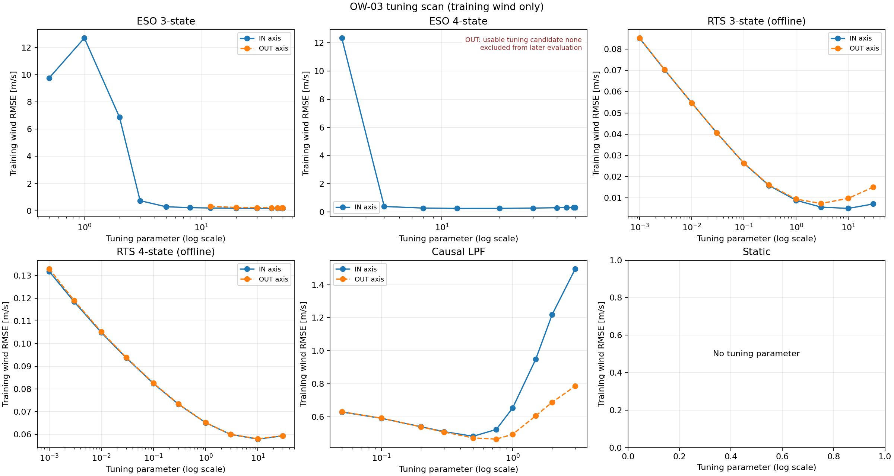
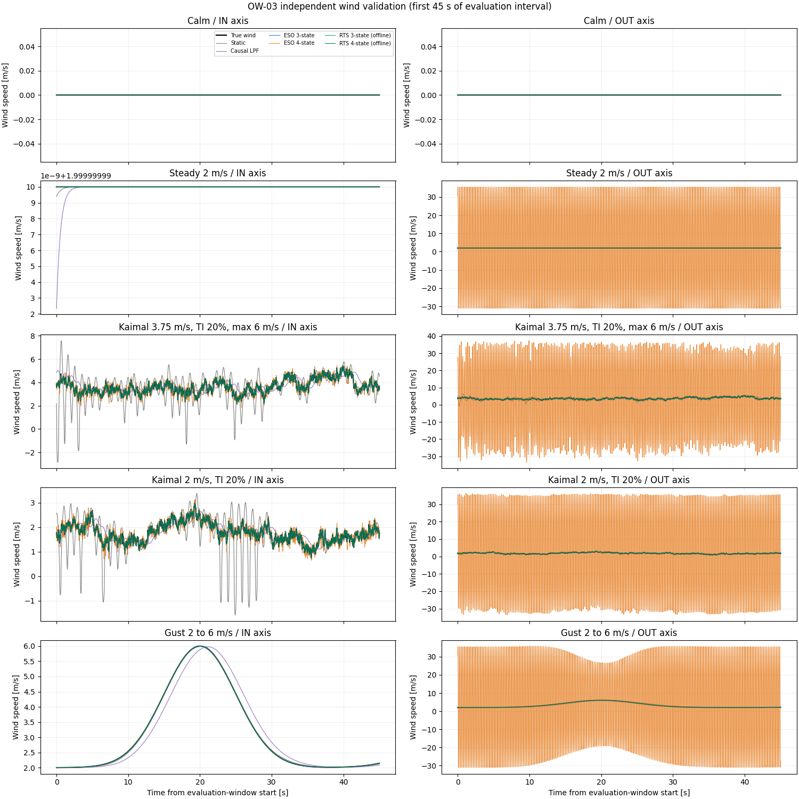

# OW-03 新ハード係数でのオブザーバー調整と独立評価

## 目的と結論

OW-02で旧調整値のまま比較したESOの極周波数等を、新しいHBK係数に合わせて再調整した。調整に使う風系列と、性能を確かめる風系列は独立させた。プラントと推定モデルの機械係数は一致させ、角度センサーは理想値とした。

調整では推定風速RMSEが小さくなるパラメーターを各軸・各方式ごとに選んだ。評価用風系列で各方式の性能を比較し、ESO極周波数を旧設定から変更した場合の発散・追従性を確認した。RTSは将来データを用いるオフライン方式のため、オンラインESOとは分けて解釈する。

本タスクでは機械係数 `I, K, c, tau` を新たに同定・変更していない。OW-01までに採用した係数を固定して基準性能を調べた。3状態ESOはIN 49.9 Hz、OUT 40 Hzが選ばれた。IN軸は探索上限49.9 Hzが選択されており、理想センサーでは高い極周波数が有利な傾向が残るため、実機用の最終値とはみなさない。

4状態ESOはIN軸では12 Hzの候補が得られたが、OUT軸では探索範囲内に有界性スクリーニングを通る設定がなかった。3 Hzの数値は診断用に残すだけで、採用設定ではない。OUT軸4状態ESOは独立評価でも大きな発散的推定を示した。このため、4状態ESOはOW-04・OW-05を含む以降のオブザーバー性能比較には使用しない。以降は3状態ESO、RTS、静的換算・LPFなどの候補を評価する。OW-04では係数ずれ、OW-05ではセンサー非理想性を加える。

## 条件と仮定

- ハード構成：BALL。係数：採用済みHBK台帳のIN/OUT別値。プラントと推定側で一致。
- サンプリング周波数：100.0 Hz。各記録長：120 s。先頭15 sを初期過渡として評価から除外。
- 機械角リミット：±60°。シミュレーション波形はクリップせず、超過した条件は実機で実現不能としてフラグする。
- 空力：球Cd=0.486050、投影面積=0.00785398 m²、力の作用腕=180.61 mm。空気密度=1.225 kg/m³。
- センサー：理想角度をプラント角から直接使用。計測ノイズ・量子化・遅延は加えていない。RTS内部の観測ノイズ設定だけに角度標準偏差0.020°を仮定する。
- 損失：採用HBK係数の `c` と軸別 `tau`、`b=0`。クーロン摩擦はOW-02と同じ0.5°/sのtanh近似。
- 静的換算はオブザーバーではなく基準方式。LPFは静的換算力を3段因果フィルターで平滑化。RTSは全記録の未来角度を利用する。

## 調整・評価データの分離

Kaimal系列は、風の乱れ成分の周波数ごとの強さをKaimal乱流スペクトルに合わせて作った人工風速時系列である。実測した風ではなく、シミュレーションで乱流条件を再現するための入力に使う。平均風速のまわりに乱れを加え、乱流強度（TI）は乱れの標準偏差を平均風速で割った値で指定する。例えばTI 20%は平均風速に対して標準偏差が約5分の1になる設定を指す。乱流の瞬時ピークは平均風速とは異なる。

調整用は平均3.00 m/s、目標TI 20.0%、最大5.0 m/sのKaimal系列（seed=20261003）。各軸でこれだけを使ってESO極周波数、RTSのプロセス雑音設定、LPF遮断周波数を選んだ。調整指標は評価区間の風速RMSEである。
評価は調整系列と異なるseedのKaimal系列、定常風、ガスト、無風で行った。選んだ設定は評価時に固定し直さない。

| 用途 | 入力 | 再現条件 |
|---|---|---|
| 調整 | kaimal | 平均3.00 m/s、TI 20.0%、上限5.0 m/s、seed 20261003 |
| 評価 | 無風 | calm、seed 20261010 |
| 評価 | 一定風 2 m/s | steady、seed 20261011 |
| 評価 | Kaimal乱流 平均3.75 m/s TI20% 最大6 m/s | kaimal、seed 20261012 |
| 評価 | 独立Kaimal乱流 平均2 m/s TI20% | kaimal、seed 20261013 |
| 評価 | ガスト 2→6 m/s | gust、seed 20261014 |

## 何を調整したか

3状態ESOは `[theta, omega, F]`、4状態ESOは `[theta, omega, F, r_F]` を推定する。ESOでは繰返し離散極周波数を探索し、その周波数と新ハードの係数から補正ゲインベクトル `L` を計算する。RTS 3状態では風力状態に加えるプロセス雑音、RTS 4状態では風力変化率状態に加えるプロセス雑音を探索した。LPFは遮断周波数を探索した。静的換算には調整値がない。

| 軸 | 方式 | 選択パラメーター | 調整用風速RMSE (m/s) | 実ゲインベクトル L |
|---|---|---:|---:|---|
| IN | ESO 3状態 | 49.9 (極周波数) | 0.17385 | `[2.6468642, 192.1424, 20.144978]^T` |
| IN | ESO 4状態 | 12 (極周波数) | 0.25318 | `[1.8953662, 110.56383, 11.823385, 180.9641]^T` |
| IN | RTS 3状態（オフライン） | 10 (風力プロセス雑音) | 0.00509 | — |
| IN | RTS 4状態（オフライン） | 10 (力変化率プロセス雑音) | 0.05787 | — |
| IN | 因果LPF | 0.5 (遮断周波数) | 0.48168 | — |
| OUT | ESO 3状態 | 40 (極周波数) | 0.22388 | `[2.3329313, 145.72748, 20.698913]^T` |
| OUT | ESO 4状態 | 3 (極周波数)（合格候補なし・診断用） | 25.01850 | `[0.26312231, 6.7862572, 0.51659838, 2.3230311]^T` |
| OUT | RTS 3状態（オフライン） | 3 (風力プロセス雑音) | 0.00740 | — |
| OUT | RTS 4状態（オフライン） | 10 (力変化率プロセス雑音) | 0.05799 | — |
| OUT | 因果LPF | 0.75 (遮断周波数) | 0.46457 | — |

ここでESOの極周波数は調整結果、列ベクトル `L` はその極周波数と各軸の採用 `I,K,c,tau` から計算した実際の補正ゲインである。ゲインの成分順はESO状態と同じで、角度残差（rad）に掛ける。RTSの雑音設定値は指定単位で示した。OW-02の45 Hz/20 Hzは初期値であり、ここに示すOW-03の値が調整後の値となる。

### 調整走査



グラフの横軸は各方式の調整パラメーター（対数目盛）、縦軸は調整用風入力に対する推定風速RMSEである。選択は有界性スクリーニングを通過した点のRMSE最小値とした。破線はOUT軸、実線はIN軸を表す。

ESO候補の有界性スクリーニングは、推定値が全標本で有限であり、かつ絶対推定風速が20 m/s以下（調整風上限5 m/sの4倍以下）であることとした。これは探索を打ち切る暴走判定の目安であり、数学的な安定性証明ではない。OUT 4状態ESOは全候補が条件を通らなかったため、調整走査・時系列・RMSE比較の図では性能曲線を描かず、「有効候補なし」と注記した。診断用の数値は表に参考値として残しているが、有効な評価成績とは扱わない。

## 独立した評価結果

風速誤差は推定風速から既知の入力風速を引いた値。`ピーク時刻差` は推定最大風速の時刻から入力風速の最大時刻を引いた値で、正なら推定が遅い。無風・一定風ケースでは真値に変動ピークがないためピーク時刻差を評価しない。

| ケース | 軸 | 方式 | 風速RMSE (m/s) | 偏り (m/s) | MAE (m/s) | 95%絶対誤差 (m/s) | 最大絶対誤差 (m/s) | ピーク時刻差 (s) | 最大角度 | ±60°以内 |
|---|---|---|---:|---:|---:|---:|---:|---:|---:|---|
| 無風 | IN | 静的換算 | 0.00000 | 0.00000 | 0.00000 | 0.00000 | 0.00000 | — | 0.00° | はい |
| 無風 | IN | 因果LPF | 0.00000 | 0.00000 | 0.00000 | 0.00000 | 0.00000 | — | 0.00° | はい |
| 無風 | IN | ESO 3状態 | 0.00000 | 0.00000 | 0.00000 | 0.00000 | 0.00000 | — | 0.00° | はい |
| 無風 | IN | ESO 4状態 | 0.00000 | 0.00000 | 0.00000 | 0.00000 | 0.00000 | — | 0.00° | はい |
| 無風 | IN | RTS 3状態（オフライン） | 0.00000 | 0.00000 | 0.00000 | 0.00000 | 0.00000 | — | 0.00° | はい |
| 無風 | IN | RTS 4状態（オフライン） | 0.00000 | 0.00000 | 0.00000 | 0.00000 | 0.00000 | — | 0.00° | はい |
| 無風 | OUT | 静的換算 | 0.00000 | 0.00000 | 0.00000 | 0.00000 | 0.00000 | — | 0.00° | はい |
| 無風 | OUT | 因果LPF | 0.00000 | 0.00000 | 0.00000 | 0.00000 | 0.00000 | — | 0.00° | はい |
| 無風 | OUT | ESO 3状態 | 0.00000 | 0.00000 | 0.00000 | 0.00000 | 0.00000 | — | 0.00° | はい |
| 無風 | OUT | ESO 4状態（不採用・診断値） | 0.00000 | 0.00000 | 0.00000 | 0.00000 | 0.00000 | — | 0.00° | はい |
| 無風 | OUT | RTS 3状態（オフライン） | 0.00000 | 0.00000 | 0.00000 | 0.00000 | 0.00000 | — | 0.00° | はい |
| 無風 | OUT | RTS 4状態（オフライン） | 0.00000 | 0.00000 | 0.00000 | 0.00000 | 0.00000 | — | 0.00° | はい |
| 一定風 2 m/s | IN | 静的換算 | 0.00000 | -0.00000 | 0.00000 | 0.00000 | 0.00000 | — | 6.44° | はい |
| 一定風 2 m/s | IN | 因果LPF | 0.00000 | -0.00000 | 0.00000 | 0.00000 | 0.00000 | — | 6.44° | はい |
| 一定風 2 m/s | IN | ESO 3状態 | 0.00000 | -0.00000 | 0.00000 | 0.00000 | 0.00000 | — | 6.44° | はい |
| 一定風 2 m/s | IN | ESO 4状態 | 0.00000 | -0.00000 | 0.00000 | 0.00000 | 0.00000 | — | 6.44° | はい |
| 一定風 2 m/s | IN | RTS 3状態（オフライン） | 0.00000 | -0.00000 | 0.00000 | 0.00000 | 0.00000 | — | 6.44° | はい |
| 一定風 2 m/s | IN | RTS 4状態（オフライン） | 0.00000 | -0.00000 | 0.00000 | 0.00000 | 0.00000 | — | 6.44° | はい |
| 一定風 2 m/s | OUT | 静的換算 | 0.00000 | -0.00000 | 0.00000 | 0.00000 | 0.00001 | — | 6.77° | はい |
| 一定風 2 m/s | OUT | 因果LPF | 0.00000 | -0.00000 | 0.00000 | 0.00000 | 0.00001 | — | 6.77° | はい |
| 一定風 2 m/s | OUT | ESO 3状態 | 0.00000 | -0.00000 | 0.00000 | 0.00000 | 0.00000 | — | 6.77° | はい |
| 一定風 2 m/s | OUT | ESO 4状態（不採用・診断値） | 26.48120 | 0.82501 | 25.26619 | 33.33503 | 33.56131 | — | 6.77° | はい |
| 一定風 2 m/s | OUT | RTS 3状態（オフライン） | 0.00000 | -0.00000 | 0.00000 | 0.00000 | 0.00000 | — | 6.77° | はい |
| 一定風 2 m/s | OUT | RTS 4状態（オフライン） | 0.00000 | -0.00000 | 0.00000 | 0.00000 | 0.00000 | — | 6.77° | はい |
| Kaimal乱流 平均3.75 m/s TI20% 最大6 m/s | IN | 静的換算 | 1.80177 | -0.21280 | 1.23228 | 4.38345 | 7.98294 | 0.220 | 77.97° | いいえ（範囲外） |
| Kaimal乱流 平均3.75 m/s TI20% 最大6 m/s | IN | 因果LPF | 0.61049 | 0.17025 | 0.46305 | 1.21427 | 2.43945 | 0.800 | 77.97° | いいえ（範囲外） |
| Kaimal乱流 平均3.75 m/s TI20% 最大6 m/s | IN | ESO 3状態 | 0.17957 | 0.00067 | 0.14295 | 0.35304 | 0.77880 | 0.020 | 77.97° | いいえ（範囲外） |
| Kaimal乱流 平均3.75 m/s TI20% 最大6 m/s | IN | ESO 4状態 | 0.25416 | -0.00635 | 0.20196 | 0.49817 | 0.95763 | 0.030 | 77.97° | いいえ（範囲外） |
| Kaimal乱流 平均3.75 m/s TI20% 最大6 m/s | IN | RTS 3状態（オフライン） | 0.00423 | 0.00000 | 0.00314 | 0.00857 | 0.06078 | 0.000 | 77.97° | いいえ（範囲外） |
| Kaimal乱流 平均3.75 m/s TI20% 最大6 m/s | IN | RTS 4状態（オフライン） | 0.06021 | 0.00023 | 0.04814 | 0.11854 | 0.25269 | -0.010 | 77.97° | いいえ（範囲外） |
| Kaimal乱流 平均3.75 m/s TI20% 最大6 m/s | OUT | 静的換算 | 1.21924 | -0.09387 | 0.82885 | 2.31076 | 7.01567 | 0.240 | 69.42° | いいえ（範囲外） |
| Kaimal乱流 平均3.75 m/s TI20% 最大6 m/s | OUT | 因果LPF | 0.54063 | 0.08971 | 0.42181 | 1.07481 | 2.03065 | 0.670 | 69.42° | いいえ（範囲外） |
| Kaimal乱流 平均3.75 m/s TI20% 最大6 m/s | OUT | ESO 3状態 | 0.22405 | -0.00301 | 0.17779 | 0.44224 | 0.91805 | 0.020 | 69.42° | いいえ（範囲外） |
| Kaimal乱流 平均3.75 m/s TI20% 最大6 m/s | OUT | ESO 4状態（不採用・診断値） | 23.70241 | 1.14218 | 22.31477 | 32.40933 | 40.13128 | 5.080 | 69.42° | いいえ（範囲外） |
| Kaimal乱流 平均3.75 m/s TI20% 最大6 m/s | OUT | RTS 3状態（オフライン） | 0.00729 | 0.00001 | 0.00547 | 0.01392 | 0.07139 | -0.010 | 69.42° | いいえ（範囲外） |
| Kaimal乱流 平均3.75 m/s TI20% 最大6 m/s | OUT | RTS 4状態（オフライン） | 0.06020 | 0.00024 | 0.04811 | 0.11885 | 0.25216 | -0.010 | 69.42° | いいえ（範囲外） |
| 独立Kaimal乱流 平均2 m/s TI20% | IN | 静的換算 | 0.65030 | -0.08879 | 0.41365 | 1.19035 | 3.51811 | 3.360 | 18.86° | はい |
| 独立Kaimal乱流 平均2 m/s TI20% | IN | 因果LPF | 0.29088 | 0.00972 | 0.23435 | 0.55276 | 1.02930 | 4.100 | 18.86° | はい |
| 独立Kaimal乱流 平均2 m/s TI20% | IN | ESO 3状態 | 0.10366 | -0.00054 | 0.08276 | 0.20274 | 0.45682 | -0.010 | 18.86° | はい |
| 独立Kaimal乱流 平均2 m/s TI20% | IN | ESO 4状態 | 0.15208 | -0.00460 | 0.12128 | 0.29578 | 0.66296 | 0.000 | 18.86° | はい |
| 独立Kaimal乱流 平均2 m/s TI20% | IN | RTS 3状態（オフライン） | 0.00333 | -0.00000 | 0.00265 | 0.00657 | 0.04356 | 0.000 | 18.86° | はい |
| 独立Kaimal乱流 平均2 m/s TI20% | IN | RTS 4状態（オフライン） | 0.03417 | 0.00010 | 0.02728 | 0.06628 | 0.14760 | 0.000 | 18.86° | はい |
| 独立Kaimal乱流 平均2 m/s TI20% | OUT | 静的換算 | 0.25464 | -0.00662 | 0.19622 | 0.50789 | 1.20420 | 3.450 | 17.44° | はい |
| 独立Kaimal乱流 平均2 m/s TI20% | OUT | 因果LPF | 0.27857 | 0.00411 | 0.22409 | 0.54362 | 0.97887 | 4.080 | 17.44° | はい |
| 独立Kaimal乱流 平均2 m/s TI20% | OUT | ESO 3状態 | 0.12953 | -0.00252 | 0.10259 | 0.25623 | 0.60039 | -0.010 | 17.44° | はい |
| 独立Kaimal乱流 平均2 m/s TI20% | OUT | ESO 4状態（不採用・診断値） | 26.40647 | 0.79169 | 25.18386 | 33.46504 | 35.72636 | -2.370 | 17.44° | はい |
| 独立Kaimal乱流 平均2 m/s TI20% | OUT | RTS 3状態（オフライン） | 0.00459 | 0.00001 | 0.00344 | 0.00919 | 0.04774 | 0.000 | 17.44° | はい |
| 独立Kaimal乱流 平均2 m/s TI20% | OUT | RTS 4状態（オフライン） | 0.03407 | 0.00011 | 0.02720 | 0.06588 | 0.14770 | 0.000 | 17.44° | はい |
| ガスト 2→6 m/s | IN | 静的換算 | 0.02437 | 0.00025 | 0.02026 | 0.03917 | 0.04325 | 43.360 | 45.42° | はい |
| ガスト 2→6 m/s | IN | 因果LPF | 0.22800 | 0.00203 | 0.16697 | 0.46189 | 0.49960 | 44.270 | 45.42° | はい |
| ガスト 2→6 m/s | IN | ESO 3状態 | 0.00485 | 0.00001 | 0.00344 | 0.01024 | 0.01108 | 43.040 | 45.42° | はい |
| ガスト 2→6 m/s | IN | ESO 4状態 | 0.00108 | -0.00001 | 0.00076 | 0.00226 | 0.00249 | 0.010 | 45.42° | はい |
| ガスト 2→6 m/s | IN | RTS 3状態（オフライン） | 0.00000 | -0.00000 | 0.00000 | 0.00000 | 0.00000 | 43.000 | 45.42° | はい |
| ガスト 2→6 m/s | IN | RTS 4状態（オフライン） | 0.00108 | 0.00000 | 0.00076 | 0.00226 | 0.00243 | 43.000 | 45.42° | はい |
| ガスト 2→6 m/s | OUT | 静的換算 | 0.05367 | 0.00213 | 0.04488 | 0.08593 | 0.09380 | 43.660 | 46.75° | はい |
| ガスト 2→6 m/s | OUT | 因果LPF | 0.18623 | 0.00292 | 0.14327 | 0.35308 | 0.37632 | 44.290 | 46.75° | はい |
| ガスト 2→6 m/s | OUT | ESO 3状態 | 0.00368 | 0.00002 | 0.00266 | 0.00774 | 0.00840 | 0.030 | 46.75° | はい |
| ガスト 2→6 m/s | OUT | ESO 4状態（不採用・診断値） | 24.64034 | 0.80219 | 23.28128 | 33.05864 | 33.59441 | -9.160 | 46.75° | はい |
| ガスト 2→6 m/s | OUT | RTS 3状態（オフライン） | 0.00000 | -0.00000 | 0.00000 | 0.00000 | 0.00001 | 43.000 | 46.75° | はい |
| ガスト 2→6 m/s | OUT | RTS 4状態（オフライン） | 0.00108 | 0.00000 | 0.00076 | 0.00226 | 0.00243 | 43.000 | 46.75° | はい |

### 入力風と推定風の重ね描き



図中ではOUT軸4状態ESOの診断波形を省き、有効な方式を比較しやすくした。評価開始から最初の45秒を表示している。

### 時間軸を拡大した波形


各乱流・定常・無風ケースは評価開始直後の5秒、ガストは最初のパルス（評価区間内16〜24秒）を拡大した。OUT軸4状態ESOは有効候補がないため、こちらにも描画していない。

### ケースごとのRMSE


## 結果の読み方と制約

各方式の設定は1つの調整用Kaimal系列で選んだ後に固定しているため、評価ケース上で再選択していない。ガストや別乱流で誤差が増える場合、設定の過学習・モデル近似・帯域の限界などを示す。RTSは未来サンプルを使うので、オンラインESOと誤差値だけで順位付けしない。

無風ケースは理想センサーかつ角度ゼロ初期条件であり、ここでの誤推定ゼロはノイズ下の性能を意味しない。センサーノイズ、量子化、遅延はOW-05で評価する。係数誤差はOW-04で評価する。

角度リミットを越えた場合、現状の非線形プラント計算は機械ストッパーによる衝突や飽和を模擬しない。該当ケースの推定性能は実機の挙動予測として採用しない。

## 再実行

リポジトリルートで実行する。調整格子や学習・評価風条件はJSON設定ファイルに保存されている。

```bash
python 06_Analysis/simulation/src/run_ow03_hbk_observer_tuning.py
```
