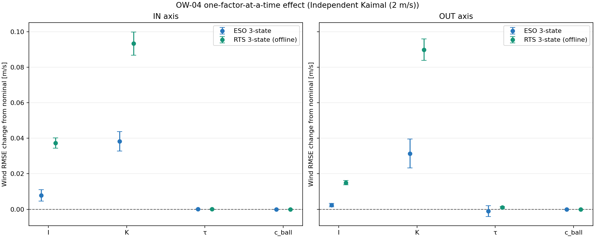
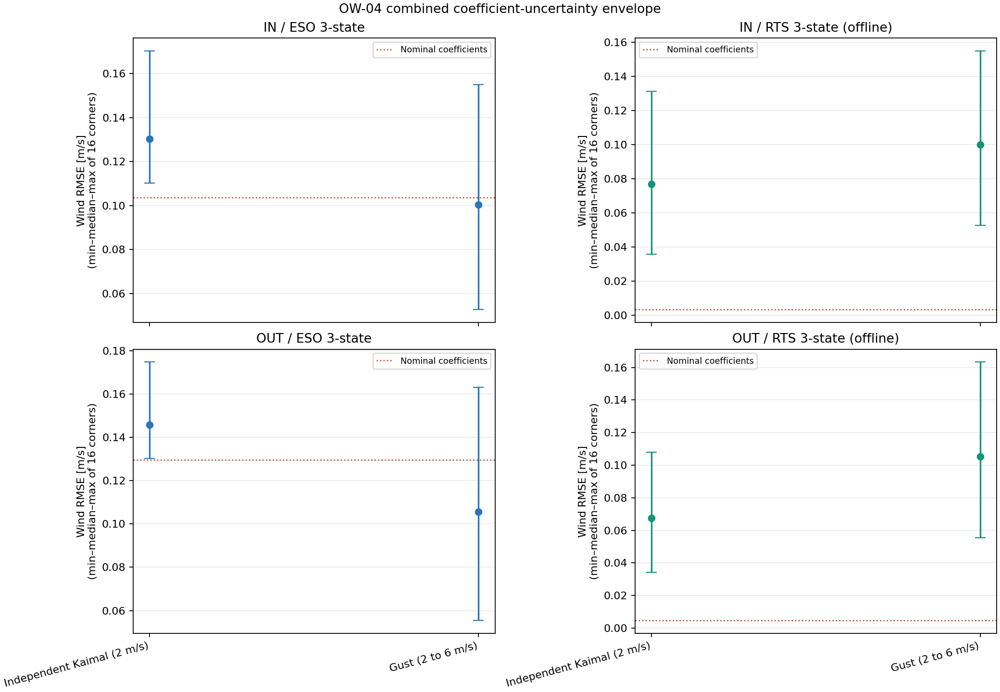
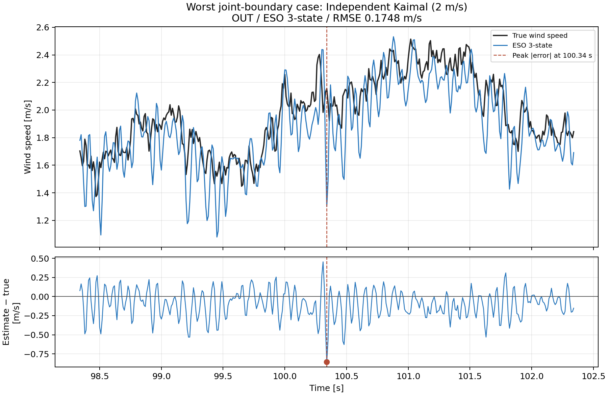
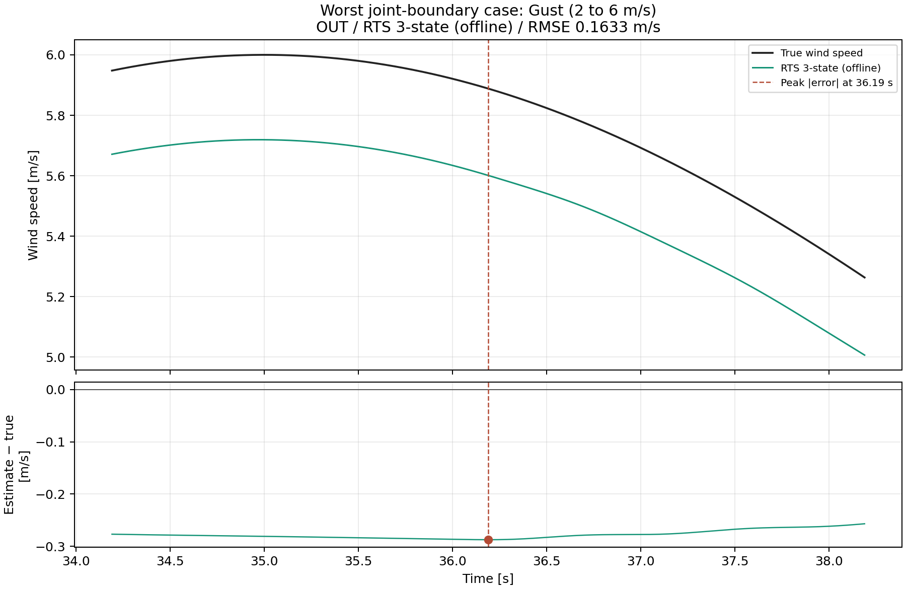

# OW-04 係数ずれに対する感度評価

## 目的と結論

OW-03で採用したBALL係数を真のプラントに固定し、推定側だけの係数をずらした。したがって今回の差は機械そのものの変化ではなく、推定モデルがI、K、τ、球抗力係数を正確に知らないときの影響である。OW-03で決めたゲイン・プロセス雑音・LPF遮断周波数は固定し、係数ずれに合わせた再調整や最適化は行っていない。センサーはOW-03同様に理想値である。

OW-03の結果を引き継ぎ、OUT軸4状態ESOは比較対象から除外した。主要比較はオンラインの3状態ESOと、OW-03で最小誤差だった3状態RTS（オフライン）で行い、Kずれに限り静的換算・因果LPFも参考比較した。

本レポートの誤差範囲は今回指定した風速モデルごとに算出している。具体的には、独立Kaimal乱流（平均2 m/s、TI 20%）と2→6 m/sガストについて、それぞれ同じ固定プラント波形を使い、推定側の係数端点シナリオ間でRMSEを比較した範囲である。したがって別の乱流系列、風速条件、実測風に対する範囲ではない。また係数誤差の確率分布や将来の実機RMSEを保証する信頼区間でもない。RTSは未来角度を使うため、実装時に利用できる方式であるESOとの順位をRMSEだけで決めない。

## 係数のずれ幅と根拠

IとKは、IHB-05の公称球質量3.9 g・有効重心腕180.61 mmに、許容した質量誤差±0.5 gと位置誤差±10 mmを与えて再計算した。この腕長は実測で確定した寸法ではなく、IHB-05の周期適合で得た有効値である。球の質量・位置はIとKを同時に変えるため、組合せ解析では同じ質量・位置からI/Kを一緒に算出した。

τの上下端は、IHB-03でスペーサー条件を一つずつ外したときの同定値変化率を採用値へ適用した。球抗力係数c_ballは、IHB-05方式Aの波形クラスタ・ブートストラップ95%区間を使った。この区間は波形間のばらつきのみを表し、他係数や質量・寸法の不確かさを含まない。c_rodの理論値は固定した。

| 軸 | 係数 | 採用値 | 下側端 | 変化率 | 上側端 | 変化率 |
|---|---|---:|---:|---:|---:|---:|
| IN | I [kg·m²] | 0.000368212 | 0.00033946 | -7.808% | 0.000401356 | +9.001% |
| IN | K [N·m/rad] | 0.0149632 | 0.0136462 | -8.802% | 0.0161823 | +8.147% |
| IN | τ [N·m] | 7.94573e-05 | 7.90631e-05 | -0.496% | 8.00945e-05 | +0.802% |
| IN | c_ball [N·m·s²/rad²] | 1.37753e-05 | 1.30091e-05 | -5.563% | 1.41573e-05 | +2.773% |
| OUT | I [kg·m²] | 0.000370938 | 0.000342186 | -7.751% | 0.000404081 | +8.935% |
| OUT | K [N·m/rad] | 0.0142211 | 0.012904 | -9.261% | 0.0154401 | +8.572% |
| OUT | τ [N·m] | 0.00017695 | 0.000169549 | -4.182% | 0.00018027 | +1.876% |
| OUT | c_ball [N·m·s²/rad²] | 1.37753e-05 | 1.30091e-05 | -5.563% | 1.41573e-05 | +2.773% |

I/Kの物理的な組合せは、各軸について4つの質量・腕長端点（質量low/high × 腕長low/high）で作った。これをτのlow/high、c_ballのlow/highと組み合わせ、軸ごとに計16ケースを評価した。これは端点を組み合わせた保守的な感度範囲であり、同時確率95%区間ではない。

## 比較条件

- プラント：OW-03の採用BALL係数で固定。係数、入力風、角度波形を感度ケース間で変更しない。
- センサー：理想角度。サンプリング 100 Hz、記録 120 s、先頭15 sは過渡として評価外。
- 調整値：OW-03のESO極周波数およびRTSプロセス雑音設定を固定。係数ずれに対する再調整なし。
- 風条件：OW-03の全5条件で公称基準を再確認。係数ずれのOAT・組合せ解析は、±60°内だった独立Kaimal平均2 m/sと2→6 m/sガストに限定。
- 指標：風速RMSE、偏り、MAE、絶対誤差95パーセンタイル・最大値、ピーク時刻差。±60°外のプラント波形は実機性能の判断から除外。
- 数値暴走：評価区間に非有限値がある、または推定絶対風速が20 m/sを越える場合は有界判定不合格とした。これはOW-03と同じ暴走除外目安で、数学的な安定性証明ではない。

## 公称モデルでの基準値

以下は今回使った独立Kaimal 2 m/sとガスト条件の公称モデル結果である。高風速Kaimal系列（平均3.75 m/s、最大6 m/s）は±60°を越えたため、他ケースの参考値とともに付属CSVへ残すが、性能比較からは除外した。

| ケース | 軸 | 方式 | RMSE [m/s] | 最大絶対誤差 [m/s] | 偏り [m/s] | 95%絶対誤差 [m/s] | 最大角度 |
|---|---|---|---:|---:|---:|---:|---:|
| 独立Kaimal乱流 平均2 m/s TI20% | IN | 静的換算 | 0.65030 | 3.51811 | -0.08879 | 1.19035 | 18.86° |
| 独立Kaimal乱流 平均2 m/s TI20% | IN | 因果LPF | 0.29088 | 1.02930 | 0.00972 | 0.55276 | 18.86° |
| 独立Kaimal乱流 平均2 m/s TI20% | IN | ESO 3状態 | 0.10366 | 0.45682 | -0.00054 | 0.20274 | 18.86° |
| 独立Kaimal乱流 平均2 m/s TI20% | IN | RTS 3状態（オフライン） | 0.00333 | 0.04356 | -0.00000 | 0.00657 | 18.86° |
| 独立Kaimal乱流 平均2 m/s TI20% | OUT | 静的換算 | 0.25464 | 1.20420 | -0.00662 | 0.50789 | 17.44° |
| 独立Kaimal乱流 平均2 m/s TI20% | OUT | 因果LPF | 0.27857 | 0.97887 | 0.00411 | 0.54362 | 17.44° |
| 独立Kaimal乱流 平均2 m/s TI20% | OUT | ESO 3状態 | 0.12953 | 0.60039 | -0.00252 | 0.25623 | 17.44° |
| 独立Kaimal乱流 平均2 m/s TI20% | OUT | RTS 3状態（オフライン） | 0.00459 | 0.04774 | 0.00001 | 0.00919 | 17.44° |
| ガスト 2→6 m/s | IN | 静的換算 | 0.02437 | 0.04325 | 0.00025 | 0.03917 | 45.42° |
| ガスト 2→6 m/s | IN | 因果LPF | 0.22800 | 0.49960 | 0.00203 | 0.46189 | 45.42° |
| ガスト 2→6 m/s | IN | ESO 3状態 | 0.00485 | 0.01108 | 0.00001 | 0.01024 | 45.42° |
| ガスト 2→6 m/s | IN | RTS 3状態（オフライン） | 0.00000 | 0.00000 | -0.00000 | 0.00000 | 45.42° |
| ガスト 2→6 m/s | OUT | 静的換算 | 0.05367 | 0.09380 | 0.00213 | 0.08593 | 46.75° |
| ガスト 2→6 m/s | OUT | 因果LPF | 0.18623 | 0.37632 | 0.00292 | 0.35308 | 46.75° |
| ガスト 2→6 m/s | OUT | ESO 3状態 | 0.00368 | 0.00840 | 0.00002 | 0.00774 | 46.75° |
| ガスト 2→6 m/s | OUT | RTS 3状態（オフライン） | 0.00000 | 0.00001 | -0.00000 | 0.00000 | 46.75° |

## 一因子ずつ動かした結果（OAT）

OATでは対象の係数だけを下側端または上側端へ動かし、残りの係数を公称値に固定した。静的換算・因果LPFは式にKしか含まれないため、Kずれだけを比較した。表と図のRMSE変化率は、公称モデルに対する増減を表す。マイナスはその端点で偶然RMSEが小さくなったことを示すが、ずれた値を採用すべきという意味ではない。



変化率は公称RMSEが小さい場合に過大表示となるため、表には変化率とRMSEの絶対変化を併記した。最大絶対誤差の範囲は、低端・高端の2つの係数条件における最大絶対誤差の最小値～最大値である。

| ケース | 軸 | 方式 | 係数 | RMSE変化率 | RMSE絶対変化 [m/s] | 最大絶対誤差の範囲 [m/s] |
|---|---|---|---|---:|---:|---:|
| 独立Kaimal乱流 平均2 m/s TI20% | IN | ESO 3状態 | I | +4.39% ～ +10.67% | +0.00455 ～ +0.01106 | 0.49034 ～ 0.49712 |
| 独立Kaimal乱流 平均2 m/s TI20% | IN | ESO 3状態 | K | +31.63% ～ +42.26% | +0.03279 ～ +0.04381 | 0.58015 ～ 0.58483 |
| 独立Kaimal乱流 平均2 m/s TI20% | IN | ESO 3状態 | τ | -0.06% ～ +0.10% | -0.00006 ～ +0.00010 | 0.45647 ～ 0.45740 |
| 独立Kaimal乱流 平均2 m/s TI20% | IN | ESO 3状態 | c_ball | -0.00% ～ +0.00% | -0.00000 ～ +0.00000 | 0.45681 ～ 0.45683 |
| 独立Kaimal乱流 平均2 m/s TI20% | IN | RTS 3状態（オフライン） | I | +1031.70% ～ +1207.18% | +0.03432 ～ +0.04016 | 0.14511 ～ 0.17869 |
| 独立Kaimal乱流 平均2 m/s TI20% | IN | RTS 3状態（オフライン） | K | +2605.82% ～ +3001.33% | +0.08669 ～ +0.09985 | 0.20940 ～ 0.25701 |
| 独立Kaimal乱流 平均2 m/s TI20% | IN | RTS 3状態（オフライン） | τ | -0.19% ～ +1.51% | -0.00001 ～ +0.00005 | 0.04318 ～ 0.04418 |
| 独立Kaimal乱流 平均2 m/s TI20% | IN | RTS 3状態（オフライン） | c_ball | +0.01% ～ +0.04% | +0.00000 ～ +0.00000 | 0.04356 ～ 0.04356 |
| 独立Kaimal乱流 平均2 m/s TI20% | IN | 静的換算 | K | -1.63% ～ +3.09% | -0.01057 ～ +0.02009 | 3.44762 ～ 3.58064 |
| 独立Kaimal乱流 平均2 m/s TI20% | IN | 因果LPF | K | +2.69% ～ +5.81% | +0.00781 ～ +0.01689 | 0.95427 ～ 1.12638 |
| 独立Kaimal乱流 平均2 m/s TI20% | OUT | ESO 3状態 | I | +1.04% ～ +2.51% | +0.00135 ～ +0.00325 | 0.63471 ～ 0.64043 |
| 独立Kaimal乱流 平均2 m/s TI20% | OUT | ESO 3状態 | K | +17.99% ～ +30.47% | +0.02330 ～ +0.03947 | 0.67369 ～ 0.79406 |
| 独立Kaimal乱流 平均2 m/s TI20% | OUT | ESO 3状態 | τ | -3.11% ～ +1.58% | -0.00403 ～ +0.00205 | 0.56884 ～ 0.61546 |
| 独立Kaimal乱流 平均2 m/s TI20% | OUT | ESO 3状態 | c_ball | -0.00% ～ +0.00% | -0.00000 ～ +0.00000 | 0.60038 ～ 0.60041 |
| 独立Kaimal乱流 平均2 m/s TI20% | OUT | RTS 3状態（オフライン） | I | +298.17% ～ +353.97% | +0.01369 ～ +0.01625 | 0.08931 ～ 0.10680 |
| 独立Kaimal乱流 平均2 m/s TI20% | OUT | RTS 3状態（オフライン） | K | +1825.40% ～ +2087.00% | +0.08382 ～ +0.09584 | 0.17940 ～ 0.21210 |
| 独立Kaimal乱流 平均2 m/s TI20% | OUT | RTS 3状態（オフライン） | τ | +10.56% ～ +32.86% | +0.00048 ～ +0.00151 | 0.04350 ～ 0.04965 |
| 独立Kaimal乱流 平均2 m/s TI20% | OUT | RTS 3状態（オフライン） | c_ball | +0.00% ～ +0.00% | +0.00000 ～ +0.00000 | 0.04774 ～ 0.04774 |
| 独立Kaimal乱流 平均2 m/s TI20% | OUT | 静的換算 | K | +4.55% ～ +7.71% | +0.01158 ～ +0.01964 | 1.15858 ～ 1.25574 |
| 独立Kaimal乱流 平均2 m/s TI20% | OUT | 因果LPF | K | +3.84% ～ +6.43% | +0.01069 ～ +0.01791 | 0.92523 ～ 1.07879 |

## 複数係数を組み合わせた結果

各ケースの16端点シナリオから得たRMSEと最大絶対誤差それぞれの最小値・中央値・最大値を表に示し、RMSEは公称係数の値（赤い点線）と比較する。両指標の最小・中央値・最大値は各々別に集計している。公称ガスト誤差がほぼ0のため、複合条件の主評価は不安定な変化率ではなく絶対RMSEとした。端点の組み合わせであるため、区間内のすべての結果を覆う保証や確率的な解釈はない。



| ケース | 軸 | 方式 | 有効/16 | 公称RMSE [m/s] | 組合せRMSE min/中央値/max [m/s] | 最大絶対誤差 min/中央値/max [m/s] |
|---|---|---|---:|---:|---:|---:|
| 独立Kaimal乱流 平均2 m/s TI20% | IN | ESO 3状態 | 16/16 | 0.10366 | 0.11014 / 0.13031 / 0.17021 | 0.43453 / 0.57081 / 0.79441 |
| 独立Kaimal乱流 平均2 m/s TI20% | IN | RTS 3状態（オフライン） | 16/16 | 0.00333 | 0.03577 / 0.07679 / 0.13118 | 0.09601 / 0.22791 / 0.48325 |
| 独立Kaimal乱流 平均2 m/s TI20% | OUT | ESO 3状態 | 16/16 | 0.12953 | 0.13022 / 0.14581 / 0.17477 | 0.60971 / 0.67864 / 0.85559 |
| 独立Kaimal乱流 平均2 m/s TI20% | OUT | RTS 3状態（オフライン） | 16/16 | 0.00459 | 0.03430 / 0.06759 / 0.10796 | 0.08603 / 0.17688 / 0.32774 |
| ガスト 2→6 m/s | IN | ESO 3状態 | 16/16 | 0.00485 | 0.05273 / 0.10033 / 0.15488 | 0.09441 / 0.17880 / 0.27017 |
| ガスト 2→6 m/s | IN | RTS 3状態（オフライン） | 16/16 | 0.00000 | 0.05259 / 0.10012 / 0.15487 | 0.09179 / 0.17501 / 0.27114 |
| ガスト 2→6 m/s | OUT | ESO 3状態 | 16/16 | 0.00368 | 0.05538 / 0.10563 / 0.16321 | 0.09605 / 0.18913 / 0.28347 |
| ガスト 2→6 m/s | OUT | RTS 3状態（オフライン） | 16/16 | 0.00000 | 0.05535 / 0.10538 / 0.16333 | 0.09700 / 0.18496 / 0.28730 |

## 考察と次段階

OATでは、I/KずれがESO 3状態に対しても明確に誤差を増やし、c_ballのずれは今回の範囲ではほとんど影響しなかった。RTS 3状態は特にI/Kに敏感で、独立Kaimal条件の非常に小さい公称RMSEを基準にすると変化率が大きく見えるため、絶対RMSEと合わせて読む必要がある。τの影響は主にOUT軸に現れた。

組合せ端点では、係数ずれがあると両方式とも公称条件よりRMSEが増え、RTS 3状態の大きな公称優位は縮まった。よって、RTS 3状態がOW-03で優勢だった結論は係数一致・理想センサー条件では維持されるが、係数ずれを含む実環境での優位は未確定である。RTSは未来サンプルを使うオフライン方式なので、オンライン選定にはESO 3状態との比較が必要である。

今回の端点は機械係数同定と既知の球質量・腕長条件から定めた。実際のI/K/τ/c_ballの誤差がこの幅を越えていないかは、係数の再計測で直接証明したわけではない。またc_ballのブートストラップ区間には質量・腕長の誤差が含まれない。このため複合端点の範囲は、感度を見落とさないためのシナリオであり、統計的な信頼区間としては解釈しない。

## 風モデルごとの最大誤差条件と時系列

次の図は、各風モデルで16個の複合係数端点のうちRMSEが最大となった有界・角度範囲内の条件を選び、その条件で絶対誤差が最大となる時刻を中心に前後2秒を拡大したものである。上段は真の風速と推定風速、下段は推定誤差を示す。対象にした風モデルは本解析で係数感度評価を行った2条件である。

### 独立Kaimal乱流 平均2 m/s TI20%

最大RMSE条件は **OUT軸・ESO 3状態・joint_mass_high_arm_high_tau-high_c-high** で、RMSEは **0.17477 m/s**。評価区間内の最大絶対誤差は **0.85555 m/s**、発生時刻は **100.34 s**。図は **98.34–102.34 s** を表示する。



### ガスト 2→6 m/s

最大RMSE条件は **OUT軸・RTS 3状態（オフライン）・joint_mass_high_arm_high_tau-high_c-high** で、RMSEは **0.16333 m/s**。評価区間内の最大絶対誤差は **0.28730 m/s**、発生時刻は **36.19 s**。図は **34.19–38.19 s** を表示する。



OW-05ではセンサーノイズ、量子化、遅延を加える。今回のOW-04は係数ずれだけを扱ったので、OW-05で係数ずれとセンサー非理想性を同時に加え、RTS 3状態（オフライン）とESO 3状態（オンライン）を実装条件も含めて最終比較する。

計算時間（この実行環境）：120.1 s。全ケースで同じ固定風波形・固定オブザーバー調整値を再利用し、反復最適化を行わず、OAT端点と16個の組合せだけを評価した。

## 再実行

リポジトリルートで次を実行する。入力誤差幅、使用ケース、評価対象方式は `06_Analysis/simulation/config/ow04_hbk_coefficient_sensitivity.json` に記録している。

```bash
python 06_Analysis/simulation/src/run_ow04_hbk_coefficient_sensitivity.py
```

詳細な全シナリオ表は `ow04_oat_scenarios.csv`、`ow04_joint_scenarios.csv`、全条件公称値は `ow04_nominal_baseline.csv` を参照。
