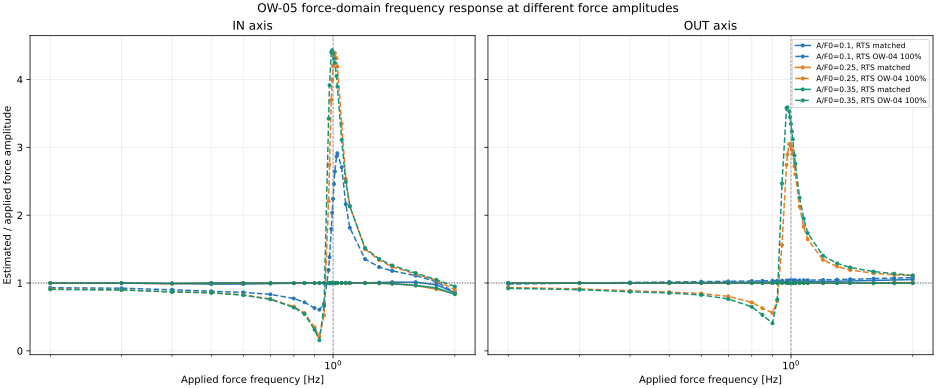

# 印加力 F の周波数に対する推定力の振幅ゲイン

平均力を2 m/s相当の空気力に保ち、

\[
F(t)=F_0+A_F\sin(2\pi f t)
\]

の正弦力を非線形プラントへ入力した。横軸を印加力の周波数、縦軸を「RTSで推定した力の基本波振幅／印加力の基本波振幅」とした。入力の開始過渡を除いた区間に正弦・余弦・定数項を最小二乗フィットして基本波振幅を求めている。

## 条件

- 平均風速換算：2 m/s
- 平均力：F0 = 0.0093527 N
- 力振幅：A_F/F0 = 0.1、0.25、0.35（A_F = 0.000935、0.002338、0.003274 N）
- 周波数：0.2〜2.0 Hz。約1 Hzの固有振動数尺度の付近を細かく掃引
- プラント：OW-03公称BALL係数、IN/OUT各軸、100 Hz、理想角度観測
- 推定器：係数一致RTS、およびOW-04の係数ずれ100%コーナー
- RTS q：IN 3e-5、OUT 3e-4 N/sample
- 正弦波入力は力Fへの直接入力。風速を正弦波にした場合の非線形な力変換はこの試験には含めない。

## 結果

実線は係数一致、破線はOW-04係数ずれ100%。色はA_F/F0を示す。点線の横線はゲイン1、縦線は1 Hz。

OW-04係数ずれ条件では、約1 Hzでゲインが大きく上昇した。周波数掃引点における最大値は次の通り。

| 軸 | A_F/F0 | 最大ゲイン | 周波数 |
|---|---:|---:|---:|
| IN | 0.10 | 2.91 | 1.025 Hz |
| IN | 0.25 | 4.39 | 1.010 Hz |
| IN | 0.35 | 4.43 | 0.995 Hz |
| OUT | 0.10 | 1.08 | 2.000 Hz |
| OUT | 0.25 | 3.05 | 0.995 Hz |
| OUT | 0.35 | 3.59 | 0.980 Hz |

係数一致条件ではゲインは概ね1だった。OUTの小振幅条件A_F/F0=0.10では、2 Hzで最大1.05（係数一致）と1.08（係数ずれ）で、顕著な共振ピークは現れなかった。入力振幅が上がると、OUTでも1 Hz付近で大きなゲインが出た。

振幅ごとの応答が異なり、ピーク周波数も少し移動するため、これは単一の線形ボード線図ではなく、振幅依存の非線形周波数応答である。最大角度はA_F/F0=0.35でIN 59.48°、OUT 49.61°で、試した全条件は±60°内だった。

## ファイル

- `estimated_force_gain_vs_frequency.svg`：拡大可能なゲイン図
- `estimated_force_gain_vs_frequency.png`：PNG版
- `estimated_force_phase_vs_frequency.png`：位相図
- `force_gain_metrics.csv`：周波数・軸・振幅・推定器別の全指標
- `settings.json`：計算設定
- `../../../../src/run_ow05_force_gain_frequency_response.py`：再計算スクリプト

再計算はリポジトリのルートで `python 06_Analysis/simulation/src/run_ow05_force_gain_frequency_response.py` を実行する。
