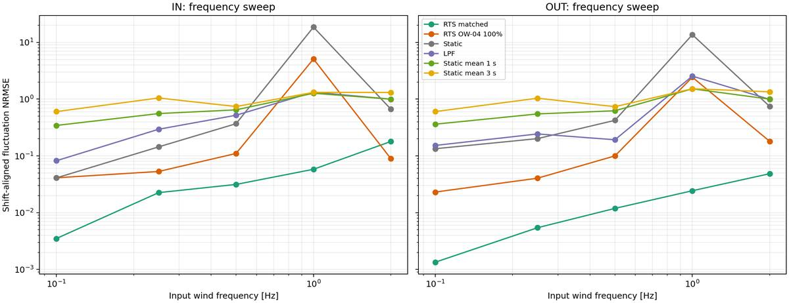
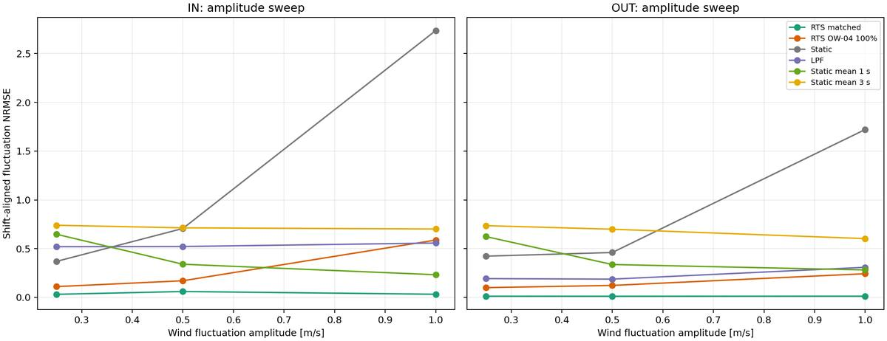
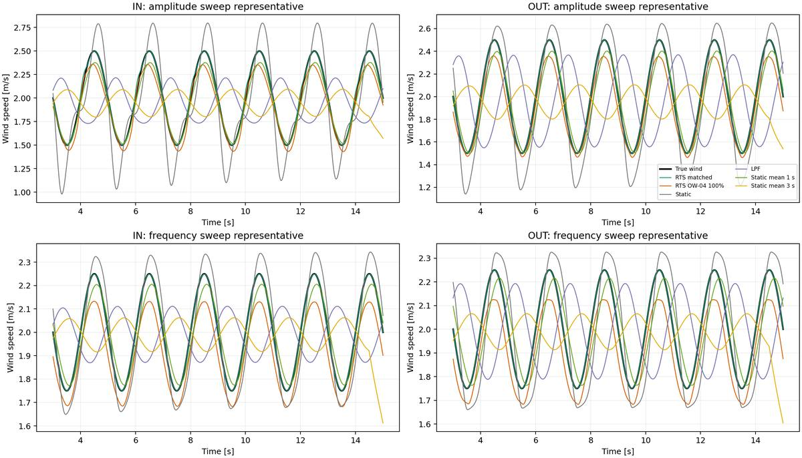

# OW-05 風変動の振幅・周波数と推定波形の比較

## 試験条件

- 風速平均は 2 m/s。
- 振幅試験は 0.5 Hz を固定し、変動振幅を 0.25、0.5、1.0 m/s とした。
- 周波数試験は変動振幅を 0.25 m/s に固定し、0.1、0.25、0.5、1、2 Hz とした。IN軸の1 Hz付近は固有振動と重なるため、最大角度が約45.6度になるが、全ケースで±60度以内に収まる。
- 各ケースで同一の理想角度波形を、係数一致RTS、OW-04複合高側係数RTS、静的換算、静的換算風速への因果LPF、静的換算風速への中央1秒・3秒移動平均に入力した。
- RTSはOW-03採用q（IN: 3e-5、OUT: 3e-4 N/sample）、3状態（力ランダムウォーク）、角度雑音仮定0.02度を使用した。シミュレーション角度には雑音を加えていない。初期状態は角度実測値、角速度0、風力推定値0とし、真の風力をRTSへ渡していない。
- LPF遮断周波数はOW-03採用値（IN: 0.5 Hz、OUT: 0.75 Hz）。区間平均は静的換算した風速に適用した中央移動平均。

## 読み方と結果

主指標は、入力と推定波形の平均値をそれぞれ除き、最大±2秒（または半周期の短い方）だけ時間をずらして最もよく重なる位置で計算した変動波形NRMSEです。時刻ずれの影響を弱めた形状指標なので、振幅比も併せて確認してください。CSVには同時刻RMSE、平均偏差、最適ずれ、相関、最大角度も保存しています。

- 周波数試験では、1 HzでOW-04 100% RTSの形状NRMSEがIN 5.09、OUT 2.43となり、係数一致RTSのIN 0.058、OUT 0.024より大きくなった。静的換算はそれぞれ18.57、13.64。推定変動振幅比も、誤差100% RTSでIN 5.87倍、OUT 3.32倍となった。
- 0.5 Hzでは同じ100%誤差RTSの形状NRMSEはIN 0.11、OUT 0.10。2 HzではIN 0.089、OUT 0.18だった。したがって、この条件では誤差は周波数とともに単調には増えず、約1 Hz付近に強い悪化が現れた。
- 係数一致RTSは、試験範囲では他方式より入力変動の形状と振幅をよく再現した。ただしこれは、雑音なしでプラントと推定器の物理モデルが一致する理想条件の基準値。
- 振幅試験では、0.5 Hz固定で変動振幅を大きくすると、100%誤差RTSの形状NRMSEがIN 0.11→0.17→0.59、OUT 0.10→0.12→0.24へ増えた。今回の設定では振幅増大も誤差を悪化させる。
- 因果LPFと区間平均は変動を平滑化するため、高周波ほど振幅比が低下する。3秒平均は0.5 Hzで振幅を強く抑え、形状指標にも現れている。

1 Hzは採用係数から計算した固有振動数（IN 約1.02 Hz、OUT 約0.99 Hz）に近い。よってこの急な悪化は「変化率一般」の効果だけでは説明できず、入力周波数と機構の共振・モデル係数誤差が重なった結果と考えられる。振幅と周波数を独立に振った今回の結果は、この共振近傍の感度を切り分ける。

本試験は単一の正弦波、理想センサ、決定論的プラントでの機構確認であり、実風の不規則波形やセンサ雑音を含む実用性能の結論ではない。OW-05レポート本体は変更せず、評価スクリプト・CSV・図をこのフォルダに分離した。

## 図

