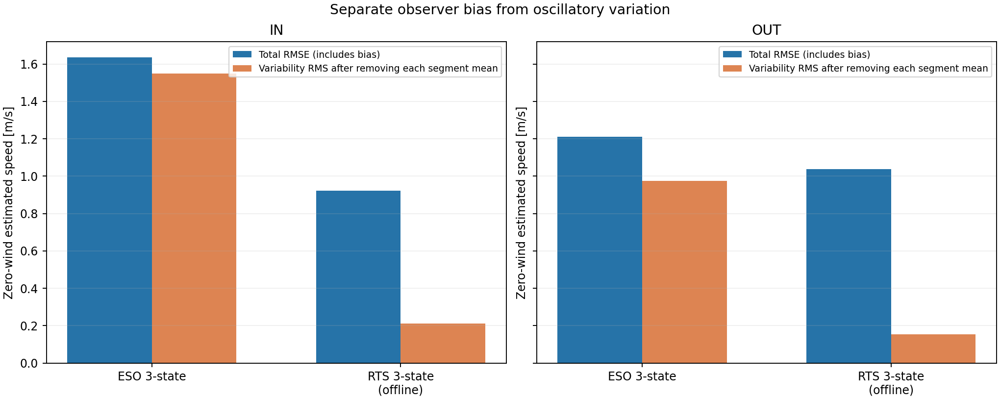
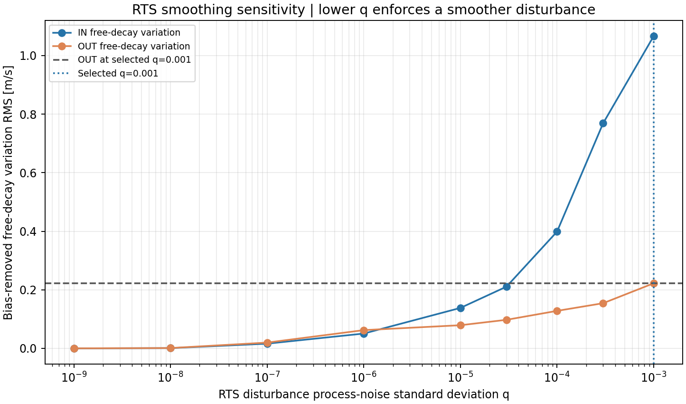
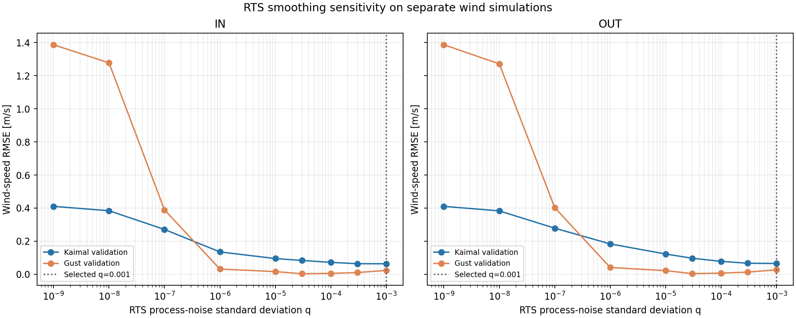
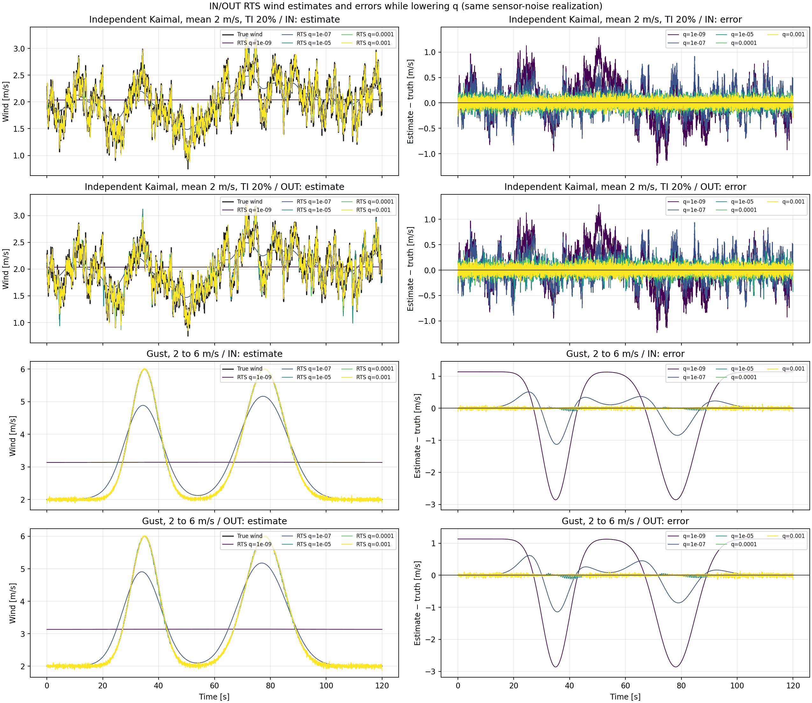
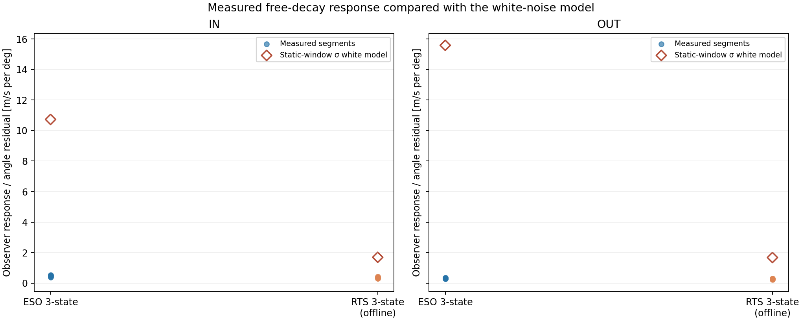
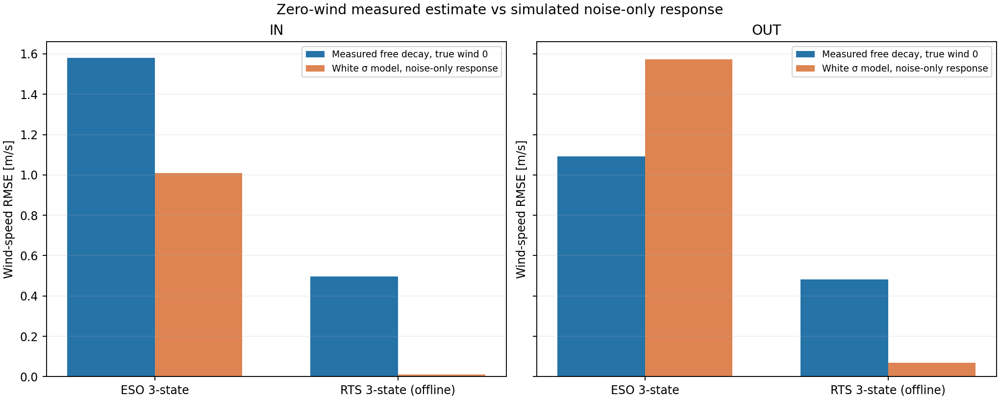

# OW-05 センサー非理想性とオブザーバー選定

## 目的・結論

OW-03で角度±60°内だった独立Kaimal乱流（平均2 m/s、TI 20%）と2→6 m/sガストを使い、採用BALLプラントにセンサーの量子化、ノイズ、遅延を含めて比較した。比較対象はオンラインの3状態ESOと未来データを使うオフライン3状態RTS。4状態ESOはOW-03で除外済みのため含めない。

公称センサー条件では、風条件・軸ごとのRMSE最小方式は下表の通り。帯域/プロセス雑音は別seedの平均3 m/s Kaimal訓練波形で方式ごと・軸ごとに一度だけ選定し、検証波形には再調整せず適用した。最大角度は全ケースで±60°内である。

| 風条件 | 軸 | ESO RMSE | RTS RMSE |
|---|---|---:|---:|
| 独立Kaimal乱流 平均2 m/s TI20% | IN | 0.19935 m/s | 0.06362 m/s |
| 独立Kaimal乱流 平均2 m/s TI20% | OUT | 0.30479 m/s | 0.06539 m/s |
| ガスト 2→6 m/s | IN | 0.10387 m/s | 0.02361 m/s |
| ガスト 2→6 m/s | OUT | 0.12206 m/s | 0.02723 m/s |

## センサー条件

角度サンプルは100 Hz、MT6701の14 bit（量子化幅0.02197266°）、白色ノイズσ=0.015°、有色ノイズσ=0.010°・時定数0.475 s、固定遅延10 msを公称条件とした。センサー段階評価に従った設定であり、量子化/サンプリング仕様以外のノイズと遅延は実測前の暫定仮定である。感度としてノイズσを2倍にした条件も計算した。


## MT6701の計測角出力誤差と静止窓内の摂動

今回の目的は、センサー単体の誤差を同定することではなく、静止と判定した窓で記録角が窓平均からどれだけ変動したかを把握することである。各窓の平均だけを差し引き、摂動 r_i=y_i-mean(y_window) をそのまま評価した。二階差分は使わない。静止判定条件は、符号付き角度35°超、0.5秒窓の標準偏差0.20°未満、線形ドリフト1°/s未満である。

静止窓内の摂動標準偏差は、全選定窓の r_i を結合して算出した。これは記録角に現れた窓内変動であり、真角度基準がないため、実際の微小運動とセンサー出力変動を分離できない。センサー出力誤差 e_s=θ_meas-θ_true やセンサー単体ノイズとは区別する。

| 軸 | 静止窓数 | 摂動点数 | 摂動σ [°] | ±3σ [°] | ±3σ内 [%] | 正規性検定 p値 | ラグ1自己相関 |
|---:|---:|---:|---:|---:|---:|---:|---:|
| IN | 20 | 1000 | 0.09334 | ±0.28001 | 98.3 | 8.69e-33 | 0.918 |
| OUT | 24 | 1200 | 0.10127 | ±0.30381 | 99.1 | 3.72e-27 | 0.929 |

上段の青線は各静止窓の平均値からの実測摂動、緑帯は同じ摂動列から計算した±3σである。中央のヒストグラムと緑の破線も同じ摂動列に対する表示である。図の時系列・分布・包含率の対象は一致している。

±3σは絶対的な上下限ではない。正規分布なら約99.73%が範囲内に入るが、今回の摂動は正規性検定で棄却された（両軸 p<0.001）。観測包含率はIN 98.3%、OUT 99.1%である。ラグ1自己相関も高く、独立白色ノイズとはみなせない。

参考として、従来の二階差分方式で得た高周波変動相当σはIN 0.00484°、OUT 0.00554°だった。今回の静止窓摂動σはそれぞれ約19.3倍、18.3倍であり、二階差分が窓内変動全体を表していなかったことが分かる。この倍率はセンサー誤差の過小評価率ではない。今回の摂動σにも治具などの微小運動が含まれ得る。

MT6701の14 bit角度量子化幅は0.02197°である。今回の摂動σとの比較は記録変動の大きさを示すだけで、量子化誤差やセンサー出力誤差を分離するものではない。センサー誤差の幅やリニアリティを求めるには、十分な精度の独立した角度基準との同時測定が必要である。


詳細値は `ow05_measured_noise_summary.csv`、使用した静止区間は `ow05_measured_noise_windows.csv` に保存した。

## 今回特定できた誤差範囲と今後の課題

センサーを真角度 $\\theta_{\\mathrm{true}}$ から計測角 $\\theta_{\\mathrm{meas}}$ への変換系と定義すると、評価対象は $e_s(\\theta,t)=\\theta_{\\mathrm{meas}}(\\theta,t)-\\theta_{\\mathrm{true}}(t)$ である。誤差要因は次のように整理できる。

| 誤差要因 | 内容 | 今回の特定状況 |
|---|---|---|
| 分解能・量子化 | 有限の角度コード幅とコード化誤差 | OW-05モデルで14 bit、1 LSB=0.02197266°として設定。これは刻み幅であり、真角度との誤差や全体精度の上限ではない |
| オフセット・ゼロ点 | 計測角の基準ずれ | 真角度基準がなく未特定 |
| ゲイン・リニアリティ | 角度に応じた傾き誤差、非直線性 | 未特定。今回のσや±3σからは評価できない |
| 繰返し性・時間変動 | 同じ真角度での出力ばらつき、電子的な揺れ | 真角度を固定した基準測定がなく、センサー分は分離できていない。今回算出したIN σ=0.09334°、OUT σ=0.10127°は、静止窓の平均からの摂動標準偏差 |
| 動的応答・タイミング | 内部フィルタ、遅れ、サンプリング時刻の揺れ | OW-05では100 Hz、固定遅延10 ms等をモデル仮定として設定。実機の遅延・帯域・ジッタは未測定 |
| 取付け・磁気条件 | 芯ずれ、傾き、磁石配置や磁場状態による角度依存誤差 | 実機条件での角度基準比較がなく未特定 |

今回数値としてまとめたのは、モデルに設定した14 bitのコード刻み幅と、静止窓で計測角が各窓平均から変動した標準偏差（IN 0.09334°、OUT 0.10127°）です。センサー出力誤差 $e_s$ の最大幅、リニアリティ誤差、センサー単体ノイズは特定できていません。図の±3σは静止窓摂動の範囲を要約し、センサー出力誤差の範囲を示すものではありません。

### 今後の試験メニュー

1. **独立角度基準との同時測定**  
   MT6701の使用時と同じ磁石・取付け・配線・読み出し処理を用い、精度が既知の角度基準と同期して記録する。基準器の誤差は、評価したいセンサー誤差より十分小さくする。生の読み値、変換後の角度、時刻も保存する。

2. **使用角度範囲の静的な往復掃引**  
   角度を複数点で止めて安定後に記録し、正方向・逆方向に複数回掃引する。基準との差から、ゼロ点オフセット、ゲイン誤差、リニアリティを求める。リニアリティは採用した基準直線を明示し、直線からの最大偏差と偏差幅で示す。往復差も角度ごとに評価する。

3. **固定角度での繰返し測定**  
   使用範囲内の複数角度で真角度を固定し、同じ条件で繰り返し記録する。センサー出力の繰返し性、時間変動、高周波ノイズを評価する。量子化の影響を見落とさないよう、一つの角度だけでなく複数角度で測る。

4. **既知の角度運動による動的応答試験**  
   基準角を同時記録しながら、複数の速度・周波数で角度を動かす。固定遅延、帯域、振幅誤差、サンプリング時刻の揺れを、静的な角度誤差と分けて確認する。

5. **使用環境の影響確認**  
   必要に応じて温度、電源、磁石の位置・取付け状態を変えて、角度誤差と再現性への影響を測る。まず実使用条件を優先する。

6. **誤差幅の集計**  
   真角度との差の角度依存曲線、最大絶対誤差、リニアリティ、往復差、繰返し性、時間変動、動的遅れを分けて報告する。ヒストグラム・自己相関も確認し、正規性と白色性が妥当な場合に限って±3σをノイズ幅の目安とする。

まずは **1の基準器との同時測定**と **2の静的往復掃引**を優先する。今回の記録角変動相当σおよび±3σは、これらの試験で真角度基準との差を測定するまで、センサー出力誤差の幅として扱わない。

## 角度ノイズから風速への増幅倍率

線形基準は、ノイズなしセンサー角度θ₀の近傍における静的な角度→風速写像の傾きで求めた。各時点の角度摂動Δθを、局所傾き g(θ₀)=dV/dθ（θ=θ₀で評価）に掛け、線形基準風速摂動 $v_{\mathrm{lin}}(t)=g(\theta_0(t))\Delta\theta(t)$ とした。角度摂動は、遅延・ゲイン・オフセット・量子化・ジッタを保って乱数ノイズだけを0にしたセンサー出力との差である。局所線形近似の妥当性確認として $\lvert\Delta\theta\rvert \leq 0.1\lvert\theta_0\rvert$ を満たす評価点の割合も記載した。これを満たさない時点では、線形基準倍率を慎重に解釈する。観測器側は、同一条件におけるノイズあり/なし推定出力差 $\Delta\hat{V}$ を全評価時点（15秒以降）で比較した。RMSE倍率は $\mathrm{RMS}(\Delta\hat{V})/\mathrm{RMS}(v_{\mathrm{lin}})$、最大値倍率は $\max_t \lvert\Delta\hat{V}(t)\rvert/\max_t \lvert v_{\mathrm{lin}}(t)\rvert$ である。


### 独立Kaimal乱流 平均2 m/s TI20%・IN軸

| ノイズ条件 | 推定器 | 角度ノイズRMSE [deg] | 線形条件成立 [%] | 基準RMSE [m/s] | 出力RMSE [m/s] | RMSE倍率 | 95%値倍率 |
|---|---|---:|---:|---:|---:|---:|---:|
| 公称 | ESO 3状態 | 0.02073 | 99.5 | 0.016496 | 0.158007 | 9.578 | 37.084 |
| 公称 | RTS 3状態（オフライン） | 0.02073 | 99.5 | 0.016496 | 0.034514 | 2.092 | 8.130 |
| 2倍 | ESO 3状態 | 0.03837 | 98.9 | 0.011681 | 0.308132 | 26.378 | 37.625 |
| 2倍 | RTS 3状態（オフライン） | 0.03837 | 98.9 | 0.011681 | 0.061631 | 5.276 | 8.076 |
| 2倍 | ESO 3状態 | 0.09383 | 97.1 | 0.060780 | 1.147667 | 18.882 | 76.849 |
| 2倍 | RTS 3状態（オフライン） | 0.09383 | 97.1 | 0.060780 | 0.189007 | 3.110 | 9.528 |

| ノイズ条件 | 推定器 | 基準最大値 [m/s] | 出力最大値 [m/s] | 最大値倍率 |
|---|---|---:|---:|---:|
| 公称 | ESO 3状態 | 1.443755 | 1.733567 | 1.201 |
| 公称 | RTS 3状態（オフライン） | 1.443755 | 0.171004 | 0.118 |
| 2倍 | ESO 3状態 | 0.721878 | 2.486851 | 3.445 |
| 2倍 | RTS 3状態（オフライン） | 0.721878 | 0.402897 | 0.558 |
| 2倍 | ESO 3状態 | 5.775021 | 4.685853 | 0.811 |
| 2倍 | RTS 3状態（オフライン） | 5.775021 | 1.995489 | 0.346 |

### 独立Kaimal乱流 平均2 m/s TI20%・OUT軸

| ノイズ条件 | 推定器 | 角度ノイズRMSE [deg] | 線形条件成立 [%] | 基準RMSE [m/s] | 出力RMSE [m/s] | RMSE倍率 | 95%値倍率 |
|---|---|---:|---:|---:|---:|---:|---:|
| 公称 | ESO 3状態 | 0.01991 | 100.0 | 0.003231 | 0.246786 | 76.380 | 74.724 |
| 公称 | RTS 3状態（オフライン） | 0.01991 | 100.0 | 0.003231 | 0.036413 | 11.270 | 11.494 |
| 2倍 | ESO 3状態 | 0.03760 | 100.0 | 0.006169 | 0.518482 | 84.049 | 77.169 |
| 2倍 | RTS 3状態（オフライン） | 0.03760 | 100.0 | 0.006169 | 0.066409 | 10.765 | 11.227 |
| 2倍 | ESO 3状態 | 0.10084 | 99.7 | 0.016420 | 1.780665 | 108.442 | 119.790 |
| 2倍 | RTS 3状態（オフライン） | 0.10084 | 99.7 | 0.016420 | 0.196968 | 11.995 | 11.754 |

| ノイズ条件 | 推定器 | 基準最大値 [m/s] | 出力最大値 [m/s] | 最大値倍率 |
|---|---|---:|---:|---:|
| 公称 | ESO 3状態 | 0.017972 | 2.218986 | 123.470 |
| 公称 | RTS 3状態（オフライン） | 0.017972 | 0.179577 | 9.992 |
| 2倍 | ESO 3状態 | 0.036401 | 3.157144 | 86.732 |
| 2倍 | RTS 3状態（オフライン） | 0.036401 | 0.333432 | 9.160 |
| 2倍 | ESO 3状態 | 0.089211 | 6.032972 | 67.626 |
| 2倍 | RTS 3状態（オフライン） | 0.089211 | 1.591506 | 17.840 |

### ガスト 2→6 m/s・IN軸

| ノイズ条件 | 推定器 | 角度ノイズRMSE [deg] | 線形条件成立 [%] | 基準RMSE [m/s] | 出力RMSE [m/s] | RMSE倍率 | 95%値倍率 |
|---|---|---:|---:|---:|---:|---:|---:|
| 公称 | ESO 3状態 | 0.02028 | 100.0 | 0.002677 | 0.108104 | 40.379 | 37.678 |
| 公称 | RTS 3状態（オフライン） | 0.02028 | 100.0 | 0.002677 | 0.025445 | 9.504 | 8.984 |
| 2倍 | ESO 3状態 | 0.03631 | 100.0 | 0.004798 | 0.197205 | 41.105 | 39.927 |
| 2倍 | RTS 3状態（オフライン） | 0.03631 | 100.0 | 0.004798 | 0.044248 | 9.223 | 9.013 |
| 2倍 | ESO 3状態 | 0.09431 | 100.0 | 0.012305 | 0.848511 | 68.955 | 65.957 |
| 2倍 | RTS 3状態（オフライン） | 0.09431 | 100.0 | 0.012305 | 0.122798 | 9.979 | 10.592 |

| ノイズ条件 | 推定器 | 基準最大値 [m/s] | 出力最大値 [m/s] | 最大値倍率 |
|---|---|---:|---:|---:|
| 公称 | ESO 3状態 | 0.010323 | 0.547870 | 53.071 |
| 公称 | RTS 3状態（オフライン） | 0.010323 | 0.134757 | 13.054 |
| 2倍 | ESO 3状態 | 0.024048 | 1.168317 | 48.582 |
| 2倍 | RTS 3状態（オフライン） | 0.024048 | 0.212058 | 8.818 |
| 2倍 | ESO 3状態 | 0.049058 | 4.594366 | 93.652 |
| 2倍 | RTS 3状態（オフライン） | 0.049058 | 0.578698 | 11.796 |

### ガスト 2→6 m/s・OUT軸

| ノイズ条件 | 推定器 | 角度ノイズRMSE [deg] | 線形条件成立 [%] | 基準RMSE [m/s] | 出力RMSE [m/s] | RMSE倍率 | 95%値倍率 |
|---|---|---:|---:|---:|---:|---:|---:|
| 公称 | ESO 3状態 | 0.01977 | 100.0 | 0.002469 | 0.126857 | 51.381 | 56.295 |
| 公称 | RTS 3状態（オフライン） | 0.01977 | 100.0 | 0.002469 | 0.029549 | 11.968 | 13.527 |
| 2倍 | ESO 3状態 | 0.03698 | 100.0 | 0.004631 | 0.253850 | 54.819 | 53.069 |
| 2倍 | RTS 3状態（オフライン） | 0.03698 | 100.0 | 0.004631 | 0.049622 | 10.716 | 10.726 |
| 2倍 | ESO 3状態 | 0.10116 | 100.0 | 0.012633 | 1.336090 | 105.764 | 138.210 |
| 2倍 | RTS 3状態（オフライン） | 0.10116 | 100.0 | 0.012633 | 0.136741 | 10.824 | 11.014 |

| ノイズ条件 | 推定器 | 基準最大値 [m/s] | 出力最大値 [m/s] | 最大値倍率 |
|---|---|---:|---:|---:|
| 公称 | ESO 3状態 | 0.013102 | 0.580831 | 44.330 |
| 公称 | RTS 3状態（オフライン） | 0.013102 | 0.134037 | 10.230 |
| 2倍 | ESO 3状態 | 0.021849 | 2.882710 | 131.937 |
| 2倍 | RTS 3状態（オフライン） | 0.021849 | 0.232425 | 10.638 |
| 2倍 | ESO 3状態 | 0.058870 | 6.009283 | 102.077 |
| 2倍 | RTS 3状態（オフライン） | 0.058870 | 0.699862 | 11.888 |

増幅倍率は全点RMSE比を主指標、絶対値95パーセンタイル比を外れ値に頑健な補助指標、最大絶対値比をピーク影響の補助指標として併記した。最大値倍率は単一点に強く左右されるため慎重に読む。線形基準は準静的な写像であり、動的な真値風速誤差の代用ではない。観測器の履歴依存性はノイズあり/なし出力差側に反映される。全値は `ow05_noise_amplification.csv` に保存した。

## 静止窓摂動σを使った追加オブザーバー評価

静止窓の平均からの摂動標準偏差を、OW-05センサーモデルの白色ノイズσとして置いた追加条件である（IN σ=0.09334°、OUT σ=0.10127°、±3σ幅はそれぞれ±0.28001°、±0.30381°）。モデルのσ欄には標準偏差を入力し、±3σを標準偏差として入力していない。有色ノイズは0にし、静止窓σを総ノイズ標準偏差の白色近似として評価した。
静止窓で観測した変動にはセンサー以外の微小運動も含まれ得る。実測摂動は時間相関（ラグ1自己相関約0.92）を持つ一方、今回の追加評価では同じ標準偏差の白色ノイズに近似しており、相関構造までは再現しない。ESO/RTSの調整値は公称条件で決めたものを固定し、追加条件に再調整せず適用した。

| 風条件 | 軸 | ノイズσ [°] | 推定器 | RMSE [m/s] | 公称比 | MAE [m/s] | 95%絶対誤差 [m/s] | 最大絶対誤差 [m/s] |
|---|---|---:|---|---:|---:|---:|---:|---:|
| 独立Kaimal乱流 平均2 m/s TI20% | IN | 0.09334 | ESO 3状態 | 1.15782 | 5.81× | 0.79393 | 2.90576 | 4.70854 |
| 独立Kaimal乱流 平均2 m/s TI20% | IN | 0.09334 | RTS 3状態（オフライン） | 0.19682 | 3.09× | 0.14690 | 0.37106 | 1.96801 |
| 独立Kaimal乱流 平均2 m/s TI20% | OUT | 0.10127 | ESO 3状態 | 1.80131 | 5.91× | 1.30206 | 4.00256 | 6.18859 |
| 独立Kaimal乱流 平均2 m/s TI20% | OUT | 0.10127 | RTS 3状態（オフライン） | 0.20326 | 3.11× | 0.15605 | 0.39663 | 1.47912 |
| ガスト 2→6 m/s | IN | 0.09334 | ESO 3状態 | 0.84825 | 8.17× | 0.53016 | 1.58161 | 4.59596 |
| ガスト 2→6 m/s | IN | 0.09334 | RTS 3状態（オフライン） | 0.12229 | 5.18× | 0.09247 | 0.25344 | 0.57914 |
| ガスト 2→6 m/s | OUT | 0.10127 | ESO 3状態 | 1.33571 | 10.94× | 0.85616 | 3.52197 | 6.01022 |
| ガスト 2→6 m/s | OUT | 0.10127 | RTS 3状態（オフライン） | 0.13604 | 5.00× | 0.10407 | 0.27825 | 0.70080 |

公称条件とのRMSE比は、ESOで5.8〜10.9倍、RTSで3.1〜5.2倍だった。今回設定した白色近似では両方式とも誤差が増え、RTSのRMSEはESOより小さい。ただしRTSは未来データを使うオフライン評価であり、実測摂動の時間相関も再現していないため、この順位や倍率を実機の相関ノイズ条件へ直接一般化できない。

追加条件の風速推定と誤差。各図は両推定器のピーク誤差を含む時刻を中心に±2秒表示し、誤差軸は共通。


## 自由振動の実測波形によるゼロ風速妥当性確認

自由振動時は外部風力を0と置き、承認済みBALL条件の実測角度をそのまま観測器へ入力した。IN/OUT各6波形、計12波形を評価した。初期角は実測先頭値、初期角速度は先頭0.2秒の直線近似で設定し、初期外力を0とした。先頭3秒と末尾0.5秒を採点から除外した。測定角と同じ初期条件でOW-05の自由減衰モデルを外力0で積分した基準波形との差を角度残差とし、実測入力と基準入力で得た推定風速の差を、実測残差に対する観測器応答とした。

実測角度とゼロ風速モデルの残差にはセンサーノイズだけでなく、減衰係数・摩擦・バックラッシュ等のモデル差や微小外乱も含まれる。したがって、残差RMSをセンサー単体ノイズ、実測応答倍率をセンサー単体の倍率とは断定しない。残差の自己相関も表に併記した。モデル予測波形を観測器に入力した場合の推定風速は0 m/sとなり、表のゼロ風速RMSEは実測波形でのみ発生する。白色モデル出力RMSEは、静止窓σを白色ノイズとしてOW-05シミュレーションに加えたときの推定器出力差を2風条件で合算した値である。

ゼロ風速RMSEは真値0 m/sからの総誤差として示す。振動の大きさは各波形ごとに推定風速の平均（Bias）を差し引き、その変動RMSを求めて比較する。複数波形をまとめる際も、波形ごとの変動分散をサンプル数で重み付けして集計する。

| 軸 | 観測器 | n波形 | 総RMSE [m/s] | Bias [m/s] | Bias除去後の変動RMS [m/s] | 白色応答RMSE [m/s] | 実測/白色 | 角度残差RMS [°] | 残差ACF lag1 | 実測倍率 [m/s/°] | 白色倍率 [m/s/°] | 倍率比 |
|---|---|---:|---:|---:|---:|---:|---:|---:|---:|---:|---:|---:|
| IN | ESO 3状態 | 6 | 1.63641 | 0.52903 | 1.54847 | 1.00923 | 1.62× | 3.62326 | 0.995 | 0.45164 | 10.72800 | 0.042 |
| IN | RTS 3状態（オフライン） | 6 | 1.24912 | 0.65055 | 1.06631 | 0.15938 | 7.84× | 3.62326 | 0.995 | 0.34475 | 1.69416 | 0.203 |
| OUT | ESO 3状態 | 6 | 1.21005 | -0.71813 | 0.97381 | 1.57415 | 0.77× | 3.91052 | 0.994 | 0.30943 | 15.58569 | 0.020 |
| OUT | RTS 3状態（オフライン） | 6 | 1.03896 | -1.01491 | 0.22219 | 0.16955 | 6.13× | 3.91052 | 0.994 | 0.26568 | 1.67872 | 0.158 |

妥当性確認の結果、実測自由振動を0風速として処理した推定RMSEは1.04〜1.64 m/sだった。白色ノイズモデルの応答RMSEとの比は0.77〜7.84倍、残差で正規化した応答倍率比は0.020〜0.203だった。値は大きく異なり、静止窓σを独立白色ノイズとする仮定は実測自由振動に対する応答を再現していない。
ただし角度残差RMSは3.62〜3.91°、ラグ1自己相関は0.994〜0.995で、静止窓σ（IN 0.093°、OUT 0.101°）より大きく、強く時間相関したモデル残差である。これをセンサーノイズと同一視できないため、差の全てをノイズモデルの誤りとは断定できない。一方、ゼロ風速でも推定風速が残るので、OW-05のノイズ倍率だけでは実機誤差を説明できず、b=0を含む機械モデル差と実測ノイズの時間構造を分けて再評価する必要がある。

図の下段のESO総RMSEはIN 1.636 m/s、OUT 1.210 m/s。波形ごとにBiasを除いた変動RMSはIN 1.548 m/s、OUT 0.974 m/sで、INの振動成分が大きい。RTSの総RMSEはIN 1.249 m/s、OUT 1.039 m/sだが、Bias除去後はIN 1.066 m/s、OUT 0.222 m/s。OUT側の大きな定常Biasが総RMSEに含まれるため、RMSEだけでは振動成分の差が見えにくい。角度残差RMS（IN 3.623°、OUT 3.911°）とは別の量である。


### IN/OUT RTSの変動を抑える設定感度

今回の選定基準はゼロ点補正後に残る高周波の変動成分とする。RTSの外力過程雑音標準偏差qを小さくすると外力推定が滑らかになるため、自由振動のBias除去後変動RMSでノイズ低減を評価し、別のKaimal乱流・ガスト波形で風速変化をどの程度保持できるかを波形と誤差で確認した。自由振動変動RMSは自由振動条件における推定出力の変動量であり、センサー単独の白色高周波成分を分離した値ではない。

| q | IN自由振動変動RMS [m/s] | IN現行比 | OUT自由振動変動RMS [m/s] | OUT現行比 |
|---:|---:|---:|---:|---:|
| 0.001 | 1.07 | 1× | 0.222 | 1× |
| 0.0003 | 0.769 | 0.721× | 0.154 | 0.694× |
| 0.0001 | 0.399 | 0.374× | 0.128 | 0.576× |
| 3e-05 | 0.211 | 0.198× | 0.0975 | 0.439× |
| 1e-05 | 0.138 | 0.129× | 0.079 | 0.356× |
| 1e-06 | 0.0505 | 0.0474× | 0.0622 | 0.28× |
| 1e-07 | 0.016 | 0.015× | 0.0197 | 0.0884× |
| 1e-08 | 7.99e-06 | 7.49e-06× | 1.07e-05 | 4.81e-05× |
| 1e-09 | 7.99e-06 | 7.49e-06× | 1.07e-05 | 4.81e-05× |

q=3e-5ではBias除去後変動RMSがIN 0.211 m/s（現行比0.20）、OUT 0.097 m/s（現行比0.44）まで低下する。Kaimal RMSEはIN 1.31倍、OUT 1.48倍、ガストRMSEはIN 0.15倍、OUT 0.15倍となった。ノイズ低減優先の次候補として両軸q=3e-5を試す価値がある。q=1e-5まで下げると変動はさらに小さくなる（IN 0.138、OUT 0.079 m/s）が、Kaimal誤差との交換条件が強くなる。
極端なq低下では推定風速がほぼ一定値に張り付き、ガスト追従が崩れる。q=1e-7でガストRMSEはIN 0.389、OUT 0.403 m/sとなり、q=1e-8〜1e-9ではさらに悪化して推定波形はほぼ水平になった。したがって極小qへの単純な低減は採用せず、3e-5を次の候補、1e-5をより攻めた比較候補として実測風波形で検証する。


各軸の現行q=0.001比を併記した（小さいほど変動が少ない）。ゼロ点保証後は定常Biasを事後解析で除去するため、Biasを含む総RMSEはq選定に使わない。今回の追試ではqを1e-9まで下げ、IN/OUT双方について自由振動の変動量とKaimal・ガスト波形への影響を確認する。風モデルで推定値が真値からずれる量と、自由振動時の変動抑制を分けて判断する。



q別波形値は `ow05_rts_smoothing_sensitivity.csv`、軸別集計とKaimal訓練RMSEは `ow05_rts_smoothing_sensitivity_summary.csv` に保存した。

q低下による風速追従への影響も、同じ公称センサーノイズ系列を使い、別のKaimal乱流・ガスト入力で両軸を確認した。表は各軸・条件での真値風速に対するRMSEと、q=0.001からの比を示す。

| 軸 | q | Kaimal RMSE [m/s] (現行比) | ガストRMSE [m/s] (現行比) |
|---|---:|---:|---:|
| IN | 0.001 | 0.06362 (1.00×) | 0.02361 (1.00×) |
| OUT | 0.001 | 0.06539 (1.00×) | 0.02723 (1.00×) |
| IN | 0.0003 | 0.06392 (1.00×) | 0.01042 (0.44×) |
| OUT | 0.0003 | 0.06674 (1.02×) | 0.01307 (0.48×) |
| IN | 0.0001 | 0.07205 (1.13×) | 0.00548 (0.23×) |
| OUT | 0.0001 | 0.07811 (1.19×) | 0.00714 (0.26×) |
| IN | 3e-05 | 0.08365 (1.31×) | 0.00345 (0.15×) |
| OUT | 3e-05 | 0.09707 (1.48×) | 0.00416 (0.15×) |
| IN | 1e-05 | 0.09500 (1.49×) | 0.01603 (0.68×) |
| OUT | 1e-05 | 0.12241 (1.87×) | 0.02201 (0.81×) |
| IN | 1e-06 | 0.13517 (2.12×) | 0.03186 (1.35×) |
| OUT | 1e-06 | 0.18359 (2.81×) | 0.04112 (1.51×) |
| IN | 1e-07 | 0.27097 (4.26×) | 0.38934 (16.49×) |
| OUT | 1e-07 | 0.27861 (4.26×) | 0.40263 (14.78×) |
| IN | 1e-08 | 0.41051 (6.45×) | 1.38716 (58.75×) |
| OUT | 1e-08 | 0.41048 (6.28×) | 1.38708 (50.93×) |
| IN | 1e-09 | 0.41051 (6.45×) | 1.38716 (58.75×) |
| OUT | 1e-09 | 0.41048 (6.28×) | 1.38708 (50.93×) |





自由振動のBias除去後変動RMS、風速RMSE・95%誤差、推定波形を合わせて選ぶ。風推定が強く平滑化される場合は、qを下げて変動RMSをOUTと揃える設定を避ける。今回の比較はシミュレーションモデル上の結果で、独立した実測風速試験による最終確認は別途必要である。q感度の風波形別値は `ow05_rts_smoothing_wind_sensitivity.csv` に保存した。

### IN/OUTで振動の減衰が違う理由

実測角度の振幅包絡から、採点区間（開始3秒後〜終了0.5秒前）の正負ピークに対して `log(|peak|)=intercept−λt` を当てはめた。λは減衰包絡の経験値で、単独の粘性減衰係数ではない。方向・繰返しごとに算出し、軸別に平均した。

| 軸 | 波形数 | 実測λ [/s] | 無風モデルλ [/s] | 実測周期 [s] | モデル周期 [s] | 採用τ/I [rad/s²] | 採用c/I [s⁻¹] |
|---|---:|---:|---:|---:|---:|---:|---:|
| IN | 6 | 0.134 | 0.108 | 0.990 | 0.990 | 0.216 | 0.0381 |
| OUT | 6 | 0.215 | 0.236 | 1.018 | 1.020 | 0.477 | 0.0378 |

実測ではOUTの包絡減衰率がINの1.60倍で、INの揺れが長く残る。評価波形の最大振幅は両軸とも約60°で、開始振幅差だけではこの減衰差を説明しにくい。方向別でもINはP/Nとも0.134/0.134 /s、OUTはP/Nで0.211/0.218 /sと、同じ軸内では近い値になった。採点区間内のピークRMSもIN 22.0°、OUT 18.7°で、INの振動が長く残る。採用モデルもOUTの方を強く減衰させる向きは合っているが、INでは実測減衰を24%過小に、OUTでは10%過大に見積もる。採用したクーロン摩擦加速度τ/IはOUTがINの2.21倍である一方、二乗抵抗c/Iはほぼ同じ。したがって、差の主候補はセンサーの高周波ノイズや固有周期より、軸ごとの摩擦・減衰特性とそのモデル化である。これは摩擦係数の確定的な再推定ではなく、包絡減衰から見た方向性の診断である。
無風モデルとの差角度RMSはIN 3.62°、OUT 3.91°で、INの方が残差波形自体が大きいという結果でもない。両軸とも残差の大部分は約1 Hzの振動帯にあり、静止窓の角度σ（約0.1°）より数十倍大きい。ESOはこの低周波のモデル残差も外力として拾うため、ゲインを下げるだけでは軸差を直せない可能性が高い。


波形別の減衰・周期値は `ow05_free_decay_axis_diagnostics.csv`、軸別集計と採用係数比は `ow05_free_decay_axis_summary.csv` に保存した。


上段は実測角度と同初期条件の無風モデル、下段は観測器の推定風速と真値0 m/s。下段はIN/OUTで同じ縦軸範囲を使い、振動幅を直接比較できる。角度残差にはモデル誤差も含まれる。倍率図は実測残差に対する応答を白色近似の応答ゲインと、追加の棒グラフはゼロ風速RMSEを白色ノイズ時の応答RMSEと比較する。実測/白色の差はノイズ分布・時間相関とモデル残差の差を含むため、単独でモデル誤りの証明とはしない。

### ESOゲイン感度（診断）

選定済み12 Hzを含む0.5〜12 HzでESO極周波数を振り、同じ実測自由振動・初期化・採点区間でゼロ風速RMSEを比較した。これはゲイン過大の診断であり、自由振動検証波形を最終ゲイン選定に流用しない。低ゲインでゼロ風速誤差が改善すれば、現行ゲインが実測摂動に過敏な可能性が高まる。ただし、自由振動のモデル残差も入力に含むため、それだけで原因をセンサーノイズと断定はできない。

| 軸 | ESO極 [Hz] | ゼロ風速RMSE [m/s] | 収束波形/対象波形 |
|---|---:|---:|---:|
| IN | 0.5 | 8.05978 | 6/6 |
| IN | 1.0 | 12.38664 | 6/6 |
| IN | 2.0 | 6.71715 | 6/6 |
| IN | 3.0 | 1.29876 | 6/6 |
| IN | 4.0 | 1.23125 | 6/6 |
| IN | 6.0 | 1.35873 | 6/6 |
| IN | 8.0 | 1.44660 | 6/6 |
| IN | 12.0 | 1.63641 | 6/6 |
| OUT | 0.5 | 発散（採点不可） | 0/6 |
| OUT | 1.0 | 17.29973 | 6/6 |
| OUT | 2.0 | 59.21464 | 6/6 |
| OUT | 3.0 | 17.36880 | 6/6 |
| OUT | 4.0 | 19.52037 | 6/6 |
| OUT | 6.0 | 23.95130 | 6/6 |
| OUT | 8.0 | 8.65913 | 6/6 |
| OUT | 12.0 | 1.21005 | 6/6 |


波形別感度値は `ow05_free_decay_gain_sensitivity.csv`、軸別集計は `ow05_free_decay_gain_sensitivity_summary.csv` に保存した。






波形別値は ow05_free_decay_metrics.csv、軸・観測器別集計は ow05_free_decay_summary.csv に保存した。

## 公称センサー条件の拡大時系列

各図は最大誤差時刻を中心に±2秒を表示する。上段は真値と推定風速、下段は誤差。同じ風条件・軸のESO図とRTS図では、上段と下段それぞれの縦軸範囲を共通にして比較できるようにした。描画環境に日本語フォントがないため、図中ラベルは英語表記とし、本文と図題は日本語で記載する。


## 解釈と選定

RTS（Rauch–Tung–Striebel）スムーザーは、まず時系列を前向きに推定し、その後、将来の観測も使って過去の状態推定を後向きに修正する。時間的に独立なホワイトノイズによる一時的な観測の揺れが、運動モデルや前後の観測と整合しない場合、その揺れを実際の状態変化ではなく観測ノイズとして扱いやすくなり、推定への影響を弱められる。これは未来の観測が過去の観測ノイズを物理的に打ち消すという意味ではなく、全時系列に最も整合する状態系列を再推定する効果である。

この平滑化は、運動モデルが十分妥当で、観測ノイズとモデル誤差の大きさ（観測・プロセス雑音の共分散）が適切に設定されていることを前提とする。ノイズが時間相関を持つ場合、その影響は独立な白色ノイズほど平均化されない。また、実際の急な風速変化をモデルが説明できないときに平滑化が強すぎると、真の変化まで抑えたり、遅らせたりする可能性がある。したがって、オフラインRTSは必ずノイズに強いわけではなく、今回の低い誤差をホワイトノイズ単独の効果と断定することもできない。今回のセンサー条件には白色ノイズに加えて有色ノイズも含まれるため、成分ごとの寄与を分けるには追加の比較が必要である。

RTS 3状態は将来データを使うオフライン評価であるため、RMSEが小さくてもオンライン実装候補とは分ける。オンライン用途はESO 3状態を候補とし、公称ノイズ条件に対する帯域選定を反映した値を使用する。RTSはログ解析や遅延許容用途の基準として残す。ノイズ2倍感度を含む推定誤差は `ow05_metrics.csv`、増幅倍率は `ow05_noise_amplification.csv`、調整スキャンは `ow05_tuning_scan.csv` に保存した。

## 再実行

```bash
python 06_Analysis/simulation/src/run_ow05_sensor_nonideality.py
```
