# OW-05 センサー非理想性とオブザーバー選定

## 目的・結論

OW-03で角度±60°内だった独立Kaimal乱流（平均2 m/s、TI 20%）と2→6 m/sガストを使い、採用BALLプラントにセンサーの量子化、ノイズ、遅延を含めて比較した。比較対象はオンラインの3状態ESOと未来データを使うオフライン3状態RTS。4状態ESOはOW-03で除外済みのため含めない。

公称センサー条件では、風条件・軸ごとのRMSE最小方式は下表の通り。ESO帯域は別seedの平均3 m/s Kaimal訓練波形で選定した。RTSの訓練最小qは初期比較として記録し、今回の広域感度評価を踏まえた最終採用値はIN 3e-05、OUT 0.0003 とした。最大角度は全ケースで±60°内である。

| 風条件 | 軸 | ESO RMSE | RTS RMSE |
|---|---|---:|---:|
| 独立Kaimal乱流 平均2 m/s TI20% | IN | 0.19935 m/s | 0.08365 m/s |
| 独立Kaimal乱流 平均2 m/s TI20% | OUT | 0.30479 m/s | 0.06674 m/s |
| ガスト 2→6 m/s | IN | 0.10387 m/s | 0.00345 m/s |
| ガスト 2→6 m/s | OUT | 0.12206 m/s | 0.01307 m/s |

## センサー条件

角度サンプルは100 Hz、MT6701の14 bit（量子化幅0.02197266°）、白色ノイズσ=0.015°、有色ノイズσ=0.010°・時定数0.475 s、固定遅延10 msを公称条件とした。センサー段階評価に従った設定であり、量子化/サンプリング仕様以外のノイズと遅延は実測前の暫定仮定である。感度としてノイズσを2倍にした条件も計算した。


## MT6701の計測角出力誤差と静止窓内の摂動

今回の目的は、センサー単体の誤差を同定することではなく、静止と判定した窓で記録角が窓平均からどれだけ変動したかを把握することである。各窓の平均だけを差し引き、摂動 r_i=y_i-mean(y_window) をそのまま評価した。二階差分は使わない。静止判定条件は、符号付き角度35°超、0.5秒窓の標準偏差0.20°未満、線形ドリフト1°/s未満である。

静止窓内の摂動標準偏差は、全選定窓の r_i を結合して算出した。これは記録角に現れた窓内変動であり、真角度基準がないため、実際の微小運動とセンサー出力変動を分離できない。センサー出力誤差 e_s=θ_meas-θ_true やセンサー単体ノイズとは区別する。

| 軸 | 静止窓数 | 摂動点数 | 摂動σ [°] | ±3σ [°] | ±3σ内 [%] | 正規性検定 p値 | ラグ1自己相関 |
|---:|---:|---:|---:|---:|---:|---:|---:|
| IN | 20 | 1000 | 0.09334 | ±0.28001 | 98.3 | 8.69e-33 | 0.918 |
| OUT | 24 | 1200 | 0.10127 | ±0.30381 | 99.1 | 3.72e-27 | 0.929 |

上段の青線は各静止窓の平均値からの実測摂動、緑帯は同じ摂動列から計算した±3σである。中央のヒストグラムと緑の破線も同じ摂動列に対する表示である。図の時系列・分布・包含率の対象は一致している。

±3σは絶対的な上下限ではない。正規分布なら約99.73%が範囲内に入るが、今回の摂動は正規性検定で棄却された（両軸 p<0.001）。観測包含率はIN 98.3%、OUT 99.1%である。ラグ1自己相関も高く、独立白色ノイズとはみなせない。

参考として、従来の二階差分方式で得た高周波変動相当σはIN 0.00484°、OUT 0.00554°だった。今回の静止窓摂動σはそれぞれ約19.3倍、18.3倍であり、二階差分が窓内変動全体を表していなかったことが分かる。この倍率はセンサー誤差の過小評価率ではない。今回の摂動σにも治具などの微小運動が含まれ得る。

MT6701の14 bit角度量子化幅は0.02197°である。今回の摂動σとの比較は記録変動の大きさを示すだけで、量子化誤差やセンサー出力誤差を分離するものではない。センサー誤差の幅やリニアリティを求めるには、十分な精度の独立した角度基準との同時測定が必要である。


詳細値は `ow05_measured_noise_summary.csv`、使用した静止区間は `ow05_measured_noise_windows.csv` に保存した。

## 今回特定できた誤差範囲と今後の課題

センサーを真角度 $\\theta_{\\mathrm{true}}$ から計測角 $\\theta_{\\mathrm{meas}}$ への変換系と定義すると、評価対象は $e_s(\\theta,t)=\\theta_{\\mathrm{meas}}(\\theta,t)-\\theta_{\\mathrm{true}}(t)$ である。誤差要因は次のように整理できる。

| 誤差要因 | 内容 | 今回の特定状況 |
|---|---|---|
| 分解能・量子化 | 有限の角度コード幅とコード化誤差 | OW-05モデルで14 bit、1 LSB=0.02197266°として設定。これは刻み幅であり、真角度との誤差や全体精度の上限ではない |
| オフセット・ゼロ点 | 計測角の基準ずれ | 真角度基準がなく実精度は未特定。自由振動の追試では波形選択表の静止基線を差し引いたが、IMU補正精度の検証ではない |
| ゲイン・リニアリティ | 角度に応じた傾き誤差、非直線性 | 未特定。今回のσや±3σからは評価できない |
| 繰返し性・時間変動 | 同じ真角度での出力ばらつき、電子的な揺れ | 真角度を固定した基準測定がなく、センサー分は分離できていない。今回算出したIN σ=0.09334°、OUT σ=0.10127°は、静止窓の平均からの摂動標準偏差 |
| 動的応答・タイミング | 内部フィルタ、遅れ、サンプリング時刻の揺れ | OW-05では100 Hz、固定遅延10 ms等をモデル仮定として設定。実機の遅延・帯域・ジッタは未測定 |
| 取付け・磁気条件 | 芯ずれ、傾き、磁石配置や磁場状態による角度依存誤差 | 実機条件での角度基準比較がなく未特定 |

今回数値としてまとめたのは、モデルに設定した14 bitのコード刻み幅と、静止窓で計測角が各窓平均から変動した標準偏差（IN 0.09334°、OUT 0.10127°）です。自由振動の追試ではベースライン差し引きを適用しましたが、独立角度基準との差を測っていないため、実角度オフセットがその値まで補正されたとは結論しません。センサー出力誤差 $e_s$ の最大幅、リニアリティ誤差、センサー単体ノイズは特定できていません。図の±3σは静止窓摂動の範囲を要約し、センサー出力誤差の範囲を示すものではありません。

### 今後の試験メニュー

1. **独立角度基準との同時測定**  
   MT6701の使用時と同じ磁石・取付け・配線・読み出し処理を用い、精度が既知の角度基準と同期して記録する。基準器の誤差は、評価したいセンサー誤差より十分小さくする。生の読み値、変換後の角度、時刻も保存する。

2. **使用角度範囲の静的な往復掃引**  
   角度を複数点で止めて安定後に記録し、正方向・逆方向に複数回掃引する。基準との差から、ゼロ点オフセット、ゲイン誤差、リニアリティを求める。リニアリティは採用した基準直線を明示し、直線からの最大偏差と偏差幅で示す。往復差も角度ごとに評価する。

3. **固定角度での繰返し測定**  
   使用範囲内の複数角度で真角度を固定し、同じ条件で繰り返し記録する。センサー出力の繰返し性、時間変動、高周波ノイズを評価する。量子化の影響を見落とさないよう、一つの角度だけでなく複数角度で測る。

4. **既知の角度運動による動的応答試験**  
   基準角を同時記録しながら、複数の速度・周波数で角度を動かす。固定遅延、帯域、振幅誤差、サンプリング時刻の揺れを、静的な角度誤差と分けて確認する。

5. **使用環境の影響確認**  
   必要に応じて温度、電源、磁石の位置・取付け状態を変えて、角度誤差と再現性への影響を測る。まず実使用条件を優先する。

6. **誤差幅の集計**  
   真角度との差の角度依存曲線、最大絶対誤差、リニアリティ、往復差、繰返し性、時間変動、動的遅れを分けて報告する。ヒストグラム・自己相関も確認し、正規性と白色性が妥当な場合に限って±3σをノイズ幅の目安とする。

まずは **1の基準器との同時測定**と **2の静的往復掃引**を優先する。今回の記録角変動相当σおよび±3σは、これらの試験で真角度基準との差を測定するまで、センサー出力誤差の幅として扱わない。

## 角度ノイズから風速への増幅倍率

線形基準は、ノイズなしセンサー角度θ₀の近傍における静的な角度→風速写像の傾きで求めた。各時点の角度摂動Δθを、局所傾き g(θ₀)=dV/dθ（θ=θ₀で評価）に掛け、線形基準風速摂動 $v_{\mathrm{lin}}(t)=g(\theta_0(t))\Delta\theta(t)$ とした。角度摂動は、遅延・ゲイン・オフセット・量子化・ジッタを保って乱数ノイズだけを0にしたセンサー出力との差である。局所線形近似の妥当性確認として $\lvert\Delta\theta\rvert \leq 0.1\lvert\theta_0\rvert$ を満たす評価点の割合も記載した。これを満たさない時点では、線形基準倍率を慎重に解釈する。観測器側は、同一条件におけるノイズあり/なし推定出力差 $\Delta\hat{V}$ を全評価時点（15秒以降）で比較した。RMSE倍率は $\mathrm{RMS}(\Delta\hat{V})/\mathrm{RMS}(v_{\mathrm{lin}})$、最大値倍率は $\max_t \lvert\Delta\hat{V}(t)\rvert/\max_t \lvert v_{\mathrm{lin}}(t)\rvert$ である。


### 独立Kaimal乱流 平均2 m/s TI20%・IN軸

| ノイズ条件 | 推定器 | 角度ノイズRMSE [deg] | 線形条件成立 [%] | 基準RMSE [m/s] | 出力RMSE [m/s] | RMSE倍率 | 95%値倍率 |
|---|---|---:|---:|---:|---:|---:|---:|
| 公称 | ESO 3状態 | 0.02073 | 99.5 | 0.016496 | 0.158007 | 9.578 | 37.084 |
| 公称 | RTS 3状態（オフライン） | 0.02073 | 99.5 | 0.016496 | 0.003075 | 0.186 | 0.726 |
| 2倍 | ESO 3状態 | 0.03837 | 98.9 | 0.011681 | 0.308132 | 26.378 | 37.625 |
| 2倍 | RTS 3状態（オフライン） | 0.03837 | 98.9 | 0.011681 | 0.005364 | 0.459 | 0.733 |
| 2倍 | ESO 3状態 | 0.09383 | 97.1 | 0.060780 | 1.147667 | 18.882 | 76.849 |
| 2倍 | RTS 3状態（オフライン） | 0.09383 | 97.1 | 0.060780 | 0.011173 | 0.184 | 0.578 |

| ノイズ条件 | 推定器 | 基準最大値 [m/s] | 出力最大値 [m/s] | 最大値倍率 |
|---|---|---:|---:|---:|
| 公称 | ESO 3状態 | 1.443755 | 1.733567 | 1.201 |
| 公称 | RTS 3状態（オフライン） | 1.443755 | 0.018684 | 0.013 |
| 2倍 | ESO 3状態 | 0.721878 | 2.486851 | 3.445 |
| 2倍 | RTS 3状態（オフライン） | 0.721878 | 0.025910 | 0.036 |
| 2倍 | ESO 3状態 | 5.775021 | 4.685853 | 0.811 |
| 2倍 | RTS 3状態（オフライン） | 5.775021 | 0.085989 | 0.015 |

### 独立Kaimal乱流 平均2 m/s TI20%・OUT軸

| ノイズ条件 | 推定器 | 角度ノイズRMSE [deg] | 線形条件成立 [%] | 基準RMSE [m/s] | 出力RMSE [m/s] | RMSE倍率 | 95%値倍率 |
|---|---|---:|---:|---:|---:|---:|---:|
| 公称 | ESO 3状態 | 0.01991 | 100.0 | 0.003231 | 0.246786 | 76.380 | 74.724 |
| 公称 | RTS 3状態（オフライン） | 0.01991 | 100.0 | 0.003231 | 0.015870 | 4.912 | 4.947 |
| 2倍 | ESO 3状態 | 0.03760 | 100.0 | 0.006169 | 0.518482 | 84.049 | 77.169 |
| 2倍 | RTS 3状態（オフライン） | 0.03760 | 100.0 | 0.006169 | 0.029949 | 4.855 | 5.125 |
| 2倍 | ESO 3状態 | 0.10084 | 99.7 | 0.016420 | 1.780665 | 108.442 | 119.790 |
| 2倍 | RTS 3状態（オフライン） | 0.10084 | 99.7 | 0.016420 | 0.080128 | 4.880 | 4.897 |

| ノイズ条件 | 推定器 | 基準最大値 [m/s] | 出力最大値 [m/s] | 最大値倍率 |
|---|---|---:|---:|---:|
| 公称 | ESO 3状態 | 0.017972 | 2.218986 | 123.470 |
| 公称 | RTS 3状態（オフライン） | 0.017972 | 0.141482 | 7.872 |
| 2倍 | ESO 3状態 | 0.036401 | 3.157144 | 86.732 |
| 2倍 | RTS 3状態（オフライン） | 0.036401 | 0.185857 | 5.106 |
| 2倍 | ESO 3状態 | 0.089211 | 6.032972 | 67.626 |
| 2倍 | RTS 3状態（オフライン） | 0.089211 | 0.592527 | 6.642 |

### ガスト 2→6 m/s・IN軸

| ノイズ条件 | 推定器 | 角度ノイズRMSE [deg] | 線形条件成立 [%] | 基準RMSE [m/s] | 出力RMSE [m/s] | RMSE倍率 | 95%値倍率 |
|---|---|---:|---:|---:|---:|---:|---:|
| 公称 | ESO 3状態 | 0.02028 | 100.0 | 0.002677 | 0.108104 | 40.379 | 37.678 |
| 公称 | RTS 3状態（オフライン） | 0.02028 | 100.0 | 0.002677 | 0.003109 | 1.161 | 1.171 |
| 2倍 | ESO 3状態 | 0.03631 | 100.0 | 0.004798 | 0.197205 | 41.105 | 39.927 |
| 2倍 | RTS 3状態（オフライン） | 0.03631 | 100.0 | 0.004798 | 0.005675 | 1.183 | 1.197 |
| 2倍 | ESO 3状態 | 0.09431 | 100.0 | 0.012305 | 0.848511 | 68.955 | 65.957 |
| 2倍 | RTS 3状態（オフライン） | 0.09431 | 100.0 | 0.012305 | 0.009935 | 0.807 | 0.902 |

| ノイズ条件 | 推定器 | 基準最大値 [m/s] | 出力最大値 [m/s] | 最大値倍率 |
|---|---|---:|---:|---:|
| 公称 | ESO 3状態 | 0.010323 | 0.547870 | 53.071 |
| 公称 | RTS 3状態（オフライン） | 0.010323 | 0.016226 | 1.572 |
| 2倍 | ESO 3状態 | 0.024048 | 1.168317 | 48.582 |
| 2倍 | RTS 3状態（オフライン） | 0.024048 | 0.023889 | 0.993 |
| 2倍 | ESO 3状態 | 0.049058 | 4.594366 | 93.652 |
| 2倍 | RTS 3状態（オフライン） | 0.049058 | 0.039614 | 0.808 |

### ガスト 2→6 m/s・OUT軸

| ノイズ条件 | 推定器 | 角度ノイズRMSE [deg] | 線形条件成立 [%] | 基準RMSE [m/s] | 出力RMSE [m/s] | RMSE倍率 | 95%値倍率 |
|---|---|---:|---:|---:|---:|---:|---:|
| 公称 | ESO 3状態 | 0.01977 | 100.0 | 0.002469 | 0.126857 | 51.381 | 56.295 |
| 公称 | RTS 3状態（オフライン） | 0.01977 | 100.0 | 0.002469 | 0.014094 | 5.709 | 6.461 |
| 2倍 | ESO 3状態 | 0.03698 | 100.0 | 0.004631 | 0.253850 | 54.819 | 53.069 |
| 2倍 | RTS 3状態（オフライン） | 0.03698 | 100.0 | 0.004631 | 0.024876 | 5.372 | 5.552 |
| 2倍 | ESO 3状態 | 0.10116 | 100.0 | 0.012633 | 1.336090 | 105.764 | 138.210 |
| 2倍 | RTS 3状態（オフライン） | 0.10116 | 100.0 | 0.012633 | 0.056839 | 4.499 | 4.554 |

| ノイズ条件 | 推定器 | 基準最大値 [m/s] | 出力最大値 [m/s] | 最大値倍率 |
|---|---|---:|---:|---:|
| 公称 | ESO 3状態 | 0.013102 | 0.580831 | 44.330 |
| 公称 | RTS 3状態（オフライン） | 0.013102 | 0.064740 | 4.941 |
| 2倍 | ESO 3状態 | 0.021849 | 2.882710 | 131.937 |
| 2倍 | RTS 3状態（オフライン） | 0.021849 | 0.140867 | 6.447 |
| 2倍 | ESO 3状態 | 0.058870 | 6.009283 | 102.077 |
| 2倍 | RTS 3状態（オフライン） | 0.058870 | 0.216494 | 3.677 |

増幅倍率は全点RMSE比を主指標、絶対値95パーセンタイル比を外れ値に頑健な補助指標、最大絶対値比をピーク影響の補助指標として併記した。最大値倍率は単一点に強く左右されるため慎重に読む。線形基準は準静的な写像であり、動的な真値風速誤差の代用ではない。観測器の履歴依存性はノイズあり/なし出力差側に反映される。全値は `ow05_noise_amplification.csv` に保存した。

## 静止窓摂動σを使った追加オブザーバー評価

静止窓の平均からの摂動標準偏差を、OW-05センサーモデルの白色ノイズσとして置いた追加条件である（IN σ=0.09334°、OUT σ=0.10127°、±3σ幅はそれぞれ±0.28001°、±0.30381°）。モデルのσ欄には標準偏差を入力し、±3σを標準偏差として入力していない。有色ノイズは0にし、静止窓σを総ノイズ標準偏差の白色近似として評価した。
静止窓で観測した変動にはセンサー以外の微小運動も含まれ得る。実測摂動は時間相関（ラグ1自己相関約0.92）を持つ一方、今回の追加評価では同じ標準偏差の白色ノイズに近似しており、相関構造までは再現しない。ESO/RTSの調整値は公称条件で決めたものを固定し、追加条件に再調整せず適用した。

| 風条件 | 軸 | ノイズσ [°] | 推定器 | RMSE [m/s] | 公称比 | MAE [m/s] | 95%絶対誤差 [m/s] | 最大絶対誤差 [m/s] |
|---|---|---:|---|---:|---:|---:|---:|---:|
| 独立Kaimal乱流 平均2 m/s TI20% | IN | 0.09334 | ESO 3状態 | 1.15782 | 5.81× | 0.79393 | 2.90576 | 4.70854 |
| 独立Kaimal乱流 平均2 m/s TI20% | IN | 0.09334 | RTS 3状態（オフライン） | 0.08425 | 1.01× | 0.06689 | 0.16672 | 0.37108 |
| 独立Kaimal乱流 平均2 m/s TI20% | OUT | 0.10127 | ESO 3状態 | 1.80131 | 5.91× | 1.30206 | 4.00256 | 6.18859 |
| 独立Kaimal乱流 平均2 m/s TI20% | OUT | 0.10127 | RTS 3状態（オフライン） | 0.10019 | 1.50× | 0.07807 | 0.19770 | 0.57647 |
| ガスト 2→6 m/s | IN | 0.09334 | ESO 3状態 | 0.84825 | 8.17× | 0.53016 | 1.58161 | 4.59596 |
| ガスト 2→6 m/s | IN | 0.09334 | RTS 3状態（オフライン） | 0.00985 | 2.85× | 0.00737 | 0.02098 | 0.03952 |
| ガスト 2→6 m/s | OUT | 0.10127 | ESO 3状態 | 1.33571 | 10.94× | 0.85616 | 3.52197 | 6.01022 |
| ガスト 2→6 m/s | OUT | 0.10127 | RTS 3状態（オフライン） | 0.05646 | 4.32× | 0.04348 | 0.11575 | 0.21744 |

公称条件とのRMSE比は、ESOで5.8〜10.9倍、RTSで1.0〜4.3倍だった。今回設定した白色近似では両方式とも誤差が増え、RTSのRMSEはESOより小さい。ただしRTSは未来データを使うオフライン評価であり、実測摂動の時間相関も再現していないため、この順位や倍率を実機の相関ノイズ条件へ直接一般化できない。

追加条件の風速推定と誤差。各図は両推定器のピーク誤差を含む時刻を中心に±2秒表示し、誤差軸は共通。

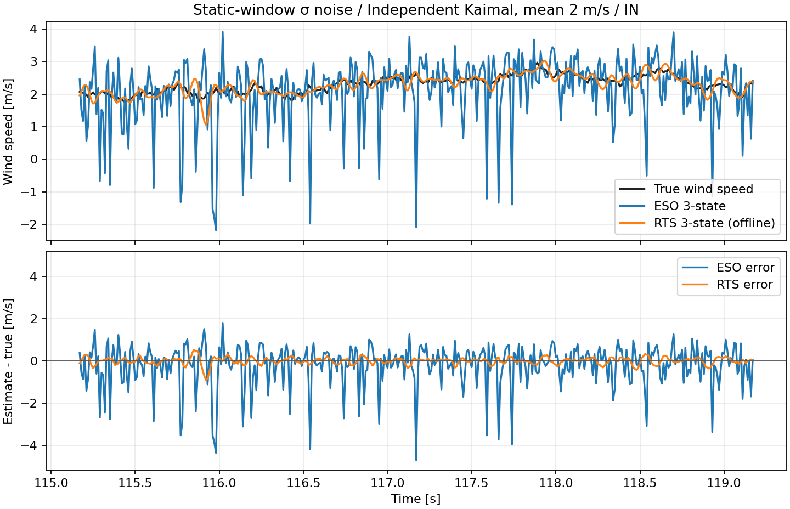

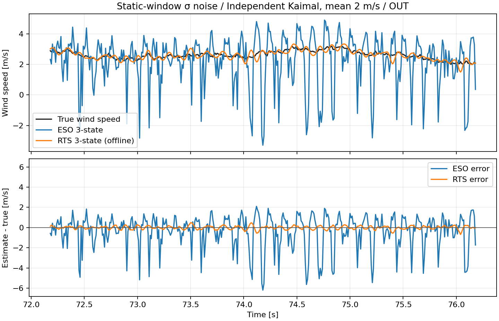

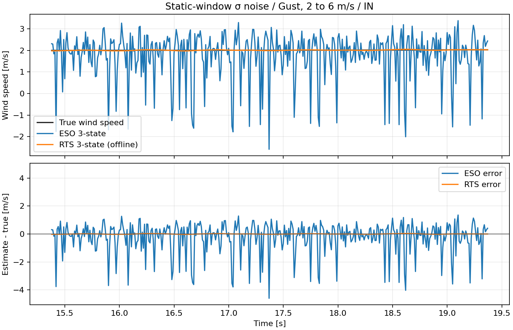

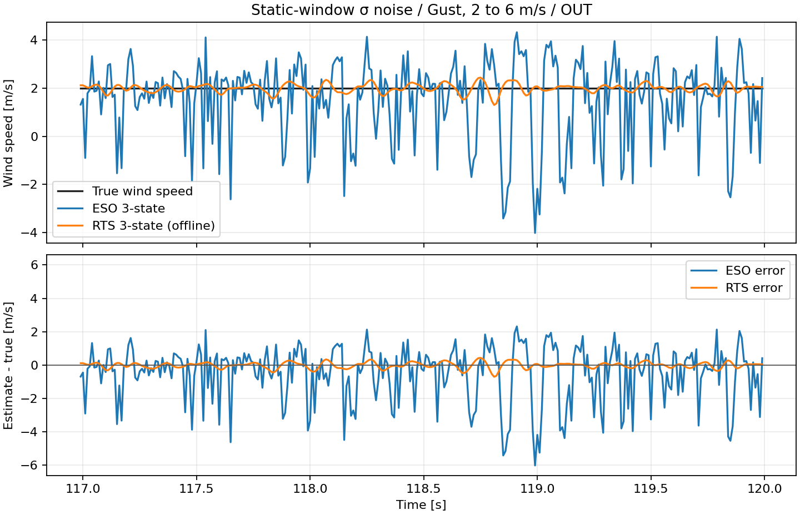


## 自由振動の実測波形によるゼロ風速妥当性確認（リリース状態・ゼロ点補正を反映）

前版では、波形選択区間の先頭角度と先頭0.2秒の平均傾きを初期条件にしていた。これはリリース時の角速度を表さず、OUTの一部波形では選択区間に静止待機が含まれていた。境界条件を取り直し、承認済みBALLの12波形（IN/OUT各6）を再評価した。

各軸の静止基線オフセットを、波形選択表の `baseline_deg`（IN +1.17202°、OUT −1.75328°）として実測角から差し引いた。保持ピークから0.15°以上離れた状態が3サンプル続く最初の点をリリースとし、その点の補正後角度を初期角、前後±50 msの二次近似の一次係数を初期角速度にした。初期外力は0。無風モデルはこの角度・角速度から積分し、開始3秒と終了0.5秒を除いて採点した。欠損角度サンプルは補間した。

この基線差し引きは、IMUでゼロ点を補正できるという想定を解析に反映したもので、独立した角度基準器で確認済みの補正精度ではない。補正対象はセンサーの静的オフセットであり、振り子の物理的なリリース角は0°に置き換えない。代表波形のリリース状態は次の通り。

| 代表波形 | 差し引いた静的オフセット [°] | 補正後リリース角 [°] | リリース角速度 [rad/s] |
|---|---:|---:|---:|
| IN_BALL_P_R01 | +1.17202 | +63.7509 | −0.3397 |
| OUT_BALL_P_R03 | −1.75328 | +63.1265 | −0.3492 |

測定角と同じ初期状態から外力0で積分したモデルとの角度残差には、センサー誤差だけでなく、摩擦・減衰・バックラッシュ等のプラント差や微小外乱が含まれる。従って残差をセンサー単体ノイズとは扱わない。モデル入力に対する推定風速は0 m/sとなるよう同じ観測器を適用した。

| 軸 | 観測器 | 波形数 | ゼロ風速推定RMSE [m/s] | Bias [m/s] | 波形平均除去後RMS [m/s] | 角度残差RMS [°] | 残差ACF lag1 |
|---|---|---:|---:|---:|---:|---:|---:|
| IN | ESO 3状態 | 6 | 1.5807 | +0.0612 | 1.5794 | 2.7255 | 0.9968 |
| IN | RTS 3状態（オフライン） | 6 | 0.4975 | +0.1604 | 0.4708 | 2.7255 | 0.9968 |
| OUT | ESO 3状態 | 6 | 1.0929 | −0.0242 | 1.0925 | 1.8389 | 0.9977 |
| OUT | RTS 3状態（オフライン） | 6 | 0.4820 | −0.0892 | 0.4735 | 1.8389 | 0.9977 |

### RTSの見かけが変わった要因の切り分け

「旧初期化か新初期化か」と「静的オフセット補正なし／あり」を分け、他の条件（実測12波形、RTSのq、採点区間3秒〜終了0.5秒前）を固定した。旧初期化は選択区間先頭の角度と最初の0.2秒の直線近似角速度、新初期化は検出リリース点の角度と前後±50 ms二次近似の角速度である。静的オフセットはIN +1.17202°、OUT −1.75328°を差し引いた。qはIN 3e−5、OUT 3e−4 N/sample。

| 条件 | 軸 | 無風角度残差RMS [°] | RTS風速RMSE [m/s] | RTS Bias [m/s] | Bias除去後RMS [m/s] |
|---|---|---:|---:|---:|---:|
| 旧初期化・補正なし | IN | 3.6233 | 0.9208 | +0.8963 | 0.2107 |
| リリース初期化・補正なし | IN | 3.2010 | 0.9207 | +0.8963 | 0.2107 |
| 旧初期化・オフセット補正あり | IN | 3.1881 | 0.4975 | +0.1605 | 0.4707 |
| リリース初期化・オフセット補正あり | IN | 2.7255 | 0.4975 | +0.1604 | 0.4708 |
| 旧初期化・補正なし | OUT | 3.9105 | 1.0381 | −1.0266 | 0.1542 |
| リリース初期化・補正なし | OUT | 2.7417 | 1.0380 | −1.0265 | 0.1541 |
| 旧初期化・オフセット補正あり | OUT | 3.3246 | 0.4822 | −0.0895 | 0.4737 |
| リリース初期化・オフセット補正あり | OUT | 1.8389 | 0.4820 | −0.0892 | 0.4735 |

角速度をリリース値へ直すと、無風モデルとの角度残差は下がるが、RTSの風速指標はほとんど変わらない。代表波形の角速度はINで旧 −3.64→新 −0.340 rad/s、OUTで旧 −2.68→新 −0.349 rad/sとなった。したがって、今回RTS波形の見え方が変わった主因は角速度初期化ではない。

静的オフセット補正を加えると、RTSの平均Biasはゼロに近づき、総RMSEはIN 0.9208→0.4975 m/s、OUT 1.0381→0.4820 m/sに改善する一方、Bias除去後の変動RMSは約0.21→0.47 m/s（IN）、0.15→0.47 m/s（OUT）へ増えた。旧波形は振動が小さく見えるものの、約±1 m/sの平均Biasを持っていた。新波形は平均が真値0に近い一方、残る周期的なモデル残差をRTSが風として出力する。このため、見た目の滑らかさと真値への誤差（RMSE）の順位が逆転して見える。

両初期状態は実装上、ゼロ風プラント基準波形とRTSの初期状態 `[θ₀, ω₀, F₀=0]` の両方に反映し、RTSには角度時系列を観測入力している。角速度時系列を別センサー観測として与えているわけではない。今回の切り分けからは、初期状態の修正が角度基準波形を改善し、静的オフセット補正がRTSのBias／変動配分を変えたことが確認できる。波形別結果は `ow05_free_decay_initial_condition_ablation.csv` に保存した。

### 風速換算前のRTS外力推定 \(F_t\)

換算式の影響を確かめるため、代表波形のRTS出力から風速換算前の外力推定値も取り出した。q・採点区間は前表と同じ。下表は採点区間の代表波形別集計で、力変動RMSは平均外力を除いたRMSである。

| 軸・波形 | 条件 | 平均外力 [N] | 外力変動RMS [N] | 風速変動RMS [m/s] |
|---|---|---:|---:|---:|
| IN / IN_BALL_P_R01 | オフセット補正なし | +0.001931 | 0.000631 | 0.154 |
| IN / IN_BALL_P_R01 | オフセット補正あり | +0.000236 | 0.000631 | 0.453 |
| OUT / OUT_BALL_P_R03 | オフセット補正なし | −0.002499 | 0.000697 | 0.154 |
| OUT / OUT_BALL_P_R03 | オフセット補正あり | −0.000089 | 0.000696 | 0.479 |

角度オフセット補正後も、換算前の外力の振動幅はほぼ同じです。一方、平均外力はゼロに近づきます。抗力換算 (v=\operatorname{sgn}(F)\sqrt{2|F|/(\rho C_d A)}) はゼロ近傍で傾きが大きいため、ほぼ同じ外力変動がより大きな風速変動として現れます。今回の振幅増加は主にこの非線形換算で説明でき、リリース角速度の修正によるものではありません。

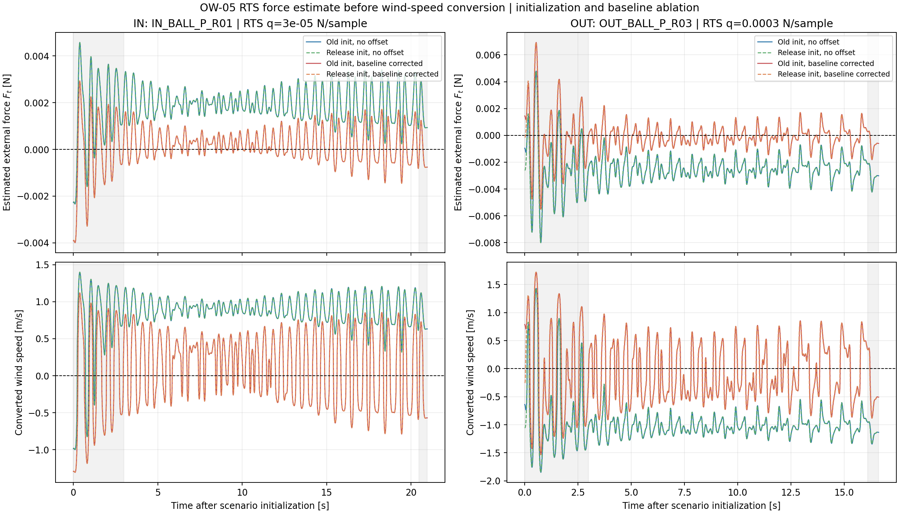

時系列の外力・換算風速は `ow05_free_decay_Ft_waveforms.csv`、上の集計値は `ow05_free_decay_Ft_summary.csv` に保存した。

### 2 m/s定常風に相当する外力オフセットを加えた換算テスト

換算の非線形性だけを見るため、補正後の自由振動で得たRTS外力時系列 (F_t) に、2 m/sに相当する一定抗力
[
F_{2}=\tfrac12\rho C_d A(2\,\mathrm{m/s})^2=0.0093527\,\mathrm{N}
]
を加え、その後に同じ力→風速換算を適用した。自由振動時の外力変動はそのまま保ち、外力の基準だけを2 m/s相当へ移している。これはプラント角度やRTSの状態を2 m/s風下で再計算した試験ではなく、換算式単体の切り分けである。

| 軸・代表波形 | 換算中心 | 推定平均風速 [m/s] | 2 m/sからのRMSE [m/s] | Bias除去後RMS [m/s] |
|---|---|---:|---:|---:|
| IN / IN_BALL_P_R01 | 0 m/s相当 | 0.146 | 0.476（真値0） | 0.453 |
| IN / IN_BALL_P_R01 | 2 m/s相当 | 2.024 | 0.071 | 0.066 |
| OUT / OUT_BALL_P_R03 | 0 m/s相当 | −0.069 | 0.484（真値0） | 0.479 |
| OUT / OUT_BALL_P_R03 | 2 m/s相当 | 1.989 | 0.076 | 0.075 |

この試算では、同じ外力変動をゼロ近傍から2 m/s相当の基準へ移すと、風速変動RMSはINで約6.8分の1、OUTで約6.4分の1になった。2 m/s近傍では推定平均も2 m/sに近い。ただしこれは「定常風が実際に流れると自由振動の外力残差が同じまま加算される」という換算上の仮定を置いた結果であり、実機の2 m/s定常風における最終誤差予測ではない。実際の定常風では釣合角とRTSの動作点も変わるため、次段階では角度軌道を含むプラント・観測器一体の評価が必要である。

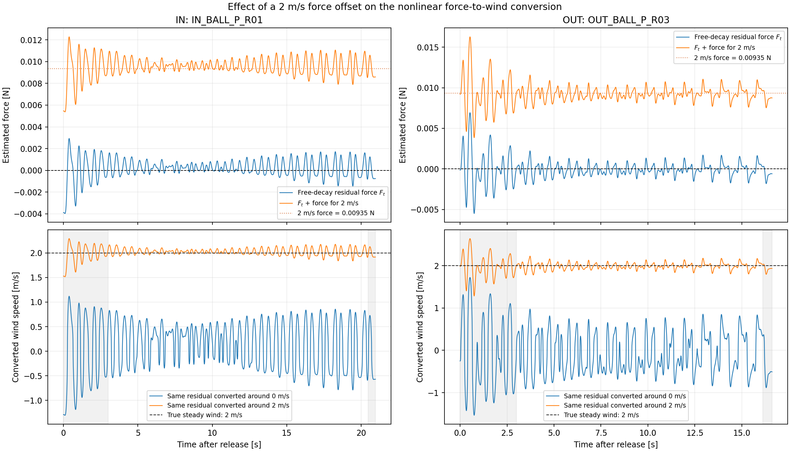

採点区間はリリース後3秒から末尾0.5秒前まで。波形は `ow05_free_decay_2ms_offset_waveforms.csv`、集計は `ow05_free_decay_2ms_offset_summary.csv` に保存した。

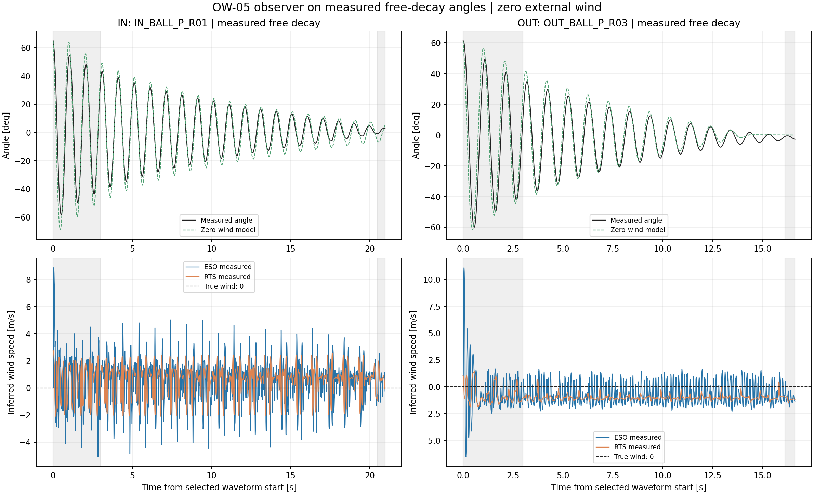

再初期化後、代表波形ではモデルと実測の角度包絡が前版より近づいた一方、残差は依然として強い時間相関を持つ。したがってゼロ風速時の推定変動は、白色センサーノイズだけでは説明できず、モデル差と実測摂動を含む。自由振動は観測器のゼロ風速妥当性確認に用い、これだけを根拠にセンサー精度や風速誤差を確定しない。

### 減衰包絡の軸差

採点区間の角度ピークに `log(|peak|)=intercept−λt` を当てはめた経験的減衰率を示す。これは単独の粘性減衰係数ではない。

| 軸 | 波形数 | 実測λ [/s] | 無風モデルλ [/s] | 実測周期 [s] | モデル周期 [s] | τ/I [rad/s²] | 二乗抵抗/I [s⁻¹] |
|---|---:|---:|---:|---:|---:|---:|---:|
| IN | 6 | 0.1340 | 0.1116 | 0.990 | 0.990 | 0.2158 | 0.0381 |
| OUT | 6 | 0.2162 | 0.2264 | 1.018 | 1.020 | 0.4770 | 0.0378 |

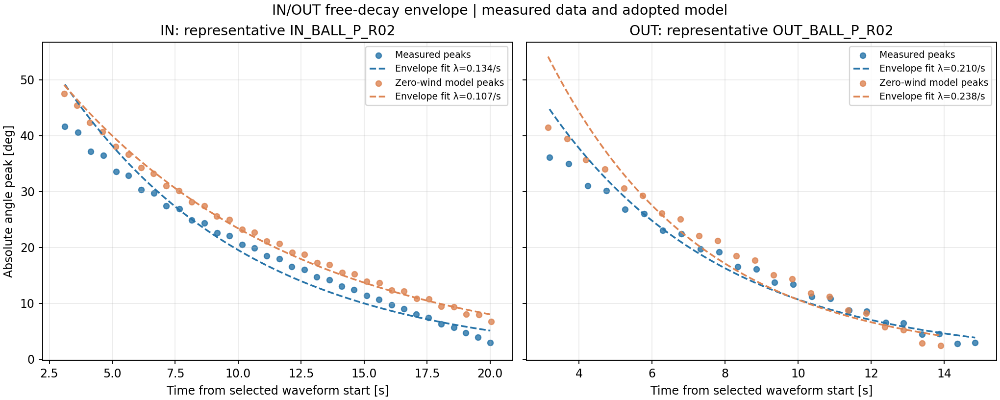

### 観測器設定感度の読み直し

角速度を含むリリース状態で初期化し直した結果、自由振動時の変動RMSも更新された。RTSのq別値を示す。小さいqほど自由振動の推定変動は小さくなるが、風変化への追従も抑えるため、自由振動だけで採用値を選ばない。

| q [N/sample] | IN変動RMS [m/s] | OUT変動RMS [m/s] |
|---:|---:|---:|
| 1e−3 | 1.1365 | 0.5216 |
| 3e−4 | 0.8911 | 0.4735 |
| 1e−4 | 0.6662 | 0.4449 |
| 3e−5 | 0.4708 | 0.3992 |
| 1e−5 | 0.3104 | 0.3476 |
| 1e−6 | 0.1575 | 0.3030 |
| 1e−7 | 0.0377 | 0.1183 |
| 1e−8 | 0.00193 | 0.00336 |
| 1e−9 | 0.000020 | 0.000034 |

今回の採用値IN q=3e−5、OUT q=3e−4は維持した。自由振動側の変動量だけでなく、別のKaimal・ガスト入力で測った追従性と併せた折衷値である。極端に小さいqは自由振動出力を平滑化するが、真の風変化も抑える。採用qの風追従評価や実効周波数応答は、前掲の独立シミュレーション結果を参照する。

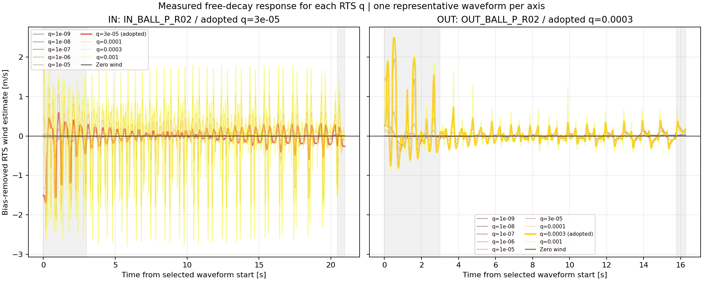

ESO極感度と白色近似との比較は、同じ修正後の初期条件で再計算した。ESO 12 Hzのゼロ風速推定RMSEはIN 1.5807 m/s、OUT 1.0929 m/s。角度残差に対するゲイン比は、時間相関したモデル残差にも依存するため、センサー単体の増幅倍率とは解釈しない。

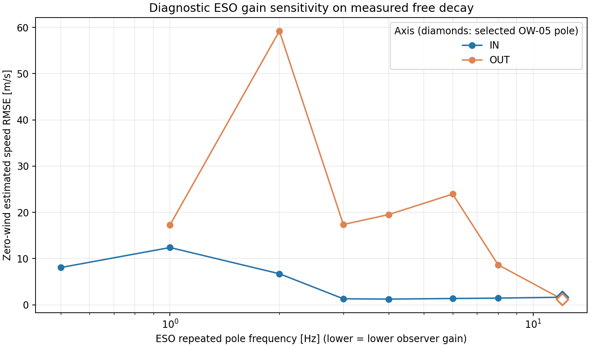

波形別初期状態と指標は `ow05_free_decay_metrics.csv`、軸・観測器別集計は `ow05_free_decay_summary.csv`、包絡値は `ow05_free_decay_axis_diagnostics.csv` に保存した。全図はリリース時刻を0秒とする。

## 公称センサー条件の拡大時系列

各図は最大誤差時刻を中心に±2秒を表示する。上段は真値と推定風速、下段は誤差。同じ風条件・軸のESO図とRTS図では、上段と下段それぞれの縦軸範囲を共通にして比較できるようにした。描画環境に日本語フォントがないため、図中ラベルは英語表記とし、本文と図題は日本語で記載する。


## 解釈と選定

RTS（Rauch–Tung–Striebel）スムーザーは、まず時系列を前向きに推定し、その後、将来の観測も使って過去の状態推定を後向きに修正する。時間的に独立なホワイトノイズによる一時的な観測の揺れが、運動モデルや前後の観測と整合しない場合、その揺れを実際の状態変化ではなく観測ノイズとして扱いやすくなり、推定への影響を弱められる。これは未来の観測が過去の観測ノイズを物理的に打ち消すという意味ではなく、全時系列に最も整合する状態系列を再推定する効果である。

この平滑化は、運動モデルが十分妥当で、観測ノイズとモデル誤差の大きさ（観測・プロセス雑音の共分散）が適切に設定されていることを前提とする。ノイズが時間相関を持つ場合、その影響は独立な白色ノイズほど平均化されない。また、実際の急な風速変化をモデルが説明できないときに平滑化が強すぎると、真の変化まで抑えたり、遅らせたりする可能性がある。したがって、オフラインRTSは必ずノイズに強いわけではなく、今回の低い誤差をホワイトノイズ単独の効果と断定することもできない。今回のセンサー条件には白色ノイズに加えて有色ノイズも含まれるため、成分ごとの寄与を分けるには追加の比較が必要である。

RTS 3状態は将来データを使うオフライン評価であるため、RMSEが小さくてもオンライン実装候補とは分ける。オンライン用途はESO 3状態を候補とし、公称ノイズ条件に対する帯域選定を反映した値を使用する。RTSはログ解析や遅延許容用途の基準として残す。ノイズ2倍感度を含む推定誤差は `ow05_metrics.csv`、増幅倍率は `ow05_noise_amplification.csv`、調整スキャンは `ow05_tuning_scan.csv` に保存した。

## 追試：球あり自由振動の時系列係数再フィット

承認済みのBALL自由振動12波形（IN/OUT各6本）に、無風の非線形運動方程式を直接合わせました。絶対慣性Iは既存値に固定し、K/I・b/I・c/I・τ/Iを軸ごとにフィットしています。球あり構成は維持し、従来0に固定していた粘性項bも有効係数としてフィット対象に含めました。

| 評価 | IN RMSE [deg] | OUT RMSE [deg] |
|---|---:|---:|
| 現行係数・全12波形内 | 3.579 | 3.890 |
| 再フィット係数・全12波形内 | 2.717 | 2.839 |
| 1波形除外の交差検証：現行係数 | 3.579 | 3.890 |
| 1波形除外の交差検証：再フィット | 2.932 | 2.926 |

自由振動波形の角度誤差が別波形でも下がったため、係数のずれはモデル残差の一因と考えられます。ただし平均残差RMSは依然約2.7〜2.9°で、残差のラグ1自己相関も約0.997と周期性が残ります。さらに、再フィット係数にしてもRTS推定のBias除去後変動RMSは低下しませんでした。したがって、オブザーバーに見える周期的な風推定を係数誤差だけで説明することはできません。

| 軸 | 係数 | 初期q=0.001 RMS [m/s] | 見直し後q RMS [m/s] |
|---|---|---:|---:|
| IN | 現行 | 1.065 | 0.195 |
| IN | 再フィット | 1.066 | 0.202 |
| OUT | 現行 | 0.222 | 0.154 |
| OUT | 再フィット | 0.234 | 0.193 |

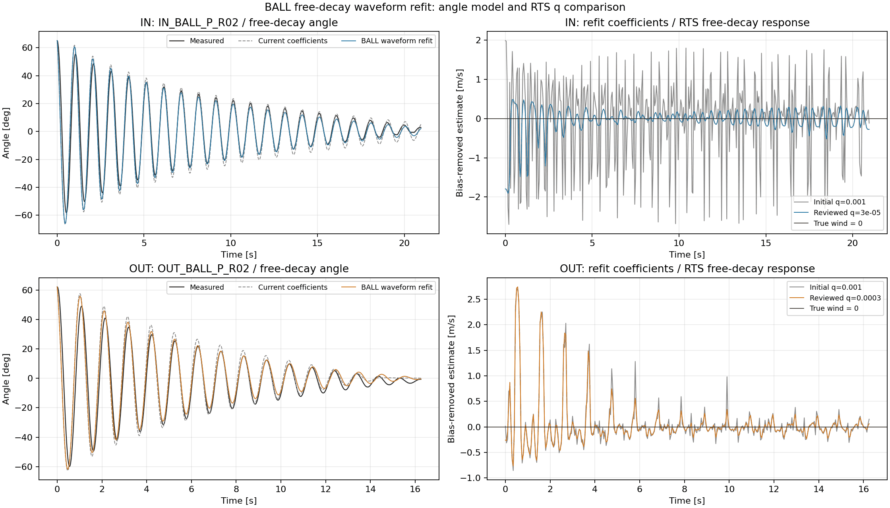

再フィット係数は診断用として別ファイルに保存し、採用係数レジストリには反映していません。自由振動のみでは絶対Iとトルク係数を一意に分けられず、bの非ゼロ値も粘性摩擦の実在を立証しません。係数、12波形別指標、交差検証、代表波形データは `ow05_ball_free_decay_refit_coefficients.csv/json`、`ow05_ball_free_decay_refit_summary.csv`、`ow05_ball_free_decay_refit_leave_one_out.csv`、`ow05_ball_free_decay_refit_waveforms.csv` に保存しました。再生成は `python 06_Analysis/simulation/src/fit_ow05_ball_free_decay_coefficients.py` で行えます。詳細は [係数再フィットレポート](OW05_BALL_FREE_DECAY_REFIT_REPORT.md) を参照してください。

## 理論値による誤差要因の切り分け（追試）

実測値を使わず、採用プラントと同一係数のRTSで、最大角度60°を保持する風相当（IN 7.834 m/s、OUT 7.637 m/s）から0 m/sへのステップを計算した。さらにOW-04の係数ずれとOW-05公称センサーノイズを別々に加え、独立Kaimal乱流と滑らかな2→6 m/sガストも同条件で比較した。

| 理論入力 | 軸 | 完全一致 RMSE [m/s] | OW-04係数ずれ RMSE [m/s] | センサーノイズ RMSE [m/s] |
|---|---|---:|---:|---:|
| 60°保持相当→0ステップ | IN | 0.2622 | 1.2019 | 0.2759 |
| 60°保持相当→0ステップ | OUT | 0.1669 | 0.9557 | 0.2743 |
| Kaimal 平均2 m/s | IN | 0.0829 | 0.1520 | 0.0830 |
| Kaimal 平均2 m/s | OUT | 0.0627 | 0.1229 | 0.0644 |
| 滑らかガスト 2→6 m/s | IN | 0.0006 | 0.1549 | 0.0028 |
| 滑らかガスト 2→6 m/s | OUT | 0.0001 | 0.1633 | 0.0127 |

完全一致・無雑音でも急なゼロ風ステップでは誤差が残る一方、滑らかなガストではほぼゼロだった。①では信号に乱数を加えていないものの、RTSの角度観測標準偏差Rは公称0.02°に固定しており、理想逆演算器ではない。q感度では、qを上げるとステップRMSEがIN 0.262→0.110 m/s、OUT 0.167→0.101 m/sまで下がった。100→200 Hzの積分刻み比較によるRMSE変化はIN +0.0014、OUT +0.0032 m/sであり、刻み幅の寄与だけでは差を説明できない。したがって自由振動での大きな誤差は、係数ずれやセンサーノイズだけでなく、段差外力に対するRTSのR/q設定にも強く依存する。

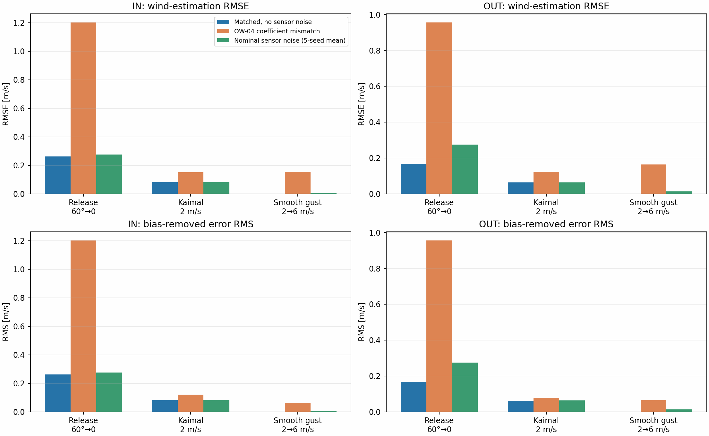

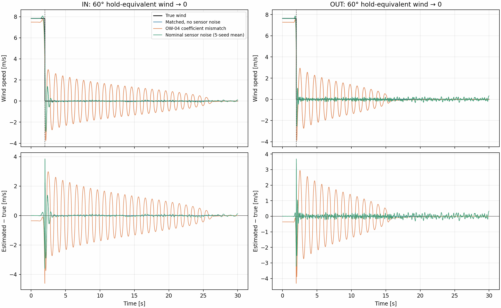

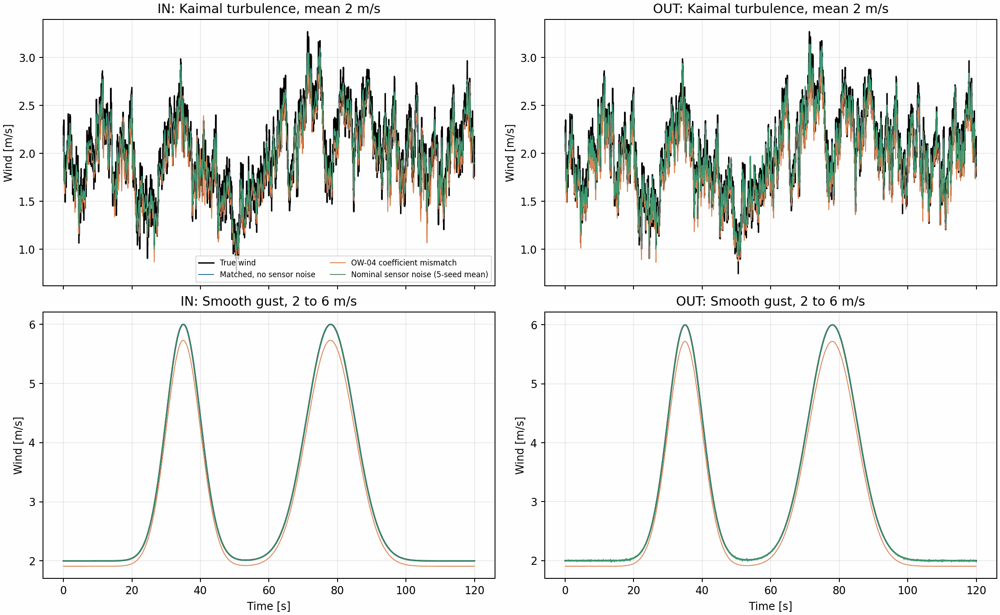

風モデル波形の拡大図では、Kaimal乱流の先頭10秒と、滑らかガスト第1パルスの25〜45秒を表示する。

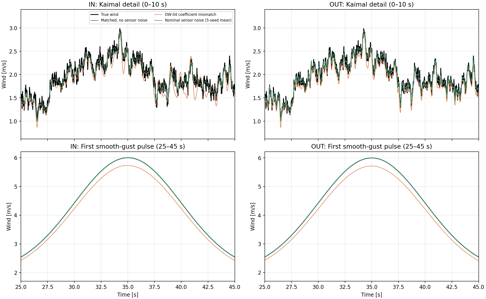

[理論値による切り分けレポート](../ow05_theoretical_error_separation/OW05_THEORETICAL_ERROR_SEPARATION.md)、係数・センサー条件ごとのCSV、および再生成スクリプト `python 06_Analysis/simulation/src/run_ow05_theoretical_error_separation.py` を参照。

## 固有振動数近傍でモデル係数誤差が増幅する理由

周波数追試では、平均風速2 m/s、風速変動振幅0.25 m/sで入力周波数を0.1、0.25、0.5、1、2 Hzと変えた。1 Hzで角度応答と風速推定誤差が大きくなった。これは自由振動の周期と同程度の周期で風を変化させたとき、振り子の応答とモデルずれによる残差が大きくなった結果と整合する。ただし、採用モデルには振幅依存の摩擦・二乗抵抗があるため、単純な線形共振式だけで結果を定量説明することはできない。

回転軸に粘性ダンパーを追加する場合、ダンパーのトルクは回転速度に比例し、運動方向と逆向きに働く。係数を $b$ とすると、風力トルクも含めた運動方程式は

\[
I\ddot{\theta}
+b\dot{\theta}
+K\sin\theta
+c|\dot{\theta}|\dot{\theta}
+\tau\tanh(\dot{\theta}/\epsilon)
=LF(t)\cos\theta
\]

となる。自由振動では外力がないため右辺を0とする。粘性ダンパーのトルク自体は $T_b=-b\dot{\theta}$ であり、上式では左辺に $+b\dot{\theta}$ として加わる。$b$ の単位は N·m·s/rad（radを無次元とすれば N·m·s）である。現在の採用係数では $b=0$ としており、実機にダンパーを追加するなら、その減衰係数を測定または同定してモデルにも反映する必要がある。

### 角度応答の線形近似とその限界

定常風に対する釣合角を $\theta_0$ とし、その周りの微小変動を考える。線形化した運動方程式は概略、

\[
I\,\delta\ddot{\theta}
+c_{\mathrm{eff}}\,\delta\dot{\theta}
+k_{\mathrm{eff}}\,\delta\theta
\simeq L\cos\theta_0\,\delta F
\]

となる。$L$ は風力の腕長、$k_{\mathrm{eff}}=K\cos\theta_0+LF_0\sin\theta_0$ は動作点での実効剛性、$F_0$ は平均風に相当する定常力である。線形化した減衰を $c_{\mathrm{eff}}$ と表す。静止点近傍では、粘性項による $b$ と平滑化クーロン摩擦の傾き $\tau/\epsilon$ が効き、二乗抵抗の一次微分はゼロとなるため、概ね $c_{\mathrm{eff}}=b+\tau/\epsilon$ である。現行採用値は $b=0$ だが、回転ダンパーを追加すれば $b$ が加わる。

角周波数 $\omega$ の正弦外力に対する角度応答は、

\[
\left|\frac{\delta\theta}{\delta F}\right|
\simeq
\frac{L\cos\theta_0}
{\sqrt{(k_{\mathrm{eff}}-I\omega^2)^2+(c_{\mathrm{eff}}\omega)^2}}
\]

で表せる。慣性項 $I\omega^2$ と復元項 $k_{\mathrm{eff}}$ が近づく周波数帯では、減衰が十分小さければ角度応答が大きくなる。一方、減衰が強ければ共振ピークは抑えられる。

無風・小振幅の**無減衰周波数尺度**は $f_0=\sqrt{K/I}/(2\pi)$ で、IN約1.015 Hz、OUT約0.985 Hzとなる。これは自由振動モデルの有限振幅周期（IN 0.990 s、OUT 1.020 s）の逆数とも近く、今回の1 Hz入力が自由振動の周期に近いことを示している。ただし、この $f_0$ を採用モデルの正確な減衰固有振動数とみなすことはできない。

採用モデルではクーロン摩擦を $\tau\tanh(\dot\theta/\epsilon)$ と平滑化している。静止点近傍だけを線形化すると、この項は減衰係数 $\tau/\epsilon$ に相当する。今回の値では $\epsilon=0.5$ deg/s とした局所減衰が強く、原点近傍の線形化は両軸とも過減衰となる。したがって、静止点まわりの線形式だけから「1 Hzで鋭い共振が起きる」と結論するのは適切でない。有限振幅では $\tanh$ 摩擦が飽和し、二乗抵抗も速度に応じて変わるため、実効減衰は運動振幅・速度に依存する。

実際の周波数追試では、1 Hz入力時のプラント最大角度がIN 45.6°、OUT 32.0°となり、他の周波数点より大きかった。今回の非線形シミュレーションでは、無減衰周波数尺度に近い入力で大きな角度応答が実際に生じている。一方、周波数点は粗いため、ピーク位置・幅を特定した結果ではない。

### 係数ずれが風力推定誤差になる

角度から風力を逆算するモデルの慣性・剛性・減衰係数が真値とずれていると、角度運動を説明できない分が推定外力の残差となる。動作点近傍の概略式は、

\[
\delta\widehat F-\delta F
\simeq
\frac{
\Delta I\,\delta\ddot\theta+
\Delta c_{\mathrm{eff}}\,\delta\dot\theta+
\Delta k_{\mathrm{eff}}\,\delta\theta
}{L\cos\theta_0}
\]

である。正弦運動では $\delta\ddot\theta=-\omega^2\delta\theta$ なので、慣性係数ずれは周波数の二乗に応じた残差を作り、剛性・減衰係数ずれも角度・速度に応じた残差を作る。角度応答が大きい周波数帯では、それらの残差も大きくなり得る。

線形近似でモデルずれが真の変動力に対してどれだけ効くかは、概略、

\[
\left|\frac{E_F}{\delta F}\right|
\simeq
\frac{
|\Delta k_{\mathrm{eff}}-\omega^2\Delta I
+j\omega\Delta c_{\mathrm{eff}}|
}{
|k_{\mathrm{eff}}-I\omega^2+j\omega c_{\mathrm{eff}}|
}
\]

と表せる。この式は、減衰が小さく分母が小さくなると係数ずれが相対的に強く表れ得ることを示す。ただし、今回の平滑化摩擦・二乗抵抗を含む有限振幅のプラント、および $q/R$ と未来観測を使うRTSの出力を表す厳密な伝達関数ではない。機構と逆算誤差の関係を示す説明用の線形近似として扱う。

### 今回の結果と結論できる範囲

1 Hzでのシフト補正後波形形状NRMSEは、係数一致RTSでIN 0.058、OUT 0.024、OW-04係数ずれ100% RTSでIN 5.09、OUT 2.43だった。同じ入力で静的換算はIN 18.57、OUT 13.64だった。今回の結果は、係数ずれがあると揺れやすい周波数帯で推定誤差が強くなることを示している。

風速を正弦波にしても、風力は $F=\tfrac12\rho C_dA U|U|$ で決まるため、厳密には純粋な正弦外力ではない。さらに、周波数試験の点数は5点で、センサー雑音なしの単一正弦波シミュレーションである。したがって、誤差ピークが厳密に1 Hzにあること、また変化率に対して誤差が単調に増えることまでは結論できない。固有振動数近傍の細かい周波数掃引と、減衰・振幅を変えた比較が次の確認項目である。

全指標・条件・比較図は [振幅・周波数比較の結果](../ow05_model_error_slew_comparison/README_ja.md) を参照。

## 再実行

```bash
python 06_Analysis/simulation/src/run_ow05_sensor_nonideality.py
```
