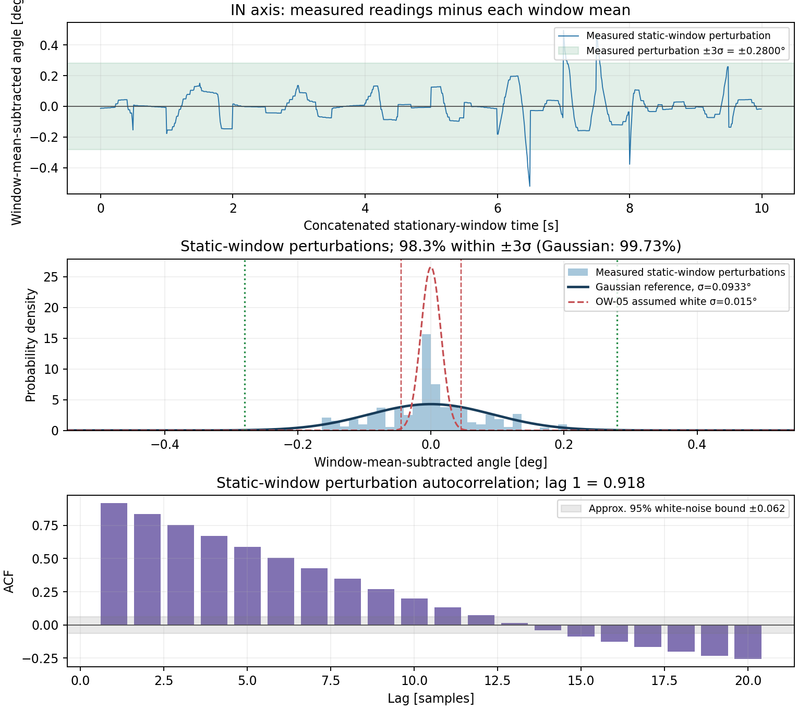
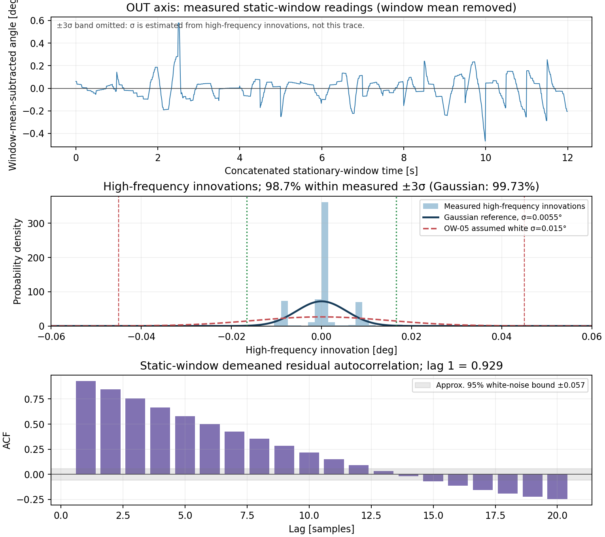

# OW-05 センサー非理想性とオブザーバー選定

## 目的・結論

OW-03で角度±60°内だった独立Kaimal乱流（平均2 m/s、TI 20%）と2→6 m/sガストを使い、採用BALLプラントにセンサーの量子化、ノイズ、遅延を含めて比較した。比較対象はオンラインの3状態ESOと未来データを使うオフライン3状態RTS。4状態ESOはOW-03で除外済みのため含めない。

公称センサー条件では、風条件・軸ごとのRMSE最小方式は下表の通り。帯域/プロセス雑音は別seedの平均3 m/s Kaimal訓練波形で方式ごと・軸ごとに一度だけ選定し、検証波形には再調整せず適用した。最大角度は全ケースで±60°内である。

| 風条件 | 軸 | ESO RMSE | RTS RMSE |
|---|---|---:|---:|
| 独立Kaimal乱流 平均2 m/s TI20% | IN | 0.19935 m/s | 0.06362 m/s |
| 独立Kaimal乱流 平均2 m/s TI20% | OUT | 0.31615 m/s | 0.06674 m/s |
| ガスト 2→6 m/s | IN | 0.10056 m/s | 0.02227 m/s |
| ガスト 2→6 m/s | OUT | 0.12416 m/s | 0.02726 m/s |

## センサー条件

角度サンプルは100 Hz、MT6701の14 bit（量子化幅0.02197266°）、白色ノイズσ=0.015°、有色ノイズσ=0.010°・時定数0.475 s、固定遅延10 msを公称条件とした。センサー段階評価に従った設定であり、量子化/サンプリング仕様以外のノイズと遅延は実測前の暫定仮定である。感度としてノイズσを2倍にした条件も計算した。

## MT6701の計測角出力誤差と静止区間の変動

本レポートでは、MT6701を含む計測系を「真の角度 $\\theta_{\\mathrm{true}}$ から計測角 $\\theta_{\\mathrm{meas}}$ への変換」と定義する。センサー出力誤差は $e_s=\\theta_{\\mathrm{meas}}-\\theta_{\\mathrm{true}}$ とし、量子化やセンサー内の信号処理による誤差も含める。

今回の角度ログには同時刻の真角度基準がないため、$e_s$ を直接求めることはできない。そこで、自由振動開始前のリリース直前から静止条件を満たす0.5秒窓（符号付き角度35°超、標準偏差0.20°未満、線形ドリフト1°/s未満）を抽出し、記録された計測角の変動を評価した。各静止窓で平均値だけを差し引いた残差 $r_i=y_i-\bar{y}_{\mathrm{window}}$ に隣接点二階差分 $e_i=(r_i-(r_{i-1}+r_{i+1})/2)/\\sqrt{1.5}$ を適用した。独立な白色成分を仮定すれば、この変換後の標準偏差は元の変動成分のσに対応する。下表のσは**計測角の高周波変動相当値**であり、真角度との差として定義したMT6701のセンサー出力誤差そのものではない。実角度の微小変化も記録角に含まれる可能性がある。

| 軸 | 静止窓数 | 高周波点数 | 計測角変動相当σ [°] | 変動相当±3σ [°] | OW-05仮定白色σ [°] | 仮定/変動相当 |
|---|---:|---:|---:|---:|---:|---:|
| IN | 20 | 960 | 0.00484 | ±0.01452 | 0.01500 | 3.10× |
| OUT | 24 | 1152 | 0.00554 | ±0.01662 | 0.01500 | 2.71× |

図の上段の青線は、各静止窓で実際に記録した計測角から、その窓内の平均値だけを引いた実測値である。線形トレンド除去や平滑化はしていない。中央の棒は、この平均差し引き後の波形から二階差分で抽出した高周波イノベーションの実測分布である。濃い青線は実測波形ではなく、イノベーションの標準偏差を用いて重ねた正規分布の参考曲線（Gaussian reference）である。正規性検定では両軸とも正規分布を棄却し（p<0.001）、ラグ1自己相関も白色雑音の95%目安範囲を大きく超えたため、この曲線は実データに適合する分布を示すものではない。下段は窓平均差し引き後の実測値の自己相関である。したがって、観測された変動を正規白色雑音とみなす仮定は支持されない。±3σ内の比率IN 98.0%、OUT 98.7%は、二階差分で得た**高周波イノベーション**を対象に数えた値である（理想正規分布なら99.73%）。窓平均を引いた実測波形とイノベーションは別の系列であり、イノベーションから推定したσを実測波形の時系列に帯として重ねてはならない。従来図の上段にあった緑帯はこの不一致を生むため、再生成図では除く。3σ線と包含率はイノベーションのヒストグラムにだけ表示する。図の赤破線は同ヒストグラム上でOW-05仮定σ=0.015°の±3σを示す。これらはいずれも真角度に対するセンサー出力誤差の包含率ではない。

14 bitの量子化幅は0.02197°で、計測角変動相当σより大きい。これは分解能と記録変動の比較であって、センサー出力誤差がこの幅以下または以上だという意味ではない。真角度基準なしでは、量子化を含むセンサー出力誤差の大きさや3σ幅は決められない。誤差幅を求めるには、MT6701と同時に、十分な精度の独立した角度基準を記録する必要がある。





詳細値は `ow05_measured_noise_summary.csv`、使用した静止区間は `ow05_measured_noise_windows.csv` に保存した。

## 今回特定できた誤差範囲と今後の課題

センサーを真角度 $\\theta_{\\mathrm{true}}$ から計測角 $\\theta_{\\mathrm{meas}}$ への変換系と定義すると、評価対象は $e_s(\\theta,t)=\\theta_{\\mathrm{meas}}(\\theta,t)-\\theta_{\\mathrm{true}}(t)$ である。誤差要因は次のように整理できる。

| 誤差要因 | 内容 | 今回の特定状況 |
|---|---|---|
| 分解能・量子化 | 有限の角度コード幅とコード化誤差 | OW-05モデルで14 bit、1 LSB=0.02197266°として設定。これは刻み幅であり、真角度との誤差や全体精度の上限ではない |
| オフセット・ゼロ点 | 計測角の基準ずれ | 真角度基準がなく未特定 |
| ゲイン・リニアリティ | 角度に応じた傾き誤差、非直線性 | 未特定。今回のσや±3σからは評価できない |
| 繰返し性・時間変動 | 同じ真角度での出力ばらつき、電子的な揺れ | 真角度を固定した基準測定がなく、センサー分は分離できていない。今回算出したIN σ=0.00484°、OUT σ=0.00554°は、静止区間の記録角から求めた高周波変動相当値 |
| 動的応答・タイミング | 内部フィルタ、遅れ、サンプリング時刻の揺れ | OW-05では100 Hz、固定遅延10 ms等をモデル仮定として設定。実機の遅延・帯域・ジッタは未測定 |
| 取付け・磁気条件 | 芯ずれ、傾き、磁石配置や磁場状態による角度依存誤差 | 実機条件での角度基準比較がなく未特定 |

したがって、今回数値として特定したのは、モデルに設定した14 bitのコード刻み幅と、自由振動開始前の静止窓に現れた計測角の高周波変動相当幅です。センサー出力誤差 $e_s$ の最大幅、リニアリティ誤差、センサー単体のノイズ幅は今回特定できていません。図に示した±3σも高周波変動相当値の範囲であり、センサー出力誤差の範囲ではありません。

### 今後の試験メニュー

1. **独立角度基準との同時測定**  
   MT6701の使用時と同じ磁石・取付け・配線・読み出し処理を用い、精度が既知の角度基準と同期して記録する。基準器の誤差は、評価したいセンサー誤差より十分小さくする。生の読み値、変換後の角度、時刻も保存する。

2. **使用角度範囲の静的な往復掃引**  
   角度を複数点で止めて安定後に記録し、正方向・逆方向に複数回掃引する。基準との差から、ゼロ点オフセット、ゲイン誤差、リニアリティを求める。リニアリティは採用した基準直線を明示し、直線からの最大偏差と偏差幅で示す。往復差も角度ごとに評価する。

3. **固定角度での繰返し測定**  
   使用範囲内の複数角度で真角度を固定し、同じ条件で繰り返し記録する。センサー出力の繰返し性、時間変動、高周波ノイズを評価する。量子化の影響を見落とさないよう、一つの角度だけでなく複数角度で測る。

4. **既知の角度運動による動的応答試験**  
   基準角を同時記録しながら、複数の速度・周波数で角度を動かす。固定遅延、帯域、振幅誤差、サンプリング時刻の揺れを、静的な角度誤差と分けて確認する。

5. **使用環境の影響確認**  
   必要に応じて温度、電源、磁石の位置・取付け状態を変えて、角度誤差と再現性への影響を測る。まず実使用条件を優先する。

6. **誤差幅の集計**  
   真角度との差の角度依存曲線、最大絶対誤差、リニアリティ、往復差、繰返し性、時間変動、動的遅れを分けて報告する。ヒストグラム・自己相関も確認し、正規性と白色性が妥当な場合に限って±3σをノイズ幅の目安とする。

まずは **1の基準器との同時測定**と **2の静的往復掃引**を優先する。今回の記録角変動相当σおよび±3σは、これらの試験で真角度基準との差を測定するまで、センサー出力誤差の幅として扱わない。

## 角度ノイズから風速への増幅倍率

線形基準は、ノイズなしセンサー角度θ₀の近傍における静的な角度→風速写像の傾きで求めた。各時点の角度摂動Δθを、局所傾き g(θ₀)=dV/dθ（θ=θ₀で評価）に掛け、線形基準風速摂動 $v_{\mathrm{lin}}(t)=g(\theta_0(t))\Delta\theta(t)$ とした。角度摂動は、遅延・ゲイン・オフセット・量子化・ジッタを保って乱数ノイズだけを0にしたセンサー出力との差である。局所線形近似の妥当性確認として $\lvert\Delta\theta\rvert \leq 0.1\lvert\theta_0\rvert$ を満たす評価点の割合も記載した。これを満たさない時点では、線形基準倍率を慎重に解釈する。観測器側は、同一条件におけるノイズあり/なし推定出力差 $\Delta\hat{V}$ を全評価時点（15秒以降）で比較した。RMSE倍率は $\mathrm{RMS}(\Delta\hat{V})/\mathrm{RMS}(v_{\mathrm{lin}})$、最大値倍率は $\max_t \lvert\Delta\hat{V}(t)\rvert/\max_t \lvert v_{\mathrm{lin}}(t)\rvert$ である。


### 独立Kaimal乱流 平均2 m/s TI20%・IN軸

| ノイズ条件 | 推定器 | 角度ノイズRMSE [deg] | 線形条件成立 [%] | 基準RMSE [m/s] | 出力RMSE [m/s] | RMSE倍率 | 95%値倍率 |
|---|---|---:|---:|---:|---:|---:|---:|
| 公称 | ESO 3状態 | 0.02073 | 99.5 | 0.016496 | 0.158007 | 9.578 | 37.084 |
| 公称 | RTS 3状態（オフライン） | 0.02073 | 99.5 | 0.016496 | 0.034514 | 2.092 | 8.130 |
| 2倍 | ESO 3状態 | 0.03837 | 98.9 | 0.011681 | 0.308132 | 26.378 | 37.625 |
| 2倍 | RTS 3状態（オフライン） | 0.03837 | 98.9 | 0.011681 | 0.061631 | 5.276 | 8.076 |

| ノイズ条件 | 推定器 | 基準最大値 [m/s] | 出力最大値 [m/s] | 最大値倍率 |
|---|---|---:|---:|---:|
| 公称 | ESO 3状態 | 1.443755 | 1.733567 | 1.201 |
| 公称 | RTS 3状態（オフライン） | 1.443755 | 0.171004 | 0.118 |
| 2倍 | ESO 3状態 | 0.721878 | 2.486851 | 3.445 |
| 2倍 | RTS 3状態（オフライン） | 0.721878 | 0.402897 | 0.558 |

### 独立Kaimal乱流 平均2 m/s TI20%・OUT軸

| ノイズ条件 | 推定器 | 角度ノイズRMSE [deg] | 線形条件成立 [%] | 基準RMSE [m/s] | 出力RMSE [m/s] | RMSE倍率 | 95%値倍率 |
|---|---|---:|---:|---:|---:|---:|---:|
| 公称 | ESO 3状態 | 0.01963 | 100.0 | 0.003179 | 0.257590 | 81.035 | 77.777 |
| 公称 | RTS 3状態（オフライン） | 0.01963 | 100.0 | 0.003179 | 0.037352 | 11.751 | 12.060 |
| 2倍 | ESO 3状態 | 0.03675 | 100.0 | 0.005959 | 0.510122 | 85.604 | 77.436 |
| 2倍 | RTS 3状態（オフライン） | 0.03675 | 100.0 | 0.005959 | 0.063998 | 10.740 | 10.849 |

| ノイズ条件 | 推定器 | 基準最大値 [m/s] | 出力最大値 [m/s] | 最大値倍率 |
|---|---|---:|---:|---:|
| 公称 | ESO 3状態 | 0.017972 | 2.243913 | 124.857 |
| 公称 | RTS 3状態（オフライン） | 0.017972 | 0.162403 | 9.037 |
| 2倍 | ESO 3状態 | 0.035944 | 3.323602 | 92.467 |
| 2倍 | RTS 3状態（オフライン） | 0.035944 | 0.300146 | 8.350 |

### ガスト 2→6 m/s・IN軸

| ノイズ条件 | 推定器 | 角度ノイズRMSE [deg] | 線形条件成立 [%] | 基準RMSE [m/s] | 出力RMSE [m/s] | RMSE倍率 | 95%値倍率 |
|---|---|---:|---:|---:|---:|---:|---:|
| 公称 | ESO 3状態 | 0.01967 | 100.0 | 0.002551 | 0.104534 | 40.984 | 46.940 |
| 公称 | RTS 3状態（オフライン） | 0.01967 | 100.0 | 0.002551 | 0.024151 | 9.469 | 10.982 |
| 2倍 | ESO 3状態 | 0.03802 | 100.0 | 0.004965 | 0.200306 | 40.344 | 39.993 |
| 2倍 | RTS 3状態（オフライン） | 0.03802 | 100.0 | 0.004965 | 0.044383 | 8.939 | 8.805 |

| ノイズ条件 | 推定器 | 基準最大値 [m/s] | 出力最大値 [m/s] | 最大値倍率 |
|---|---|---:|---:|---:|
| 公称 | ESO 3状態 | 0.013764 | 0.553211 | 40.191 |
| 公称 | RTS 3状態（オフライン） | 0.013764 | 0.114383 | 8.310 |
| 2倍 | ESO 3状態 | 0.020647 | 1.148612 | 55.632 |
| 2倍 | RTS 3状態（オフライン） | 0.020647 | 0.199577 | 9.666 |

### ガスト 2→6 m/s・OUT軸

| ノイズ条件 | 推定器 | 角度ノイズRMSE [deg] | 線形条件成立 [%] | 基準RMSE [m/s] | 出力RMSE [m/s] | RMSE倍率 | 95%値倍率 |
|---|---|---:|---:|---:|---:|---:|---:|
| 公称 | ESO 3状態 | 0.02001 | 100.0 | 0.002527 | 0.129178 | 51.111 | 53.097 |
| 公称 | RTS 3状態（オフライン） | 0.02001 | 100.0 | 0.002527 | 0.030314 | 11.994 | 13.149 |
| 2倍 | ESO 3状態 | 0.03775 | 100.0 | 0.004734 | 0.250589 | 52.935 | 51.447 |
| 2倍 | RTS 3状態（オフライン） | 0.03775 | 100.0 | 0.004734 | 0.047642 | 10.064 | 10.091 |

| ノイズ条件 | 推定器 | 基準最大値 [m/s] | 出力最大値 [m/s] | 最大値倍率 |
|---|---|---:|---:|---:|
| 公称 | ESO 3状態 | 0.013022 | 0.560705 | 43.058 |
| 公称 | RTS 3状態（オフライン） | 0.013022 | 0.138432 | 10.631 |
| 2倍 | ESO 3状態 | 0.018993 | 2.418837 | 127.355 |
| 2倍 | RTS 3状態（オフライン） | 0.018993 | 0.196321 | 10.337 |

増幅倍率は全点RMSE比を主指標、絶対値95パーセンタイル比を外れ値に頑健な補助指標、最大絶対値比をピーク影響の補助指標として併記した。最大値倍率は単一点に強く左右されるため慎重に読む。線形基準は準静的な写像であり、動的な真値風速誤差の代用ではない。観測器の履歴依存性はノイズあり/なし出力差側に反映される。全値は `ow05_noise_amplification.csv` に保存した。

## 公称センサー条件の拡大時系列

各図は最大誤差時刻を中心に±2秒を表示する。上段は真値と推定風速、下段は誤差。同じ風条件・軸のESO図とRTS図では、上段と下段それぞれの縦軸範囲を共通にして比較できるようにした。描画環境に日本語フォントがないため、図中ラベルは英語表記とし、本文と図題は日本語で記載する。


## 解釈と選定

RTS（Rauch–Tung–Striebel）スムーザーは、まず時系列を前向きに推定し、その後、将来の観測も使って過去の状態推定を後向きに修正する。時間的に独立なホワイトノイズによる一時的な観測の揺れが、運動モデルや前後の観測と整合しない場合、その揺れを実際の状態変化ではなく観測ノイズとして扱いやすくなり、推定への影響を弱められる。これは未来の観測が過去の観測ノイズを物理的に打ち消すという意味ではなく、全時系列に最も整合する状態系列を再推定する効果である。

この平滑化は、運動モデルが十分妥当で、観測ノイズとモデル誤差の大きさ（観測・プロセス雑音の共分散）が適切に設定されていることを前提とする。ノイズが時間相関を持つ場合、その影響は独立な白色ノイズほど平均化されない。また、実際の急な風速変化をモデルが説明できないときに平滑化が強すぎると、真の変化まで抑えたり、遅らせたりする可能性がある。したがって、オフラインRTSは必ずノイズに強いわけではなく、今回の低い誤差をホワイトノイズ単独の効果と断定することもできない。今回のセンサー条件には白色ノイズに加えて有色ノイズも含まれるため、成分ごとの寄与を分けるには追加の比較が必要である。

RTS 3状態は将来データを使うオフライン評価であるため、RMSEが小さくてもオンライン実装候補とは分ける。オンライン用途はESO 3状態を候補とし、公称ノイズ条件に対する帯域選定を反映した値を使用する。RTSはログ解析や遅延許容用途の基準として残す。ノイズ2倍感度を含む推定誤差は `ow05_metrics.csv`、増幅倍率は `ow05_noise_amplification.csv`、調整スキャンは `ow05_tuning_scan.csv` に保存した。

## 再実行

```bash
python 06_Analysis/simulation/src/run_ow05_sensor_nonideality.py
```
