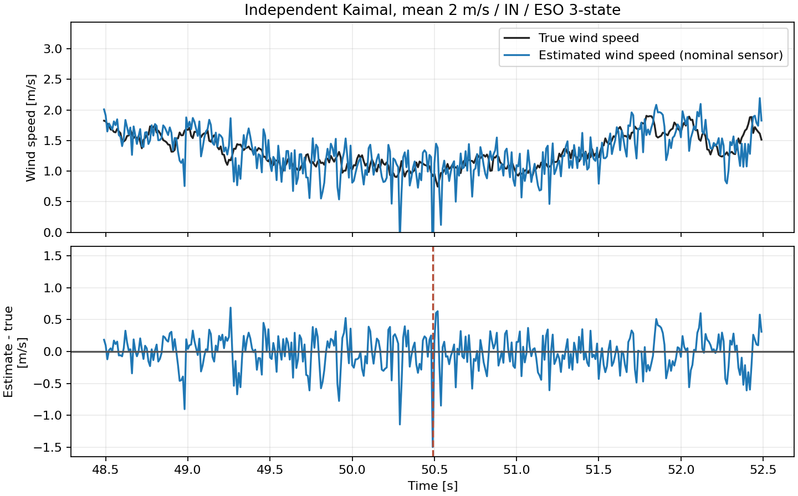
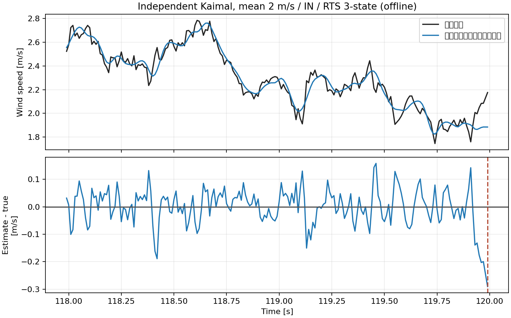
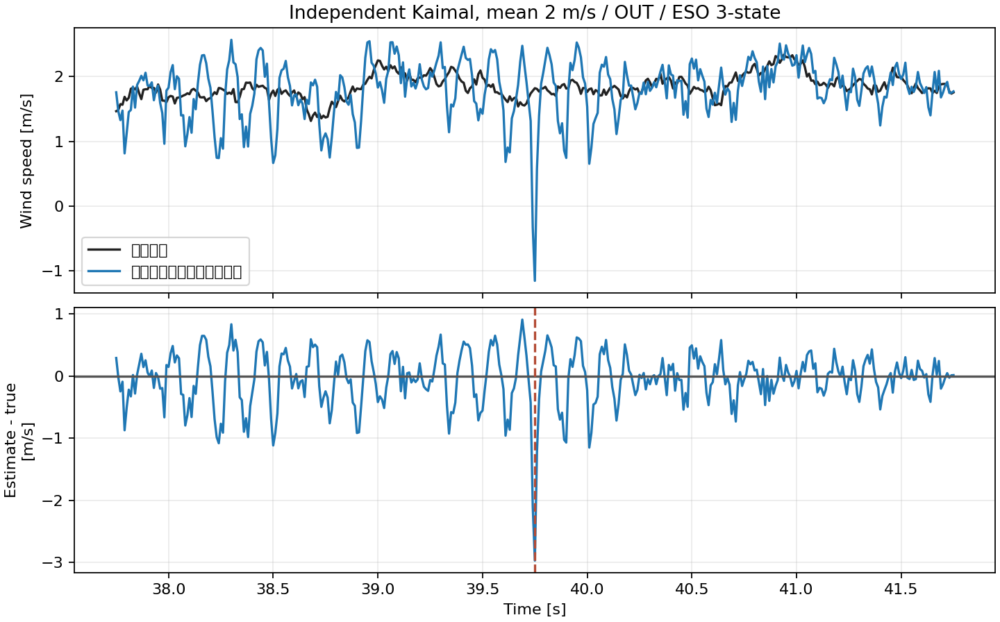
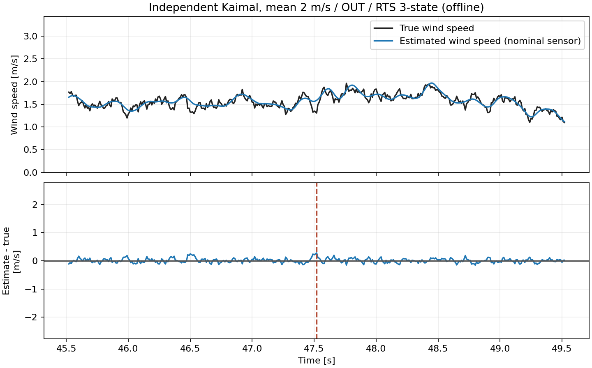
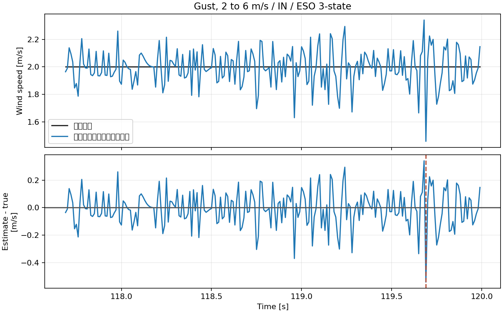
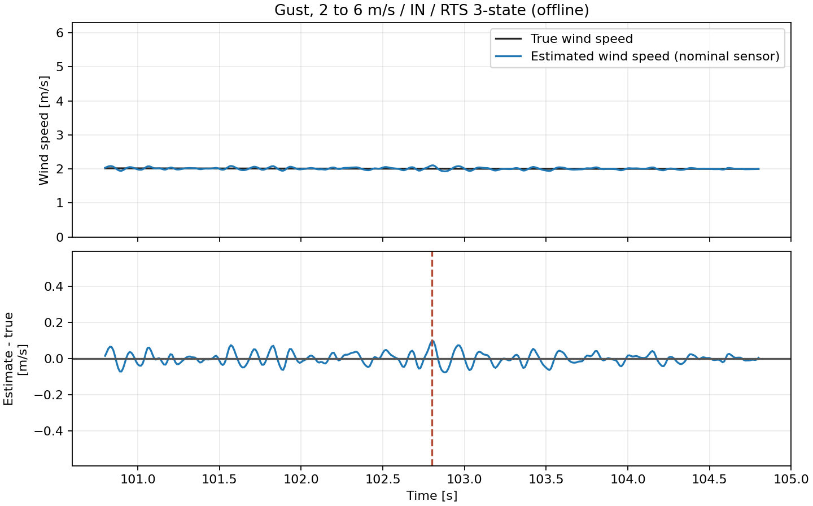
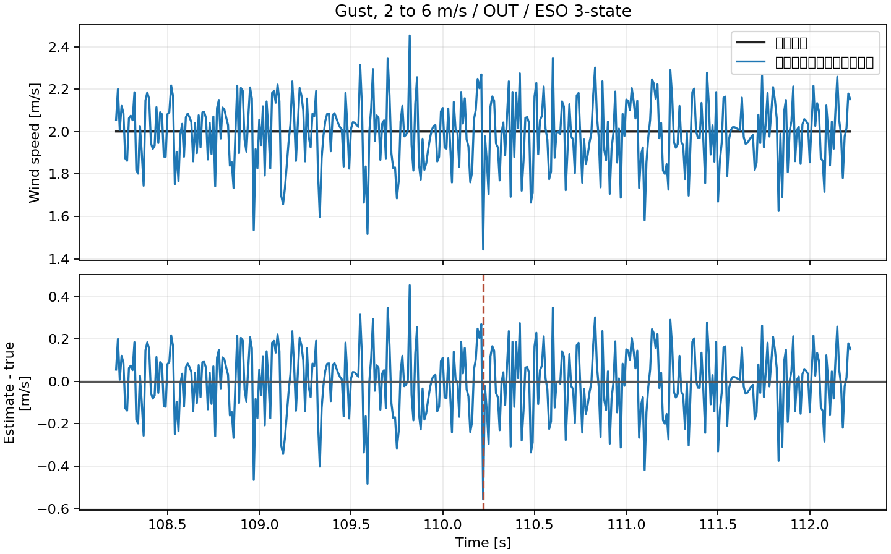
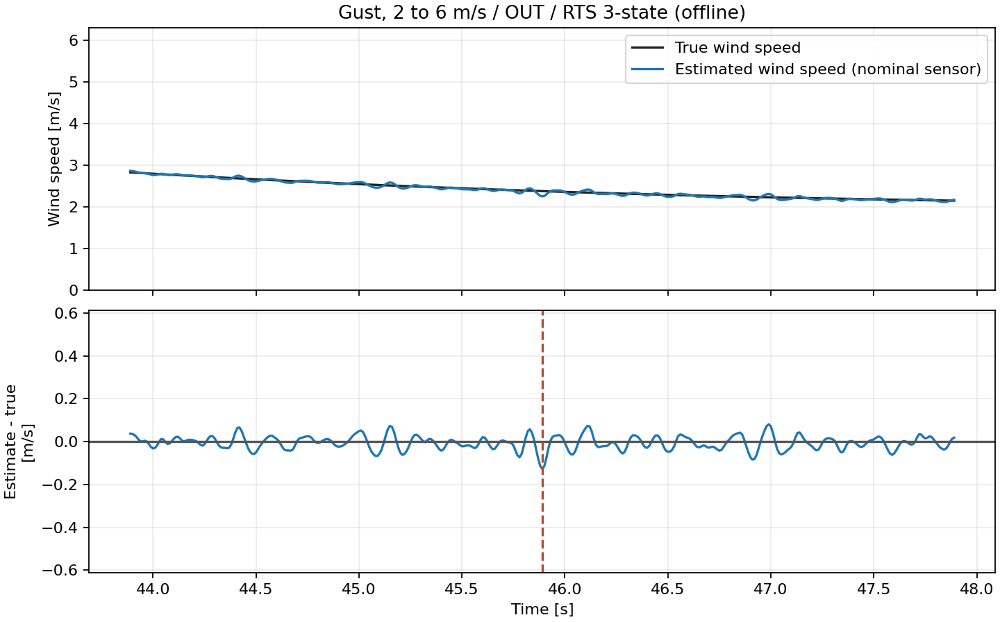

# OW-05 センサー非理想性とオブザーバー選定

## 目的・結論

OW-03で角度±60°内だった独立Kaimal乱流（平均2 m/s、TI 20%）と2→6 m/sガストを使い、採用BALLプラントにセンサーの量子化、ノイズ、遅延を含めて比較した。比較対象はオンラインの3状態ESOと未来データを使うオフライン3状態RTS。4状態ESOはOW-03で除外済みのため含めない。

公称センサー条件では、風条件・軸ごとのRMSE最小方式は下表の通り。帯域/プロセス雑音は別seedの平均3 m/s Kaimal訓練波形で方式ごと・軸ごとに一度だけ選定し、検証波形には再調整せず適用した。最大角度は全ケースで±60°内である。

| 風条件 | 軸 | ESO RMSE | RTS RMSE |
|---|---|---:|---:|
| 独立Kaimal乱流 平均2 m/s TI20% | IN | 0.19935 m/s | 0.06362 m/s |
| 独立Kaimal乱流 平均2 m/s TI20% | OUT | 0.31615 m/s | 0.06674 m/s |
| ガスト 2→6 m/s | IN | 0.10056 m/s | 0.02227 m/s |
| ガスト 2→6 m/s | OUT | 0.12416 m/s | 0.02726 m/s |

## センサー条件

角度サンプルは100 Hz、MT6701の14 bit（量子化幅0.02197266°）、白色ノイズσ=0.015°、有色ノイズσ=0.010°・時定数0.475 s、固定遅延10 msを公称条件とした。センサー段階評価に従った設定であり、量子化/サンプリング仕様以外のノイズと遅延は実測前の暫定仮定である。感度としてノイズσを2倍にした条件も計算した。

## 角度ノイズから風速への増幅倍率

線形基準は、ノイズなしセンサー角度θ₀の近傍における静的な角度→風速写像の傾きで求めた。各時点の角度摂動Δθを、局所傾き g(θ₀)=dV/dθ（θ=θ₀で評価）に掛け、線形基準風速摂動 $v_{\mathrm{lin}}(t)=g(\theta_0(t))\Delta\theta(t)$ とした。角度摂動は、遅延・ゲイン・オフセット・量子化・ジッタを保って乱数ノイズだけを0にしたセンサー出力との差である。局所線形近似の妥当性確認として $\lvert\Delta\theta\rvert \leq 0.1\lvert\theta_0\rvert$ を満たす評価点の割合も記載した。これを満たさない時点では、線形基準倍率を慎重に解釈する。観測器側は、同一条件におけるノイズあり/なし推定出力差 $\Delta\hat{V}$ を全評価時点（15秒以降）で比較した。RMSE倍率は $\mathrm{RMS}(\Delta\hat{V})/\mathrm{RMS}(v_{\mathrm{lin}})$、最大値倍率は $\max_t \lvert\Delta\hat{V}(t)\rvert/\max_t \lvert v_{\mathrm{lin}}(t)\rvert$ である。

### 独立Kaimal乱流 平均2 m/s TI20%・IN軸

| ノイズ条件 | 推定器 | 角度ノイズRMSE [deg] | 線形条件成立 [%] | 基準RMSE [m/s] | 出力RMSE [m/s] | RMSE倍率 | 95%値倍率 |
|---|---|---:|---:|---:|---:|---:|---:|
| 公称 | ESO 3状態 | 0.02073 | 99.5 | 0.016496 | 0.158007 | 9.578 | 37.084 |
| 公称 | RTS 3状態（オフライン） | 0.02073 | 99.5 | 0.016496 | 0.034514 | 2.092 | 8.130 |
| 2倍 | ESO 3状態 | 0.03837 | 98.9 | 0.011681 | 0.308132 | 26.378 | 37.625 |
| 2倍 | RTS 3状態（オフライン） | 0.03837 | 98.9 | 0.011681 | 0.061631 | 5.276 | 8.076 |

| ノイズ条件 | 推定器 | 基準最大値 [m/s] | 出力最大値 [m/s] | 最大値倍率 |
|---|---|---:|---:|---:|
| 公称 | ESO 3状態 | 1.443755 | 1.733567 | 1.201 |
| 公称 | RTS 3状態（オフライン） | 1.443755 | 0.171004 | 0.118 |
| 2倍 | ESO 3状態 | 0.721878 | 2.486851 | 3.445 |
| 2倍 | RTS 3状態（オフライン） | 0.721878 | 0.402897 | 0.558 |

### 独立Kaimal乱流 平均2 m/s TI20%・OUT軸

| ノイズ条件 | 推定器 | 角度ノイズRMSE [deg] | 線形条件成立 [%] | 基準RMSE [m/s] | 出力RMSE [m/s] | RMSE倍率 | 95%値倍率 |
|---|---|---:|---:|---:|---:|---:|---:|
| 公称 | ESO 3状態 | 0.01963 | 100.0 | 0.003179 | 0.257590 | 81.035 | 77.777 |
| 公称 | RTS 3状態（オフライン） | 0.01963 | 100.0 | 0.003179 | 0.037352 | 11.751 | 12.060 |
| 2倍 | ESO 3状態 | 0.03675 | 100.0 | 0.005959 | 0.510122 | 85.604 | 77.436 |
| 2倍 | RTS 3状態（オフライン） | 0.03675 | 100.0 | 0.005959 | 0.063998 | 10.740 | 10.849 |

| ノイズ条件 | 推定器 | 基準最大値 [m/s] | 出力最大値 [m/s] | 最大値倍率 |
|---|---|---:|---:|---:|
| 公称 | ESO 3状態 | 0.017972 | 2.243913 | 124.857 |
| 公称 | RTS 3状態（オフライン） | 0.017972 | 0.162403 | 9.037 |
| 2倍 | ESO 3状態 | 0.035944 | 3.323602 | 92.467 |
| 2倍 | RTS 3状態（オフライン） | 0.035944 | 0.300146 | 8.350 |

### ガスト 2→6 m/s・IN軸

| ノイズ条件 | 推定器 | 角度ノイズRMSE [deg] | 線形条件成立 [%] | 基準RMSE [m/s] | 出力RMSE [m/s] | RMSE倍率 | 95%値倍率 |
|---|---|---:|---:|---:|---:|---:|---:|
| 公称 | ESO 3状態 | 0.01967 | 100.0 | 0.002551 | 0.104534 | 40.984 | 46.940 |
| 公称 | RTS 3状態（オフライン） | 0.01967 | 100.0 | 0.002551 | 0.024151 | 9.469 | 10.982 |
| 2倍 | ESO 3状態 | 0.03802 | 100.0 | 0.004965 | 0.200306 | 40.344 | 39.993 |
| 2倍 | RTS 3状態（オフライン） | 0.03802 | 100.0 | 0.004965 | 0.044383 | 8.939 | 8.805 |

| ノイズ条件 | 推定器 | 基準最大値 [m/s] | 出力最大値 [m/s] | 最大値倍率 |
|---|---|---:|---:|---:|
| 公称 | ESO 3状態 | 0.013764 | 0.553211 | 40.191 |
| 公称 | RTS 3状態（オフライン） | 0.013764 | 0.114383 | 8.310 |
| 2倍 | ESO 3状態 | 0.020647 | 1.148612 | 55.632 |
| 2倍 | RTS 3状態（オフライン） | 0.020647 | 0.199577 | 9.666 |

### ガスト 2→6 m/s・OUT軸

| ノイズ条件 | 推定器 | 角度ノイズRMSE [deg] | 線形条件成立 [%] | 基準RMSE [m/s] | 出力RMSE [m/s] | RMSE倍率 | 95%値倍率 |
|---|---|---:|---:|---:|---:|---:|---:|
| 公称 | ESO 3状態 | 0.02001 | 100.0 | 0.002527 | 0.129178 | 51.111 | 53.097 |
| 公称 | RTS 3状態（オフライン） | 0.02001 | 100.0 | 0.002527 | 0.030314 | 11.994 | 13.149 |
| 2倍 | ESO 3状態 | 0.03775 | 100.0 | 0.004734 | 0.250589 | 52.935 | 51.447 |
| 2倍 | RTS 3状態（オフライン） | 0.03775 | 100.0 | 0.004734 | 0.047642 | 10.064 | 10.091 |

| ノイズ条件 | 推定器 | 基準最大値 [m/s] | 出力最大値 [m/s] | 最大値倍率 |
|---|---|---:|---:|---:|
| 公称 | ESO 3状態 | 0.013022 | 0.560705 | 43.058 |
| 公称 | RTS 3状態（オフライン） | 0.013022 | 0.138432 | 10.631 |
| 2倍 | ESO 3状態 | 0.018993 | 2.418837 | 127.355 |
| 2倍 | RTS 3状態（オフライン） | 0.018993 | 0.196321 | 10.337 |

増幅倍率は全点RMSE比を主指標、絶対値95パーセンタイル比を外れ値に頑健な補助指標、最大絶対値比をピーク影響の補助指標として併記した。最大値倍率は単一点に強く左右されるため慎重に読む。線形基準は準静的な写像であり、動的な真値風速誤差の代用ではない。観測器の履歴依存性はノイズあり/なし出力差側に反映される。全値は `ow05_noise_amplification.csv` に保存した。


## 公称センサー条件の拡大時系列

各図は最大誤差時刻を中心に±2秒を表示する。上段は真値と推定風速、下段は誤差。同じ風条件・軸のESO図とRTS図では、上段と下段それぞれの縦軸範囲を共通にして比較できるようにした。描画環境に日本語フォントがないため、図中ラベルは英語表記とし、本文と図題は日本語で記載する。

















## 解釈と選定

RTS（Rauch–Tung–Striebel）スムーザーは、まず時系列を前向きに推定し、その後、将来の観測も使って過去の状態推定を後向きに修正する。時間的に独立なホワイトノイズによる一時的な観測の揺れが、運動モデルや前後の観測と整合しない場合、その揺れを実際の状態変化ではなく観測ノイズとして扱いやすくなり、推定への影響を弱められる。これは未来の観測が過去の観測ノイズを物理的に打ち消すという意味ではなく、全時系列に最も整合する状態系列を再推定する効果である。

この平滑化は、運動モデルが十分妥当で、観測ノイズとモデル誤差の大きさ（観測・プロセス雑音の共分散）が適切に設定されていることを前提とする。ノイズが時間相関を持つ場合、その影響は独立な白色ノイズほど平均化されない。また、実際の急な風速変化をモデルが説明できないときに平滑化が強すぎると、真の変化まで抑えたり、遅らせたりする可能性がある。したがって、オフラインRTSは必ずノイズに強いわけではなく、今回の低い誤差をホワイトノイズ単独の効果と断定することもできない。今回のセンサー条件には白色ノイズに加えて有色ノイズも含まれるため、成分ごとの寄与を分けるには追加の比較が必要である。

RTS 3状態は将来データを使うオフライン評価であるため、RMSEが小さくてもオンライン実装候補とは分ける。オンライン用途はESO 3状態を候補とし、公称ノイズ条件に対する帯域選定を反映した値を使用する。RTSはログ解析や遅延許容用途の基準として残す。ノイズ2倍感度を含む推定誤差は `ow05_metrics.csv`、増幅倍率は `ow05_noise_amplification.csv`、調整スキャンは `ow05_tuning_scan.csv` に保存した。

## 再実行

```bash
python 06_Analysis/simulation/src/run_ow05_sensor_nonideality.py
```
