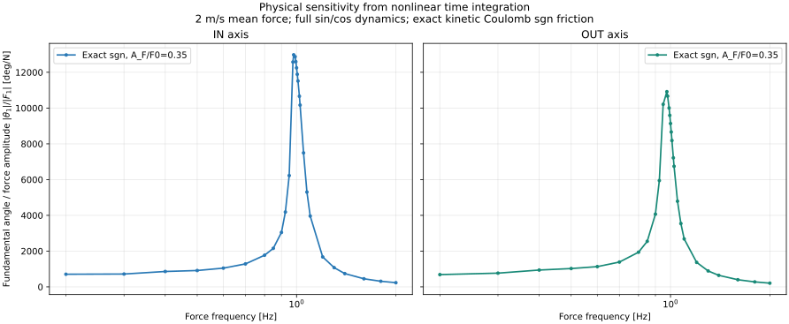
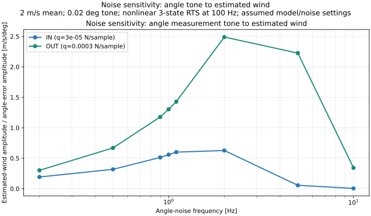

# OW-06 WBS 0–1 実施結果

実施日: 2026-10-06（JST）  
対象ブランチ: ow06-frequency-aware-observer-design

## 結論・WBS達成状況

| WBS | 目的 | 実施結果 | 判定 |
|---|---|---|---|
| 0.1 | 解析条件・新ハード係数の確定 | BALL構成の新ハード係数、±60°可動域、100 Hz、風速・加振・係数ずれ条件を整理 | **達成**。係数はシミュレーション用の暫定値で、実機検証済みの真値ではない |
| 0.2 | OW-05ベースライン再現 | 振幅・周波数評価96行と力入力周波数掃引348行を再実行し、保存済みCSVと一致 | **達成**。シミュレーション再現確認であり実機性能検証ではない |
| 1.1 | 新ハードの物理周波数特性の目安 | 0〜6 m/sの平衡角、実効剛性、無減衰固有周波数スケールを算出 | **一部達成**。実効剛性・周波数目安は得た。実機を代表する実効減衰・減衰込みピークは未確定 |
| 1.2-A | 物理感度 | 非線形運動方程式を数値積分し、入力力から角度への有限振幅感度を周波数掃引 | **理想化モデルで達成**。静止摩擦・固着を含まず、実機ピークの確定ではない |
| 1.2-B | 測角ノイズ感度 | 0.02°単一トーン誤差からRTS推定風速への伝搬を周波数ごとに評価 | **シミュレーション達成**。仮定したモデル・雑音設定に条件づけられる |
| 1.2-C | 係数ずれ感度 | OW-04係数ずれ条件でRTS推定力ゲインの誤差を周波数ごとに評価 | **シミュレーション達成**。実機での測定結果ではない |

**WBS 1.1の結論:** 実効剛性と固有周波数の目安は得られた。実効減衰は、任意の平滑化幅を持つtanh摩擦を速度ゼロで微分した結果に依存し、実機の摩擦則として確認できていないため未達。したがって「過減衰・古典的ピークなし」はtanh静止点線形化モデル内の結論で、実機に共振ピークがないとは結論できない。

**WBS 1.2の結論:** A/B/Cの周波数プロットを作成した。Aは線形化モデルではなく非線形数値積分で評価した有限振幅応答である。AとB/Cは摩擦モデル等の前提が異なり、同一条件での直接比較ではない。いずれもシミュレーション結果で、実機確認は今後の課題である。

## 0.1 解析条件と係数

IN軸・OUT軸を独立した1自由度系として扱い、初期検討のため2軸干渉は含めない。IN/OUTは軸名であり、回転方向ではない。可動域は各軸±60°、サンプリング100 Hz。

運動方程式は次のとおり。

$$
I\ddot{\theta}+K\sin\theta+b\dot{\theta}
+c|\dot{\theta}|\dot{\theta}
+\tau_f\,\mathrm{sgn}(\dot{\theta})
=LF(t)\cos\theta
$$

今回の新ハード係数は次のとおり（$b=0$）。

| 係数 | IN | OUT |
|---|---:|---:|
| $I$ [kg·m²] | 3.6821194×10⁻⁴ | 3.7093758×10⁻⁴ |
| $K$ [N·m/rad] | 1.4963241×10⁻² | 1.4221078×10⁻² |
| $b$ [N·m·s/rad] | 0 | 0 |
| $c$ [N·m·s²/rad²] | 1.4031974×10⁻⁵ | 1.4031974×10⁻⁵ |
| $\tau_f$ [N·m] | 7.9457314×10⁻⁵ | 1.7694968×10⁻⁴ |

球質量3.9 g、球中心腕長180.61 mm。係数は解析用の暫定値で、実機で独立検証済みの真値ではない。出典: [新ハード係数](../../../../config/hbk_model_coefficients.json)。

| 項目 | 条件 |
|---|---|
| 平衡点風速 | 0、1、2、4、6 m/s |
| 正弦力掃引 | 平均2 m/s相当、$A_F/F_0=0.10,0.25,0.35$、0.2〜2 Hz |
| 係数ずれ | OW-04の相関付き100%高側コーナー（$I,K,\tau_f,c$を同時変更） |
| RTS 3状態のプロセス雑音 $q$ | IN: $3\times10^{-5}$、OUT: $3\times10^{-4}$ N/sample |
| RTS角度観測標準偏差 | 0.02° |
| OW-05センサーノイズ仮定 | 14 bit、0.02197266°/LSB、白色σ=0.015°、有色σ=0.010°・時定数0.475 s、遅延10 ms |

量子化以外のセンサーノイズ値は実測確定値ではなくシミュレーション上の仮定。OW-04高側コーナーはINで $I+9.00\%$, $K-8.80\%$, $\tau_f+0.80\%$, $c+2.72\%$、OUTで $I+8.94\%$, $K-9.26\%$, $\tau_f+1.88\%$, $c+2.72\%$。

## 0.2 OW-05ベースライン再現

振幅・周波数比較96行を再実行し、RMSE・振幅比・最大角度が保存済みCSVと一致した。力入力周波数掃引348行もゲイン・位相・最大角度が一致した。

$A_F/F_0=0.35$、1 Hzで係数一致RTSの推定ゲインはIN 1.004、OUT 0.999。OW-04係数ずれRTSはIN 4.387、OUT 3.344。係数ずれRTSの掃引ピークはIN 0.995 Hzで4.432、OUT 0.980 Hzで3.590。1 Hzでの最大角度はIN 54.9°、OUT 41.2°で、±60°内だった。これはシミュレーション再現確認であり実機性能保証ではない。

## 1.1 平衡点・実効剛性・固有周波数目安

平均力 $F_0$ の静的平衡角は

$$
\theta_0=\tan^{-1}\left(\frac{LF_0}{K}\right)
$$

平衡点まわりの正味トルク勾配（実効剛性）は

$$
k_{\mathrm{eff}}
=\left.\frac{d}{d\theta}
\left(K\sin\theta-LF_0\cos\theta\right)\right|_{\theta=\theta_0}
=K\cos\theta_0+LF_0\sin\theta_0
$$

である。実効剛性は追加ばねの剛性ではなく、平衡点における正味トルクの局所勾配を意味する。平衡条件から $k_{\mathrm{eff}}=K/\cos\theta_0$ とも書ける。減衰を含まない周波数スケールは

$$
f_n=\frac{1}{2\pi}\sqrt{\frac{k_{\mathrm{eff}}}{I}}
$$

で求めた。

| 平均風速 | IN平衡角 | OUT平衡角 | IN周波数目安 | OUT周波数目安 |
|---:|---:|---:|---:|---:|
| 0 m/s | 0.00° | 0.00° | 1.015 Hz | 0.985 Hz |
| 2 m/s | 6.44° | 6.77° | 1.018 Hz | 0.989 Hz |
| 4 m/s | 24.30° | 25.41° | 1.063 Hz | 1.037 Hz |
| 6 m/s | 45.45° | 46.91° | 1.211 Hz | 1.192 Hz |

この周波数目安は実機の減衰込み共振周波数ではない。

### 実効減衰について未達となった理由

先行解析では摩擦を $\tau_f\tanh(\dot\theta/\epsilon)$ とし、$\epsilon=0.5°/s$ を設定した。速度ゼロでの微分は $\tau_f/\epsilon$ となるが、$\epsilon$ は数値上の平滑化幅であり、実機の低速摩擦特性として同定された値ではない。よってそこから得た減衰比・極・過減衰判定を実機特性とはみなせない。

運動中の理想クーロン摩擦 $\tau_f\mathrm{sgn}(\dot\theta)$ は、速度符号が一定の区間では速度に依存しない定数トルクで、反転点では符号が切り替わる。周期全体を静止点の単一の傾きに置き換えることはできない。静止摩擦・固着も評価するには、その則の同定が必要。

## 1.2 周波数感度プロット

3図、数値データ、条件の詳細は[プロット説明](ow06_wbs12_sensitivity_plots/README_ja.md)にまとめた。

### A. 物理プラントの入力力→角度感度

Aは線形化した伝達関数ではなく、sin/cos項と二乗抗力を保持した非線形運動方程式の数値積分結果。摩擦は運動時の $\tau_f\mathrm{sgn}(\dot\theta)$ とし、$\mathrm{sgn}(0)=0$。静止摩擦・固着は含めない。平均風2 m/s相当、$A_F/F_0=0.35$、0.2〜2 Hz、RK4刻み0.002 s。

縦軸は基本波振幅比 $|\theta_1|/|F_1|$ [deg/N]。これは有限振幅条件に依存し、微分としての小信号感度 $d\theta/dF$ ではない。周波数グリッド上の最大はIN 0.98 Hzで約12,978 deg/N、OUT 0.975 Hzで約10,918 deg/N。全区間最大角はIN 59.50°、OUT 49.60°。INは可動限界±60°に近い。静止摩擦・固着を含まない理想化モデルなので、実機ピークの確定にはならない。

### B. 角度計測ノイズ→推定風速感度

0.02°の単一トーン角度誤差をRTSに入力し、推定風速の基本波振幅を周波数ごとに評価した。平均2 m/s相当、非線形3状態RTS、100 Hz。上記の $q$ を用いた仮定条件下の誤差伝搬で、物理プラント単体の感度や実測ノイズではない。

### C. 係数ずれによる推定力ゲイン誤差

OW-04係数ずれ100%高側コーナーでのRTSシミュレーション。力振幅比は0.10、0.25、0.35。縦軸は

$$
100\left|\frac{\text{推定力の基本波振幅}}
{\text{印加力の基本波振幅}}-1\right|\%
$$

で定義する相対ゲイン誤差。OW-05のtanh摩擦モデルとRTS設定による結果であり、実機測定値ではない。

### 次工程への引継ぎ

- **達成:** 3種類の周波数プロットを作成。Aは非線形数値積分で評価。作図用スクリプト・CSVも保存。
- **未達:** 静止摩擦・固着を含む摩擦則の実機同定と、実機物理ピークの確定。
- **未達:** 3感度を同一の実機妥当モデルで評価すること。
- **次工程:** 低速トルク–角速度特性と固着/離脱条件を測定し、摩擦モデルを更新する。その後、カルマンフィルタ等で物理応答を活用して推定帯域やゲインを下げられるか評価する。ハードウェア改修は制御方式の成立条件を確認してから検討する。

## 再実行・関連ファイル

- 作図スクリプト: [run_ow06_wbs12_sensitivity_plots.py](../../../../src/run_ow06_wbs12_sensitivity_plots.py)
- 図・CSV・条件説明: [ow06_wbs12_sensitivity_plots/README_ja.md](ow06_wbs12_sensitivity_plots/README_ja.md)
- 新ハード係数: [hbk_model_coefficients.json](../../../../config/hbk_model_coefficients.json)
