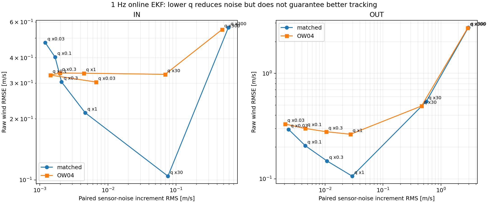
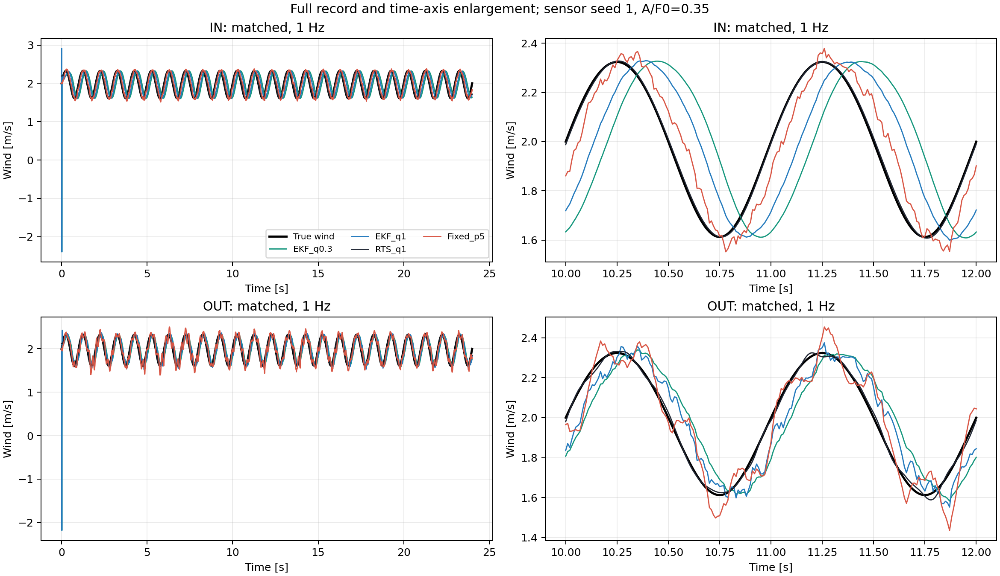
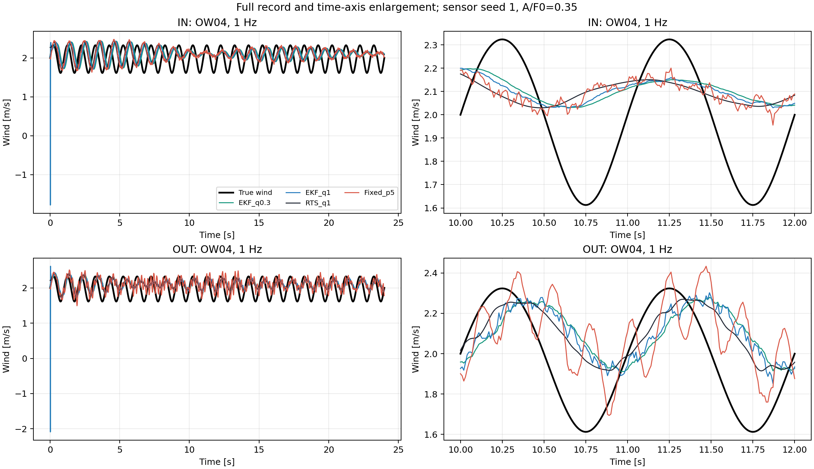
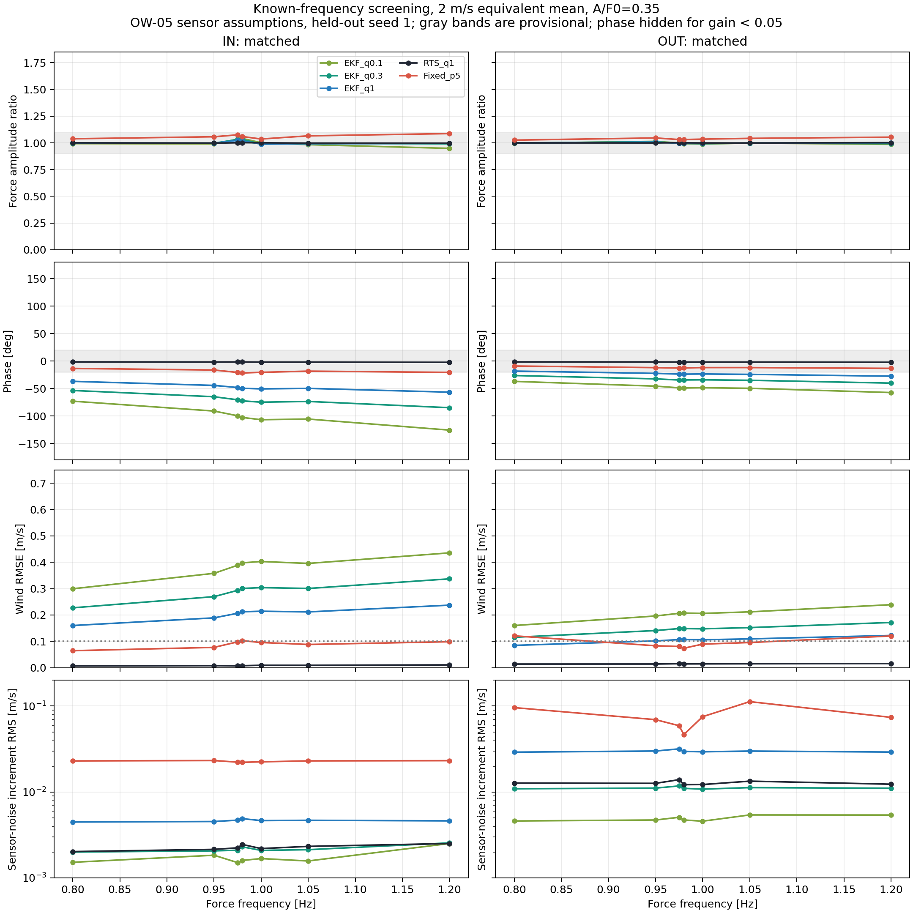
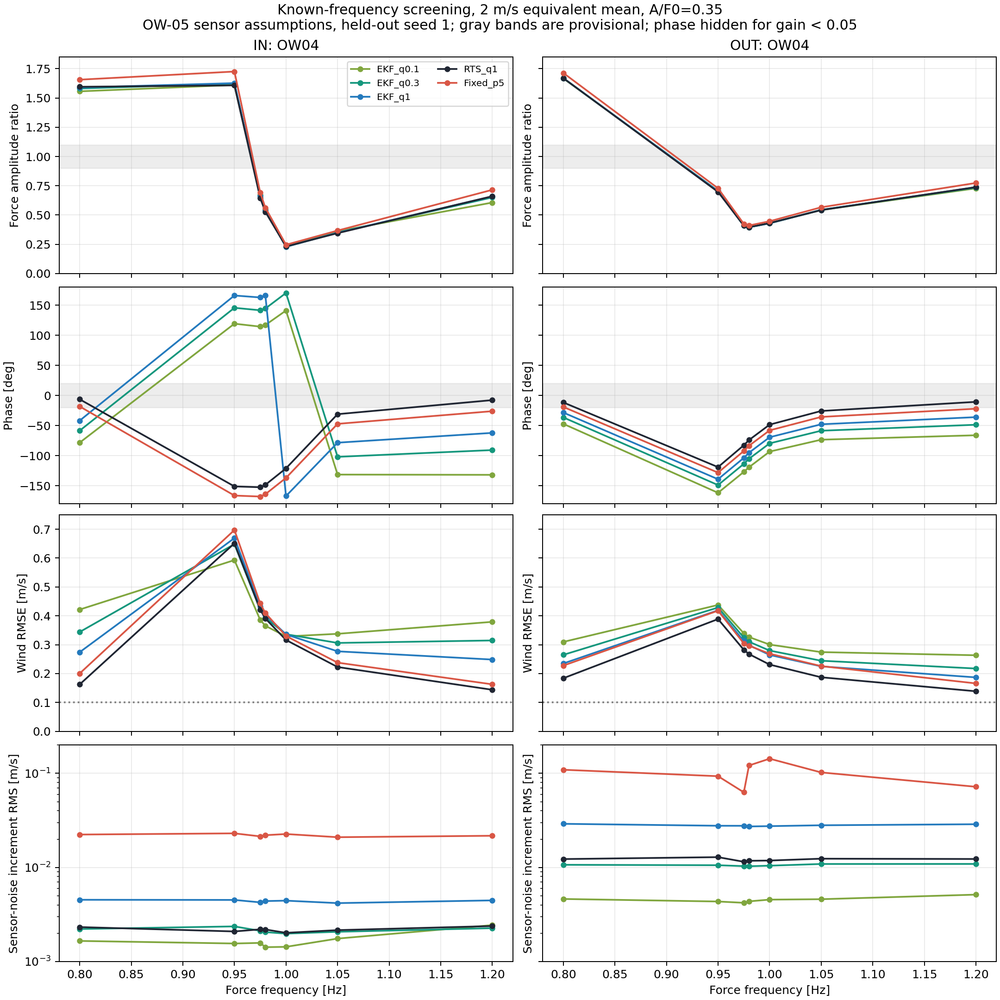
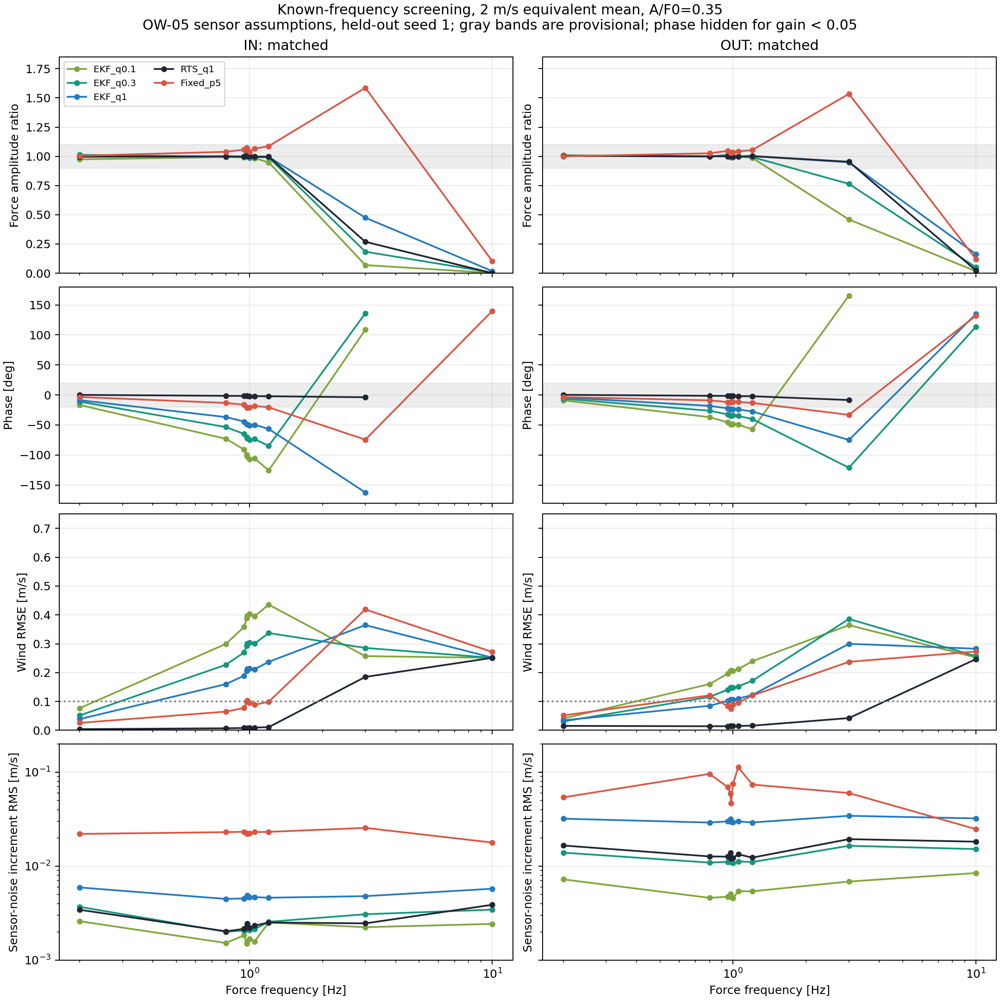
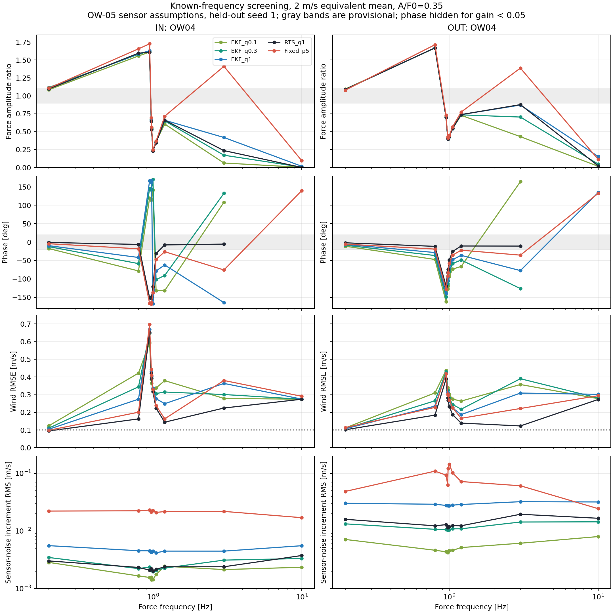
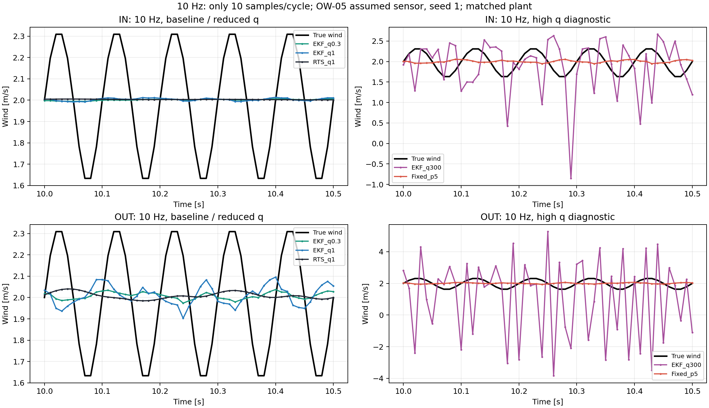
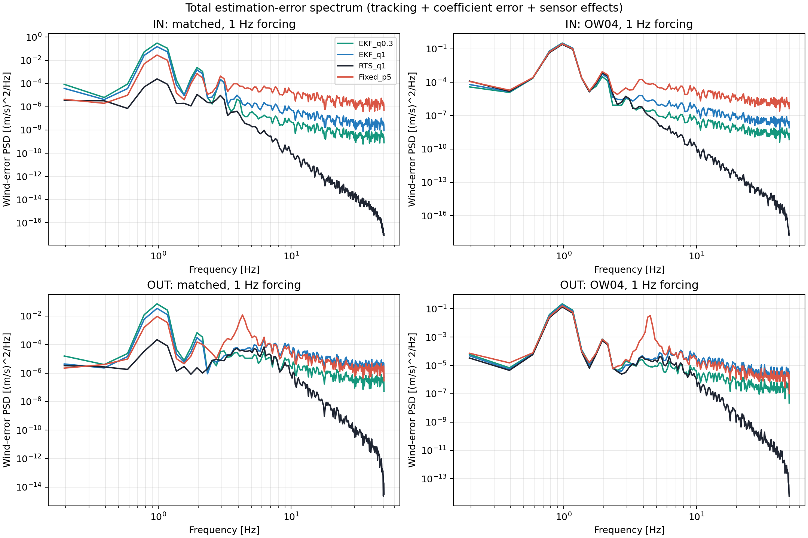

# OW-06 WBS 2.2：既知周波数でのゲイン低減・代表条件スクリーニング

実施日：2026-10-07（JST）  
基点：`4cc3b63260c8800807bca8769938e85e3bdd7270`  
前提：[WBS 2.1方式設計](../ow06_wbs_2_1_observer_design_ja.md)／[計画書](../OW06_PLAN.md)

## 1. 結論

**WBS 2.2の比較を完了した。今回の候補・代表条件では、追従性と係数ずれ耐性を保ったゲイン低減の利点を確認できず、WBS 2.3は保留とする。** 未知周波数の検出器やゲイン切替は実装していない。

- 約1 Hzでは、オンラインEKFの風力過程雑音を下げると、センサーノイズによる出力変動は減る。しかし位相遅れが増え、係数一致でも真値との時刻を揃えたRMSEは悪化した。角度応答が大きいことだけでは、風の位相まで正しく追従できるとはいえない。
- OW-04の相関付き係数ずれを**プラント側だけ**に与えると、約1 Hzの風力ゲイン・位相が大きく変わる。RTSでも残る誤差があり、未来データの利用やゲイン低減だけでは係数不一致を除去できない。
- 10 Hzでは、基準EKFおよび低減設定の追従振幅が不足した。参考の高q設定で振幅が回復する場合もあるが、位相遅れ・ノイズが大きく、振幅比だけで10 Hz要求達成とは判定できない。
- 固定ゲイン観測器の低い極周波数では、局所線形設計上の安定極だけでは非線形計算の有界性を保証できなかった。発散・有界判定超過はCSVに残し、性能曲線として描画していない。
- 主評価の52プラント条件は全て±60°に接触しなかった。ただし最大59.847°で余裕は約0.153°しかなく、実機の機械余裕を保証しない。

これは「可変ゲインという方法が一般に不可能」という証明ではない。既存の3状態・風力ランダムウォークモデル、今回のゲイン候補とセンサー仮定で、次段階へ進む根拠が得られなかったという判断である。後続作業へは進めていない。

## 2. 比較条件と評価対象

| 項目 | 今回の条件 |
|---|---|
| 機械係数 | 新ハードの採用BALL値。IN/OUT独立の1自由度。b=0 |
| 係数一致／ずれ | 基準プラント／OW-04 `joint_mass_high_arm_high_tau-high_c-high`。観測器は全条件で基準係数 |
| 風力入力 | 2 m/s相当の平均風力に単一正弦風力を重畳。主振幅比0.35、補足0.10 |
| 主周波数 [Hz] | 0.2, 0.8, 0.95, 0.975, 0.98, 1.0, 1.05, 1.2, 3, 10, 30 |
| 補足小振幅 | 振幅比0.10、1 Hzと10 Hzのみ |
| 標本化／積分 | 観測・推定100 Hz。連続正弦風力のプラントRK4内部刻み2 ms。観測器は既存と同じ10 ms・区間内一定風力予測 |
| 摩擦 | 主評価：tanh、ε=0.5 deg/s。補足：理想sgnの運動摩擦（静止摩擦は含まない） |
| 記録長 | 24秒と10周期の長い方。初期8秒と4周期の長い方を除外、末尾2秒と2周期の長い方も除外 |
| 角度制約 | ±60°の非弾性ストップを実装。初回接触以後を無効とし、接触ケース全体を通過判定から除外 |
| 測角条件 | 理想／10 ms遅延＋14 bit量子化のみ／さらに白色・有色ノイズを加えた3系列 |
| 白色／有色ノイズ | σ=0.015°／σ=0.010°、有色時定数0.475 s。OW-05仮定であり実機確定値ではない |
| 量子化 | 360°/16384 = 0.02197265625° |
| ノイズ系列 | seed 20261007で設定選択、20261008・20261009で確認。同一プラント・系列を全方式で共用 |
| 全比較数 | 52プラント条件 × 5測角系列 × 13方式 = 3,380行 |

**30 Hzは参考域**であり、10 Hzまでの要求評価とは分ける。今回の周波数点はスクリーニング用の代表点であり、0～10 Hz全域を保証する連続掃引ではない。平均風も2 m/s相当のみで、広い動作点・誤差幅・組合せの評価はWBS 3.1/3.2に残る。

WBS 1.2-Aの感度ピークはIN 0.980 Hz、OUT 0.975 Hzだったため、その近傍を細かく採った。WBS 1.2-Aのsgnプラントと今回のtanh主評価を同一視せず、後述の補足で摩擦形式を比較した。

### 2.1 係数ずれの適用

OW-04の球質量3.9→4.4 g、有効腕長180.61→190.61 mmの組合せによるI/K相関を保ち、同じケースのτ上限・球c上限を使用した。元CSVの列名は `observer_I_kg_m2` 等だが、**今回はその値を真のプラントへ読み込み、観測器へは渡さない**。今回の設定・全係数は [settings.json](settings.json) に記録した。

球半径をr、重力加速度をg、基準質量・腕長をm₀・ℓ₀、変動後をm₁・ℓ₁とする。球自身の中心まわりの慣性と支点までの平行軸成分を足すと、球の慣性は次式になる。

$$
I_{\mathrm{ball}}=\frac{2}{5}mr^2+m\ell^2
=m\left(\ell^2+\frac{2r^2}{5}\right)
$$

基準全慣性から基準球の寄与を引き、変動後の寄与を加える。

$$
I_1=I_0-m_0\left(\ell_0^2+\frac{2r^2}{5}\right)
+m_1\left(\ell_1^2+\frac{2r^2}{5}\right)
$$

採用モデルの球質量は復元係数を減らす方向に作用するため、同様に

$$
K_1=K_0+m_0g\ell_0-m_1g\ell_1
$$

とした。力をトルクへ変換する腕長Lと風速換算のCd・面積は、OW-04で定義した係数感度試験と同じく固定した。**腕長が変わった実機の全ての幾何・空力変化を再現する試験ではない。** Lの不確かさや他の相関ケースは今回未評価である。

### 2.2 比較方式

| 表示名 | 内容 |
|---|---|
| EKF_q1 | WBS 2.1のオンライン前向きEKF。q₀：IN 3e-5、OUT 3e-4 N/sample |
| RTS_q1 | 同じ前向き計算に後向き平滑化を追加。未来データを使用するオフライン基準 |
| EKF_q0.03 / q0.1 / q0.3 | q₀の0.03／0.1／0.3倍。ゲイン低減候補 |
| EKF_q30 / q300 | q₀の30／300倍。低減候補ではなく、追従性と雑音の交換関係を調べる参考 |
| Fixed_p1 / p2 / p5 / p10 / p20 | 2 m/s定常点で離散極を配置。pは極周波数[Hz]。全試験中Lは固定 |
| Fixed_p5_design4 | 4 m/s定常点で設計したp=5 Hz固定ゲインを、同じ2 m/s入力条件で比較 |

固定ゲインの比較基準はp=5 Hz、低減候補はp=1・2 Hzとした。5 Hzは今回の比較基準であり、既承認の最適値ではない。4 m/sで設計した方式も入力平均風は2 m/sであり、4 m/sでのプラント試験を実施したという意味ではない。

## 3. 実装と計算式

### 3.1 風力入力と風速換算

抗力式の定数部分をαと置く。

$$
\alpha=\frac{1}{2}\rho C_D A,\qquad F=\alpha V|V|
$$

平均風力と正弦力を

$$
F_0=\alpha(2)^2,\qquad
F(t)=F_0+A_F\sin(2\pi ft),\qquad A_F=0.35F_0
$$

と設定する。補足試験だけ0.35を0.10へ変える。αは約0.00233817 N/(m/s)²、F₀は約0.00935269 N。入力は「風速が正弦波」ではなく「風力が正弦波」である。

風速換算では符号を保持する。

$$
|F|=\alpha |V|^2
\quad\Longrightarrow\quad
|V|=\sqrt{\frac{|F|}{\alpha}}
\quad\Longrightarrow\quad
V=\mathrm{sgn}(F)\sqrt{\frac{|F|}{\alpha}}
$$

真値と推定値に同じ換算を適用し、負の推定風力をゼロへ切り捨てない。真の風速は主振幅で約1.612～2.324 m/sとなる。

### 3.2 オンライン出力と固定ゲインの時刻を揃える

観測器は現在の角度を受け取り、現在時刻の更新後推定値を出す。

$$
\hat x_k^-=f_d(\hat x_{k-1}),\qquad
\nu_k=y_k-H\hat x_k^-,\qquad
\hat x_k=\hat x_k^-+L\nu_k
$$

H=[1,0,0]であり、状態は角度・角速度・風力の3状態。EKFではLを毎サンプルのカルマンゲインに置き換える。全方式は同じ系列の最初の測角値、角速度0、平均風力F₀で初期化した。初期平均風力は既知とした有利な比較条件であり、真の正弦風力系列を推定器に与えてはいない。周波数は試験前の設定選択だけに使い、推定中の内部モデルに正弦波を組み込んではいない。

qは風力変化の標準偏差なので、共分散へ入るのはq²である。たとえばqを0.3倍にすると風力過程雑音分散は0.09倍となる。q倍率と、実際の角度・角速度・風力の補正ゲイン倍率は同一ではなく、CSVには各ゲインのRMSも保存した。RTS行のゲインRMSは共通の前向きEKFの値で、後向き平滑化の等価ゲインではない。

固定ゲインは、代表定常点の連続ヤコビアンJからAを求める。

$$
A=\exp(JT_s),\qquad T_s=0.01\ \mathrm{s}
$$

更新前後の推定誤差をそれぞれe⁻、eとすれば、無雑音・局所線形の条件で

$$
e_k^-=Ae_{k-1},\qquad
e_k=(\mathbf{I}-LH)e_k^-
$$

したがって

$$
e_k=(\mathbf{I}-LH)Ae_{k-1}
=\left[A-L(HA)\right]e_{k-1}
$$

となる。ここで太字Iは単位行列で、機械の慣性Iとは異なる。このため、Ackermann法には対(A, HA)を与え、誤差遷移行列の3個の極を

$$
p_d=\exp(-2\pi f_p T_s)
$$

へ置く。A−LHへ極を置く従来の一時刻先補正式を、そのまま今回の更新後出力へ流用しない。[fixed_gains.csv](fixed_gains.csv) にLの3成分と極検証結果を保存した。

局所モデルで全極が単位円内にあっても、有限振幅の非線形モデル全域で安定とは限らない。特にtanh摩擦の速度微分は静止近傍と運動中で大きく違う。今回の固定ゲイン発散はその設計上の限界を示すが、これだけで実機摩擦が原因と特定したわけではない。

### 3.3 振幅・位相・誤差の計算

評価区間で、真の風力と推定風力をそれぞれ次式へ最小二乗フィットする。

$$
z(t_k)\approx a\sin(2\pi f t_k)+b\cos(2\pi f t_k)+d
$$

各時刻のsin、cos、1を並べた行列Xと信号ベクトルzについて、残差二乗和を最小にする係数を求める。

$$
\hat\beta=\underset{\beta}{\mathrm{arg\,min}}
\|X\beta-z\|_2^2,\qquad \beta=[a,b,d]^T
$$

これは正規方程式

$$
X^TX\hat\beta=X^Tz
$$

に対応する。実装では逆行列を直接作らず `numpy.linalg.lstsq` を使う。sinの加法定理から

$$
B\sin(2\pi ft+\phi)
=B\cos\phi\sin(2\pi ft)+B\sin\phi\cos(2\pi ft)
$$

なので、a=B cosφ、b=B sinφとなり、

$$
B=\sqrt{a^2+b^2},\qquad \phi=\mathrm{atan2}(b,a)
$$

が得られる。推定・真値の基本波振幅を使って

$$
G_F=\frac{B_{\mathrm{est}}}{B_{\mathrm{true}}},\qquad
\Delta\phi=\phi_{\mathrm{est}}-\phi_{\mathrm{true}},\qquad
t_{\mathrm{lag}}=-\frac{\Delta\phi}{2\pi f}
$$

を求める。最後の式の位相はrad。CSVの位相は−180～180°へ折り返しており、ほぼ消失した基本波の位相や、周期を跨ぐ大きな位相を実時間の遅れと断定しない。図ではゲイン0.05未満の位相を非表示にした。

風速の時刻を揃えた誤差と平均誤差は

$$
e_k=\hat V_k-V_k,\qquad
\bar e=\frac{1}{N}\sum_{k=1}^N e_k
$$

であり、

$$
\mathrm{RMSE}=\sqrt{\frac{1}{N}\sum_{k=1}^N e_k^2},\qquad
\mathrm{RMS}_{\mathrm{centered}}=
\sqrt{\frac{1}{N}\sum_{k=1}^N(e_k-\bar e)^2}
$$

を保存した。P95は絶対誤差の95パーセンタイル、最大誤差はその最大値。位相補正後の形状誤差は別列であり、主判定のRMSEでは時間シフトをしない。

形状診断だけでは、推定位相差を使って推定信号を一度平行移動する。

$$
\hat F_{\mathrm{shift}}(t)=\hat F\left(t-\frac{\Delta\phi}{2\pi f}\right),\qquad
r_k=\hat F_{\mathrm{shift}}(t_k)-F(t_k)
$$

$$
E_{\mathrm{shape}}=
\frac{\sqrt{\frac1N\sum_k(r_k-\bar r)^2}}
{\sqrt{\frac1N\sum_k(F_k-\bar F)^2}}
$$

この診断は遅れとDC偏差を取り除くので、それだけでオンライン追従良好とは判断しない。

### 3.4 センサーノイズの寄与を分ける

同一プラント・同一観測器に対して、「遅延＋量子化のみ」と「それに白色・有色ノイズを追加」を対で実行した。

$$
\delta\hat V_k=\hat V_{k,\mathrm{noise+delay+quant}}
-\hat V_{k,\mathrm{delay+quant}}
$$

$$
N_V=\sqrt{\frac1N\sum_k(\delta\hat V_k)^2},\qquad
G_{\mathrm{noise}}=
\frac{N_V}{\sqrt{\frac1N\sum_k(\delta y_{k,\mathrm{deg}})^2}}
$$

差分δyも上と同じ測角系列どうしの差とする。量子化はノイズ追加後に行うため、Nᵥにはノイズに起因する量子化コードの変化も含む。非線形系のため、主RMSEからこの値を二乗で引けば他の誤差が分離できるとは仮定しない。

有色ノイズは1次Gauss–Markov系列とした。標準偏差σc、時定数Tcに対して

$$
a_c=\exp(-T_s/T_c),\qquad
n_{c,k}=a_c n_{c,k-1}+\sigma_c\sqrt{1-a_c^2}\,\xi_k
$$

とし、ξは独立な標準正規乱数、初期値も標準偏差σcの正規分布から与える。この係数なら定常分散は、σc²=a_c²σc²+σc²(1−a_c²)を満たす。

## 4. ゲートの定義と設定選択

計画書で合意済みなのは10 Hz目標、±60°、追従・ノイズ・係数ずれを含めた事前確認であり、**RMSEや位相の許容値は数値合意されていない**。以下は今回の探索を再現可能にする暫定的な設計目安で、製品要求を新たに確定したものではない。

| 暫定目安 | 値 |
|---|---:|
| 基本波風力ゲイン | 0.90～1.10 |
| 位相差絶対値 | 20°以下 |
| 風速RMSE（時刻を補正しない） | 0.10 m/s以下 |
| 基準方式に対する雑音寄与の低下 | 10%以上 |
| 基準方式に対するRMSE増加 | 5%以下 |
| 風力補正ゲインのRMS | 基準方式より小さい |
| ストップ接触・発散判定 | なし |

たとえば位相20°の遅れは、1 Hzで20/360 = 55.6 ms、10 Hzで20/(360×10) = 5.56 msである。仮定したセンサー遅延10 msだけでも10 Hzでは36°となる。今回の実装は遅延補償や未来予測を加えていないので、この目安は特に10 Hzで厳しい。**位相・RMSEの目安の未合意と、遅延補償の未実装を残したまま、正式な要求不適合を宣言しない。** 一方、低qの振幅不足、約1 Hzの遅れ増大、係数ずれ時の大きなゲイン・位相誤差は、目安の選び方に依存せず表と波形から確認できる。

各周波数・軸・振幅につき、基準プラントの理想測角とseed 0で目安を満たす低減候補を選び、その中で雑音寄与が最小のものを選択する。選んだ設定を固定し、seed 1/2および係数ずれプラントを評価する。候補が全滅したときは、最小RMSEの候補を**診断用**に記録し、通過扱いにしない。固定ゲインはp=5 Hz、EKFはq₀を比較基準とする。

さらに、低減候補に限らず全オンライン候補から基準プラントseed 0の最小RMSEを選ぶ参考欄 `Any_online` も作った。これは低減成功の判定には使わない。[oracle_selection.csv](oracle_selection.csv) に選択設定、選択時の成立性、独立系列・ずれ条件での最悪値と基準比を保存した。

今回、低減候補のゲート通過は0件だった。広い誤差幅を総当たりしていないため、確率的な成功率や最悪値保証には用いない。

## 5. 数値結果

### 5.1 1 Hz：ノイズは減るが、オンライン追従は悪化

以下は振幅比0.35、OW-05センサー、設定選択に使っていないseed 1。RMSEと雑音寄与の単位はm/s。

| 軸・プラント | 方式 | 風力ゲイン | 位相 [deg] | 風速RMSE | 雑音寄与RMS |
|---|---|---:|---:|---:|---:|
| IN・一致 | EKF q₀ | 0.989 | −50.61 | 0.2143 | 0.00465 |
| IN・一致 | EKF 0.3q₀ | 0.990 | −74.78 | 0.3040 | 0.00209 |
| IN・一致 | RTS q₀ | 1.001 | −1.95 | 0.0093 | 0.00220 |
| OUT・一致 | EKF q₀ | 0.994 | −23.46 | 0.1059 | 0.02937 |
| OUT・一致 | EKF 0.3q₀ | 0.993 | −34.09 | 0.1476 | 0.01080 |
| OUT・一致 | RTS q₀ | 1.000 | −1.85 | 0.0146 | 0.01221 |
| IN・ずれ | EKF q₀ | 0.229 | −167.11 | 0.3358 | 0.00444 |
| IN・ずれ | EKF 0.3q₀ | 0.228 | +170.43 | 0.3363 | 0.00198 |
| IN・ずれ | RTS q₀ | 0.232 | −121.07 | 0.3164 | 0.00202 |
| OUT・ずれ | EKF q₀ | 0.429 | −69.38 | 0.2646 | 0.02748 |
| OUT・ずれ | EKF 0.3q₀ | 0.429 | −79.56 | 0.2797 | 0.01045 |
| OUT・ずれ | RTS q₀ | 0.432 | −48.44 | 0.2313 | 0.01184 |

係数一致でqを0.3倍にすると、雑音寄与はINで約55%、OUTで約63%減った。しかし風速RMSEはそれぞれ約42%、約39%増えた。オンラインEKFの基本波振幅がほぼ1でも、位相が遅れれば瞬間風速の推定誤差は大きくなる。RTSとの差は未来サンプルを使う効果を含み、オンラインEKFへそのまま移せない。







INの+170°と−167°は±180°折返しの近傍にある。符号だけで「遅れが進みに改善した」と読まない。

### 5.2 感度ピーク近傍と周波数の代表点

以下の4段図は上から風力振幅比、位相、風速RMSE、ノイズ追加による推定変動。IN/OUTおよび一致/ずれの軸範囲を揃えた。灰色は暫定目安である。30 HzはCSVに残し、この主図は10 Hzまでとした。









係数ずれの影響は風力へ次のように混入する。真のプラントの式を風力について解くと

$$
F_{\mathrm{true}}=
\frac{I_p\ddot\theta+K_p\sin\theta+b_p\dot\theta
+c_p|\dot\theta|\dot\theta+\tau_p\tanh(\dot\theta/\epsilon)}{L\cos\theta}
$$

同じ運動を基準係数の運動方程式で説明するために必要な風力は

$$
F_{\mathrm{nom}}=
\frac{I_o\ddot\theta+K_o\sin\theta+b_o\dot\theta
+c_o|\dot\theta|\dot\theta+\tau_o\tanh(\dot\theta/\epsilon)}{L\cos\theta}
$$

である。2式を引くと

$$
F_{\mathrm{nom}}-F_{\mathrm{true}}=
\frac{(I_o-I_p)\ddot\theta+(K_o-K_p)\sin\theta
+(b_o-b_p)\dot\theta+(c_o-c_p)|\dot\theta|\dot\theta
+(\tau_o-\tau_p)\tanh(\dot\theta/\epsilon)}{L\cos\theta}
$$

となる。添字pはプラント、oは観測器を示す。大きな角度・加速度が生じる帯域では、係数差による項も大きくなり得る。観測角度だけではこの差を任意の未知風力から完全に分離できない。この式は理想的な運動方程式の逆算であり、有限帯域EKFの出力と完全一致する式ではない。

### 5.3 10 Hz：振幅回復だけでは要求達成といえない

同じく主振幅、基準プラント、seed 1の比較。

| 軸 | 方式 | 風力ゲイン | 位相 [deg] | 風速RMSE [m/s] | 雑音寄与RMS [m/s] |
|---|---|---:|---:|---:|---:|
| IN | EKF 0.3q₀ | 0.0054 | +91.55 | 0.2512 | 0.0034 |
| IN | EKF q₀ | 0.0179 | +99.18 | 0.2520 | 0.0058 |
| IN | EKF 300q₀ | 0.9926 | −92.13 | 0.6530 | 0.5626 |
| OUT | EKF 0.3q₀ | 0.0509 | +113.68 | 0.2569 | 0.0152 |
| OUT | EKF q₀ | 0.1638 | +134.73 | 0.2828 | 0.0322 |
| OUT | EKF 300q₀ | 0.9689 | −52.03 | 2.7351 | 3.0193 |

低ゲインの基本波がほぼ消失しているケースの位相は参考値。高qでは風力振幅が近くても、推定波形全体はノイズを大きく含む。q₀自体がIN/OUTで10倍違うので、同じ倍率は同じ絶対qではない。



ここではサンプル点も表示した。左列は基準・低減・RTS、右列は高qの参考。図の縦軸範囲はノイズ増加を隠さず個別表示している。30 Hzは1周期約3.3標本しかなく、今回の計算結果を実用帯域の保証には使わない。

### 5.4 固定ゲインと有界性

p=5 Hz・2 m/s設計は、1 Hzの一致条件でIN RMSE=0.0957 m/s、OUT=0.0895 m/sだった。一方、ずれ条件ではIN=0.3302、OUT=0.2688 m/sへ悪化した。固定ゲインで一部の一致条件を改善できても、係数ずれを含む通過条件は満たさなかった。

全3,380行のうち194行が有界判定を超過した。内訳は全てOUTで、p=1 Hzが23行、p=2 Hzが122行、p=5 Hz・4 m/s設計が49行。[invalid_cases.csv](invalid_cases.csv) に初回超過サンプル等を保存した。非有限値、推定角絶対値20π rad超、または推定風力絶対値が風速換算20 m/s相当を超えた場合に打ち切った。これは数学的な発散の証明ではなく、評価を続けないための有界性判定である。

この判定内に留まっても正確とは限らない。たとえばIN p=1 Hzは、誤った大きな出力を出しながら有界判定内に留まるケースがあった。これらもCSVには残し、ゲートはRMSE等で不通過とした。比較図は主要方式を表示し、低い極での異常な大振幅に全図の縮尺を合わせてはいない。

### 5.5 推定誤差スペクトル



Welch法、100 Hz、窓512点で、真値との差のPSDを示す。これは追従誤差・係数誤差・センサー誤差を含む**総推定誤差**であり、センサー単独PSDではない。ノイズだけの寄与比較には3.4節の対差分を使う。

## 6. 検証と解釈上の制限

- [implementation_checks.json](implementation_checks.json)：既存EKF/RTSとの同一短時間入力比較、RK4の一致、閉形式状態遷移とSciPy行列指数の一致、固定極の特性多項式、EKFの因果性を確認した。未来の測角値を変更しても、それ以前のEKF出力は変化しなかった。
- [numerical_friction_checks.csv](numerical_friction_checks.csv)：IN/OUT、基準/ずれ、0.98/10 Hzで、tanhの内部刻み2→1 ms、sgnの1→0.5 msを比較した。観測器は基準のtanhのまま。主結論の大きな遅れ・係数ずれ誤差は、これらの刻み変更でも残った。
- [late_window_checks.csv](late_window_checks.csv)：0.98 Hzの記録を60秒へ延長し、8～22秒と40～58秒を比較した。初期過渡だけで結論が決まっていないかを確認するための追加である。
- [hard_stop_check.json](hard_stop_check.json)：別の検証専用入力でストップ接触を発生させ、角度制限と接触後の無効化が実際に動作することを確認した。主52ケースのストップ結果と混ぜていない。

tanhの2→1 ms比較で角度差の最大は0.00324°、sgnの1→0.5 ms比較で0.01167°だった。後者は不連続摩擦の微小運動が刻みに依存するため、sgn結果を厳密解として扱わない。0.98 Hz・一致条件の後半40～58秒でも、INのq₀→0.3q₀でRMSEは0.2145→0.3050 m/s、OUTは0.1059→0.1473 m/sとなった。ずれ条件のq₀では、後半でもINゲイン0.591・位相174.62°、OUTゲイン0.428・位相−95.93°である。短い記録から得た数値と完全に同じではないが、遅れ増加・係数ずれに関する判断は変わらない。

sgnの補足モデルは運動摩擦のみで、静止摩擦・stick-slipを忠実に再現する実機モデルではない。主評価ではεを固定しており、ε全域の感度解析、センサー帯域・アンチエイリアス、遅延補償、実機CPU負荷、欠測、二軸連成、切替安定性は未評価。RTSの末尾影響を避けるため共通の末尾区間を除外し、RTSだけ有利な区間を選んではいない。

OW-05の従来周波数試験は風力を100 Hzで区間一定としてプラントへ与えたが、今回は連続正弦風力を2 ms刻みで与える。したがって、OW-05の数表との厳密な再現比較ではない。今回の全方式は同じ連続風力プラントを共有する。観測器の力予測・共分散計算は既存方式を維持し、今回の比較だけ都合よく再調整していない。

## 7. 成果物と再実行

- [全比較CSV](metrics.csv)：振幅・位相、風速RMSE/Bias/中心化RMS/P95/最大、形状誤差、ノイズ寄与、実ゲインRMS、ストップ・有界判定。
- [選択と独立確認](oracle_selection.csv)、[集計](summary.json)、[設定・係数](settings.json)、[固定ゲイン](fixed_gains.csv)。
- `trace_*.csv`：1 Hz、0.98 Hz、10 Hzの主振幅における真値・計測角・主要推定系列。設定選択に使っていないseed 1。
- 図はPNGとSVGを併記。レポート埋込みはPNG。

リポジトリルートで実行する。

```bash
OPENBLAS_NUM_THREADS=1 OMP_NUM_THREADS=1 python 06_Analysis/simulation/src/run_ow06_wbs22_oracle.py --workers 4
OPENBLAS_NUM_THREADS=1 OMP_NUM_THREADS=1 python 06_Analysis/simulation/src/check_ow06_wbs22_numerics.py
OPENBLAS_NUM_THREADS=1 OMP_NUM_THREADS=1 python 06_Analysis/simulation/src/report_ow06_wbs22_oracle.py
```

このREADMEは結果を解釈した説明文。CSV・図・集計は上のスクリプトで再生成する。WBS 2.1承認を受けたWBS 2.2の範囲で完了した。

> **追記（2026-10-07）:** 当初の「WBS 2.3の開始は保留」という判断は、オンライン周波数推定・ゲイン切替を想定した暫定判断だった。高周波データは全て事後処理する要件であり、オンライン処理は要求されていない。このため、同判断はオフライン方式を除外しない。係数一致の約1 HzでRTSが示した改善を踏まえ、WBS 2.3はオフライン周波数推定とRTSを含む方式の比較として計画書を改訂した。係数ずれ・10 Hzで十分な性能が得られたことを意味するものではない。
