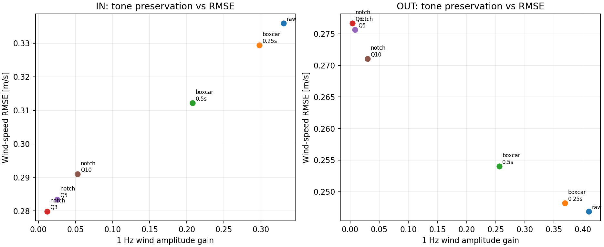

# WBS 2.4：固定ゲイン出力のオフライン事後処理

## 結論

固定ゲイン `Fixed_p5` の推定力に、ゼロ位相移動平均または固有振動数ノッチを適用した。無風自由振動の誤推定は下げられるが、固有振動数付近の真の風変動も同時に下げる。特にノッチは約1 Hzの正弦風振幅をほぼゼロにした。0.25秒移動平均は風の振幅を約10%落とし、0.5秒移動平均は約37%落とすうえ、5〜10 Hzの応答も大幅に弱める。

したがって、**固有振動数に単純なノッチや広い窓平均を掛ける方法は、0〜10 Hzを測る目的には採用できない**。無風時の誤推定だけを消し、同じ帯域の真の風を保つには、単純な周波数除去ではなく、信号/誤差のスペクトルや校正情報を用いた分離が必要になる。

## 条件

- 100 Hz、IN/OUT、固定ゲイン `Fixed_p5`。ゲインは2 m/s設計点で設定し、記録中は一定。
- プラントは公称係数一致またはOW-04相関係数ずれ。ずれはプラントだけに与え、推定器は公称係数。
- フィルター対象は観測器の**力推定値**。風速への非線形換算より前に処理。
- ゼロ位相ボックスカー移動平均0.25/0.5秒、固有振動数中心のiirnotch（Q=3/5/10）を比較。フィルター端点を採点から外し、自由減衰は0.5秒以降、風入力は15秒以降を採点。
- OW-05相当センサーノイズも評価した。以下の表はフィルターの影響を分けて読むため、理想角度・OW-04ずれプラントを示す。
- 自由減衰は30°静止解放、真の風速0。正弦入力は1 Hz、平均風換算2 m/s、力振幅0.35 F₀。

## 無風誤推定と1 Hz真風の両方を見る

表のRMSEと固有振動数帯RMSの単位はm/s。正弦列の「ゲイン」は真の1 Hz風振幅に対する推定振幅比。

| 軸 | 方式 | 自由減衰RMSE | 自由減衰・固有振動数帯RMS | 1 Hz正弦RMSE | 正弦振幅ゲイン |
|---|---|---:|---:|---:|---:|
| IN | 無処理 | 0.733 | 0.697 | 0.336 | 0.330 |
| IN | 0.25秒移動平均 | 0.701 | 0.667 | 0.329 | 0.298 |
| IN | 0.5秒移動平均 | 0.603 | 0.573 | 0.312 | 0.208 |
| IN | 固有振動数ノッチ Q=3 | 0.380 | 0.347 | 0.280 | 0.012 |
| IN | 固有振動数ノッチ Q=5 | 0.509 | 0.476 | 0.283 | 0.025 |
| OUT | 無処理 | 0.526 | 0.431 | 0.247 | 0.410 |
| OUT | 0.25秒移動平均 | 0.492 | 0.448 | 0.248 | 0.369 |
| OUT | 0.5秒移動平均 | 0.425 | 0.387 | 0.254 | 0.256 |
| OUT | 固有振動数ノッチ Q=3 | 0.384 | 0.159 | 0.277 | 0.004 |
| OUT | 固有振動数ノッチ Q=5 | 0.419 | 0.262 | 0.276 | 0.008 |

ノッチでは無風自由減衰の固有振動数帯誤差が下がった一方、1 Hzの真風もほぼ通らなくなった。ノッチ後のRMSEだけを見ると多少改善したように見えるが、正弦振幅ゲインがほぼゼロなので、真の変動を復元できたとは言えない。

ボックスカー移動平均の固有振動数での振幅利得は0.25秒で約0.90、0.5秒でIN 0.61/OUT 0.63。フィルター応答表では5〜10 Hzも大きく減衰する。移動平均が特定入力でRMSEを下げても、風速応答帯域全体を保つ設定ではない。

## Kaimal・ガスト

| 軸 | 入力 | 無処理RMSE | 0.25秒平均RMSE | 0.5秒平均RMSE | ノッチQ=3 RMSE |
|---|---|---:|---:|---:|---:|
| IN | Kaimal | 0.180 | 0.156 | 0.167 | 0.172 |
| OUT | Kaimal | 0.240 | 0.142 | 0.166 | 0.242 |
| IN | ガスト2→6 | 0.184 | 0.184 | 0.184 | 0.184 |
| OUT | ガスト2→6 | 0.194 | 0.194 | 0.194 | 0.194 |

KaimalのRMSEが一部改善したのは、誤差の一部が高周波側にあったため。ただしOUT軸では0.25秒平均で固有振動数帯誤差が0.0357→0.0395 m/sと増えた。ガストはもともと固有振動数近傍の入力成分がほぼなく、ノッチの効果もほとんどなかった。

## 判定と次候補

単一ノッチは「共振帯の誤差」と「同じ帯域の真風」を区別できず、窓平均は10 Hz要求を維持できない。よって、現段階で単純フィルターは採用しない。次の候補は、校正記録で得た風信号/自由振動誤差スペクトルを用いるWiener型または正則化型のオフラインフィルター。ただし実測に風速真値がないため、調整は既知風の校正試験と未知条件の保留検証で行い、実測ログだけを使って「正しい風」を保証しない。

## 成果物と再実行

- `postfilter_metrics.csv`: 軸・入力・プラント・センサー・フィルター別の指標。
- `postfilter_frequency_response.csv`: 固有振動数・0.5/1.5/5/10 Hzのゼロ位相振幅利得。
- `postfilter_tone_tradeoff.png`: 1 Hz真風の振幅保持とRMSEの比較。
- 再実行: `python 06_Analysis/simulation/src/run_ow06_wbs23_output_postfilter.py`

