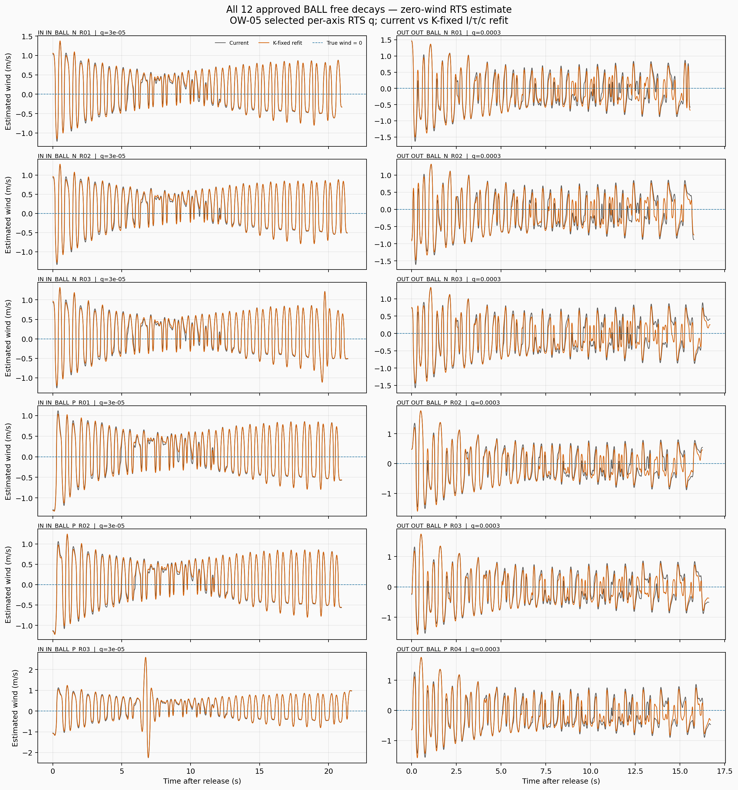
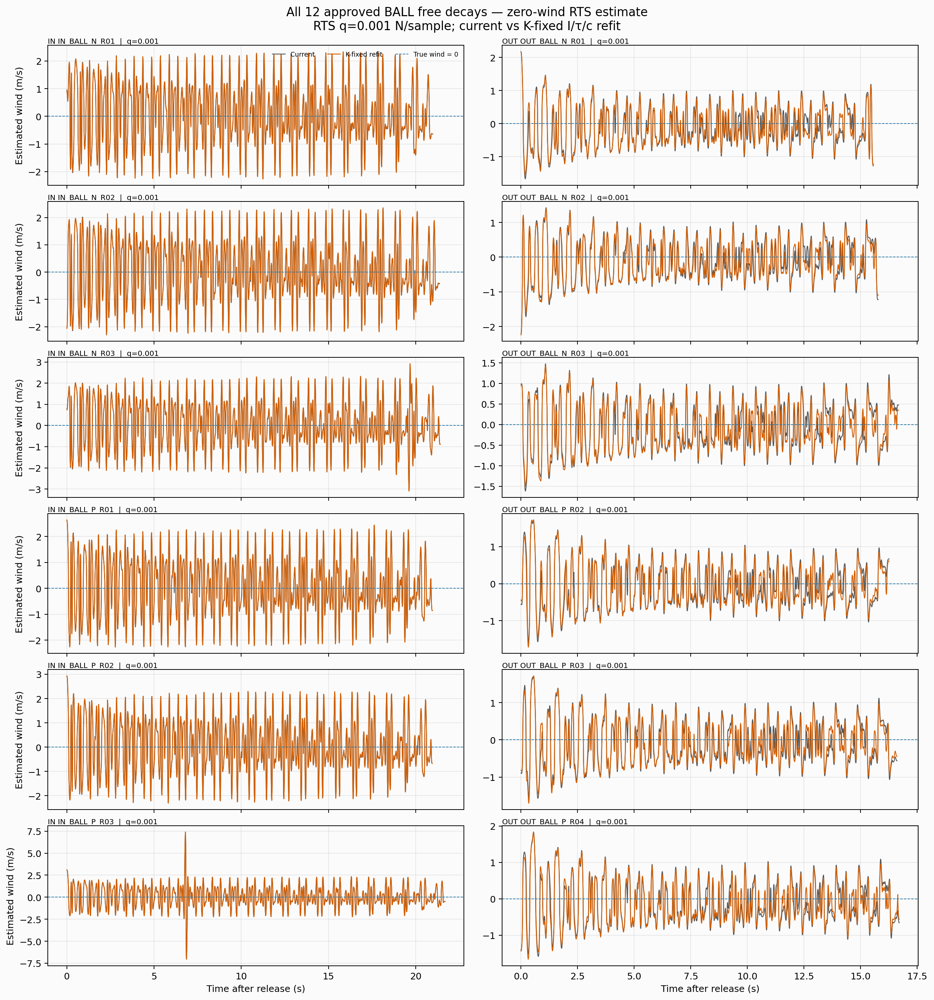

# WBS 2.7: 球あり無風自由振動による係数の最終調整（K固定）

## 背景：周波数応答の検討から係数校正へ

WBS 2.3では、周波数に応じたQ切替や調波状態の追加は、係数ずれのあるプラントで固定Q RTSに対する実質的な改善を示さなかった。1 Hz入力でOUT軸の波形形状相関は約0.998でも振幅ゲインは約0.39、IN軸は相関約0.85・ゲイン約0.31だった。時刻ずれだけでは振幅不足や形状差を直せず、実測BALL自由減衰12波形を使った過去の係数再フィットでも、ゼロ風推定残差はIN 0.195→0.202 m/s、OUT 0.154→0.193 m/sと悪化した。したがって、合成プラントでの同定成功を実機にそのまま期待できず、実測球あり波形で再検証する必要がある。

WBS 2.4では出力後フィルターも比較した。Kaimal条件の一部では移動平均が改善した一方、1 Hz正弦の振幅ゲインは0.330→0.298（IN）、0.410→0.369（OUT）へ低下し、固有振動数ノッチは真の1 Hz成分までほぼ消した。フィルターで広く解決する根拠はなく、実測波形に即した機械係数の調整を次に評価する。

参照: [WBS 2.3](../ow06_frequency_aware_observer_design/wbs23_offline/README.md)、[WBS 2.4](../ow06_frequency_aware_observer_design/wbs24_output_postprocess/README.md)。各レポートにIN/OUTの時系列サマリー図がある。

## 結論

Kを現行値に固定し、採用済みの実測BALL自由減衰12波形（IN/OUT各6本）から、I、クーロン摩擦トルクτ、合成二次抵抗係数cを軸ごとに同時フィットした。両軸とも自由減衰角度の前向き再現誤差は下がり、係数は探索境界に達しなかった。しかし、これをそのままオブザーバーの改善とみなすことはできない。OW-05採用Qでゼロ風速を推定したとき、IN軸の平均RMSEは0.495→0.497 m/sでほぼ不変（わずかに悪化）、OUT軸は0.482→0.439 m/sに改善した。ゼロ風速の実測自由振動に対して残差振動は依然大きく、特にIN軸では今回の係数調整だけで解決できていない。

したがって、今回の方法は「角度自由減衰波形の機械係数を改善する候補」としては有効だが、「風速推定残差を両軸で改善する最終校正」としては未完了である。採用係数レジストリおよび通常のオブザーバー設定は変更していない。

## 方法

- データ: `04_Data/05_Fitting/20260921` の波形から、選定表で `APPROVED` かつ `use_for_fitting=1` のBALL波形12本を使用。球ありのIN/OUTを別々に評価する。
- 前処理: 選定表の基線角を除去し、保持ピーク後に3サンプル連続で0.15°以上戻った点を解放点とした。解放直後±5サンプルの二次近似で角速度初期値を推定。フィットは解放0.2秒後から記録末尾0.5秒前まで、50 Hzに間引いた角度時系列を使う。
- 運動方程式: `I θ¨ + K sin(θ) + c |θ̇| θ̇ + τ tanh(θ̇/ε) = 0`。εは採用オブザーバー設定の摩擦平滑化幅。粘性項bは採用値0に固定。
- 固定/調整: 各軸のKは現行レジストリ値に固定。I、τ、総二次抵抗cを正値の対数パラメーターとして、全波形同時のロバスト非線形最小二乗（soft-L1）で推定。過去の診断フィットと異なり、Iも調整する。データ駆動の絶対スケールは固定Kが与える。
- 検証: 全12波形の角度前向き再生と、一波形を除外して残る同軸5本を再フィットするleave-one-waveform-out（LOO）を実施。さらに同じ角度データに現在係数/再フィット係数のRTSオブザーバーを適用し、真の風速0との差を全波形で比較した。
- オブザーバーQ: 直近の感度検討と比較できる `q=0.001`、およびOW-05選定値（IN `3e-5`、OUT `3e-4` N/sample）の2条件を表示。後者を運用候補として読む。

### この方法を選んだ理由と限界

自由振動だけでI、K、τ、cをすべて同時に自由化すると、運動方程式の力係数全体とIの共通倍率を区別できないため、絶対スケールが同定できない。今回はユーザー指定に従い、重力復元係数Kを固定してこのスケール不定性を避けた。

係数は記録内でほぼ静的な物理量であるため、カルマンフィルターの状態に増やして時々刻々追うより、複数波形を一括して解くロバスト最小二乗を採用した。LOOで別波形への転移を確かめる。ただしKを誤差なしと置いた条件付き推定であり、摩擦、センサー遅れ、角度基線、軸間干渉など、運動方程式外のずれを係数が吸収する可能性は残る。

## フィット結果

| 軸 | K固定 [N m/rad] | 係数 | 現行値 | フィット値 | 変化 |
|---|---:|---|---:|---:|---:|
| IN | 0.01496324 | I [kg m²] | 0.000368212 | 0.000367421 | −0.21% |
| IN | 同上 | τ [N m] | 0.000079457 | 0.000083317 | +4.86% |
| IN | 同上 | c [N m s²/rad²] | 0.000014032 | 0.000015270 | +8.83% |
| OUT | 0.01422108 | I [kg m²] | 0.000370938 | 0.000371182 | +0.07% |
| OUT | 同上 | τ [N m] | 0.000176950 | 0.000127292 | −28.06% |
| OUT | 同上 | c [N m s²/rad²] | 0.000014032 | 0.000020737 | +47.78% |

全12本で採点した角度RMSE平均は、IN 2.599→1.051°、OUT 1.826→0.875°。LOO（各回、同軸の残る5波形で推定）の除外波形RMSE平均はIN 1.147°、OUT 0.948°だった。全軸のヤコビアン階数は3。局所条件数はIN 120.8、OUT 99.9で、推定は形式上フルランクだが係数間相関は残る。特にOUTのτ低下とc増加は、異なる減衰機構間のトレードオフとして慎重に扱う。

## 風速ゼロ波形に対するオブザーバー誤差

各グラフは12波形すべてについて、真の風速0（破線）、現行係数（灰）、K固定再フィット係数（橙）を重ねる。薄い背景区間は角度採点区間（解放3秒後から記録末尾0.5秒前）。この出力はセンサーを含む実測角度をRTSへ通した結果である。

### OW-05選定Q

| 軸 | 現行係数RMSE平均 [m/s] | 再フィットRMSE平均 [m/s] | 現行 bias除去RMS | 再フィット bias除去RMS |
|---|---:|---:|---:|---:|
| IN | 0.4954 | 0.4967 | 0.4686 | 0.4698 |
| OUT | 0.4818 | 0.4385 | 0.4733 | 0.4294 |

### q=0.001

| 軸 | 現行係数RMSE平均 [m/s] | 再フィットRMSE平均 [m/s] |
|---|---:|---:|
| IN | 1.1367 | 1.1350 |
| OUT | 0.5288 | 0.4959 |

ゼロ風に対して平均値を差し引かないRMSEを主指標とした。bias除去RMSは振動成分の大きさを補助表示する。再フィットはIN軸の誤差を実質改善せず、全波形に残る周期的な推定風出力もほぼ残った。係数フィットが角度予測を改善することと、未知風を分離するオブザーバー出力が改善することは別の評価である。

## 判断と次の作業候補

本結果から、採用係数の即時置換は勧めない。次に進むなら、(1) センサー遅れ・基線・初期角速度を含む前処理の不確かさを同時評価する、(2) 波形単位の予測で悪化する記録を調べる、(3) 独立した無風BALL記録または既知風試験でオブザーバー残差を検証する、の順が妥当。とくにIN軸では角度RMSEが改善したのにゼロ風推定が変わらず、モデル誤差やセンサー影響の切り分けが必要。

## 成果物と再実行

- `ow07_ball_coefficients_k_fixed.csv/json`: 条件付き推定値、変化率、局所同定診断。
- `ow07_ball_angle_fit_metrics.csv`: 12本の角度前向き再生指標。
- `ow07_ball_angle_leave_one_out.csv`: 波形単位LOOの結果。
- `ow07_ball_zero_wind_metrics.csv`: 2種類のQ、現行/再フィットのゼロ風指標。
- 全推定時系列CSVは再実行で生成される。12波形すべてを示す図と集計指標CSVをコミットし、再生成可能な大容量時系列CSVはリポジトリには含めない。
- 再実行: `python 06_Analysis/simulation/src/fit_ow07_ball_free_decay_k_fixed.py`
