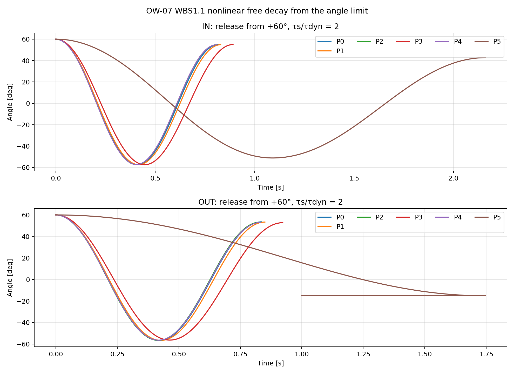
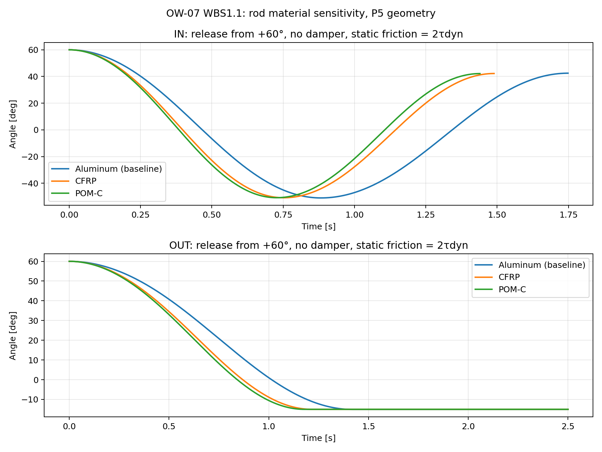

# OW-07 WBS1.1 — 60°初期角からの非線形自由振動

## 結論

候補P0〜P4の全てで、角度リミット端の`+60°`・角速度0から解放すると、IN/OUT両軸とも1周期を完了して再び正側へ戻った。次の正側最大角は`+52.8〜+55.0°`で、1周期後にも初期振幅の`88.0〜91.6%`が残る。今回の候補パラメータは過減衰・臨界減衰にならず、明確に振動する。

OW-06の結論どおり摩擦系を線形減衰比で判定せず、クーロン摩擦と二乗抗力を含む運動方程式を1周期数値積分した。古典的な臨界減衰比はこの非線形・乾性摩擦モデルには定義できないが、60°から放した応答が平衡点を通過し、反対側へ振れて1周期後も戻るため、「今回の動作範囲で振動を止められるか」への答えは「止められない」である。

## 方程式と数値条件

```text
I θ¨ + K sin(θ) + c |θ˙| θ˙ + τdyn sgn(θ˙) = 0
```

- OW-06の採用方針に従い`b=0`。`c`は球の二乗抗力（球径の2乗で補正）と理論ロッド抗力の合計。
- 初期条件は全候補で`θ(0)=+60°`、`θ˙(0)=0`。風入力はゼロにして内向きに解放する。
- 半周期ごとにODEを数値積分し、速度ゼロの反転点をイベント検出。`I`,`K`,`c`,`τdyn`は候補・軸ごとに設定。
- 静止摩擦は反転点で`|K sinθ|≤τs`なら固着とするハイブリッド条件。`τs/τdyn=1、1.5、2`を全ケースで確認した。60°付近では復元トルクが静止摩擦の最大シナリオを大きく上回るため、この倍率幅で結果は変わらなかった。
- 積分最大刻み1 ms。P3 OUTの最大刻み2/1/0.5 ms比較で周期と次周期角の差はそれぞれ`10⁻⁹ s`、`10⁻⁹°`未満。

候補は、現行球100 mm・3.9 g、錘約50.72 g・重心55 mmからの差分として評価した。球質量は同一密度近似`m∝D³`、球慣性は中実球近似、錘は点質量近似。

| 候補 | 球径・質量 | 錘質量・重心位置 |
|---|---|---|
| P0 | 70 mm・1.34 g | 50.72 g・55 mm |
| P1 | 68 mm・1.23 g | 47.832 g・55 mm |
| P2 | 65 mm・1.07 g | 50.72 g・50 mm |
| P3 | 55 mm・0.65 g | 35.874 g・55 mm |
| P4 | 60 mm・0.84 g | 50.72 g・45 mm |

各候補の運動係数:

| 候補 | `I_IN` [10⁻⁴ kg·m²] | `K_IN` [mN·m/rad] | `I_OUT` [10⁻⁴ kg·m²] | `K_OUT` [mN·m/rad] | `c` [10⁻⁵ N·m·s²/rad²] |
|---|---:|---:|---:|---:|---:|
| P0 | 2.8739 | 19.3354 | 2.9012 | 18.5933 | 0.7007 |
| P1 | 2.7519 | 17.9679 | 2.7792 | 17.2257 | 0.6626 |
| P2 | 2.5249 | 17.3035 | 2.5521 | 16.5613 | 0.6077 |
| P3 | 2.2117 | 12.5034 | 2.2389 | 11.7613 | 0.4424 |
| P4 | 2.2132 | 15.2067 | 2.2405 | 14.4645 | 0.5216 |

動摩擦は全候補でIN `0.07946 mN·m`、OUT `0.17695 mN·m`に固定した。

## 60°から解放した1周期の結果

| 候補 | IN周期 [s] | IN次周期最大角 | IN振幅保持率 | OUT周期 [s] | OUT次周期最大角 | OUT振幅保持率 |
|---|---:|---:|---:|---:|---:|---:|
| P0 | 0.817 | 54.87° | 91.4% | 0.836 | 53.54° | 89.2% |
| P1 | 0.829 | 54.83° | 91.4% | 0.850 | 53.39° | 89.0% |
| P2 | 0.810 | 54.79° | 91.3% | 0.831 | 53.30° | 88.8% |
| P3 | 0.892 | 54.97° | 91.6% | 0.923 | 52.80° | 88.0% |
| P4 | 0.808 | 54.71° | 91.2% | 0.832 | 52.99° | 88.3% |



P3 OUTが今回の候補で最も減衰するが、1周期で振幅は約12%しか減らず、次の振れも約53°ある。球・錘の変更だけで過減衰化する物理的な見込みは得られない。これらの変更を続けるなら、目的は過減衰化ではなく、8 m/s角度制約を満たしつつ応答性と静止摩擦の影響を比べることになる。ダンパーで粘性減衰を追加する案は、別途必要な減衰係数から評価する。

## さらに軽い錘・小さい球の極端ケース

ご提案の方向を確認するため、P0〜P4より大幅に小さい球・軽い錘のP5を追加した。OUT軸の8 m/s静的角度が約57°となるよう、球径12 mmに対する錘を逆算した。現行の錘アセンブリ約50.72 gに対し、錘質量は12.96 g（約74%減）。球は100 mmから12 mmに小さく、同密度換算質量は約0.0067 gとなる。

| 項目 | P5 |
|---|---:|
| 球径／同密度換算質量 | 12 mm／0.0067 g |
| 錘質量／重心位置 | 12.96 g／55 mm |
| `I` IN / OUT | 1.3223×10⁻⁴ / 1.3495×10⁻⁴ kg·m² |
| `K` IN / OUT | 0.001242 / 0.000500 N·m/rad |
| 8 m/s静的角度 IN / OUT | 19.7° / 57.0° |
| 起動風速（`τs/τdyn=2`）IN / OUT | 4.92 / 7.35 m/s |

ダンパーなしで+60°から数値積分すると、IN軸は約2.16秒で1周期を完了し、次の正側最大角は+42.70°だった。OUT軸は反対側の−15.14°まで振れてから静止摩擦で停止し、1周期を完了しない。つまり、**軽量化・小径化でOUT軸の振動は大きく抑えられるが、IN軸はまだ振動する**。しかもOUT軸は8 m/sで約57°、高側の起動風速は約7.35 m/sとなり、角度・低風速側の余裕が小さい。

これは錘を軽くして球を小さくする案の効果を示すが、両軸を過減衰相当にする解ではない。現在の候補計算では、共通の質量・位置変更による`K`の差分は両軸に同じだけ加わり、`K_IN−K_OUT=0.000742 N·m/rad`が残る。OUT軸で8 m/s・±60°を保つ下限まで`K_OUT`を下げても、IN軸の`K_IN`は約0.00115 N·m/rad以上となる。INの運動摩擦は0.0000795 N·mなので、60°から静止摩擦だけで振動を止めるにはまだ大きい復元エネルギーが残る。P5は有効な比較案だが、WBS1.1内で「両軸を過減衰化できる」とは判定できない。


P5の係数・時系列は[候補パラメータCSV](wbs11_candidate_dynamic_parameters.csv)と[自由振動結果CSV](wbs11_nonlinear_free_decay.csv)に含む。

## 支柱材質を変えたP5感度

ユーザー指定を反映し、支柱をアルミ以外にしたケースも追加した。直径229 mm・外径5 mm・肉厚0.5 mmの一様な中空管を球側に沿う支柱とし、球密度は現状のまま、直径12 mm・質量0.00674 gに固定した。管の重力モーメントは球と同じく不安定側（`K`への寄与が負）と仮定した。材料変更でその負の寄与が小さくなる分、錘を軽くしてOUTの`K=0.500 mN·m/rad`を維持した。素材密度はアルミ2.70、CFRP 1.60、POM-C 1.41 g/cm³の代表値を使用した（[Toray CFRP資料](https://www.cf-composites.toray/resources/data_sheets/modal2.html)、[Ensinger POM-C資料](https://www.ensingerplastics.com/en-us/shapes/acetal-tecaform-ah-natural)）。

| 支柱材質 | 支柱質量 | 支柱材質変更後に合わせる錘質量 | IN `I` [10⁻⁴ kg·m²] | OUT `I` [10⁻⁴ kg·m²] | IN 60°解放 | OUT 60°解放 |
|---|---:|---:|---:|---:|---|---|
| アルミ | 4.371 g | 12.964 g | 1.3223 | 1.3495 | 1周期、次の正側最大42.70° | −15.14°で静止 |
| CFRP | 2.590 g | 9.257 g | 0.8989 | 0.9261 | 1周期、次の正側最大42.50° | −15.10°で静止 |
| POM-C | 2.282 g | 8.617 g | 0.8258 | 0.8530 | 1周期、次の正側最大42.45° | −15.08°で静止 |

静止摩擦は高側シナリオ`τs=2τdyn`、初期角は+60°、ダンパーなし。錘を合わせ直して`K`を一定にした比較なので、材質低密度化で主に`I`が下がり、時間は短くなる。一方、反対側への最大角はほぼ変わらず、INは明確に振動する。OUTは一度−15°まで越えてから止まり、平衡点を越えない応答ではない。つまり、この形状の支柱材質変更だけでは過減衰化できない。

この結果は、229 mm管が全長一様・球側にあり、管質量による`K`寄与の符号が現行の係数符号と一致する前提での感度計算である。実際の支柱長・位置が異なる場合は再計算が必要。また錘8.6〜9.3 gは現行のボス・カラーを流用した値ではなく、錘アセンブリ全体を作り直す前提の等価質量であり、取付寸法・強度・剛性は未検証である。低密度化のみのケースも同CSVと図に収録した。



材質感度の[計算結果CSV](wbs11_rod_material_sensitivity.csv)と[再現スクリプト](../../../src/run_ow07_wbs11_rod_material_sensitivity.py)を追加した。

## 球腕・錘腕・支柱長を同時に変えた探索

球中心腕`r_ball`、錘重心腕`r_weight`、球径、支柱材質を同時に変えた。球密度は3.9 g/100 mm球から換算して固定。球側支柱長は球中心腕+球半径+端部余裕5 mmとし、現行229 mm管からの質量・慣性・重力モーメント差を`I`,`K`へ反映した。風トルクは球抗力に基づき、8 m/s・60°で5%の復元トルク余裕を持たせて錘質量を逆算した。支柱抗力係数は現在の露出長依存モデルに従い、露出長の4乗で補正した。

掃引範囲は球径8〜40 mm、球腕50〜500 mm、錘腕20〜70 mm、支柱CFRP/POM-Cの計640形状（両軸1280ケース）。静止摩擦は厳しめの`τs=2τdyn`とした。8 m/sでの角度が±60°以内、同じ摩擦条件での起動風速が8 m/s未満となる236形状を比較した。**この範囲に、IN/OUT両軸とも平衡点を越えず停止する形状はなかった。**

次の形状が、8 m/s条件を満たしながらINの次周期最大角を最も下げた。ただし支柱長509 mmの極端な形状であり、剛性・たわみ・共振は未確認で、実装候補ではなく探索範囲内の比較上の最良値である。

| 項目 | 値 |
|---|---:|
| 支柱材質・長さ | POM-C・509 mm |
| 球径・同密度質量 | 8 mm・0.00200 g |
| 球中心腕 | 500 mm |
| 錘質量・重心腕 | 27.61 g・55 mm |
| IN / OUT の`I` | 5.386×10⁻⁴ / 5.413×10⁻⁴ kg·m² |
| IN / OUT の`K` | 1.392 / 0.650 mN·m/rad |
| 8 m/s平衡角 IN / OUT | 22.65° / 55.57° |
| 高側摩擦での起動風速 IN / OUT | 4.36 / 6.50 m/s |
| +60°解放後 IN | 周期4.09 s、次の正側最大33.82° |
| +60°解放後 OUT | −21.19°まで振れて停止 |

この最良値でもINは一周期して戻り、OUTも反対側へ振れてから停止する。長い支柱は空気抵抗を増やす一方で、分布慣性と構造たわみも増やすため、今回の「Iを下げる」方針とは逆向きの寸法になる。球腕/錘腕比を広げても、今回の係数・摩擦・抗力モデルの範囲では過減衰相当の両軸解は見つからなかった。

全1280軸ケースの[探索CSV](wbs11_arm_ratio_scan.csv)、[最良形状の時系列図](wbs11_arm_ratio_best_timeseries.png)、[再現スクリプト](../../../src/run_ow07_wbs11_arm_ratio_scan.py)を追加した。

## 8 m/sの静的角度チェック

P0〜P4の球径候補に加え、極端な小径P5も最大風速の角度制約と照合した。推定平衡角はいずれも±60°内だが、P5はOUT軸で上限近くまで使う。

| 候補 | 8 m/s IN平衡角 | 8 m/s OUT平衡角 |
|---|---:|---:|
| P0 | 47.6° | 50.1° |
| P1 | 48.5° | 51.4° |
| P2 | 45.3° | 48.0° |
| P3 | 44.8° | 48.5° |
| P4 | 43.6° | 46.4° |
| P5 | 19.7° | 57.0° |

## 再現ファイル

- [計算スクリプト](../../../src/run_ow07_wbs11_nonlinear_free_decay.py)
- [候補別の動的パラメータ](wbs11_candidate_dynamic_parameters.csv)
- [30条件のシミュレーション結果](wbs11_nonlinear_free_decay.csv)
- [60°解放の時系列図](wbs11_free_decay_60deg.png)

CSVは候補6×軸2×静止摩擦倍率3=36条件を収録する。P5は球を12 mm、錘を12.96 gとした追加の極端ケース。
