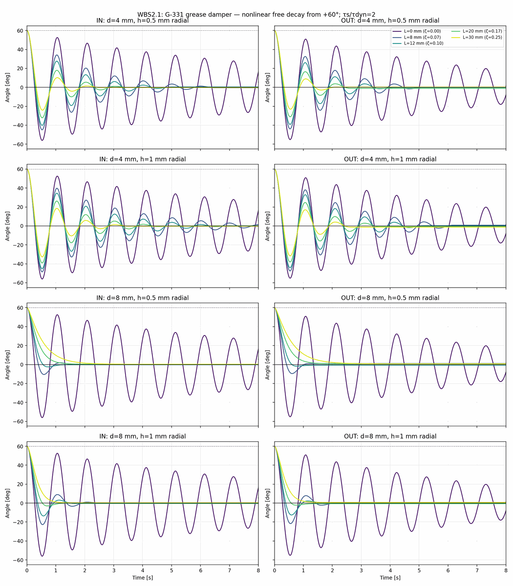

# OW-07 WBS2.1 — シャフト径・すきま別グリスダンパー評価

## 結論

ユーザー指定の範囲を更新し、シャフト径4/8 mm、半径方向すきま0.5/1.0 mm、接触長0〜30 mmを比較した。メーカー標準試験点から理想環状Couetteせん断で換算した机上モデルでは、**8 mm径・1 mmすきま・30 mm長**が現行の錘・球で臨界相当となる候補だった。

この条件での等価減衰係数は約4.613 mN·m·s/rad、減衰比はIN 0.983、OUT 1.004。+60°自由振動では両軸とも平衡点通過なしで停止した。INは線形臨界値の約98%、OUTは約100%で、まさに臨界近傍の計算結果である。

8 mm径・0.5 mmすきまなら等価減衰比はIN 1.686、OUT 1.723で、臨界値を上回る。4 mm径では、すきま0.5 mmでも減衰比0.246/0.251にとどまる。したがって、シャフト径を8 mmまで許容し、1 mmすきまが取れるなら、寸法範囲内で有望な候補が得られる。

ただし、この数値はG-331の35 µmすきま・4 mmシャフトでの単一カタログ試験点を、異なる径とすきまへ外挿した理想せん断モデルである。グリスの実効粘度・降伏応力や箱端効果は含まれず、**実機での臨界減衰を保証する値ではない**。8 mm径・1 mmすきまを次の設計候補として扱い、製作可能な箱形状とグリスの保持を照合する必要がある。また粘性ダンパーは静止時にトルクを発生しないため、現行100 mm球の8 m/s静的角度制約はこの結果では解決していない。全体成立には球サイズの再評価が残る。

## 条件とモデル

- シャフト径: 4 mm、8 mm。
- 半径方向すきま: 0.5 mm（下限）、1.0 mm（希望値）。
- 接触長: 0〜30 mm。
- 錘・球・支柱の寸法、質量、現行BALLの`I`,`K`,`c_quad`,`τ_dyn`は固定。
- 各軸とも`θ(0)=+60°`, `θ̇(0)=0`から数値積分。
- 静止摩擦は`τ_s/τ_dyn=1, 1.5, 2`の感度条件。表と図は比2。

```text
I θ¨ + K sin(θ) + b_eq θ˙ + c_quad |θ˙| θ˙ + τ_dyn sgn(θ˙) = 0
```

折返し点で`|K sin(θ)| ≤ τ_s`なら静止摩擦で停止できるとしている。

### 現行係数と臨界係数

| 軸 | `I` [kg·m²] | `K` [N·m/rad] | 固有振動数 [Hz] | `b_crit=2√(IK)` [mN·m·s/rad] |
|---|---:|---:|---:|---:|
| IN | 3.6821×10⁻⁴ | 0.014963 | 1.015 | 4.695 |
| OUT | 3.7094×10⁻⁴ | 0.014221 | 0.985 | 4.594 |

### カタログ値からの等価係数換算

信越化学G-331の標準試験は、直径4 mm、接触長8 mm、すきま35 µm、10 rpm時に3.4 mN·mのトルクを記載している。G-330系は温度変化によるトルク変化が小さいとの説明があるが、温度別数値や速度—トルク曲線は示されていない。出典: [信越化学シリコーングリースカタログ](https://www.shinetsusilicone-global.com/catalog/pdf/grease_e.pdf)。

10 rpm時の角速度で割ると、基準係数は`b_ref=3.247 mN·m·s/rad`（4 mm径、35 µm、8 mm長）。回転内筒と静止外筒の理想ニュートン流体Couette流れでは、トルク/角速度/長さは次の幾何因子に比例すると仮定した。

```text
F(a,h) = a²(a+h)² / ((a+h)²-a²)
R = F(a,h) / F(2 mm, 0.035 mm)
b_eq(L) = b_ref × (L/8 mm) × R
```

| シャフト径 | 半径すきま | 幾何比 `R` | `b_eq` (30 mm) | IN/OUT `ζ_eq` (30 mm) |
|---:|---:|---:|---:|---:|
| 4 mm | 0.5 mm | 0.09473 | 1.153 mN·m·s/rad | 0.246 / 0.251 |
| 4 mm | 1.0 mm | 0.06138 | 0.747 mN·m·s/rad | 0.159 / 0.163 |
| 8 mm | 0.5 mm | 0.64995 | 7.913 mN·m·s/rad | 1.686 / 1.723 |
| 8 mm | 1.0 mm | 0.37891 | 4.613 mN·m·s/rad | 0.983 / 1.004 |

グリスは一般に理想ニュートン流体ではないため、これは材料粘度の測定値ではなく幾何学的なせん断換算にすぎない。特に8 mm径条件はカタログの4 mm径から外挿している。グリスの降伏応力、速度・温度・塗布状態、端部の流れ、シャフトと箱の偏心は未評価。

## +60°自由振動結果

| シャフト径 [mm] | 半径すきま [mm] | 接触長 [mm] | `b_eq` [mN·m·s/rad] | `ζ_eq` IN / OUT | 最初の反対側ピーク IN / OUT | 平衡点通過 IN / OUT |
|---:|---:|---:|---:|---:|---:|---:|
| 4 | 0.5 | 30 | 1.153 | 0.246 / 0.251 | −24.12° / −23.06° | 5 / 4 |
| 4 | 1.0 | 30 | 0.747 | 0.159 / 0.163 | −32.66° / −31.61° | 7 / 5 |
| 8 | 0.5 | 30 | 7.913 | 1.686 / 1.723 | 通過なし | 0 / 0 |
| 8 | 1.0 | 30 | 4.613 | 0.983 / 1.004 | 通過なし | 0 / 0 |

8 mm径・1 mmすきまでは、INの`ζ_eq`が1を少し下回るものの、今回の大振幅非線形モデルでは乾性摩擦・二乗抵抗も働くため、+60°解放後に反対側へ通過せず停止した。停止角はIN +0.304°、OUT +0.713°、停止時間はIN 2.37 s、OUT 2.73 s。静止摩擦比1および1.5でも、該当ケースの自由振動をCSVに記録している。

8 mm径・0.5 mmすきまも平衡点通過なしだったが、係数換算上は線形臨界値の約1.7倍である。実トルクが見積もりより小さくなる不確かさに対しては1 mm条件より余裕がある一方、応答が過減衰側へ移る可能性が高い。1 mm条件は臨界相当、0.5 mm条件は余裕側として比較できる。



## 限界と次の確認

- 0.5 mm、1 mmは**半径方向すきま**として扱った。寸法図でも半径すきまを指定し、直径すきまと混同しない。
- カタログのトルク一点から異なるシャフト径・すきまへ外挿したため、`b_eq`の絶対値には大きな不確かさがある。線形臨界近傍という分類も実機保証ではない。
- シャフト径を8 mmへ増した場合の周囲部品との干渉、箱の外径、封止、グリス保持、軸受荷重、組立公差、追加慣性はまだ確認していない。
- 次は8 mm径・1 mmすきま・30 mm長を中心候補に、箱の寸法成立性とグリス保持構造を確認する。0.5 mmすきまは製作可能な場合の余裕側比較として残す。
- 静的な8 m/s角度は速度ゼロの釣合いで決まり、この粘性項は静止時に作用しない。現行100 mm球では既存の静的スクリーニングで角度リミットを満たさないため、ダンパー寸法が有望でも全体目標の成立を意味しない。球サイズの再評価が残る。推定器込み10 Hz性能も別途評価が必要。

## 再現

```bash
python 06_Analysis/simulation/src/run_ow07_wbs21_grease_damper_free_decay.py
```

- `wbs21_grease_damper_free_decay.csv` — 4幾何条件 × 接触長7条件 × 軸2 × 静止摩擦比3の168ケース
- `wbs21_grease_damper_free_decay.png` — 4幾何条件、IN/OUT両軸の時系列比較
- `../../../src/run_ow07_wbs21_grease_damper_free_decay.py` — 再実行スクリプト
