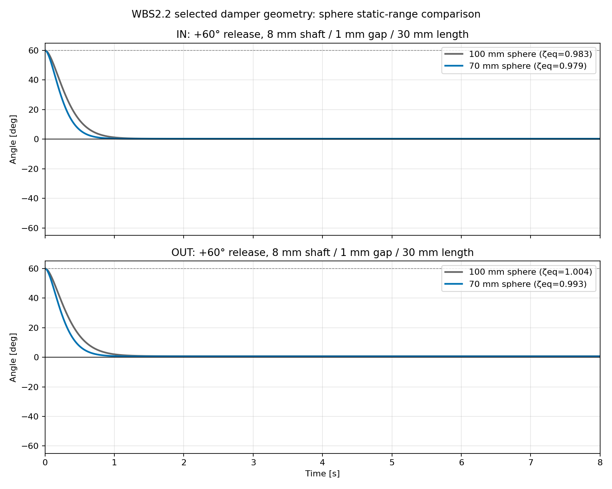

# OW-07 WBS2.2 — 選定ダンパー条件の寸法・球径スクリーニング

## 前提と結論

次候補を**シャフト径8 mm、グリス接触長30 mm、半径方向すきま1 mm**に固定した。箱の内径は10 mmとなる。現行球100 mmのままでは、8 m/s時に必要な静的復元トルクを満たせない。一方、同密度で球を70 mmにすると、既存の錘を維持した計算で8 m/s平衡角はIN 47.6°、OUT 50.2°となり、±60°内に入る。球質量は約1.34 g。

70 mm球に変更した後も、選定ダンパーでの等価減衰比はIN 0.979、OUT 0.993。+60°解放の非線形計算は両軸とも平衡点を通過せず、静止摩擦比2の条件ではIN約1.79秒・OUT約2.04秒で止まった。よって、**力学モデル上の暫定組合せは「70 mm球、既存錘、8 mm径・30 mm長・1 mm半径すきま」**となる。

ただし機械的な取付け可否は未確定。既存BOMのMR62ZZは内径2 mm、外径6 mmである。8 mm径の部品がその軸受を通る軸そのものなら不適合で、別の同軸スリーブとして取り付ける構造が必要になる。リポジトリにはV1機構部の組立CAD・断面図がないため、周辺部品との干渉を確定できない。さらに、G-331のカタログ値は単一試験条件であり、1 mmすきまへの実減衰換算は未検証である。以下は寸法要求と力学候補を絞る机上評価で、製作承認ではない。

## 1. 箱とグリスの必要寸法

8 mm円筒シャフトの半径方向に1 mmのすきまを設けると、箱の内径は`8+2×1=10 mm`。30 mm長の環状すきまを円筒一周分満たすと、グリス容積は次の通り。

```text
V = π[(5 mm)² − (4 mm)²] × 30 mm = 848 mm³ = 0.848 mL / 軸
```

G-331の代表密度1.15 g/cm³を使うと、環状部だけで約0.975 g/軸、IN/OUTの2軸で約1.95 gとなる。これは端部空間や保持溝を含まない充填量の目安。

| 部位 | 寸法・量 | 扱い |
|---|---:|---|
| シャフト外径 | 8 mm | 選定値 |
| 箱内径 | 10 mm | 半径すきま1 mmから算出 |
| グリスせん断長 | 30 mm | 選定値 |
| 箱の外径 | `10 mm + 2×壁厚` | 壁厚・強度・固定方法未定。例として壁厚1 mmなら外径12 mmだが、これは構造設計値ではない |
| 箱の全長 | 30 mmより長い | 両端の壁・保持・シール分が追加で必要。必要余長は構造未定のため算出できない |
| 環状部グリス量 | 約0.848 mL / 軸 | 全長30 mmを一様充填する仮定 |
| 2軸分のグリス質量 | 約1.95 g | 密度1.15 g/cm³で換算。端部充填分を除く |

開放端のままでは、タッキーなグリスでも回転と重力で移動・漏出しないとは言えない。両端に保持形状またはシールが必要になる。接触シールを使うとその摩擦トルクがダンパーの粘性トルクに重なり、今回のモデルには含まれていない。密閉する場合も、温度変化やグリスの体積変化を逃がす空間を設計する必要があるが、公開資料からG-331の膨張率を得られないため量的評価はできない。

信越化学は[製品情報](https://www.shinetsusilicones.com/rtv.aspx?ID=G-331)で、G-331を高粘着・高せん断抵抗のダンパー用グリスとし、G-330系は温度でのトルク変化が小さいと説明している。公開代表値には23℃での密度1.15 g/cm³、ちょう度305、使用温度−30〜+150℃、トルク34×10⁻⁴ N·mがある。メーカーは代表値が規格値ではないと明記している。これらの情報は適性を示すが、「1 mmすきまで長期に漏れない」「計算通りの速度比例トルクが出る」ことは保証しない。

## 2. 軸受・周辺部品との干渉

設計BOMに記載されたMR62ZZの公称寸法は内径2 mm、外径6 mm、幅2.5 mmである（[NSK仕様](https://www.nsk.com/engineering/mr62zz-esm-md.html)）。したがって、8 mm径を既存MR62ZZの内輪に通す構造は寸法上成立しない。

8 mm径を既存の2 mm軸の外側に固定する回転スリーブとして使えば軸受穴との直接干渉は避けられる可能性があるが、スリーブ外径8 mmと内径10 mmの箱、既存の6 mm外径軸受、支持板、センサー、配線との隙間を確認できる組立CADがない。確認できたV1 CADは基板のSTEPで、機構一式の3Dモデルはリポジトリ内に見当たらない。よって「箱内径10 mmの環状部は幾何上定義できる」が「現ハードに組める」は未判定である。

軸の有効長も公称寸法記録がない。選定した30 mm接触長に、端板・溝・保持部を加えた軸方向長さが取れるかも確認できていない。取付け面から支点までの利用可能長、既存軸の直径と突出長、センサー磁石との距離を示す断面寸法があれば干渉判定を閉じられる。

## 3. 8 m/s静的角度と球径

粘性ダンパーは角速度ゼロではトルクを発生しないため、静的平衡角を改善しない。既存球100 mmのままでは、これまでの静的評価で8 m/s・±60°条件を満たさず、現行錘での球径上限は約73.6 mmと推定されている（[WBS1.1の候補計算](wbs11_arm_ratio_scan.csv)）。

既存の錘（50.72 g、重心腕55 mm）を保ち、球密度を現行と同じにして70 mmを選ぶ。WBS1.1の球・錘補正モデルから得た値は次の通り。

| 条件 | 球径 | 同密度球質量 | `I` IN / OUT [kg·m²] | `K` IN / OUT [N·m/rad] | 8 m/s平衡角 IN / OUT |
|---|---:|---:|---:|---:|---:|
| 現行 | 100 mm | 3.90 g | 3.6821e-4 / 3.7094e-4 | 0.014963 / 0.014221 | 角度上限を満たさない |
| P0候補 | 70 mm | 1.34 g | 2.8739e-4 / 2.9012e-4 | 0.019335 / 0.018593 | 47.6° / 50.2° |

70 mm球ではOUT側で60°まで約9.8°の静的角度余裕がある。より小さい球では角度余裕は増えるが、受風トルクが面積に比例して減る。推定風速の最低要求値は未定なので、70 mmを「静的条件を満たす保守候補」として残し、低風速側の受け入れ判断は別途行う。

軸摩擦比`τ_s/τ_dyn=1〜2`を使った停止状態からの起動風速目安は、70 mm球ではIN約0.60〜0.84 m/s、OUT約0.89〜1.26 m/sとなる。これは停止摩擦を越える目安で、実際の推定可能下限ではない。センサーノイズや角度分解能を加えた最低計測風速の判定はまだ行っていない。

## 4. 70 mm球での選定ダンパー自由振動

8 mm径・30 mm長・1 mmすきまの`b_eq=4.613 mN·m·s/rad`を使い、70 mm球・現行錘の係数で`+60°`から積分した。

| 軸 | `ζ_eq` | 最初の反対側ピーク | 停止角 (`τ_s/τ_dyn=2`) | 停止時間 |
|---|---:|---:|---:|---:|
| IN | 0.979 | なし | +0.235° | 1.79 s |
| OUT | 0.993 | なし | +0.545° | 2.04 s |

静止摩擦比1、1.5でも平衡点を通過しない。動摩擦・二乗抗力・粘性項を含めた大振幅モデルの結果であり、`ζ_eq≈1`の小振幅近似だけで応答を断定していない。



## 5. ハードウェア実測の制約

このプロジェクトでは実ハードの計測環境がないため、グリスの実トルク、シール摩擦、温度特性、漏れ、ガタ・偏心を新規に測定していない。計算はメーカー代表値と既存自由振動係数に基づく。ここで完了できるのは、必要空間、材料情報の範囲、静的球径とモデル上の波形を整理するところまでで、現物での性能検証ではない。

次の判定で必要な機械情報は、(1) 8 mm部品が軸受支持軸か外付けスリーブか、(2) 支点周辺と支持板の断面寸法または機構CAD、(3) IN/OUTそれぞれの軸突出長、(4) シール方式を含む利用可能軸方向長さ。これらがない限り干渉の最終判定は保留となる。

## 再現

```bash
python 06_Analysis/simulation/src/run_ow07_wbs22_selected_candidate.py
```

- `wbs22_selected_candidate.csv` — 現行球と70 mm球、軸別・静止摩擦比別の静的/自由振動結果
- `wbs22_selected_candidate_timeseries.png` — 選定ダンパー条件における+60°自由振動
- `../../../src/run_ow07_wbs22_selected_candidate.py` — 再実行スクリプト
