# OW-07 WBS2.3 — グリス粘性を含むオフライン風速推定の比較

## 結論

WBS2.2で選んだ**70 mm球、8 mm径・30 mm長シャフト、半径すきま1 mm**を対象に、モデルへ仮定粘性係数 `b=4.613×10⁻³ N·m·s/rad` を追加してRTSを再評価した。`b=0` の従来観測器を使い回さず、プラントとRTSの両方へ選定した `b` を入れ直した。比較には静的換算、従来設定の因果LPF、静的風速の中央1秒・3秒平均を用いた。

- 一致係数・ノイズなしではRTSがKaimal風と1 Hz正弦で形状・振幅をよく再現した。1 Hzでは静的換算とLPFの振幅が大きく不足した。
- **10 Hz正弦はRTSを含めて推定できなかった。** ダンパーで角度の10 Hz成分が小さくなり、角度計測から風の10 Hz成分を復元する情報が不足する。静的換算やLPFも振幅を保持しない。
- `b` が仮定値から±50%ずれると、特に1 Hzの係数不一致ケースでRTSの振幅誤差が大きくなった。OW-04係数ずれと `b` ずれを同時に入れた条件では、INの基本波振幅比が `b=0.5b₀` で1.79、`b=1.5b₀` で0.76、OUTはそれぞれ1.47と0.80だった。
- 60°からゼロ風へ解放する条件では、一致モデル・理想角度のRTSは偽風速をほぼ出さないが、指定した角度ノイズ・量子化・遅れを含めるとRTSの偽風速RMSEはIN 0.169 m/s、OUT 0.351 m/sになった。ノイズに対する余裕は十分でない。

したがって、今回の `b` を入れたRTSは低周波・滑らかな風のオフライン推定に一定の性能を示す一方、10 Hz応答と `b` の不確かさを含む実用精度は未達または未保証である。`b` の値はグリスの実測トルクではなく理想Couette流れによる外挿値であり、以下の結果は机上シミュレーションである。

## 1. 対象モデルと係数

選定した70 mm球は現行球と同密度を仮定した質量1.338 g。空力換算は `ρ=1.225 kg/m³`, `Cd=0.544`, 球投影面積 `πD²/4` を使用した。支点から球中心までの幾何腕長はWBS2.2の静的評価と同じ174 mmとした。対象はIN/OUT独立の1自由度で、プラント式は次の通り。

```text
I θ¨ + b θ˙ + c |θ˙| θ˙ + τ tanh(θ˙/ε) + K sinθ
  = L F cosθ
F = 0.5 ρ Cd A V|V|
```

摩擦平滑化はOW-06と同じ `ε=0.5 deg/s`。±60°ハードストップをモデルに入れ、計算中の接触はなかった（自由解放の初期角60°を除く）。球を70 mmにした候補係数とグリス減衰は次の通り。

| 軸 | `I` [kg·m²] | `K` [N·m/rad] | `c` [N·m·s²/rad²] | `τ` [N·m] | 仮定 `b₀` [N·m·s/rad] |
|---|---:|---:|---:|---:|---:|
| IN | 2.8739e−4 | 0.019335 | 7.0066e−6 | 7.9457e−5 | 0.0046134 |
| OUT | 2.9012e−4 | 0.018593 | 7.0066e−6 | 1.7695e−4 | 0.0046134 |

`b₀` はWBS2.1のG-331カタログ一点を環状Couette幾何へ換算した値。グリスの粘度・速度依存トルクが公開されていないため、物性値として確定した値ではない。今回の `b` 感度ケースは `0.5b₀=0.002307` と `1.5b₀=0.006920 N·m·s/rad`。この±50%は設計感度用の仮定幅で、信頼区間ではない。

### 1.1 箱の幾何エンベロープ

ユーザー確認により、指定した8 mm径・30 mm長の配置は既存部品と干渉しない。1 mm半径すきまを保つ箱の内径は10 mm、有効長は30 mm、環状部の充填量は0.848 mL/軸（G-331代表密度換算で0.975 g/軸）となる。壁厚1 mmを作図用の暫定値とすれば箱胴の外径は12 mm。両端に1 mm厚の端壁を設けた場合でも、シール溝・軸通過部・保持代は別に必要なので、箱の最終全長は32 mmより長くなる。壁厚1 mmは本体配置用の仮寸法であり、材質・締結・加工方法に対する強度確定値ではない。

箱はフレーム側に固定し、シャフトのみを回転させる前提なので箱・グリスの質量は回転慣性に加えていない。回転シャフトに接触シールを付ける場合、その摩擦トルクは `b₀` と別に効くが、実用トルク仕様がなく数値へ加算できない。従ってこの段階では箱胴の内外径・有効長・グリス量の幾何要求までを定義し、シール構造と密閉後の実トルクは未確定として残す。

## 2. 比較条件

| 項目 | 設定 |
|---|---|
| 標本化・プラント積分 | 100 Hz出力、5内部刻み/標本、連続入力を線形補間 |
| RTS | `[θ, θ˙, F]` 3状態EKF＋全記録区間のRTS後向き平滑化。`b=b₀`、IN/OUTの風力ランダムウォーク標準偏差はOW-06の `3e−5 / 3e−4 N/sample`、想定角度ノイズ0.02° |
| Static | `F̂=K tanθ/L` を選定球の空力係数で風速に換算。摩擦・角速度項は使わない |
| LPF | 静的換算後にOW-03/05既定の3段一次因果フィルター。遮断周波数IN 0.5 Hz、OUT 0.75 Hz |
| Static mean | 静的換算風速に対する中央移動平均1秒/3秒。事後処理として未来側標本も使う |
| センサー理想条件 | 真の角度を直接使用 |
| センサーノイズ条件 | 14 bit、360°フルスケール、白色σ=0.015°、有色σ=0.010°・時定数0.475 s、10 ms遅れ。seed 20261007–20261009 |

OW-04で使った相関付き `I/K/τ/c` 同時ずれを、100 mm基準BALL係数からの比率として70 mm候補へ適用した。プラント側のみを変更し、RTSと静的換算は公称70 mm係数のままにした。ずれ比はINで `I×1.090`, `K×0.912`, `τ×1.008`, 球の二次抗力 `×1.028`、OUTで `I×1.089`, `K×0.907`, `τ×1.019`, 球の二次抗力 `×1.028`。`b` ずれ単独と、OW-04ずれに `b=0.5b₀/1.5b₀` を加えた複合ケースを別々に評価した。

| 入力 | 波形・評価開始 |
|---|---|
| 風モデル | 独立Kaimal、平均2 m/s、TI 20%、最大4 m/s、120 s。15 s以降を評価 |
| 正弦波1 Hz | 平均2 m/s、振幅0.5 m/s、30 s。3 s以降を評価 |
| 正弦波10 Hz | 平均2 m/s、振幅0.5 m/s、30 s。3 s以降を評価 |
| ガスト | 2 m/s基底に、6 m/sまでのガウス型ガスト（中心35/78 s、幅5/7 s）を重畳、120 s。15 s以降を評価 |
| 60°解放 | 60°静止から時刻0で解放し、以降の風速は0 m/s、30 s。全区間を評価 |

## 3. 指標

非ゼロ風の波形は、OW-05/06の評価に合わせ同時刻RMSEと、許容時間ずれ後の相関・NRMSEを分けた。正弦波の振幅比は基本波の正弦・余弦最小二乗フィット、Kaimalとガストは平均除去後の変動標準偏差比で算出した。許容ラグは正弦波で最大半周期、他の風入力で最大2秒。振幅比は形状一致や総合精度を単独で示さない。60°解放は真値が全区間0なので、ラグ指標は適用せず偽風速RMSE・95パーセンタイルを見る。

## 4. 結果

### 4.1 一致係数・理想角度

| 入力 | 軸 | RTS RMSE [m/s] | RTS ラグ後NRMSE | RTS 振幅比 | Static RMSE [m/s] | LPF RMSE [m/s] |
|---|---|---:|---:|---:|---:|---:|
| Kaimal | IN | 0.0920 | 0.223 | 0.982 | 0.189 | 0.310 |
| Kaimal | OUT | 0.0671 | 0.162 | 0.994 | 0.217 | 0.302 |
| 正弦1 Hz | IN | 0.0532 | 0.084 | 1.064 | 0.364 | 0.354 |
| 正弦1 Hz | OUT | 0.0268 | 0.052 | 1.017 | 0.365 | 0.364 |
| 正弦10 Hz | IN | 0.3548 | 1.000 | 0.0003 | 0.360 | 0.355 |
| 正弦10 Hz | OUT | 0.3484 | 0.981 | 0.019 | 0.358 | 0.355 |
| ガスト | IN | 0.0016 | 0.001 | 1.000 | 0.082 | 0.288 |
| ガスト | OUT | 0.0011 | 0.001 | 1.000 | 0.126 | 0.262 |

ガストは変化が数秒スケールの滑らかな2回のパルスであり、一致モデルRTSに有利な条件である。係数ずれとセンサー誤差を含む条件は後掲の時系列図と全件CSVに示す。ガストの一致結果を一般の突風追従性能へ広げない。

60°解放・ゼロ風の一致モデルでは理想角度RTSの偽風RMSEはIN 0.0005 m/s、OUT 0.0018 m/s。ノイズあり3 seed平均ではRTSがIN 0.169、OUT 0.351 m/s、静的換算はIN 1.059、OUT 1.070 m/s、LPFはIN 0.619、OUT 0.744 m/sとなった。RTSは大角度の運動モデルを使うため静的換算より偽風を抑えたが、ノイズによる非ゼロ風出力は残る。

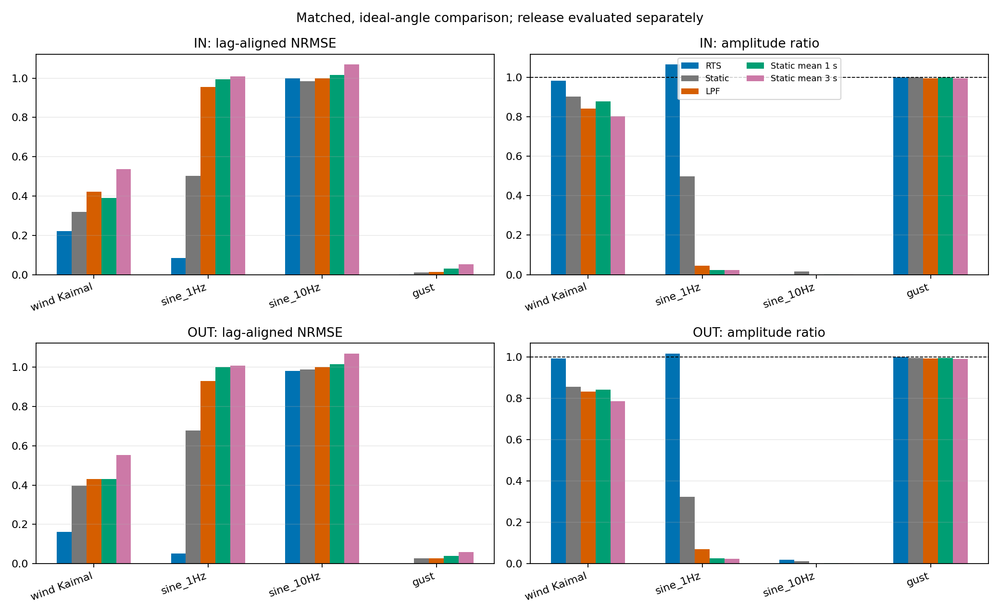

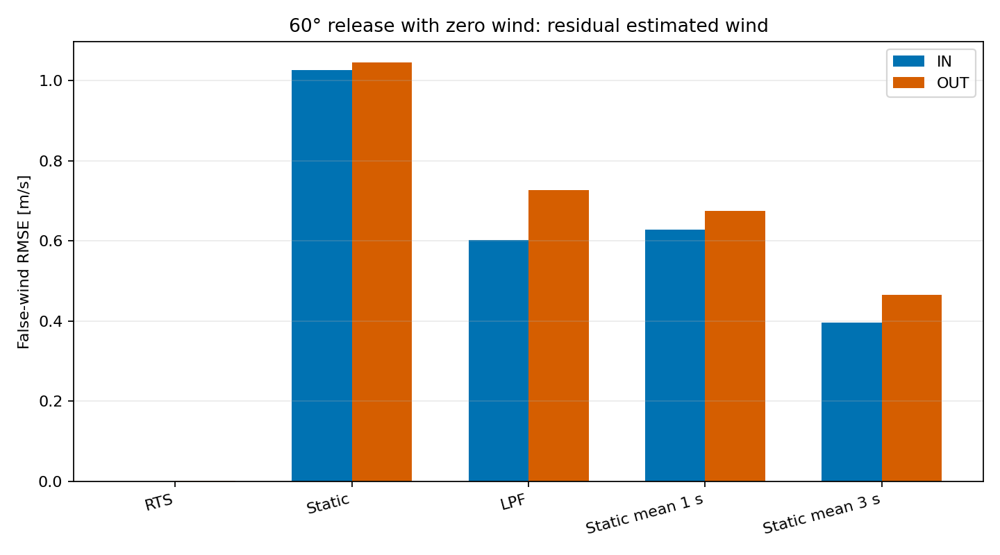

### 4.2 係数ずれ・`b` ずれ・センサーノイズ

下表はRTSのノイズseed 3系列平均。`b` ずれ単独は他係数一致、複合条件はOW-04係数ずれも同時にプラントへ入れた。

| 入力 | 軸 | 係数条件 | RMSE [m/s] | ラグ後NRMSE | 振幅比 | 偏り [m/s] |
|---|---|---|---:|---:|---:|---:|
| 正弦1 Hz | IN | 一致 | 0.038 | 0.087 | 1.066 | −0.001 |
| 正弦1 Hz | IN | `b=0.5b₀` | 0.315 | 0.830 | 1.809 | −0.071 |
| 正弦1 Hz | IN | `b=1.5b₀` | 0.075 | 0.208 | 0.797 | 0.014 |
| 正弦1 Hz | IN | OW-04 + `b=0.5b₀` | 0.286 | 0.801 | 1.785 | 0.033 |
| 正弦1 Hz | IN | OW-04 + `b=1.5b₀` | 0.142 | 0.243 | 0.761 | 0.113 |
| 正弦1 Hz | OUT | 一致 | 0.035 | 0.100 | 1.026 | −0.002 |
| 正弦1 Hz | OUT | `b=0.5b₀` | 0.209 | 0.572 | 1.555 | −0.046 |
| 正弦1 Hz | OUT | `b=1.5b₀` | 0.069 | 0.193 | 0.840 | 0.009 |
| 正弦1 Hz | OUT | OW-04 + `b=0.5b₀` | 0.185 | 0.486 | 1.468 | 0.067 |
| 正弦1 Hz | OUT | OW-04 + `b=1.5b₀` | 0.142 | 0.229 | 0.793 | 0.115 |
| Kaimal | IN | 一致 | 0.092 | 0.224 | 0.983 | 0.004 |
| Kaimal | IN | OW-04 + `b=0.5b₀` | 0.154 | 0.297 | 1.091 | 0.094 |
| Kaimal | IN | OW-04 + `b=1.5b₀` | 0.145 | 0.249 | 0.968 | 0.102 |
| Kaimal | OUT | 一致 | 0.076 | 0.185 | 1.002 | 0.001 |
| Kaimal | OUT | OW-04 + `b=0.5b₀` | 0.136 | 0.224 | 1.083 | 0.098 |
| Kaimal | OUT | OW-04 + `b=1.5b₀` | 0.137 | 0.208 | 0.980 | 0.106 |

`b` の誤差は角速度比例トルクのモデルずれなので、動的励起が強い1 Hzの正弦波で振幅誤差を生じた。係数ずれを含むガストでは、時間ずれを許した波形形状は良好でも、推定風の正の偏りが約0.15 m/s残るケースがあり、ラグ後指標だけでは絶対値の偏りを見落とす。

10 Hzは係数一致でもRTS基本波振幅比がIN 0.001、OUT 0.019、RTS RMSEは約0.35 m/sだった。真値の変動振幅0.5 m/sに対し推定基本波がほぼ消失している。これは平滑化だけでは補えないプラント応答・角度情報量の制限を示す。

### 4.3 正弦波周波数掃引によるRTSの実効帯域

WBS2.3と同じ70 mm球・選定ダンパーのマッチド条件で、入力風速を

$$
V(t)=2.0+0.2\sin(2\pi f t)\quad[\mathrm{m/s}]
$$

として、0.05〜15 Hzを対数間隔で掃引した。1 Hzと10 Hzは個別の測定点として加えた。風による力は二乗抗力の式

$$
F(t)=\frac{1}{2}\rho C_D A\,V(t)|V(t)|
$$

で求め、WBS2.3の非線形運動方程式を積分した。プラントとRTSの係数は一致させ、両方に今回仮定した粘性係数 $b=4.613\times10^{-3}\ \mathrm{N\,m\,s/rad}$ を含めた。サンプリングは100 Hz、RTSのqはIN $3\times10^{-5}$、OUT $3\times10^{-4}\ \mathrm{N/sample}$。角度信号には乱数センサーノイズを加えず、RTSの測定ノイズ共分散には従来どおり角度標準偏差0.02°を設定した。

各周波数で10周期を計算し、オフライン平滑化の端点影響を避けるため、先頭と末尾の各2周期を除いた中央6周期を使った。真の風速と推定風速を同じ周波数の正弦・余弦・定数項で最小二乗フィットする。フィット式を

$$
y(t)=c_0+c_s\sin(2\pi f t)+c_c\cos(2\pi f t)
$$

とすると、正弦波の振幅は2つの直交成分の二乗和平方根

$$
A_y=\sqrt{c_s^2+c_c^2}
$$

で求まる。したがって、RTSの実効振幅ゲインとdB表示は

$$
G_V(f)=\frac{A_{\hat V}(f)}{A_V(f)},\qquad
G_{V,\mathrm{dB}}(f)=20\log_{10}G_V(f)
$$

である。位相差は、フィットした正弦・余弦係数から求めた推定風の位相から入力位相を引いた値とした。これは風速2 m/s、振幅0.2 m/s、指定したqとbに対する**局所的な非線形周波数応答**であり、入力振幅や平均風速、係数が変われば曲線も変わり得る。

カットオフは低周波側のゲインを基準にした最初の下向き−3 dB交点と定義した。低周波基準は掃引で最も低い3周波数点のdB平均で、この試験では両軸ともほぼ0 dBである。ゲイン対dBの隣接2点間を、周波数の対数軸上で線形補間して交点を求めた。

| 軸 | 低周波基準 | −3 dB振幅比 | −3 dBカットオフ | 1 Hzゲイン | 10 Hzゲイン |
|---|---:|---:|---:|---:|---:|
| IN | 0.0002 dB | 0.708 | **1.66 Hz** | 1.069（+0.58 dB） | 0.00057（−64.89 dB） |
| OUT | 0.0001 dB | 0.708 | **3.35 Hz** | 1.012（+0.10 dB） | 0.0155（−36.18 dB） |

INは約1.00 Hzで最大ゲイン1.069、OUTは約1.53 Hzで最大ゲイン1.019となり、低周波ではおおむね振幅を保った後に減衰した。10 Hzでは推定振幅が入力のIN約0.057%、OUT約1.55%に低下した。この条件のRTS実効帯域はINで約1.7 Hz、OUTで約3.3 Hzであり、10 Hz風速変動を振幅どおり推定できない。これはWBS2.3の10 Hz正弦試験の結論とも一致する。

位相図はゲイン比0.05未満では表示を止めた。推定基本波がほぼゼロになる領域では、小さな数値変化で位相が大きく変わり、読み取りに適さないためである。

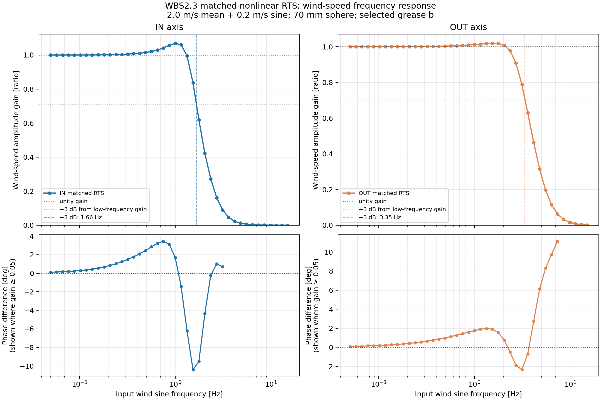

数値データは `rts_wind_speed_gain_vs_frequency.csv`、再生成設定は `rts_wind_speed_gain_settings.json`、再現スクリプトは `../../../../src/run_ow07_wbs23_rts_frequency_sweep.py` に保存した。

## 5. 時系列図

各図の上段は係数一致・理想角度、下段はOW-04係数ずれと `b=1.5b₀` の複合条件にセンサーノイズ（seed 20261007）を加えた場合。全方式を同じプラント角度から推定し、真風速と重ねた。10 Hz図は細部が読めるよう最初の1秒を表示。

### Kaimal風モデル


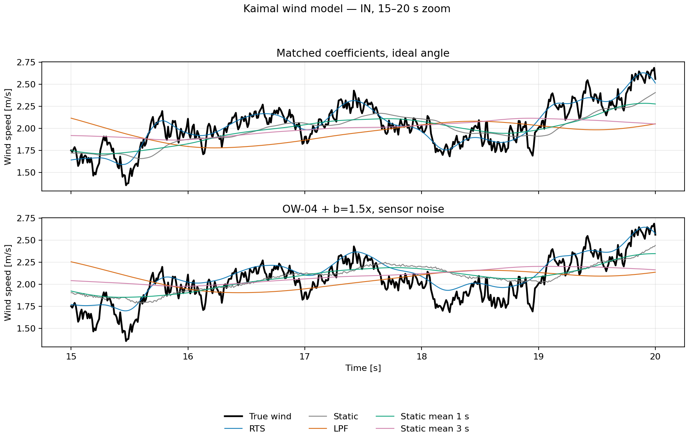


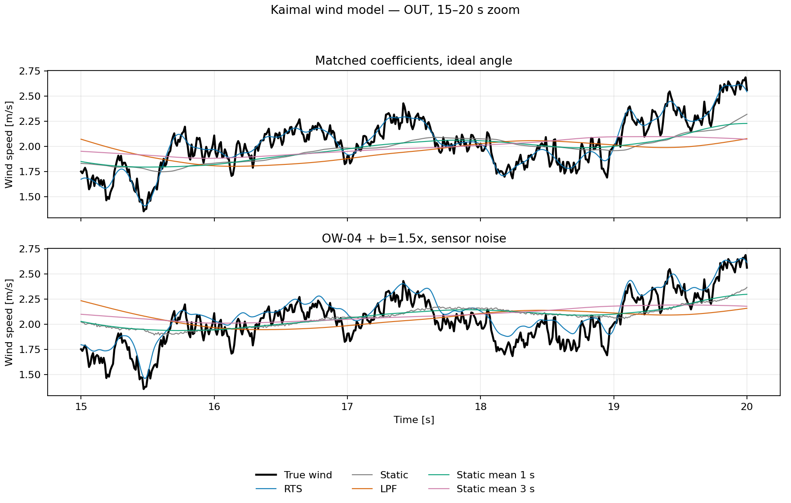

全区間図に加え、Kaimal風の評価開始後の15–20秒を拡大した図をIN/OUT各軸に追加した。高周波側の風速変動と各推定方式の追従を確認しやすい時間幅で表示している。

### 1 Hz正弦風

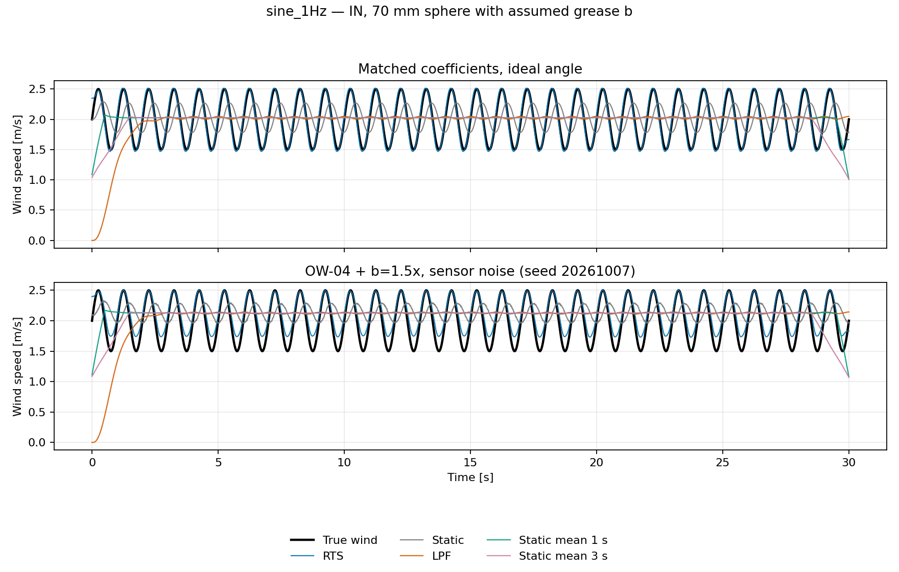

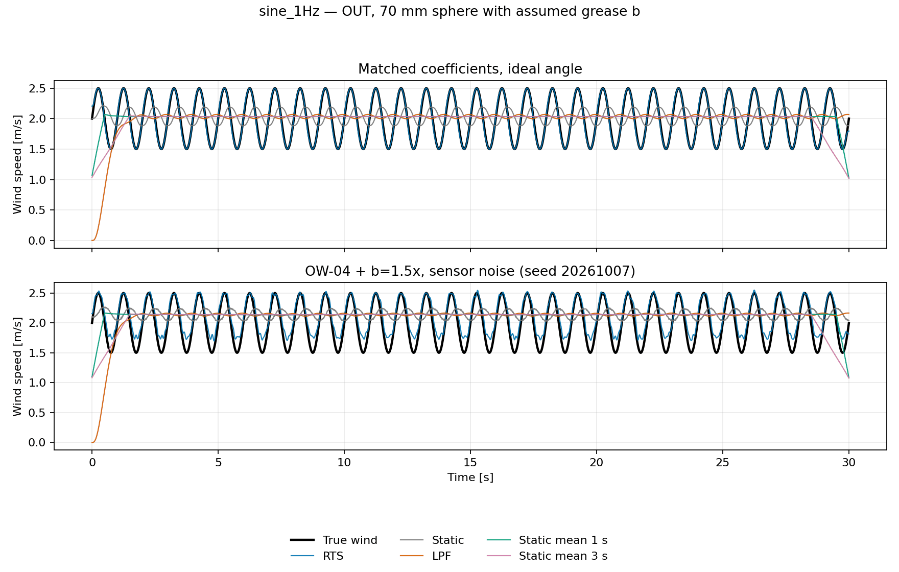

### 10 Hz正弦風


### 2→6 m/sガスト

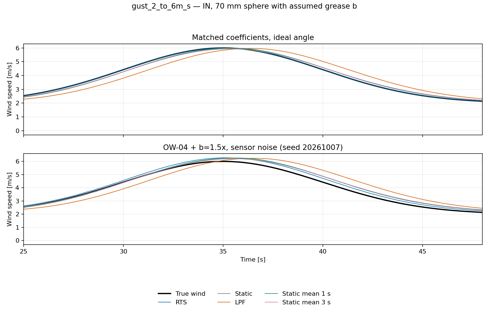


### 60°からの解放（解放後ゼロ風）

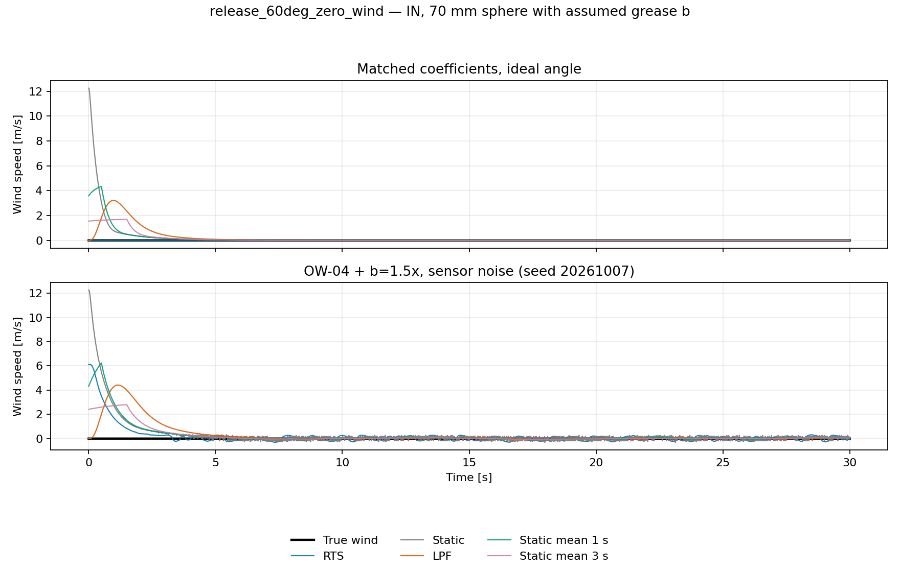


### 全プラント係数ケースのRTS時系列

各図の上段は理想角度、下段はセンサーノイズseed 20261007。各パネルは公称一致、OW-04ずれ、`b`単独ずれ2ケース、OW-04と`b`ずれの複合2ケースの全6条件を重ねた。これにより、時系列図でも個別/複合係数ケースを確認できる。

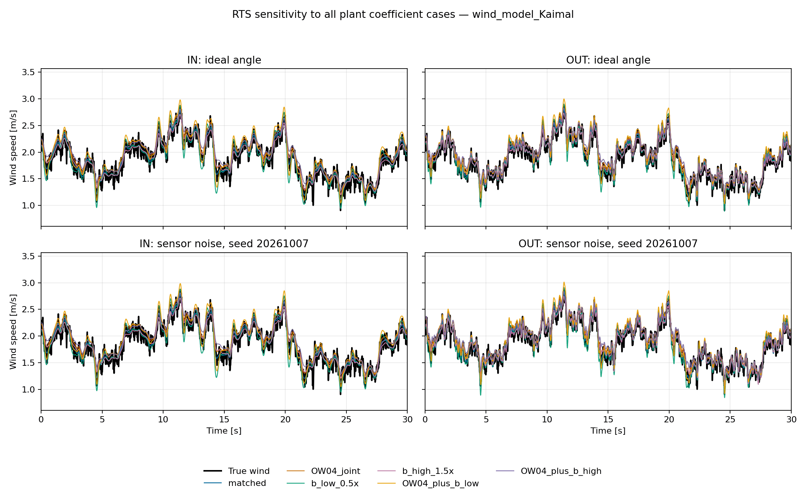


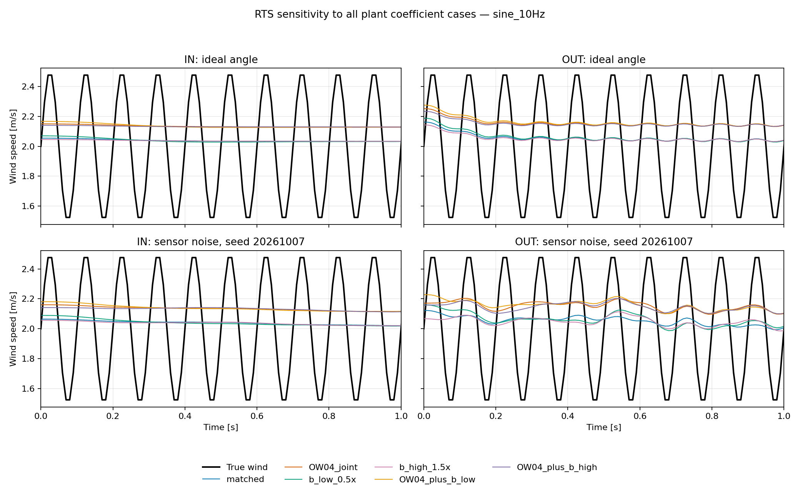

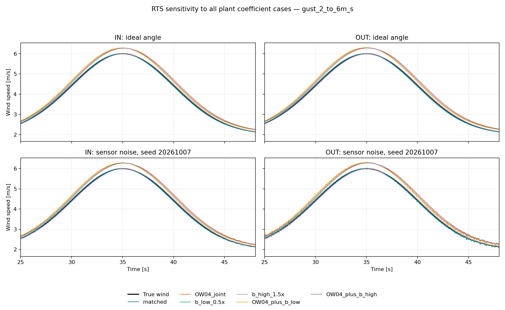

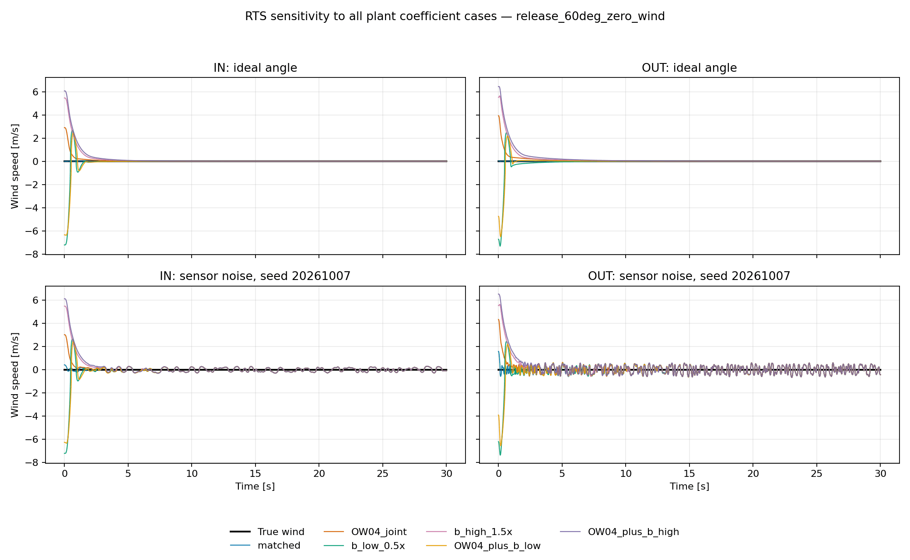

## 6. 制約と扱い

- 本シミュレーションはG-331の実トルク速度曲線、温度特性、せん断減粘、シール摩擦を再現していない。`b₀`は幾何外挿した仮定値である。
- `b`の±50%は感度幅のみであり、実物がこの幅に入る保証はない。観測器を現物で検証した結果ではない。
- 摩擦はOW-06と同じ `τ tanh(θ˙/ε)` の滑らか化モデルで、WBS0.2で幅を置いた静止摩擦やstick-slipは明示していない。特に60°解放後の停止角・停止時間を実機予測として使わない。
- センサーノイズはOW-05/06で使った仮定モデル。現物ノイズの確定値ではない。
- 10 Hzの振幅保持は達成できず、強いダンパーでプラント応答を小さくすることと、角度から高周波の風を推定することは両立しにくい。
- ±60°ハードストップやシール機構は最終部品形状として設計していない。シャフト配置の干渉なしはユーザー指定条件として反映したが、箱壁・端部シールの製作寸法と実漏れ特性は別途設計・検証を要する。

## 再現・成果物

リポジトリルートから次で再生成できる。

```bash
MPLCONFIGDIR=/tmp/mplconfig python 06_Analysis/simulation/src/run_ow07_wbs23_damper_observer.py
```

- `wbs23_observer_metrics.csv`: 軸・入力・プラント係数条件・センサーseed・方式別の1200行の全指標。
- `wbs23_coefficients_and_settings.json`: 係数、`b`条件、ノイズ、波形設定。
- `timeseries_<axis>_<input>.png`: 全入力・両軸の代表時系列。各図に一致条件と係数ずれ＋ノイズ条件を示す。
- `rts_sensitivity_allcases_<input>.png`: 全6プラント係数ケースのRTS時系列を、理想角度と代表ノイズseedで比較。
- `matched_metrics_comparison.png`, `release_false_wind_metrics.png`: 一致条件の要約図。
