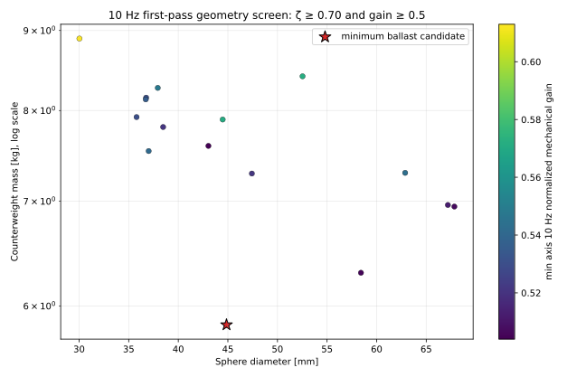
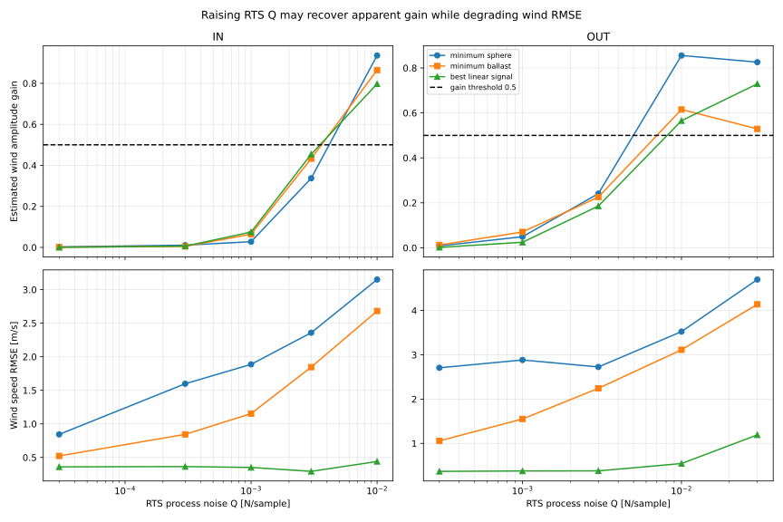

# WBS2.4 — 10 Hz応答に向けた球・ロッド・錘・ダンパーの探索

## 現行結論（2026-10-08更新：現行錘質量上限を適用）

この節が現在の判断です。以下の「前回の結論」は現行錘の質量上限を適用する前の参考結果であり、その候補は今回の設計候補として扱いません。

現行ハードの錘質量は、止めねじを除き **50.72 g** です。今回の探索では錘質量を **0.1〜50.72 g** としました。下限0.1 gは軽量側まで探索するための数値上の下限です。球・ロッド・錘の位置と寸法を再探索し、グリス、軸別摩擦トルク、ダンパー寸法の許容範囲は既存条件に合わせました。

球質量は、固体ポリスチレン密度1,050 kg/m³を発泡率60で割って求めた密度を使います。

\[
\rho_{\mathrm{foam}}=\frac{1050}{60}=17.5\ \mathrm{kg/m^3}
\]

直径 \(D\) の球体積は半径 \(D/2\) を使って

\[
V_{\mathrm{ball}}=\frac{4}{3}\pi\left(\frac{D}{2}\right)^3
=\frac{\pi D^3}{6}
\]

となるため、球質量は

\[
m_{\mathrm{ball}}=\rho_{\mathrm{foam}}V_{\mathrm{ball}}
=17.5\cdot\frac{\pi D^3}{6}
\]

です。例えば直径67.62 mmでは、\(D=0.06762\ \mathrm{m}\) を代入して

\[
m_{\mathrm{ball}}=17.5\cdot\frac{\pi(0.06762)^3}{6}
\approx 0.00283\ \mathrm{kg}=2.83\ \mathrm{g}
\]

となります。

### 判定条件と探索範囲

| 項目 | 今回の条件 |
|---|---|
| 球径 | 30〜100 mm |
| 球密度 | 17.5 kg/m³（発泡率60倍EPS） |
| 球中心腕長 | 球半径+5 mm以上、最大500 mm |
| ロッド | CFRP相当密度1,600 kg/m³、外径2〜8 mm、肉厚0.5 mm（暫定）。全長は球中心腕長+球半径+5 mm |
| 錘質量 | 0.1〜50.72 g（現行ハード上限50.72 g、止めねじ除外） |
| 錘腕長 | 2〜70 mm |
| グリス | 信越化学 G-331（固定） |
| ダンパー寸法 | 軸径2〜8 mm、接触長0〜30 mm、半径すきま0.5〜1.0 mmの既存探索範囲 |
| 軸別摩擦トルク | IN \(7.945731\times10^{-5}\) N·m、OUT \(1.769497\times10^{-4}\) N·mで固定 |
| 静的角度 | 8 m/sで両軸60°以内 |
| 減衰 | 線形化減衰比 \(\zeta\ge0.70\)。2次線形系なら約4.6%のオーバーシュートに相当 |
| 10 Hz機械ゲイン | DC応答に対する角度振幅比 \(G_{10}\ge0.5\)（−6 dB以内） |
| 風入力 | 平均2 m/s、振幅0.5 m/sの10 Hz正弦波 |
| サンプル探索 | 2,000,000点、乱数seed 20261008 |

10 Hzゲインは、10 Hzで角度振幅が準静的な角度振幅の何倍残るかで定義しました。線形化モデルでは

\[
G_{10}=\frac{K_{\mathrm{eff}}}
{\sqrt{(K_{\mathrm{eff}}-I\omega^2)^2+(b\omega)^2}},
\qquad
\omega=2\pi f=2\pi\cdot10\approx62.83\ \mathrm{rad/s}
\]

です。ここで \(I\) は慣性モーメント、\(K_{\mathrm{eff}}\) は動作点まわりの復元剛性、\(b\) は同じG-331グリスから寸法換算した粘性係数です。\(G_{10}=0.5\) は10 Hzで準静的応答の半分以上を残す基準として採用しました。

### 探索結果

2,000,000点中、静的角度・\(\zeta\ge0.70\)・同じグリスで必要な減衰を実現可能、という前段条件を満たした形状は102,494点でした。しかし、そのうち **10 Hz機械ゲイン \(G_{10}\ge0.5\) も同時に満たす形状は0点** でした。厳密な過減衰を要求する場合も、全条件を同時に満たす候補はありません。

| 前段条件を満たす候補の評価 | 球径 / 球質量 | 球腕長 / ロッド長 | 錘質量 / 錘腕長 | ダンパー軸径 / 接触長 / 半径すきま | \(\zeta\) IN / OUT | \(G_{10}\) IN / OUT |
|---|---:|---:|---:|---:|---:|---:|
| 10 Hzゲインが最大の近似候補 | 39.73 mm / 0.575 g | 25.31 / 50.18 mm | 49.88 g / 23.42 mm | 8 mm / 3.61 mm / 0.5 mm | 0.700 / 0.705 | 0.0594 / 0.0520 |

この近似候補の10 Hz線形角度振幅はIN 0.00683°、OUT 0.00643°です。OUTゲイン0.0517は採用基準0.5の約10分の1であり、センサーの角度雑音より十分大きな風応答を残せません。

線形角度振幅を最大化した別の前段候補は、球径82.36 mm（5.12 g）、球腕長46.18 mm、ロッド長92.36 mm、錘50.60 g・錘腕長15.06 mm、ロッド外径2.63 mmでした。必要粘性係数は0.593 mN·m·s/radで、既存ダンパー範囲内では軸径8 mm、接触長2.25 mm、半径すきま0.5 mm相当です。この候補の線形10 HzゲインはIN 0.0238、OUT 0.0184、線形角度振幅はIN 0.0543°、OUT 0.0509°でした。

この候補について、固定 \(\tau\) を含む非線形プラントに平均2 m/s、振幅0.5 m/s、10 Hzの風を入力して角度応答を確認しました。3〜27秒区間を10 Hz正弦波へ当てはめた角度振幅はIN 0.0302°、OUT 0.00636°でした。採用したセンサーモデルの雑音RMSは

\[
\sigma_\theta=\sqrt{(0.015^\circ)^2+(0.010^\circ)^2}
=0.0180^\circ
\]

なので、OUTの10 Hz角度振幅は雑音RMSの約0.35倍にとどまります。さらに、この候補の10 Hz風トルク振幅はINで約\(1.58\times10^{-4}\) N·m、OUTで約\(1.30\times10^{-4}\) N·mです。OUT軸の固定摩擦トルク \(1.77\times10^{-4}\) N·mは、風トルク振幅の約1.36倍であり、摩擦によって応答が抑えられます。したがって、この条件では10 Hzの真の風速波形を実用的な精度で復元できる設計解は確認できませんでした。機械条件を通る候補があることと、風波形を推定できることは別の判定です。

10 Hzゲイン条件を通る候補が0点のため、今回はその先のRTS雑音込み比較を実施していません。既存のRTS結果を今回の質量上限に対する性能として読み替えないでください。

### 結論

**錘を現行ハード以下の50.72 gに制限し、球・ロッド・腕長・ダンパー寸法を指定範囲内で変えても、減衰条件と十分な10 Hz応答を両立する設計解は見つかりませんでした。** 2,000,000点の探索では10 Hzゲイン基準の約10分の1が最良で、最も信号振幅の大きい前段候補でも非線形OUT応答はセンサーノイズRMSを下回りました。

下記に残す前回のkg級錘候補と図は、現行錘上限を適用する前の探索結果です。今回の設計判断には使用しません。

## 前回の結論（錘上限適用前・旧探索結果）


前回版ではダンパー寸法まで固定していましたが、この条件はユーザー指示の範囲を狭めていたため修正しました。今回は**グリスと軸別`τ`を固定し、球・ロッド・錘に加えてダンパー寸法も探索**しています。ダンパー寸法を調整すると、線形化減衰比`ζ≥0.70`と10 Hz機械ゲイン`≥0.5`を満たす候補が見つかりました。一方、WBS2.3採用のRTS共分散では10 Hzゲインがほぼゼロです。`Q`を大きく調整すればゲイン0.5超えも得られますが、風速RMSEは入力振幅0.5 m/sと同等以上となり、安定した波形復元には至りません。

2,000,000点の機械形状サンプルから、同一グリスのダンパー寸法で必要な`b`を作れる範囲に絞ると、両軸で静的角度・`ζ≥0.70`・10 Hz機械ゲイン`≥0.5`を満たすものは264点でした。厳密な過減衰（`ζ≥1`）と同ゲイン条件を両軸で満たす点は0点です。`ζ=0.70`は線形2次系なら約4.6%のステップオーバーシュートに相当しますが、固定クーロン摩擦を含む実際の系に対するオーバーシュート保証ではありません。

## 条件と固定値

| 項目 | 探索・検証条件 |
|---|---|
| 球径 | 30〜100 mm。30 mmを下限とする |
| 発泡球密度 | 発泡率60倍を固体PS密度1,050 kg/m³の1/60とし、17.5 kg/m³を使用。球質量は球形として算出 |
| 球中心腕長 | 球半径+5 mm以上、最大500 mm |
| ロッド | CFRP相当密度1,600 kg/m³、外径2〜8 mm、肉厚0.5 mm（暫定） |
| 錘 | 腕長2〜70 mm、探索計算上の質量範囲0.05〜1,000 kg。1,000 kgはユーザー指定の上限ではなく数値探索範囲 |
| グリス | WBS2.3と同じ信越化学G-331を仮定 |
| ダンパー | 軸径2〜8 mm、接触長0〜30 mm、半径すきま0.5〜1.0 mmを探索。候補は必要な`b`を満たす範囲で外形体積 proxy が小さくなる組合せを選定 |
| 粘性係数`b` | 固定せず、同じグリスのWBS2.1 Couette幾何換算で候補ごとに算出。最大値は`7.913×10⁻³ N·m·s/rad` |
| 摩擦トルク`τ` | IN `7.945731×10⁻⁵ N·m`、OUT `1.769497×10⁻⁴ N·m`に固定 |
| 判定 | 8 m/sで両軸60°以内、線形化減衰比`ζ≥0.70`、10 Hzの機械ゲイン`≥0.5`（DC比で−6 dB以内） |
| 10 Hz入力 | 平均2 m/s、振幅0.5 m/sの正弦波。WBS2.3と同じ100 Hzサンプリング、実センサーモデル、3ノイズseedを使用 |

ダンパーの`b`は両軸で`ζ≥0.70`となる必要値から定め、シャフト径0.5 mm刻み・半径すきま0.1 mm刻みの候補中から、必要接触長が30 mm以内となる最小外形体積 proxy の組合せを選びました。これはグリス実トルクを測定した選定ではありません。

球中心腕長をロッド長の代表値として扱い、ロッド全長を「支点から球中心まで+球半径+5 mm」と仮定しました。既存係数から基準球・錘・アルミ管の寄与を差し引き、残りを固定構造の寄与として扱っています。この固定残差とCFRP管近似は、CADや実測質量分布がない状態での暫定モデルです。

## 候補比較

次の3案は同じ2,000,000点探索から選びました。いずれも線形化した機械条件は通りますが、非線形プラントの実応答では摩擦の影響で角度振幅がさらに小さくなりました。

| 候補 | 球径 / 質量 | 球腕長 / ロッド長 | 錘質量 / 腕長 | ダンパー軸径 / 長さ / 半径すきま | `b` mN·m·s/rad | `ζ` IN / OUT | 10 Hz機械ゲイン IN / OUT | 非線形角度 IN / OUT |
|---|---:|---:|---:|---:|---:|---:|---:|---:|
| 最小球径 | 30.03 mm / 0.248 g | 29.97 / 49.98 mm | 8.894 kg / 2.09 mm | 8 / 17.20 / 0.5 mm | 4.538 | 0.715 / 0.700 | 0.629 / 0.623 | 0.00092° / 0.00050° |
| 最小錘質量 | 32.42 mm / 0.312 g | 27.81 / 49.02 mm | **4.393 kg** / 2.23 mm | 8 / 10.52 / 0.5 mm | 2.776 | 0.721 / 0.700 | 0.516 / 0.501 | 0.00114° / 0.00059° |
| 最大線形信号 | 78.47 mm / 4.428 g | 44.24 / 88.47 mm | 7.233 kg / 2.04 mm | 8 / 15.77 / 0.5 mm | 4.161 | 0.714 / 0.700 | 0.511 / 0.501 | **0.01224° / 0.00565°** |

「最小球径」は球を下限まで縮められますが、錘が重く、信号が最小です。「最小錘質量」は通過集合内で錘を最軽量にした候補です。「最大線形信号」でも非線形モデルの10 Hz角度は仮定ノイズ標準偏差0.02°のIN約61%、OUT約28%で、実センサーモデルの白色・有色ノイズ合成RMS約0.018°を下回ります。8 m/s静的角度も最大約1.85°で、±60°範囲をほとんど使いません。



## 固定`τ`が効く大きさ

ベスト信号候補でも2 m/s中心・±0.5 m/s風速正弦波の線形化トルク振幅は約`1.43×10⁻⁴ N·m`です。固定摩擦トルクとの比はINで約0.56、OUTで約1.24です。最小球径候補ではトルク振幅が約`1.41×10⁻⁵ N·m`に下がり、`τ`はINで約5.6倍、OUTで約12.5倍になります。小型候補ほど固定`τ`による非線形減衰が大きくなります。

## RTSの雑音込み検証

3案について、WBS2.3標準`Q`と、より大きい`Q`を軸別に比較しました。ベスト信号候補でも標準値（IN `3×10⁻⁵`、OUT `3×10⁻⁴ N/sample`）での平均10 HzゲインはIN 0.00025、OUT 0.00197とほぼ消失します。`Q`をIN `0.003`、OUT `0.01 N/sample`まで上げると平均ゲインは0.454、0.565になりますが、RMSEは0.292、0.546 m/sで、OUTは入力振幅0.5 m/sを超えます。位相差は3 seedでIN −19〜−27°、OUT −22〜−39°でした。両軸のRTSゲイン0.5以上だけなら調整で達成できますが、波形誤差と位相まで見ると実用的な復元条件には達しません。



## 判定と次の設計判断

- ダンパー寸法を変えれば、今回のζ・機械ゲイン条件を満たす解はあります。候補では軸径8 mm、半径すきま0.5 mm、接触長約10.5〜17.2 mmが選ばれました。
- 球径30 mm前後まで小さくすると固定`τ`に対する10 Hz風トルクが不足し、RTS再現性は改善しません。最小錘質量でも約4.39 kgで、重心腕は約2.23 mmです。軸荷重・保持構造・実装寸法は未評価です。
- 線形化減衰比が0.70台の候補は許容オーバーシュートを想定した一次候補に留まります。厳密な過減衰案は今回のランダム探索では得られていません。
- **機械系の一次条件を満たす設計候補は確認できましたが、現行センサー・RTS条件で10 Hz波形を十分な精度で復元する設計解は確認できませんでした。** これは記載した材料・力学モデルと探索範囲内の結論です。
- 実機のグリストルク曲線、シール損失、箱・軸受の制約を測って再評価する必要があります。今回の`b`はカタログ一点をCouette幾何で外挿した仮定値です。

## 再現方法・成果物

```bash
python 06_Analysis/simulation/src/run_ow07_wbs24_10hz_geometry_search.py
```

- `06_Analysis/simulation/src/run_ow07_wbs24_10hz_geometry_search.py` — 2,000,000点スクリーニングと非線形RTS検証
- `search_settings_and_summary.json` — 固定値、探索範囲、候補の物理係数
- `jointly_feasible_geometry_shortlist.csv` — 条件を通過した264形状から小型側と極値を含む候補
- `candidate_rts_noise_validation.csv` — 3候補×2軸のRTS・ノイズ検証
- `geometry_search_screen.svg`、`rts_q_sensitivity.svg` — 判定図（PNG版も同じフォルダーに保存）

この検討は数値モデルによる設計スクリーニングです。グリスの実機粘性、シール摩擦、部品たわみ、錘保持部の強度と寸法、公差、質量分布は未検証です。
